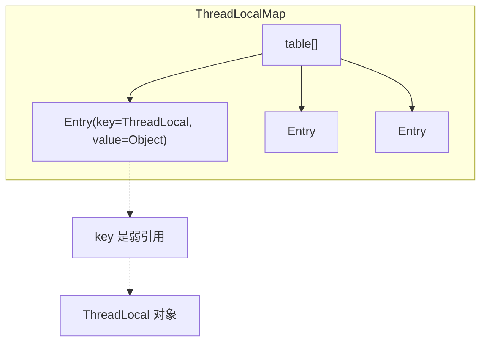

# ThreadLocal 原理

> **目标级别**：P5/P6
> **面试频率**：🔴 高频

面试官问：「ThreadLocal 是什么？」你说「线程本地存储」——然后面试官紧接着追问「那 ThreadLocal 是怎么实现的？为什么会导致内存泄漏？」你沉默了。

ThreadLocal 是 Java 并发编程中最容易出错的地方之一，理解其原理和潜在问题至关重要。

## 面试官最关心的 3 个问题

1. ⚠️ ThreadLocal 的原理是什么？
2. ⚠️ ThreadLocal 和普通变量的区别是什么？
3. ⚠️ ThreadLocal 适合什么场景？

## 核心原理

### 基本概念

ThreadLocal 提供线程本地存储，每个线程都有独立的变量副本，互不干扰。

```mermaid
graph LR
    subgraph "Thread A"
        TA1["ThreadLocal A"]
        TA2["value A"]
    end
    subgraph "Thread B"
        TB1["ThreadLocal A"]
        TB2["value B"]
    end
    TA1 --> TA2
    TB1 --> TB2
    Note over TA2,TB2: 独立的值，互不干扰
```

### 基本使用

```java
public class ThreadLocalDemo {
    private static final ThreadLocal<String> threadLocal = new ThreadLocal<>();

    public static void main(String[] args) {
        // 线程 A 设置值
        new Thread(() -> {
            threadLocal.set("Thread A's value");
            System.out.println(threadLocal.get());
        }).start();

        // 线程 B 设置值
        new Thread(() -> {
            threadLocal.set("Thread B's value");
            System.out.println(threadLocal.get());
        }).start();
    }
}
```

## 实现原理

### ThreadLocalMap

每个 Thread 内部都有一个 ThreadLocalMap：

```java
public class Thread implements Runnable {
    ThreadLocal.ThreadLocalMap threadLocals = null;
}

public class ThreadLocal<T> {
    static class ThreadLocalMap {
        private Entry[] table;
        private int size;

        static class Entry extends WeakReference<ThreadLocal<?>> {
            Object value;
            Entry(ThreadLocal<?> k, Object v) {
                super(k);
                value = v;
            }
        }
    }
}
```

### 数据结构



### get 方法实现

```java
public T get() {
    Thread t = Thread.currentThread();
    ThreadLocalMap map = getMap(t);
    if (map != null) {
        ThreadLocalMap.Entry e = map.getEntry(this);
        if (e != null) {
            @SuppressWarnings("unchecked")
            T result = (T)e.value;
            return result;
        }
    }
    return setInitialValue();
}
```

### set 方法实现

```java
public void set(T value) {
    Thread t = Thread.currentThread();
    ThreadLocalMap map = getMap(t);
    if (map != null) {
        map.set(this, value);
    } else {
        createMap(t, value);
    }
}
```

## ThreadLocal vs 普通变量

| 区别 | ThreadLocal | 普通变量 |
|------|-------------|---------|
| **存储位置** | 线程内部 | 堆（共享） |
| **可见性** | 线程隔离 | 可见 |
| **线程安全** | 天然安全 | 需要同步 |
| **内存** | 每个线程一份 | 共享一份 |
| **生命周期** | 随线程 | 随对象 |

### 场景对比

```java
// 普通变量：需要同步
public class NormalVar {
    private int value = 0; // 共享变量

    public void increment() {
        value++; // 需要 synchronized
    }
}

// ThreadLocal：线程隔离
public class ThreadLocalVar {
    private static final ThreadLocal<Integer> value =
        ThreadLocal.withInitial(() -> 0);

    public void increment() {
        value.set(value.get() + 1); // 不需要同步
    }
}
```

## 典型应用场景

### 1. 线程上下文传递

```java
public class UserContext {
    private static final ThreadLocal<User> currentUser = new ThreadLocal<>();

    public static void setUser(User user) {
        currentUser.set(user);
    }

    public static User getUser() {
        return currentUser.get();
    }

    public static void clear() {
        currentUser.remove();
    }
}

// 使用
public class UserService {
    public void doSomething() {
        User user = UserContext.getUser(); // 获取当前用户
        // ...
    }
}
```

### 2. 数据库连接管理

```java
public class DBConnectionHolder {
    private static final ThreadLocal<Connection> connection =
        ThreadLocal.withInitial(() -> {
            try {
                return DriverManager.getConnection(url);
            } catch (SQLException e) {
                throw new RuntimeException(e);
            }
        });

    public static Connection getConnection() {
        return connection.get();
    }
}
```

### 3. SimpleDateFormat

```java
public class ThreadSafeDateFormat {
    private static final ThreadLocal<DateFormat> dateFormat =
        ThreadLocal.withInitial(() -> new SimpleDateFormat("yyyy-MM-dd"));

    public static String format(Date date) {
        return dateFormat.get().format(date);
    }
}
```

## 高频面试题

### 🔴 题目 1：ThreadLocal 的原理是什么？

**参考回答**：

ThreadLocal 的原理：

1. **ThreadLocalMap**：每个 Thread 内部有一个 ThreadLocalMap
2. **Entry**：key 是 ThreadLocal 弱引用，value 是实际值
3. **散列表**：ThreadLocalMap 使用散列表存储
4. **线程隔离**：不同线程访问同一个 ThreadLocal，得到的是各自的值

### 🔴 题目 2：ThreadLocal 为什么会内存泄漏？

**参考回答**：

**内存泄漏原因**：

1. **弱引用**：Entry 的 key 使用弱引用指向 ThreadLocal
2. **线程复用**：线程池中线程不销毁，复用的线程仍持有 ThreadLocalMap
3. **未清理**：如果 ThreadLocal 外部没有强引用，GC 会回收 ThreadLocal 对象
4. **value 无法回收**：但 value 仍是强引用，无法被回收

**解决方案**：使用完 ThreadLocal 后调用 `remove()` 方法。

### 🔴 题目 3：为什么 Entry 使用弱引用？

**参考回答**：

使用弱引用的原因：

1. **防止内存泄漏**：如果没有弱引用，ThreadLocal 对象永远不会被回收
2. **自动清理**：GC 时 ThreadLocal 对象会被回收
3. **但 value 仍可能泄漏**：如果线程复用且未调用 remove()，value 仍无法回收

## 常见错误与陷阱

### ⚠️ 陷阱 1：忘记 remove

```java
// ❌ 可能导致内存泄漏
try {
    User user = getUser();
    // 使用 user
} finally {
    // 忘记 remove
    // threadLocal.remove();
}
```

### ⚠️ 陷阱 2：线程池复用

```java
// ❌ 线程复用导致值残留
executor.submit(() -> {
    threadLocal.set("value");
    // 业务逻辑
    // 线程复用时，value 仍然存在
});

// ✅ 使用后清理
executor.submit(() -> {
    try {
        threadLocal.set("value");
        // 业务逻辑
    } finally {
        threadLocal.remove();
    }
});
```

### ⚠️ 陷阱 3：静态 ThreadLocal

```java
// 静态 ThreadLocal 是正确的做法
private static final ThreadLocal<String> context = new ThreadLocal<>();

// 但不要误解为 static 导致泄漏
// 泄漏是因为线程复用 + 未清理
```

## 加分回答

### 💡 ThreadLocalMap 的哈希算法

```java
private final int threadLocalHashCode = nextHashCode();

private static int nextHashCode() {
    return nextHashCode.getAndAdd(HASH_INCREMENT);
}

// 哈希增量：0x61c88647（黄金比例）
private static final int HASH_INCREMENT = 0x61c88647;
```

### 💡 哈希冲突解决

ThreadLocalMap 使用**开放地址法**解决哈希冲突：

```java
private Entry getEntry(ThreadLocal<?> key) {
    int i = key.threadLocalHashCode & (table.length - 1);
    Entry e = table[i];
    if (e != null && e.get() == key)
        return e;
    return getEntryAfterMiss(key, i, e);
}
```

## 总结对比表

| 维度 | ThreadLocal | synchronized |
|------|-------------|-------------|
| **目的** | 线程隔离 | 互斥访问 |
| **原理** | 每个线程一份 | 同一份 |
| **开销** | 存储开销 | 时间开销 |
| **适用** | 无共享数据 | 有共享数据 |

## 延伸思考

### 面试官可能会继续追问

1. 「ThreadLocalMap 的扩容机制是什么？」
2. 「InheritableThreadLocal 是什么？」
3. 「ThreadLocal 在 Spring 中是怎么用的？」

### 回答方向

关于 ThreadLocalMap 扩容：ThreadLocalMap 使用**探测再散列**（线性探测）解决冲突，初始容量 16，负载因子 2/3，超过时 rehash。
