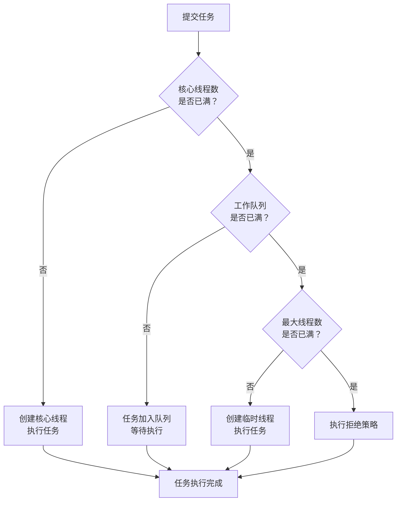

# 线程池执行流程

> **目标级别**：P5/P6
> **面试频率**：🔴 高频

面试官问：「线程池的执行流程是什么？」你说「先核心线程，再队列，最后临时线程」——然后面试官紧接着追问「那如果队列满了怎么办？如果核心线程满了怎么办？」你沉默了。

理解线程池的执行流程是正确使用线程池的基础。

## 面试官最关心的 3 个问题

1. ⚠️ 线程池的执行流程是什么？
2. ⚠️ 什么情况下会创建临时线程？
3. ⚠️ 拒绝策略在什么时候触发？

## 核心原理

### 执行流程图



### 流程详解

```java
public void execute(Runnable command) {
    if (command == null)
        throw new NullPointerException();

    int c = ctl.get();
    // 1. 核心线程未满，创建核心线程
    if (workerCountOf(c) < corePoolSize) {
        if (addWorker(command, true))
            return;
        c = ctl.get();
    }

    // 2. 核心线程满，尝试加入队列
    if (isRunning(c) && workQueue.offer(command)) {
        int recheck = ctl.get();
        // 再次检查是否需要创建核心线程
        if (!isRunning(recheck) && remove(command))
            reject(command);
        else if (workerCountOf(recheck) == 0)
            addWorker(null, false);
    }

    // 3. 队列满，创建临时线程
    else if (!addWorker(command, false))
        reject(command);
}
```

## 各阶段详解

### 阶段 1：创建核心线程

| 条件 | 行为 |
|------|------|
| `workerCount < corePoolSize` | 创建核心线程执行任务 |

```java
// 核心线程创建
private boolean addWorker(Runnable firstTask, boolean core) {
    // 检查线程数
    int wc = workerCountOf(ctl.get());
    if (wc >= (core ? corePoolSize : maximumPoolSize))
        return false;

    // 创建 Worker
    Worker w = new Worker(firstTask);
    w.thread.start();
    // ...
}
```

### 阶段 2：加入队列

| 条件 | 行为 |
|------|------|
| 核心线程满 + 队列未满 | 任务加入队列等待 |

```java
// 队列添加
if (workQueue.offer(command)) {
    // 添加成功，等待执行
} else {
    // 队列满，尝试创建临时线程
}
```

### 阶段 3：创建临时线程

| 条件 | 行为 |
|------|------|
| 核心线程满 + 队列满 | 创建临时线程执行任务 |

```java
// 临时线程创建
if (workerCountOf(c) < maximumPoolSize) {
    addWorker(command, false); // false 表示临时线程
}
```

### 阶段 4：拒绝策略

| 条件 | 行为 |
|------|------|
| 核心线程满 + 队列满 + 临时线程满 | 执行拒绝策略 |

## 示例分析

### 示例 1：正常执行

```java
ThreadPoolExecutor executor = new ThreadPoolExecutor(
    2, 4, 60L, TimeUnit.SECONDS,
    new LinkedBlockingQueue<>(10));

// 任务 1, 2 → 核心线程 1, 2
// 任务 3, 4, ..., 12 → 队列
// 任务 13 → 临时线程 1
// 任务 14 → 临时线程 2
// 任务 15 → 拒绝
```

### 示例 2：队列满

```java
ThreadPoolExecutor executor = new ThreadPoolExecutor(
    2, 4, 60L, TimeUnit.SECONDS,
    new LinkedBlockingQueue<>(2));

// 任务 1, 2 → 核心线程
// 任务 3, 4 → 队列
// 任务 5 → 队列满，创建临时线程
// 任务 6 → 队列满，创建临时线程
// 任务 7 → 拒绝
```

## 各阶段任务来源

| 阶段 | 任务来源 |
|------|---------|
| 核心线程 | firstTask 参数 |
| 队列 | execute() 提交的任务 |
| 临时线程 | execute() 提交的任务 |

## 高频面试题

### 🔴 题目 1：线程池的执行流程？

**参考回答**：

线程池执行流程：

1. **核心线程未满**：创建核心线程执行任务
2. **核心线程满**：任务加入工作队列
3. **队列满**：创建临时线程执行任务
4. **临时线程满**：执行拒绝策略

### 🔴 题目 2：什么情况下会创建临时线程？

**参考回答**：

创建临时线程的条件：
- 核心线程已满
- 工作队列已满
- 最大线程数 > 核心线程数

### 🔴 题目 3：拒绝策略在什么时候触发？

**参考回答**：

拒绝策略在以下情况触发：
1. 核心线程已满
2. 工作队列已满
3. 最大线程数已满
4. 线程池处于非 RUNNING 状态

## 常见错误与陷阱

### ⚠️ 陷阱 1：队列大小和线程数不匹配

```java
// ❌ 配置不合理
new ThreadPoolExecutor(
    2,           // 核心线程数
    2,           // 最大线程数
    0L, TimeUnit.SECONDS,
    new LinkedBlockingQueue<>(1000)); // 队列太大，没有临时线程
```

### ⚠️ 陷阱 2：使用 SynchronousQueue

```java
// ❌ SynchronousQueue 必须有临时线程才能执行任务
new ThreadPoolExecutor(2, Integer.MAX_VALUE, 60L,
    TimeUnit.SECONDS, new SynchronousQueue<>());
```

### ⚠️ 陷阱 3：队列和线程数关系

```
┌────────────────────────────────────────────────────────────┐
│         maximumPoolSize > corePoolSize 的意义              │
├────────────────────────────────────────────────────────────┤
│                                                            │
│  核心线程（corePoolSize）处理正常负载                       │
│  临时线程（maximumPoolSize - corePoolSize）处理峰值        │
│                                                            │
└────────────────────────────────────────────────────────────┘
```

## 加分回答

### 💡 addWorker 的细节

```java
private boolean addWorker(Runnable firstTask, boolean core) {
    retry:
    for (;;) {
        int c = ctl.get();
        int rs = runStateOf(c);

        // 检查线程池状态
        if (rs >= SHUTDOWN &&
            !(rs == SHUTDOWN && firstTask == null && !workQueue.isEmpty()))
            return false;

        for (;;) {
            int wc = workerCountOf(c);
            if (wc >= (core ? corePoolSize : maximumPoolSize))
                return false;

            if (compareAndIncrementWorkerCount(c))
                break retry;

            c = ctl.get();
            if (runStateOf(c) != rs)
                continue retry;
        }
    }

    // 创建 Worker
    Worker w = new Worker(firstTask);
    // ...
}
```

## 总结对比表

| 阶段 | 条件 | 结果 |
|------|------|------|
| 1 | 核心线程未满 | 创建核心线程 |
| 2 | 核心线程满 | 加入队列 |
| 3 | 队列满 | 创建临时线程 |
| 4 | 临时线程满 | 拒绝策略 |

## 延伸思考

### 面试官可能会继续追问

1. 「为什么核心线程空闲时不会被销毁？」
2. 「线程池如何实现线程复用？」
3. 「为什么队列满了才创建临时线程？」

### 回答方向

关于线程复用：Worker 线程会从队列中获取任务并执行，这是线程复用的关键：
```java
final void runWorker(Worker w) {
    Runnable task = w.firstTask;
    while (task != null || (task = getTask()) != null) {
        try {
            task.run();
        } finally {
            task = null;
        }
    }
}
```
