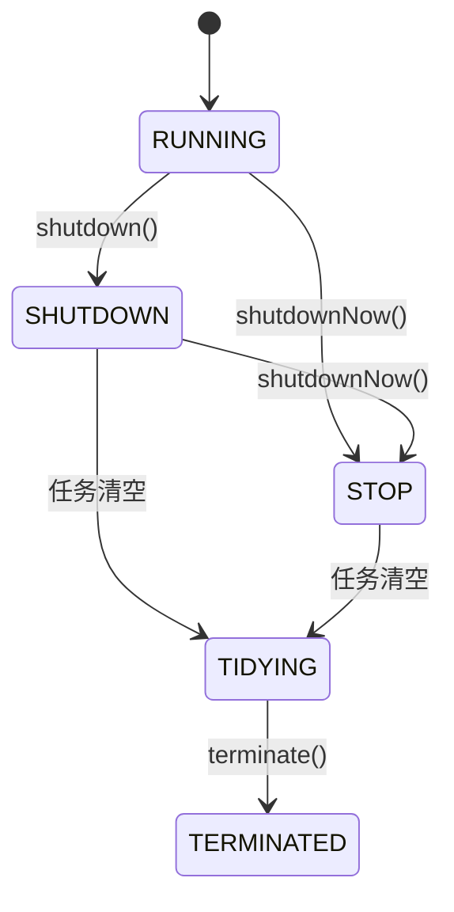

# 线程池核心参数

> **目标级别**：P5/P6
> **面试频率**：🔴 高频

面试官问：「线程池有哪些核心参数？」你说「核心线程数、最大线程数」——然后面试官紧接着追问「那队列满了怎么办？线程空闲时什么时候销毁？」你沉默了。

线程池是 Java 并发编程的核心工具，理解参数配置才能正确使用。

## 面试官最关心的 3 个问题

1. ⚠️ 线程池有哪 7 个核心参数？
2. ⚠️ 各参数之间的关系是什么？
3. ⚠️ 如何合理配置线程池参数？

## 核心原理

### 7 个核心参数

```java
public ThreadPoolExecutor(
    int corePoolSize,              // 1. 核心线程数
    int maximumPoolSize,            // 2. 最大线程数
    long keepAliveTime,            // 3. 空闲线程存活时间
    TimeUnit unit,                 // 4. 存活时间单位
    BlockingQueue<Runnable> workQueue, // 5. 工作队列
    ThreadFactory threadFactory,   // 6. 线程工厂
    RejectedExecutionHandler handler // 7. 拒绝策略
)
```

### 参数详解

| 参数 | 说明 | 默认值 |
|------|------|--------|
| **corePoolSize** | 核心线程数，即使空闲也不销毁 | - |
| **maximumPoolSize** | 最大线程数，核心线程 + 临时线程 | - |
| **keepAliveTime** | 空闲线程存活时间 | - |
| **unit** | keepAliveTime 的时间单位 | - |
| **workQueue** | 任务队列 | - |
| **threadFactory** | 线程工厂，用于创建线程 | DefaultThreadFactory |
| **handler** | 拒绝策略 | AbortPolicy |

## 线程池状态



| 状态 | 说明 |
|------|------|
| **RUNNING** | 接受新任务，处理队列任务 |
| **SHUTDOWN** | 不接受新任务，但处理队列任务 |
| **STOP** | 不接受新任务，不处理队列任务 |
| **TIDYING** | 所有任务终止，准备 terminated |
| **TERMINATED** | terminated() 执行完毕 |

## 线程工厂

### 默认线程工厂

```java
public class DefaultThreadFactory implements ThreadFactory {
    private static final AtomicInteger poolNumber = new AtomicInteger(1);
    private final ThreadGroup group;
    private final AtomicInteger threadNumber = new AtomicInteger(1);
    private final String namePrefix;

    public DefaultThreadFactory() {
        SecurityManager s = System.getSecurityManager();
        group = (s != null) ? s.getThreadGroup() :
                              Thread.currentThread().getThreadGroup();
        namePrefix = "pool-" + poolNumber.getAndIncrement() +
                     "-thread-";
    }

    public Thread newThread(Runnable r) {
        Thread t = new Thread(group, r,
                              namePrefix + threadNumber.getAndIncrement(),
                              0);
        if (t.isDaemon())
            t.setDaemon(false);
        if (t.getPriority() != Thread.NORM_PRIORITY)
            t.setPriority(Thread.NORM_PRIORITY);
        return t;
    }
}
```

### 自定义线程工厂

```java
public class CustomThreadFactory implements ThreadFactory {
    private final ThreadFactory defaultFactory = Executors.defaultThreadFactory();

    @Override
    public Thread newThread(Runnable r) {
        Thread thread = defaultFactory.newThread(r);
        thread.setName("biz-pool-" + thread.getName());
        thread.setDaemon(false);
        thread.setPriority(Thread.NORM_PRIORITY);
        return thread;
    }
}
```

## 常见线程池类型

### newFixedThreadPool

```java
// 固定线程数线程池
public static ExecutorService newFixedThreadPool(int nThreads) {
    return new ThreadPoolExecutor(
        nThreads,      // 核心线程数
        nThreads,      // 最大线程数 = 核心线程数
        0L,            // 空闲时间（使用 LinkedBlockingQueue，无界队列）
        TimeUnit.MILLISECONDS,
        new LinkedBlockingQueue<>()); // 无界队列
}
```

### newCachedThreadPool

```java
// 可缓存线程池
public static ExecutorService newCachedThreadPool() {
    return new ThreadPoolExecutor(
        0,                  // 核心线程数
        Integer.MAX_VALUE,  // 最大线程数
        60L,                // 空闲时间
        TimeUnit.SECONDS,
        new SynchronousQueue<>()); // 同步队列
}
```

### newSingleThreadExecutor

```java
// 单线程池
public static ExecutorService newSingleThreadExecutor() {
    return new FinalizableDelegatedExecutorService(
        new ThreadPoolExecutor(
            1, 1, 0L, TimeUnit.MILLISECONDS,
            new LinkedBlockingQueue<>()));
}
```

## 阿里规范：不推荐使用 Executors

```java
// ❌ 不推荐
ExecutorService executor = Executors.newFixedThreadPool(10);

// ✅ 推荐：明确参数
ThreadPoolExecutor executor = new ThreadPoolExecutor(
    2,                              // corePoolSize
    4,                              // maximumPoolSize
    60L, TimeUnit.SECONDS,           // keepAliveTime
    new LinkedBlockingQueue<>(100),  // 队列容量
    new ThreadFactoryBuilder()
        .setNameFormat("biz-pool-%d")
        .build(),
    new ThreadPoolExecutor.AbortPolicy()
);
```

### 为什么不推荐 Executors？

| 问题 | FixedThreadPool | CachedThreadPool |
|------|-----------------|------------------|
| 队列 | LinkedBlockingQueue | SynchronousQueue |
| 问题 | 无界队列，可能 OOM | 线程数无限制，可能 OOM |

## 高频面试题

### 🔴 题目 1：线程池有哪些核心参数？

**参考回答**：

线程池有 7 个核心参数：

1. **corePoolSize**：核心线程数
2. **maximumPoolSize**：最大线程数
3. **keepAliveTime**：空闲线程存活时间
4. **unit**：存活时间单位
5. **workQueue**：工作队列
6. **threadFactory**：线程工厂
7. **handler**：拒绝策略

### 🔴 题目 2：各参数之间的关系？

**参考回答**：

```
核心线程数 <= 最大线程数
最大线程数 = 核心线程数 + 临时线程数
临时线程数 = 最大线程数 - 核心线程数
```

当任务提交时：
1. 核心线程数 < 核心线程数 → 创建核心线程
2. 核心线程数满 → 队列
3. 队列满 → 创建临时线程
4. 临时线程数满 → 拒绝策略

### 🔴 题目 3：如何合理配置线程池参数？

**参考回答**：

| 场景 | 配置 |
|------|------|
| **CPU 密集型** | 核心线程数 = CPU 核心数 + 1 |
| **IO 密集型** | 核心线程数 = CPU 核心数 × 2 |

## 常见错误与陷阱

### ⚠️ 陷阱 1：使用无界队列

```java
// ❌ 可能导致 OOM
new ThreadPoolExecutor(10, 10, 0L,
    TimeUnit.MILLISECONDS,
    new LinkedBlockingQueue<>()); // 无界队列
```

### ⚠️ 陷阱 2：最大线程数设置过大

```java
// ❌ 线程数过多，上下文切换开销大
new ThreadPoolExecutor(10, 10000, 0L,
    TimeUnit.MILLISECONDS,
    new LinkedBlockingQueue<>());
```

### ⚠️ 陷阱 3：忘记 shutdown

```java
// ❌ 资源泄漏
ExecutorService executor = Executors.newFixedThreadPool(10);
// 不调用 shutdown
```

## 加分回答

### 💡 线程池的监控

```java
ThreadPoolExecutor executor = new ThreadPoolExecutor(...);

// 监控方法
executor.getPoolSize();              // 当前线程数
executor.getActiveCount();            // 活跃线程数
executor.getQueue().size();           // 队列大小
executor.getCompletedTaskCount();     // 完成任务数
executor.getTaskCount();              // 总任务数
```

## 总结对比表

| 参数 | 说明 | 是否必须 |
|------|------|---------|
| corePoolSize | 核心线程数 | ✅ |
| maximumPoolSize | 最大线程数 | ✅ |
| keepAliveTime | 空闲时间 | ✅ |
| unit | 时间单位 | ✅ |
| workQueue | 工作队列 | ✅ |
| threadFactory | 线程工厂 | ❌（有默认） |
| handler | 拒绝策略 | ❌（有默认） |
