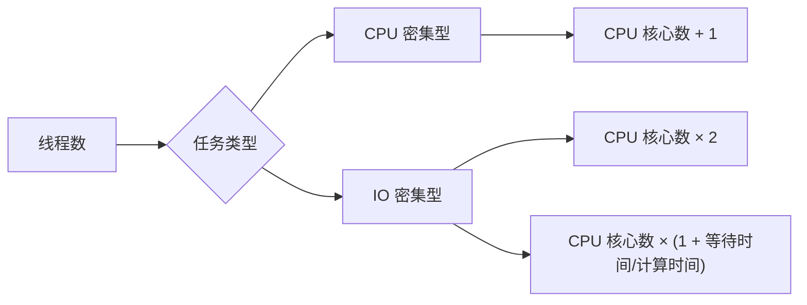

# 线程池大小设置

> **目标级别**：P5/P6
> **面试频率**：🔴 高频

面试官问：「线程池大小怎么设置？」你说「看情况」——然后面试官紧接着追问「那 CPU 密集型和 IO 密集型有什么区别？有什么计算公式？」你沉默了。

线程池大小设置是生产环境中的重要配置，错误的配置可能导致性能问题。

## 面试官最关心的 3 个问题

1. ⚠️ CPU 密集型和 IO 密集型有什么区别？
2. ⚠️ 线程池大小如何计算？
3. ⚠️ 生产环境如何配置？

## 核心原理

### CPU 密集型 vs IO 密集型

| 类型 | 特点 | 线程行为 |
|------|------|---------|
| **CPU 密集型** | 计算密集，等待 CPU | 一直在计算，CPU 利用率高 |
| **IO 密集型** | IO 密集，等待 IO | 大量时间在等待 IO，CPU 利用率低 |

### CPU 密集型配置

```java
// CPU 核心数
int cpuCores = Runtime.getRuntime().availableProcessors();

// 线程数 = CPU 核心数
ThreadPoolExecutor executor = new ThreadPoolExecutor(
    cpuCores,         // 核心线程数
    cpuCores,         // 最大线程数
    60L, TimeUnit.SECONDS,
    new LinkedBlockingQueue<>(100));
```

**原因**：CPU 密集型任务需要大量 CPU 计算，线程数过多会导致上下文切换开销。

### IO 密集型配置

```java
int cpuCores = Runtime.getRuntime().availableProcessors();

// 线程数 = CPU 核心数 × 2
ThreadPoolExecutor executor = new ThreadPoolExecutor(
    cpuCores * 2,     // 核心线程数
    cpuCores * 2,     // 最大线程数
    60L, TimeUnit.SECONDS,
    new LinkedBlockingQueue<>(100));
```

**原因**：IO 密集型任务大部分时间在等待 IO，此时 CPU 空闲，可以处理更多任务。

## 计算公式

### 公式推导



### 通用公式

```
最佳线程数 = CPU 核心数 × (1 + IO 等待时间 / CPU 计算时间)
```

### 不同 IO 类型的经验值

| IO 类型 | 等待时间/计算时间 | 推荐线程数 |
|--------|------------------|-----------|
| 纯计算 | 0 | CPU 核心数 |
| 轻度 IO | 1 | CPU 核心数 × 2 |
| 中度 IO | 2-3 | CPU 核心数 × 3-4 |
| 重度 IO | > 5 | CPU 核心数 × 5+ |

## 生产环境配置

### Tomcat 线程池配置

```xml
<Connector port="8080" protocol="HTTP/1.1"
    maxThreads="200"           <!-- 最大线程数 -->
    minSpareThreads="10"       <!-- 最小空闲线程 -->
    acceptCount="100"          <!-- 队列大小 -->
    connectionTimeout="20000"
    maxConnections="10000"    <!-- NIO 最大连接数 -->
/>
```

### 数据库连接池配置

```java
// HikariCP 配置
HikariConfig config = new HikariConfig();
config.setMaximumPoolSize(20);   // 最大连接数
config.setMinimumIdle(5);        // 最小空闲连接
config.setConnectionTimeout(30000);
config.setIdleTimeout(600000);
config.setMaxLifetime(1800000);
```

### 异步任务线程池配置

```java
// 业务异步任务线程池
ThreadPoolExecutor asyncExecutor = new ThreadPoolExecutor(
    10,                           // 核心线程数
    20,                           // 最大线程数
    60L, TimeUnit.SECONDS,        // 空闲时间
    new LinkedBlockingQueue<>(1000),
    new ThreadFactoryBuilder()
        .setNameFormat("async-task-%d")
        .build(),
    new ThreadPoolExecutor.CallerRunsPolicy()
);
```

## 动态配置

### 根据负载动态调整

```java
public class DynamicThreadPool {
    private final ThreadPoolExecutor executor;

    public DynamicThreadPool(int corePoolSize, int maxPoolSize) {
        this.executor = new ThreadPoolExecutor(
            corePoolSize, maxPoolSize, 60L, TimeUnit.SECONDS,
            new LinkedBlockingQueue<>(100));
    }

    // 根据 CPU 使用率调整
    public void adjustByCpuUsage() {
        OperatingSystemMXBean osBean =
            ManagementFactory.getOperatingSystemMXBean();
        double cpuUsage = osBean.getSystemCpuLoad();

        if (cpuUsage > 0.8) {
            // CPU 使用率高，减少线程数
            executor.setCorePoolSize(executor.getCorePoolSize() - 1);
        } else if (cpuUsage < 0.2) {
            // CPU 使用率低，增加线程数
            executor.setCorePoolSize(executor.getCorePoolSize() + 1);
        }
    }

    // 根据队列使用率调整
    public void adjustByQueueUsage() {
        int queueSize = executor.getQueue().size();
        int poolSize = executor.getPoolSize();

        if (queueSize > 80 && poolSize < executor.getMaximumPoolSize()) {
            executor.setCorePoolSize(poolSize + 1);
        }
    }
}
```

## 高频面试题

### 🔴 题目 1：如何设置线程池大小？

**参考回答**：

| 任务类型 | 计算公式 | 说明 |
|---------|---------|------|
| **CPU 密集型** | CPU 核心数 + 1 | CPU 利用率高，避免上下文切换 |
| **IO 密集型** | CPU 核心数 × 2 | IO 等待时可处理更多任务 |
| **混合型** | CPU 核心数 × (1 + 等待时间/计算时间) | 根据实际比例调整 |

### 🔴 题目 2：线程数过多会怎样？

**参考回答**：

线程数过多的问题：

1. **上下文切换开销**：CPU 时间片轮转，切换线程消耗 CPU
2. **内存占用增加**：每个线程需要独立的栈空间
3. **资源竞争**：线程越多，竞争越激烈

### 🔴 题目 3：如何估算 IO 等待时间？

**参考回答**：

| 方法 | 说明 |
|------|------|
| **压测** | 实际压测获取性能指标 |
| **监控** | 通过 APM 工具监控 |
| **经验公式** | (线程时间 / CPU 时间) - 1 |

## 常见错误与陷阱

### ⚠️ 陷阱 1：线程数设置为 CPU 核心数 × 10

```java
// ❌ 线程数过多
ThreadPoolExecutor executor = new ThreadPoolExecutor(
    100, 100, 60L, TimeUnit.SECONDS,
    new LinkedBlockingQueue<>(100));
// CPU 只有 8 核，100 个线程导致大量上下文切换
```

### ⚠️ 陷阱 2：忽视队列大小

```java
// ❌ 队列太小，容易触发拒绝
ThreadPoolExecutor executor = new ThreadPoolExecutor(
    10, 10, 60L, TimeUnit.SECONDS,
    new LinkedBlockingQueue<>(10)); // 太小
```

### ⚠️ 陷阱 3：固定配置不调整

```java
// ❌ 生产环境负载变化，需要动态调整
ThreadPoolExecutor executor = new ThreadPoolExecutor(
    10, 10, 60L, TimeUnit.SECONDS,
    new LinkedBlockingQueue<>(100));

// ✅ 应该根据监控动态调整
executor.setCorePoolSize(newSize);
executor.setMaximumPoolSize(newMaxSize);
```

## 加分回答

### 💡 最佳线程数公式详解

```
最佳线程数 = CPU 核心数 × (CPU 时间 / 任务执行时间) 的倒数

或者：

最佳线程数 = CPU 核心数 × (1 + 等待时间 / 计算时间)
```

### 💡 内存与线程数的关系

```java
// 栈大小（默认）
// - 32 位 JVM：320KB
// - 64 位 JVM：1MB

// 1000 个线程需要的内存
// 1000 × 1MB = 1GB
```

## 总结对比表

| 场景 | 核心线程数 | 最大线程数 | 队列 |
|------|-----------|-----------|------|
| **CPU 密集型** | CPU 核心数 | CPU 核心数 | 较大 |
| **IO 密集型** | CPU × 2 | CPU × 2 + | 适中 |
| **高并发短任务** | CPU × 2 | CPU × 4 | 小 |
| **低并发长任务** | CPU | CPU × 2 | 大 |

## 延伸思考

### 面试官可能会继续追问

1. 「如何监控线程池的运行状态？」
2. 「如何避免线程池导致的 OOM？」
3. 「ForkJoinPool 和 ThreadPoolExecutor 有什么区别？」

### 回答方向

关于 ForkJoinPool：
- 适用于分治任务（如归并排序）
- 工作窃取算法，空闲线程从其他线程队列偷任务
- 适合计算密集型的分治任务
