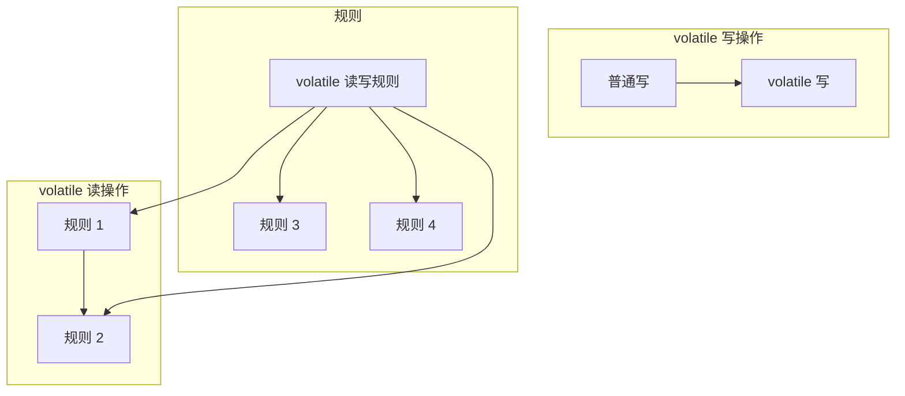
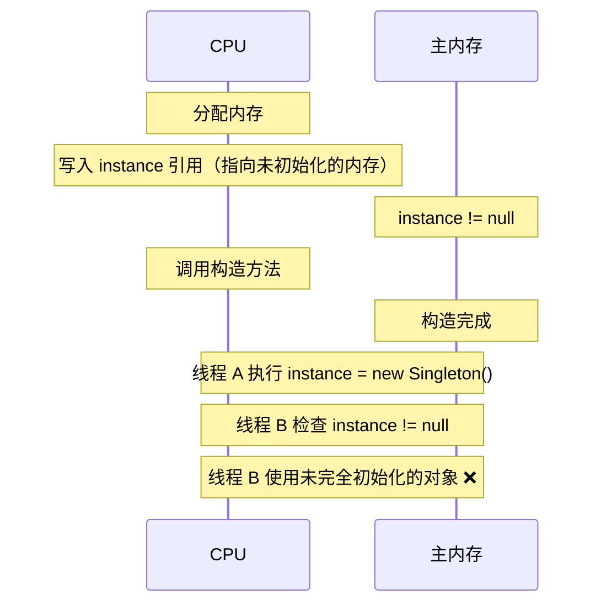

# volatile 禁止重排序原理

> **目标级别**：P5/P6
> **面试频率**：🔴 高频

面试官问：「volatile 怎么禁止重排序的？」你说「通过内存屏障」——然后面试官紧接着追问「具体插入了哪些屏障？为什么 volatile 不能保证复合操作的原子性？」你沉默了。

理解 volatile 的重排序规则，才能真正写出正确的并发代码。

## 面试官最关心的 3 个问题

1. ⚠️ volatile 禁止重排序的规则是什么？
2. ⚠️ volatile 插入的内存屏障有哪些？
3. ⚠️ volatile 为什么不保证原子性？

## 核心原理

### 重排序的类型

重排序分为三种类型：

| 类型 | 发生阶段 | 说明 |
|------|---------|------|
| **编译器重排序** | 编译期 | 编译器可以在不改变单线程语义的前提下重排序 |
| **指令级重排序** | 运行期 | CPU 流水线，指令并行 |
| **内存系统重排序** | 运行期 | CPU 缓存、StoreBuffer、Invalidate Queue |

### as-if-serial 语义

> 在单线程内，程序看起来是按顺序执行的。

编译器、CPU 可以重排序，只要**不改变单线程程序的执行结果**。

```java
double pi = 3.14;      // A
double r = 1.0;         // B
double area = pi * r * r; // C

// 编译器可以重排序为 B → A → C
// 因为 C 依赖 A 和 B 的结果
```

### volatile 重排序规则

JMM 为 volatile 定义了以下重排序规则：



| 操作 | 能否重排序 |
|------|-----------|
| 普通写 / volatile 写 | ❌ 禁止 |
| volatile 写 / 普通写 | ❌ 禁止 |
| volatile 写 / volatile 读 | ❌ 禁止 |
| volatile 读 / 普通读 | ❌ 禁止 |
| 普通读 / volatile 读 | ✅ 允许 |
| 普通写 / volatile 读 | ✅ 允许 |

### 内存屏障类型

| 屏障类型 | 说明 |
|---------|------|
| **LoadLoad** | 屏障前的所有 load 操作在屏障后的所有 load 操作之前完成 |
| **StoreStore** | 屏障前的所有 store 操作在屏障后的所有 store 操作之前完成 |
| **LoadStore** | 屏障前的所有 load 操作在屏障后的所有 store 操作之前完成 |
| **StoreLoad** | 屏障前的所有 store 操作在屏障后的所有 load 操作之前完成 |

### volatile 的内存屏障

```java
public class VolatileBarrier {
    private int a = 0;              // 普通变量
    private volatile int b = 0;     // volatile 变量

    // volatile 写后会插入 StoreStore + StoreLoad 屏障
    public void writer() {
        a = 1;           // 普通写
        b = 1;           // volatile 写 → StoreStore + StoreLoad
        // b = 1 之前的所有写操作（普通写）都会在 b = 1 之前完成
        // b = 1 之后的读操作（volatile 读）都会在 b = 1 之后开始
    }

    // volatile 读后会插入 LoadLoad + LoadStore 屏障
    public void reader() {
        int x = b;       // volatile 读 → LoadLoad + LoadStore
        int y = a;       // 普通读
        // b = 1 之前的读操作（如果有）都会在读取 b 之后
        // 读取 b 之后的所有操作都在读取 b 之后
    }
}
```

### 屏障插入图解

```
volatile 写操作后的屏障：
┌──────────┐    ┌──────────┐    ┌──────────┐
│ 普通写    │ → │ StoreStore│ → │ StoreLoad│ → 继续执行
└──────────┘    └──────────┘    └──────────┘
                （屏障）         （屏障）

volatile 读操作后的屏障：
┌──────────┐    ┌──────────┐    ┌──────────┐
│ volatile读│ → │ LoadLoad │ → │ LoadStore│ → 继续执行
└──────────┘    └──────────┘    └──────────┘
                （屏障）         （屏障）
```

## 单例模式中的 volatile

### 经典双重检查锁定

```java
public class Singleton {
    private static volatile Singleton instance;

    public static Singleton getInstance() {
        if (instance == null) { // 第一次检查
            synchronized (Singleton.class) {
                if (instance == null) { // 第二次检查
                    instance = new Singleton();
                }
            }
        }
        return instance;
    }
}
```

### 为什么需要 volatile？

`instance = new Singleton()` 分解为三个步骤：

```java
// 步骤 1：分配内存
memory = allocate();

// 步骤 2：调用构造方法
constructor(memory);

// 步骤 3：写入 instance 引用
instance = memory;
```

**问题**：指令重排序可能导致 3 → 2 的顺序：



### volatile 如何解决？

volatile 写后的 **StoreLoad** 屏障阻止了重排序：

```
普通写 (allocate) → volatile 写 (instance) → StoreLoad 屏障 → 后续读

屏障确保：volatile 写之前的所有操作（包括普通写）
         都在 volatile 写之前完成。
         后续的 volatile 读必须等待屏障完成。
```

## 高频面试题

### 🔴 题目 1：volatile 禁止重排序的规则是什么？

**参考回答**：

volatile 的重排序规则：

| 第一个操作 | 第二个操作 | 能否重排序 |
|-----------|-----------|-----------|
| 普通写 | volatile 写 | ❌ 禁止 |
| volatile 写 | 普通写 | ❌ 禁止 |
| volatile 写 | volatile 读 | ❌ 禁止 |
| volatile 读 | 普通读 | ❌ 禁止 |
| 普通读 | volatile 读 | ✅ 允许 |
| 普通写 | volatile 读 | ✅ 允许 |

**核心规则**：volatile 写之前的操作不能重排到 volatile 写之后，volatile 读之后的操作不能重排到 volatile 读之前。

### 🔴 题目 2：volatile 插入的内存屏障是什么？

**参考回答**：

- **volatile 写前**：StoreStore 屏障
- **volatile 写后**：StoreLoad 屏障
- **volatile 读前**：LoadLoad 屏障
- **volatile 读后**：LoadStore 屏障

### 🔴 题目 3：为什么 volatile 不保证原子性？

**参考回答**：

volatile 只保证**单个读写操作**的原子性，不保证**复合操作**的原子性。

```java
private volatile int counter = 0;

// counter++ 分解为：
// 1. 读取 counter（volatile 读）
// 2. counter + 1
// 3. 写入 counter（volatile 写）

// 两个线程同时执行 counter++：
// 线程 A：读取 counter = 0
// 线程 B：读取 counter = 0
// 线程 A：写入 counter = 1
// 线程 B：写入 counter = 1  ← 覆盖了 A 的修改！
```

**解决方案**：使用 `AtomicInteger` 或 `synchronized`。

## 常见错误与陷阱

### ⚠️ 陷阱 1：volatile + 非原子操作

```java
// ❌ 不安全
private volatile int balance = 1000;

public void withdraw(int amount) {
    if (balance >= amount) {
        balance -= amount; // 非原子
    }
}
```

### ⚠️ 陷阱 2：忽视内存屏障的性能影响

```java
// ❌ 高频更新场景
private volatile long counter = 0;

public void increment() {
    counter++; // volatile++ 有 StoreLoad 开销
}
```

### ⚠️ 陷阱 3：volatile 与复合条件

```java
// ❌ 不安全
private volatile boolean ready = false;
private volatile int data = 0;

// 线程 A
data = 100;
ready = true;

// 线程 B
while (!ready) {
    Thread.sleep(100);
}
use(data); // 可能看到 data = 0
```

**原因**：`ready` 的 volatile 读保证了读取到最新值，但 `data` 是普通写，可能被重排序到 `ready = true` 之前。

## 加分回答

### 💡 StoreLoad 屏障的性能开销

StoreLoad 屏障是内存屏障中最贵的，因为它需要：

1. 刷新 StoreBuffer
2. 使 InvalidQueue 失效
3. 可能导致 CPU 流水线停顿

```java
// x86 上的 volatile 开销
public class VolatileCost {
    private int a;                  // ~1 cycle
    private volatile int b;         // ~40-100 cycles (StoreLoad)
}
```

### 💡 x86 vs ARM 的屏障差异

| 屏障类型 | x86/x64 | ARM/Power |
|---------|---------|----------|
| StoreStore | 不需要 | 需要 |
| LoadLoad | 不需要 | 需要 |
| LoadStore | 需要 | 需要 |
| StoreLoad | 需要 | 需要 |

## 总结对比表

| 操作组合 | 重排序规则 | 插入屏障 |
|---------|-----------|---------|
| 普通写 → volatile 写 | ❌ 禁止 | StoreStore |
| volatile 写 → 普通写 | ❌ 禁止 | StoreLoad |
| volatile 写 → volatile 读 | ❌ 禁止 | StoreLoad |
| volatile 读 → 普通读 | ❌ 禁止 | LoadStore |
| 普通读 → volatile 读 | ✅ 允许 | 无 |
| 普通写 → volatile 读 | ✅ 允许 | StoreLoad |

## 延伸思考

### 面试官可能会继续追问

1. 「synchronized 的重排序规则是什么？」
2. 「Lock 和 volatile 有什么区别？」
3. 「如何实现一个线程安全的计数器？」

### 回答方向

synchronized 的重排序规则比 volatile 更严格：它既禁止了上述四种重排序，也禁止了锁内的重排序。synchronized 通过 `monitorenter` 和 `monitorexit` 隐式插入了 LoadLoad、LoadStore、StoreStore、StoreLoad 四种屏障。
