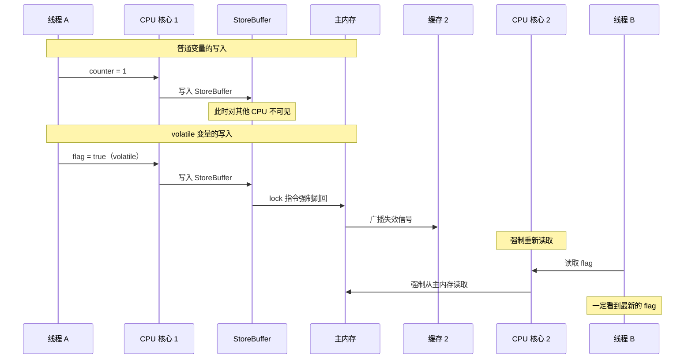
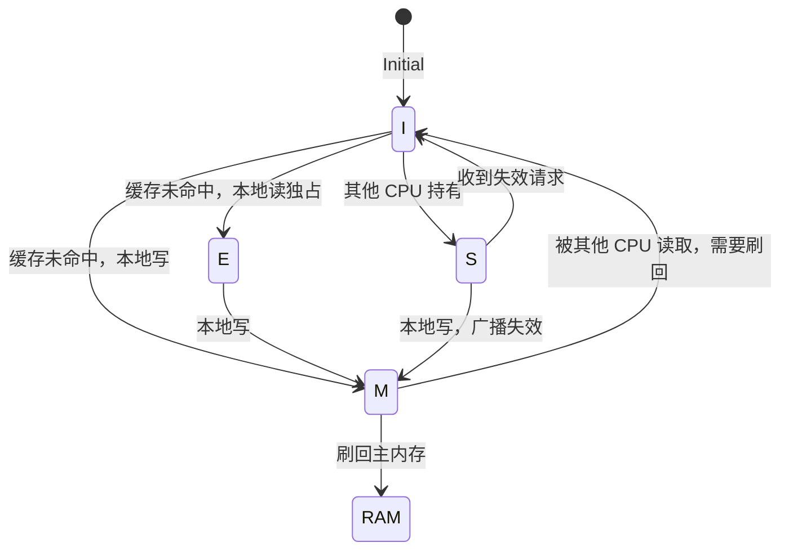

# volatile 可见性原理

> **目标级别**：P5/P6
> **面试频率**：🔴 高频

面试官问：「volatile 是怎么保证可见性的？」你说「通过缓存失效」——然后面试官紧接着追问「那底层实现是什么？MESI 协议了解吗？」你沉默了。

这道题考察的是对 volatile 底层原理的理解深度。

## 面试官最关心的 3 个问题

1. ⚠️ volatile 是怎么保证可见性的？
2. ⚠️ volatile 和普通变量的区别是什么？
3. ⚠️ volatile 的可见性在 x86 和 ARM 架构上有何不同？

## 核心原理

### volatile 的两大特性

| 特性 | 说明 |
|------|------|
| **可见性** | 写操作后立即刷新到主内存，读操作直接从主内存读取 |
| **禁止重排序** | 通过内存屏障阻止编译器和 CPU 的重排序 |

### 可见性问题回顾

```java
public class VisibilityProblem {
    private boolean flag = false;
    private int counter = 0;

    // 线程 A
    public void writer() {
        counter = 1;    // 步骤 1
        flag = true;    // 步骤 2
    }

    // 线程 B
    public void reader() {
        if (flag) {     // 步骤 3
            int x = counter; // 步骤 4
        }
    }
}
```

**问题**：线程 B 可能看到 `flag = true` 但 `counter = 0`！

### volatile 保证可见性的机制



### lock 前缀指令的作用

在 x86 架构下，volatile 写会使用 `lock` 前缀指令，主要作用：

1. **锁总线**：锁定 CPU 对内存总线的访问（早期实现，性能差）
2. **缓存锁定**：锁定缓存行，阻止其他 CPU 修改（现代实现，性能好）
3. **写屏障**：强制将 StoreBuffer 中的数据刷到主内存
4. **失效广播**：通知其他 CPU 缓存行失效

:::tip lock 指令的进化
现代 CPU（如 Intel Nehalem 以后）不再锁总线，而是使用缓存一致性协议（MESI）。lock 指令的作用变成：强制执行缓存刷新 + 失效其他 CPU 的缓存。
:::

## MESI 缓存一致性协议

### 四种缓存行状态

| 状态 | 缩写 | 说明 |
|------|------|------|
| **Modified** | M | 缓存行有效，数据被修改，只在本 CPU 缓存中 |
| **Exclusive** | E | 缓存行有效，数据与主内存一致，只在本 CPU 缓存中 |
| **Shared** | S | 缓存行有效，数据与主内存一致，多个 CPU 共享 |
| **Invalid** | I | 缓存行无效 |

### 状态转换图



### volatile 可见性实现

```
volatile 写：
┌────────────────────────────────────────────────────────────┐
│ 1. 写 volatile 变量                                         │
│ 2. 执行 lock 指令                                           │
│ 3. 将 StoreBuffer 中的数据刷到主内存                        │
│ 4. 发送 Invalidate 消息到其他 CPU                           │
│ 5. 等待其他 CPU 的 Invalidate Acknowledge                   │
└────────────────────────────────────────────────────────────┘

volatile 读：
┌────────────────────────────────────────────────────────────┐
│ 1. 读 volatile 变量                                         │
│ 2. 发送 Read 消息到总线                                      │
│ 3. 等待最新数据（可能是其他 CPU 刷回的数据）                 │
│ 4. 无视本地缓存中的过期数据                                  │
└────────────────────────────────────────────────────────────┘
```

## 不同架构的内存模型

### x86/x64 (TSO - Total Store Order)


x86 是相对较强的内存模型：
- 写后读不保证可见（StoreBuffer 导致）
- 读后写不重排序
- 写后写不重排序

### ARM/Power (Relaxed Memory Order)


ARM/Power 是较弱的内存模型：
- 允许更多重排序
- 性能更好，但编程更困难
- volatile 需要更多内存屏障

### 性能对比

| 架构 | volatile 开销 | 原因 |
|------|--------------|------|
| x86/x64 | 较低 | TSO 模型，lock 指令相对便宜 |
| ARM | 较高 | 宽松模型，需要更多屏障 |
| Power | 较高 | 宽松模型，需要更多屏障 |

## 高频面试题

### 🔴 题目 1：volatile 是怎么保证可见性的？

**参考回答**：

volatile 通过以下机制保证可见性：

1. **写操作**：CPU 执行 lock 指令，将数据强制刷新到主内存，并发送失效信号给其他 CPU
2. **读操作**：CPU 读取时强制从主内存读取，无视本地缓存中的过期数据
3. **缓存一致性**：依赖 MESI 协议，当缓存行被修改时，其他 CPU 的缓存行会失效

**追问**：lock 指令具体做了什么？

1. 锁定缓存行（通过缓存一致性协议）
2. 强制将 StoreBuffer 中的数据刷到主内存
3. 失效其他 CPU 的缓存行

### 🔴 题目 2：volatile 和普通变量有什么区别？

**参考回答**：

| 区别 | 普通变量 | volatile 变量 |
|------|---------|----------------|
| **可见性** | 不保证 | 保证 |
| **禁止重排序** | 不保证 | 保证 |
| **原子性** | 复合操作不保证 | 不保证 |
| **性能** | 较高 | 较低（需要内存屏障） |

### 🔴 题目 3：volatile 能保证 long/double 的原子性吗？

**参考回答**：

- **32 位 JVM**：volatile long/double 不保证原子性（可能分两次写入）
- **64 位 JVM**：volatile long/double 保证原子性（JVM 规范要求）

:::warning 最佳实践
在 32 位系统上，如果对 long/double 有原子性要求，应该使用 synchronized 或 AtomicLong/AtomicDouble。
:::

## 常见错误与陷阱

### ⚠️ 陷阱 1：以为 volatile 可以替代 synchronized

```java
// ❌ 不安全的操作
private volatile int counter = 0;

public void increment() {
    counter++; // 非原子操作！
}
```

**原因**：`counter++` 是三个操作（读-改-写），volatile 不能保证原子性。

### ⚠️ 陷阱 2：忽视 volatile 的性能开销

```java
// ❌ 频繁更新的场景不适合 volatile
private volatile int frameCount = 0;

public void render() {
    frameCount++; // 每帧都更新，开销大
}
```

### ⚠️ 陷阱 3：volatile 与死循环

```java
private volatile boolean running = true;

public void stop() {
    running = false; // 设置为 false
}

public void run() {
    while (running) {
        // 如果 running 不可见，死循环！
    }
}
```

**问题**：在 ARM 等弱内存模型上，可能永远看不到 running = false。

## 加分回答

### 💡 缓存行与伪共享

缓存行（Cache Line）是 CPU 缓存的最小单位，通常是 64 字节。如果多个变量在同一缓存行，一个线程修改会影响另一个线程。

```java
// 伪共享示例
public class FalseSharing {
    private volatile long x = 0;
    private volatile long y = 0; // 与 x 在同一缓存行！
}
```

**解决方案**：
1. 使用 `@Contended` 注解（Java 8+）
2. 填充缓存行

### 💡 JMM 的内存屏障类型

| 屏障类型 | 说明 |
|---------|------|
| **LoadLoad** | 屏障前的读操作在屏障后的读操作之前 |
| **StoreStore** | 屏障前的写操作在屏障后的写操作之前 |
| **LoadStore** | 屏障前的读操作在屏障后的写操作之前 |
| **StoreLoad** | 屏障前的写操作在屏障后的读操作之前 |

volatile 写后会插入 **StoreLoad** 屏障，这是最贵的屏障。

## 总结对比表

| 特性 | 普通变量 | volatile | synchronized |
|------|---------|----------|--------------|
| 可见性 | ❌ | ✅ | ✅ |
| 禁止重排序 | ❌ | ✅ | ✅ |
| 原子性（简单操作） | ✅ | ✅ | ✅ |
| 原子性（复合操作） | ❌ | ❌ | ✅ |
| 性能 | 高 | 中 | 低 |
| 可重入 | - | - | ✅ |

## 延伸思考

### 面试官可能会继续追问

1. 「什么是缓存行对齐？如何避免伪共享？」
2. 「MESI 协议中 M 和 E 状态的区别是什么？」
3. 「为什么 Java 需要 JMM 而不是直接依赖硬件内存模型？」

### 回答方向

关于 JMM 的必要性：不同 CPU 架构有不同的内存模型（JMM 屏蔽了这些差异）：
- x86 是 TSO 模型
- ARM/Power 是 Relaxed 模型
- 如果 Java 直接依赖硬件内存模型，跨平台代码的行为会不一致
