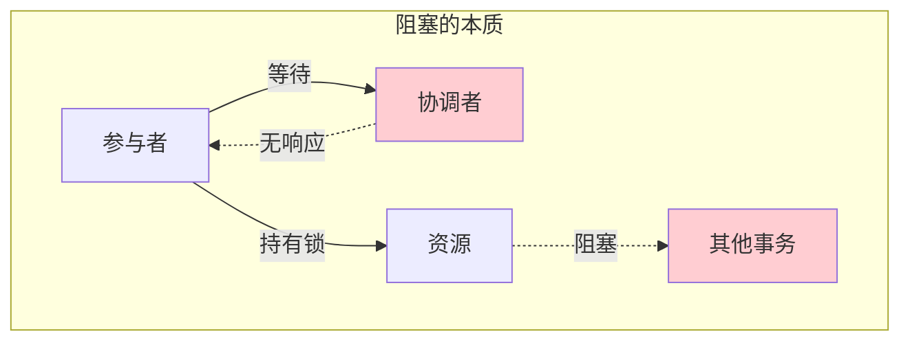
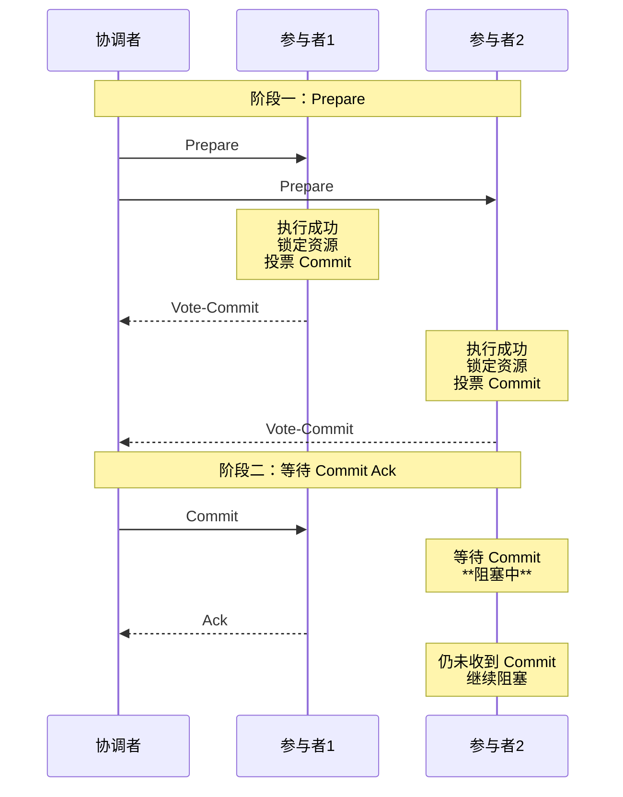
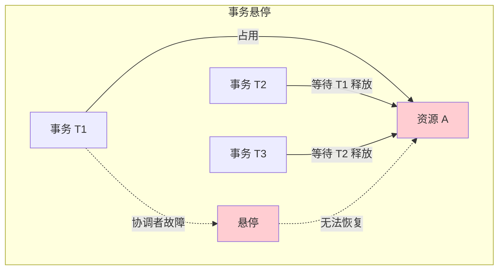
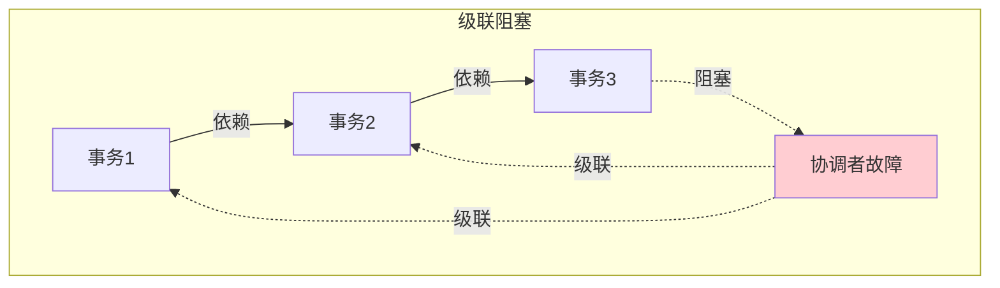
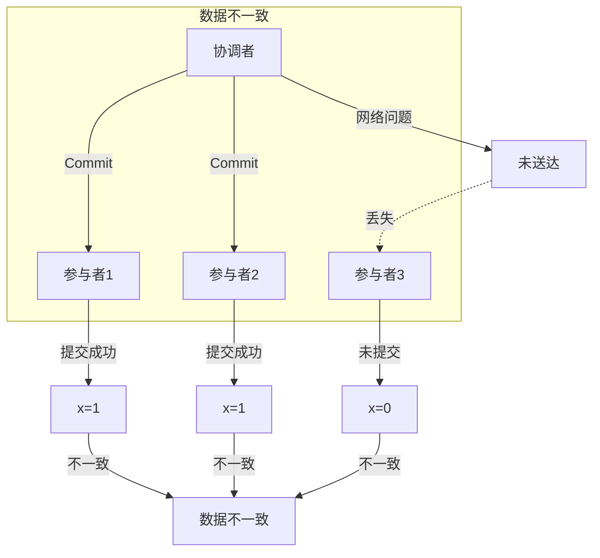

# 2PC 的阻塞问题与缺陷

> **目标级别**：P6
> **面试频率**：🔴 高频
> **面试官最关心的 3 个问题**：
> 1. 2PC 的阻塞问题是怎么产生的？
> 2. 协调者故障后，参与者会怎样？
> 3. 如何解决 2PC 的阻塞问题？

面试官问：「2PC 有什么问题？」你说「同步阻塞、单点故障」——然后面试官紧接着追问「那具体是怎么阻塞的？协调者挂了之后，参与者怎么恢复？」你沉默了。

理解 2PC 的阻塞问题和缺陷，是面试 P6 的必备知识点。

## 一、2PC 阻塞问题的本质

### 1.1 阻塞的定义

**阻塞（Blocking）**：事务在执行过程中，由于某些条件不满足，导致事务参与者无限期等待，无法继续执行。



### 1.2 阻塞的触发条件

| 触发条件 | 说明 |
|----------|------|
| **协调者发送 Prepare 后等待** | 参与者等待投票结果 |
| **协调者故障** | 参与者不知道该提交还是回滚 |
| **网络分区** | 参与者无法与协调者通信 |
| **参与者故障恢复** | 恢复后不知道事务状态 |

## 二、阻塞场景分析

### 2.1 场景一：协调者正常，参与者阻塞



**问题**：协调者发送 Commit 后，部分参与者可能未收到

### 2.2 场景二：协调者故障

```mermaid
graph TB
    subgraph "协调者故障"
        C["协调者"] -.x|"故障"| P1["参与者1"]
        C -.x|"故障"| P2["参与者2"]
        C -.x|"故障"| P3["参与者3"]

        P1 -->|"持有锁|等待"| W["无限等待"]
        P2 -->|"持有锁|等待"| W
        P3 -->|"持有锁|等待"| W

        W -->|"超时？"| R["恢复决策"]
        R -->|"无法判断"| Q["? 提交还是回滚?"
    end

    style C fill:#ffcdd2
    style W fill:#ffcdd2
    style Q fill:#ffcdd2
```

### 2.3 场景三：网络分区

```mermaid
graph TB
    subgraph "网络分区"
        subgraph "分区1"
            C["协调者"]
            P1["参与者1"]
        end

        subgraph "分区2"
            P2["参与者2"]
            P3["参与者3"]
        end

        P1 -.->|"网络断开"| P2
        P2 -.->|"网络断开"| P1
    end

    Note over C,P3: 分区1 认为：准备成功，可以提交<br/>分区2 认为：协调者挂了
```

## 三、阻塞问题的具体表现

### 3.1 资源长时间锁定

```java
// 2PC 中资源的生命周期
public class ResourceLockExample {

    public void distributedTransaction() {
        // 阶段一：Prepare
        lock(resource1);  // 开始锁定
        lock(resource2);
        lock(resource3);

        // 业务逻辑
        doBusiness();

        // 阶段二：Commit/Rollback
        if (allPrepared) {
            commit();
        } else {
            rollback();
        }

        unlock(resource1);  // 释放锁
        unlock(resource2);
        unlock(resource3);
    }
}

// 问题：Prepare 到 Commit 之间，资源一直被锁定
// 如果协调者故障，锁可能永远无法释放
```

### 3.2 事务悬停（Distributed Hang）



### 3.3 级联阻塞



## 四、2PC 的其他缺陷

### 4.1 单点故障

| 缺陷 | 说明 |
|------|------|
| **协调者唯一** | 没有备份协调者 |
| **故障无备援** | 协调者故障后无法自动恢复 |
| **决策失效** | 参与者不知道该提交还是回滚 |

### 4.2 数据不一致风险



### 4.3 保守策略

| 策略 | 说明 | 影响 |
|------|------|------|
| **全票通过** | 一个 Vote-Abort 导致全部回滚 | 缺乏灵活性 |
| **无法区分原因** | 不知道是业务失败还是网络问题 | 处理复杂 |

## 五、阻塞问题的解决方案

### 5.1 日志+超时机制

```java
public class CoordinatorRecovery {

    // 协调者需要记录日志
    public void writeCommitLog(String transactionId, String decision) {
        log.write(transactionId, decision);
        log.sync();  // 同步到磁盘
    }

    // 协调者重启后读取日志恢复
    public void recover() {
        List<TransactionLog> logs = log.readAll();

        for (TransactionLog log : logs) {
            if (log.isPrepared() && !log.isDecided()) {
                // 事务处于准备状态，需要重新决策
                redoDecision(log);
            } else if (log.isDecided()) {
                // 事务已决策，发送决定
                resendDecision(log);
            }
        }
    }
}
```

### 5.2 参与者超时机制

```java
public class ParticipantRecovery {

    // 参与者记录日志
    public void writePrepareLog(String transactionId) {
        log.write(transactionId, TransactionState.PREPARED);
        log.sync();
    }

    // 参与者超时等待决策
    public void waitForDecision() {
        // 等待协调者的 Commit/Rollback
        // 设置超时时间
        Decision decision = waitQueue.poll(30, TimeUnit.SECONDS);

        if (decision == null) {
            // 超时后的处理策略
            handleTimeout();
        }
    }

    private void handleTimeout() {
        // 策略1：查询其他参与者
        // 策略2：查询协调者的备份
        // 策略3：人工干预
        // 策略4：默认回滚（保守策略）
    }
}
```

### 5.3 协调者备份

```mermaid
graph TB
    subgraph "协调者备份"
        C1["主协调者"]
        C2["备份协调者"]
        P1["参与者1"]
        P2["参与者2"]

        C1 -->|"实时同步日志"| C2

        C1 -.x|"故障"| F["故障"]

        C2 -->|"接管"| P1
        C2 -->|"接管"| P2

        P1 -->|"恢复"| REC["事务恢复"]
        P2 -->|"恢复"| REC
    end

    style F fill:#ffcdd2
    style REC fill:#c8e6c9
```

## 六、面试高频题

### 🔴 题目 1：2PC 的阻塞问题是怎么产生的？

**参考回答**：

2PC 的阻塞问题主要来自两个方面：

**1. 协调者正常，参与者阻塞**
- 协调者发送 Prepare 后等待投票
- 协调者发送 Commit 后，部分参与者未收到
- 参与者无限期等待

**2. 协调者故障，参与者悬停**
- 协调者故障后，参与者不知道该提交还是回滚
- 参与者一直持有锁，阻塞其他事务

**根本原因**：2PC 没有完善的超时和恢复机制

### 🔴 题目 2：如何解决 2PC 的阻塞问题？

**参考回答**：

| 解决方案 | 说明 |
|----------|------|
| **日志记录** | 协调者和参与者都记录事务状态 |
| **超时机制** | 设置超时时间，超时后采取默认策略 |
| **协调者备份** | 主备协调者，故障自动切换 |
| **3PC 协议** | 增加 CanCommit 阶段，减少阻塞时间 |
| **人工干预** | 极端情况人工介入 |

### 🟡 题目 3：协调者挂了之后，参与者怎么恢复？

**参考回答**：

**参与者恢复流程**：

1. **读取本地 Prepare 日志**
2. **如果日志显示已准备**：
   - 查询协调者或其他参与者
   - 根据协调者的状态决定提交或回滚
3. **如果日志显示未准备**：正常回滚
4. **超时后**：根据默认策略（通常是回滚）

```java
public RecoveryResult recover() {
    TransactionState state = readPrepareLog();

    if (state == PREPARED) {
        // 查询协调者状态
        CoordinatorStatus status = queryCoordinator();

        if (status == COMMIT) {
            commit();
        } else if (status == ROLLBACK) {
            rollback();
        } else {
            // 协调者无响应，根据超时决策
            return handleUnknownState();
        }
    }

    return COMPLETED;
}
```

## 七、常见错误与陷阱

### ⚠️ 陷阱 1：认为超时就是回滚

```
❌ 错误理解：
参与者等待超时后就回滚

✅ 正确理解：
超时后应该：
1. 尝试联系协调者
2. 查询其他参与者
3. 协调多个参与者达成一致
4. 最后才采取默认策略
```

### ⚠️ 陷阱 2：忽略日志的重要性

```
❌ 错误理解：
2PC 只需要网络通信

✅ 正确理解：
日志是恢复的基础
没有日志，无法恢复事务状态
```

### ⚠️ 陷阱 3：协调者单点故障是小问题

```
❌ 错误理解：
协调者很少故障，不用太在意

✅ 正确理解：
任何节点都可能故障
必须设计协调者故障的恢复方案
```

## 八、总结对比表

| 问题类型 | 问题描述 | 影响 | 解决方案 |
|----------|----------|------|----------|
| **同步阻塞** | 资源锁定时间长 | 性能差 | 3PC |
| **单点故障** | 协调者故障无备援 | 事务悬停 | 主备协调者 |
| **数据不一致** | 部分提交部分未提交 | 数据错误 | 日志+恢复 |
| **超时处理** | 无标准超时策略 | 行为不确定 | 明确超时策略 |
| **保守策略** | 一个拒绝全部回滚 | 缺乏灵活 | 改进投票机制 |

## 九、加分回答

> **💡 面试加分点**：
>
> 1. **MySQL XA 的阻塞问题**：MySQL XA 在协调者故障时的处理机制
>
> 2. **Percolator 事务模型**：Google Bigtable 使用的分布式事务模型，避免 2PC 的问题
>
> 3. **Spanner 的 TrueTime**：使用 TrueTime API + 两阶段提交，保证外部一致性
>
> 4. **TicToc**：基于 MVCC 的分布式事务协议，减少锁竞争
