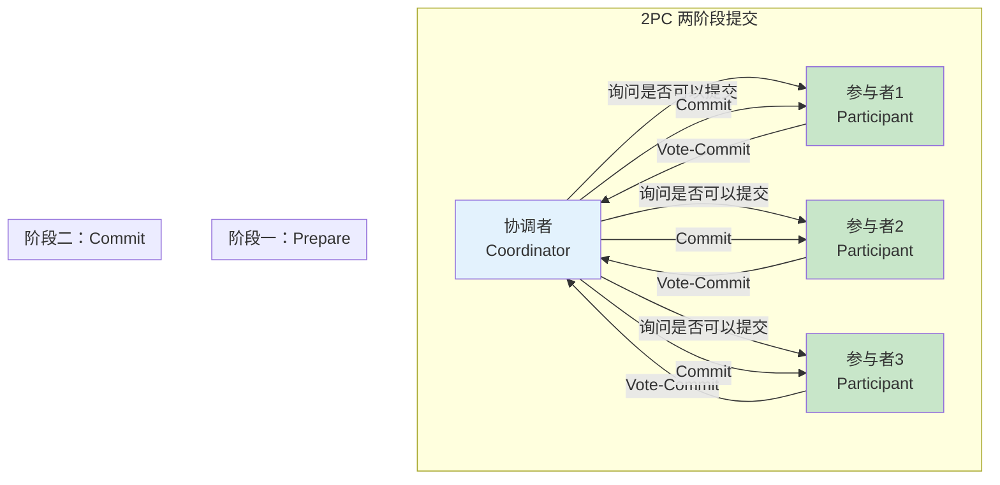
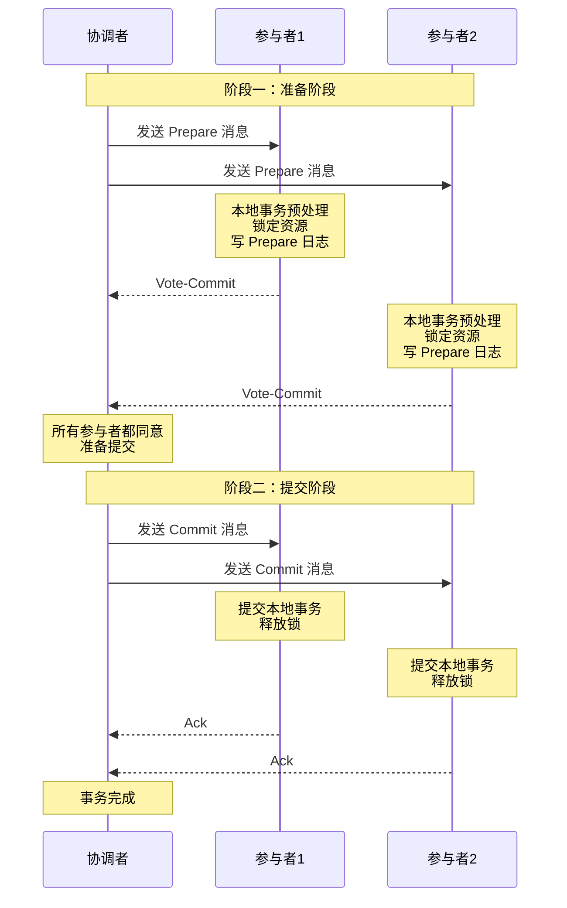
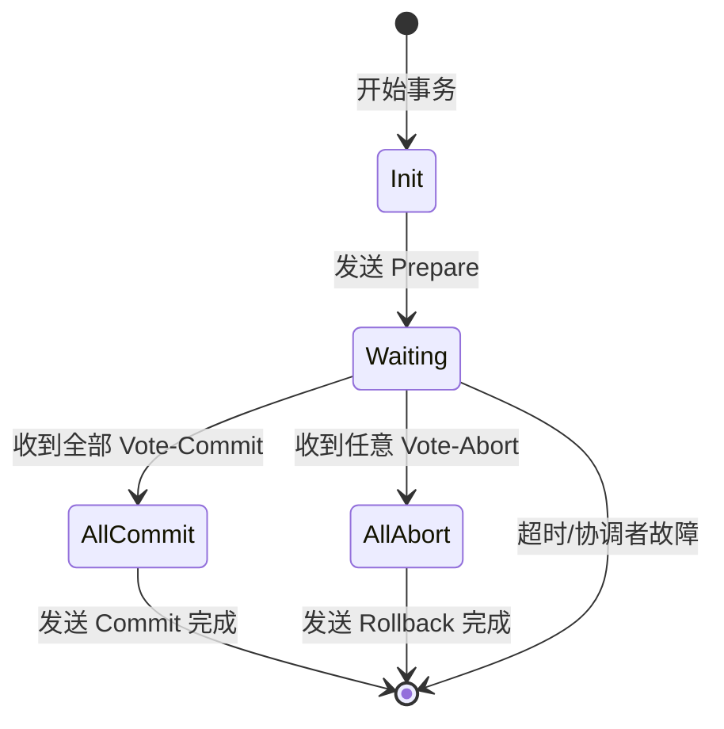
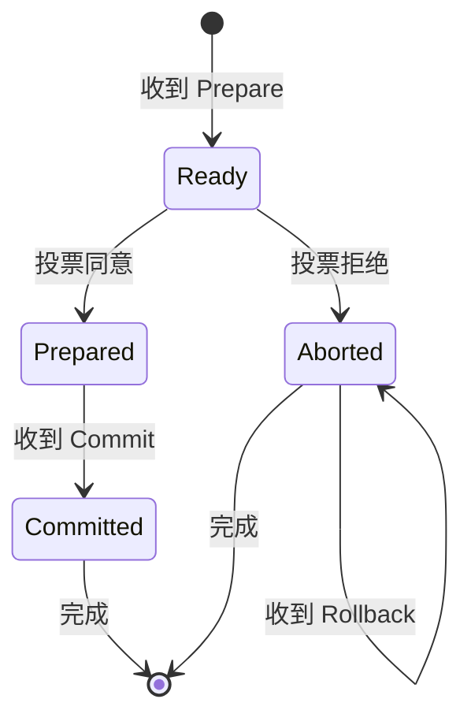
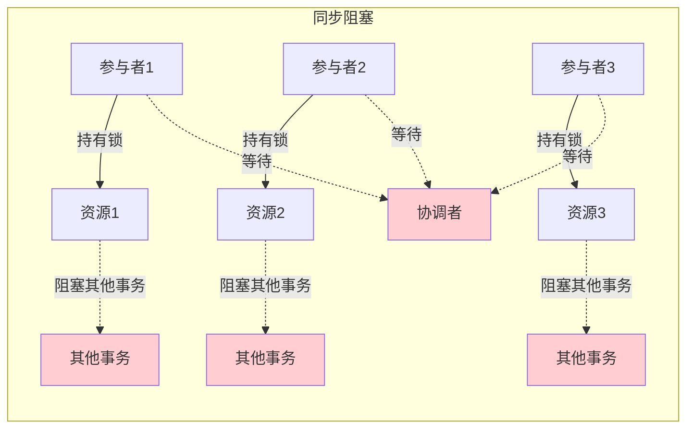
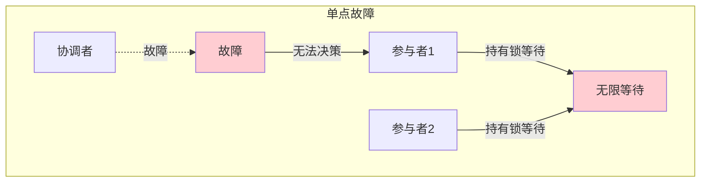

# 2PC 两阶段提交

> **目标级别**：P6
> **面试频率**：🔴 高频
> **面试官最关心的 3 个问题**：
> 1. 2PC 的流程是什么？
> 2. 2PC 有什么问题？
> 3. 2PC 和 3PC 有什么区别？

面试官问：「分布式事务怎么实现？」你说「用两阶段提交」——然后面试官紧接着追问「那 2PC 的 prepare 和 commit 阶段分别做什么？如果协调者挂了怎么办？」你沉默了。

2PC 是分布式事务的经典协议，理解它是学习分布式事务的起点。

## 一、2PC 的基本概念

### 1.1 什么是 2PC

2PC（Two-Phase Commit）两阶段提交协议，用于保证分布式系统中事务的原子性：

- **阶段一：Prepare（准备阶段）**：协调者询问所有参与者是否可以提交
- **阶段二：Commit（提交阶段）**：协调者根据结果决定提交或回滚



### 1.2 角色定义

| 角色 | 说明 | 类比 |
|------|------|------|
| **协调者（Coordinator）** | 负责协调整个事务 | 事务管理器 TM |
| **参与者（Participant）** | 负责执行本地事务 | 资源管理器 RM |

## 二、2PC 的详细流程

### 2.1 流程图



### 2.2 第一阶段：Prepare（准备阶段）

```
┌─────────────────────────────────────────────────────────┐
│                     Prepare 阶段                        │
├─────────────────────────────────────────────────────────┤
│  协调者：                                                │
│    1. 发送 Prepare 消息给所有参与者                        │
│    2. 等待所有参与者的响应                                 │
│                                                         │
│  参与者：                                                │
│    1. 执行本地事务（但不提交）                             │
│    2. 锁定相关资源                                       │
│    3. 写入 Prepare 日志（Undo/Redo）                      │
│    4. 返回 Vote-Commit 或 Vote-Abort                      │
└─────────────────────────────────────────────────────────┘
```

### 2.3 第二阶段：Commit（提交阶段）

#### 情况一：所有参与者都 Vote-Commit

```
协调者：
  1. 发送 Commit 消息给所有参与者
  2. 等待所有参与者的 Ack

参与者：
  1. 提交本地事务
  2. 释放锁
  3. 发送 Ack 给协调者
```

#### 情况二：任何一个参与者 Vote-Abort

```
协调者：
  1. 发送 Rollback 消息给所有参与者
  2. 等待所有参与者的 Ack

参与者：
  1. 回滚本地事务
  2. 释放锁
  3. 发送 Ack 给协调者
```

## 三、2PC 的状态机

### 3.1 协调者状态机



### 3.2 参与者状态机



## 四、2PC 的代码实现

### 4.1 协调者实现

```java
public class Coordinator {

    private List<Participant> participants = new ArrayList<>();

    public boolean commit() {
        // 第一阶段：准备
        boolean allPrepared = prepare();

        if (allPrepared) {
            // 第二阶段：提交
            return doCommit();
        } else {
            // 回滚
            return doRollback();
        }
    }

    private boolean prepare() {
        for (Participant p : participants) {
            if (!p.prepare()) {
                return false;
            }
        }
        return true;
    }

    private boolean doCommit() {
        for (Participant p : participants) {
            if (!p.commit()) {
                // 提交失败，尝试重试或告警
                log.error("Participant {} commit failed", p);
            }
        }
        return true;
    }

    private boolean doRollback() {
        for (Participant p : participants) {
            p.rollback();
        }
        return true;
    }
}
```

### 4.2 参与者实现

```java
public class Participant {

    private boolean prepared = false;

    public boolean prepare() {
        try {
            // 1. 开启本地事务
            connection.setAutoCommit(false);

            // 2. 执行本地事务操作
            executeLocalTransaction();

            // 3. 锁定资源（悲观锁/乐观锁）
            lockResources();

            // 4. 写入 Prepare 日志（Undo/Redo）
            writePrepareLog();

            // 5. 预提交成功
            prepared = true;
            return true;
        } catch (Exception e) {
            rollback();
            return false;
        }
    }

    public void commit() {
        if (prepared) {
            // 提交本地事务
            connection.commit();
            prepared = false;
        }
    }

    public void rollback() {
        // 回滚本地事务
        connection.rollback();
        prepared = false;
    }
}
```

## 五、2PC 的问题

### 5.1 同步阻塞问题



**问题**：参与者在 Prepare 阶段锁定资源，直到 Commit/Rollback 才释放

### 5.2 单点故障问题



**问题**：协调者故障后，参与者不知道该提交还是回滚

### 5.3 数据不一致问题

```
场景：协调者发送 Commit 后，部分参与者故障

协调者：已发送 Commit，认为事务完成
参与者1：收到 Commit，提交成功
参与者2：未收到 Commit（故障），一直等待
参与者3：收到 Commit，提交成功

结果：数据不一致
```

## 六、面试高频题

### 🔴 题目 1：2PC 的流程是什么？

**参考回答**：

2PC 分为两个阶段：

**阶段一（Prepare）**：
1. 协调者发送 Prepare 消息给所有参与者
2. 参与者执行本地事务（但不提交），锁定资源
3. 参与者写入 Prepare 日志
4. 参与者返回 Vote-Commit 或 Vote-Abort

**阶段二（Commit）**：
1. 如果所有参与者都 Vote-Commit，协调者发送 Commit
2. 如果有参与者 Vote-Abort，协调者发送 Rollback
3. 参与者提交/回滚本地事务，释放锁

### 🔴 题目 2：2PC 有什么问题？

**参考回答**：

| 问题 | 说明 | 影响 |
|------|------|------|
| **同步阻塞** | 参与者锁定资源直到事务结束 | 性能差 |
| **单点故障** | 协调者故障导致事务悬停 | 可用性低 |
| **数据不一致** | 部分参与者提交成功，部分失败 | 数据错误 |
| **保守策略** | 一个拒绝则全部回滚 | 缺乏灵活性 |

### 🟡 题目 3：2PC 和 3PC 有什么区别？

**参考回答**：

| 区别 | 2PC | 3PC |
|------|-----|-----|
| **阶段数** | 2 阶段 | 3 阶段 |
| **协调者故障** | 可能导致数据不一致 | 有超时机制 |
| **参与者阻塞** | Prepare 阶段就开始阻塞 | CanCommit 有超时 |
| **网络开销** | 较少 | 较多 |
| **数据不一致风险** | 存在 | 降低但仍存在 |

## 七、常见错误与陷阱

### ⚠️ 陷阱 1：认为 2PC 可以完全保证一致性

```
❌ 错误理解：
2PC 可以 100% 保证分布式事务一致

✅ 正确理解：
2PC 在协调者故障时可能导致数据不一致
需要配合其他机制（如日志恢复）
```

### ⚠️ 陷阱 2：忽略 Prepare 阶段的资源锁定

```
❌ 错误理解：
2PC 只是多了一次网络通信

✅ 正确理解：
Prepare 阶段锁定资源
可能导致长时间阻塞
```

### ⚠️ 陷阱 3：认为协调者故障是小概率事件

```
❌ 错误理解：
协调者很少故障，不用考虑

✅ 正确理解：
分布式系统中，任何节点都可能故障
必须考虑协调者故障的场景
```

## 八、总结对比表

| 维度 | 2PC | 3PC |
|------|-----|-----|
| **阶段数** | 2 | 3 |
| **同步阻塞** | 有 | 缩短 |
| **单点故障** | 存在 | 有改善 |
| **数据不一致** | 可能 | 降低 |
| **网络开销** | 较少 | 较多 |
| **超时机制** | 无 | 有 |

## 九、加分回答

> **💡 面试加分点**：
>
> 1. **MySQL XA**：MySQL 支持 XA 协议实现 2PC，可用于分布式事务
>
> 2. **ShardingSphere**：通过 ShardingSphere 实现 2PC，解决分库分表事务问题
>
> 3. **Atomikos**：Java 中的分布式事务框架，支持 JTA/XA
>
> 4. **2PC 的优化**：预提交机制、双 Coordinator 等优化方案
