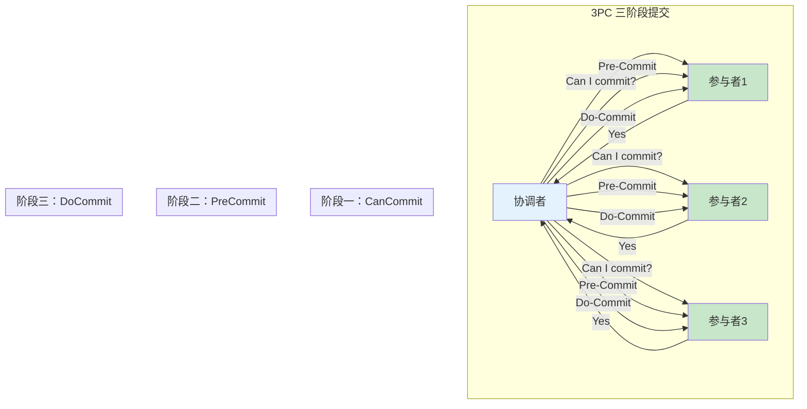
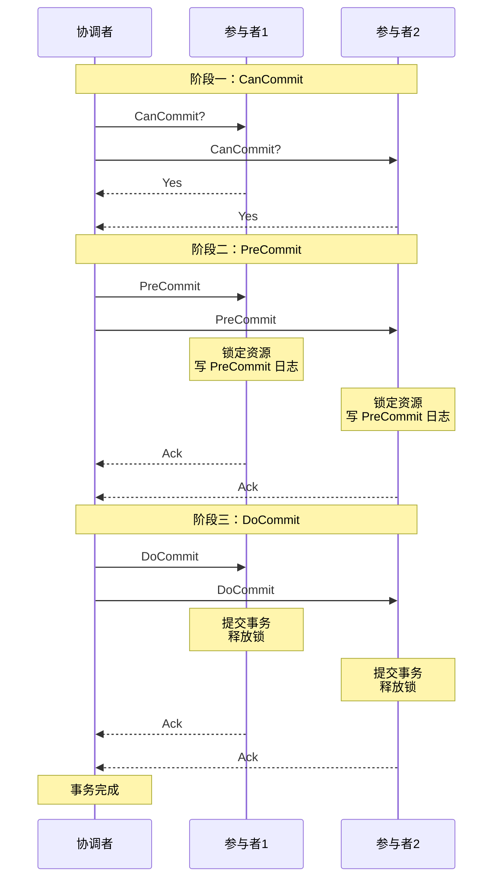
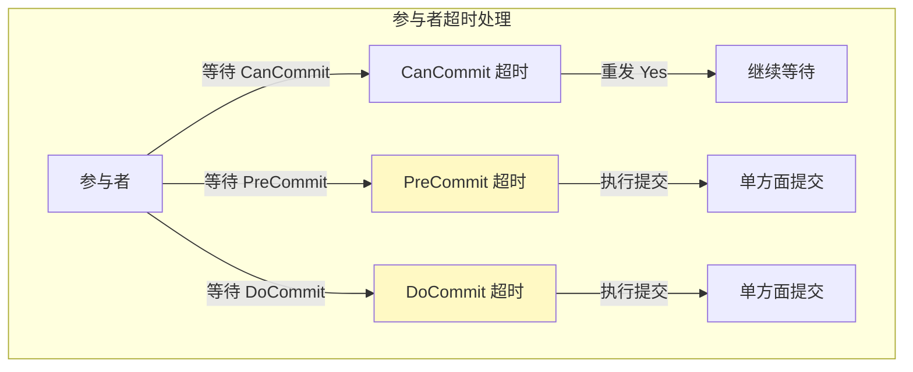
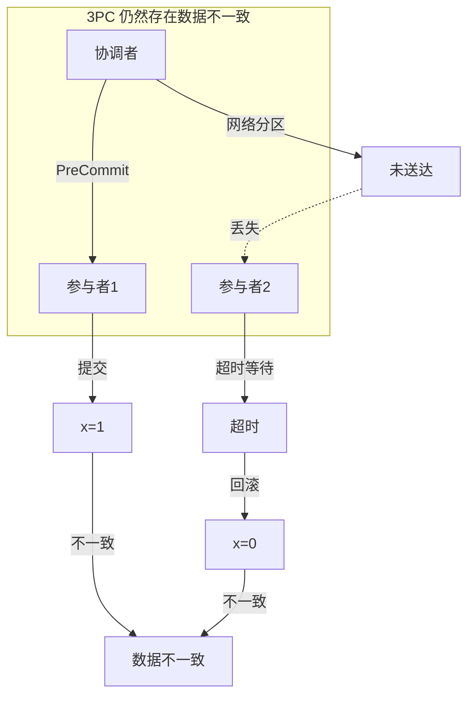
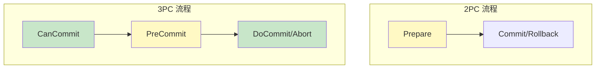

# 3PC 三阶段提交

> **目标级别**：P6
> **面试频率**：🟡 中频
> **面试官最关心的 3 个问题**：
> 1. 3PC 的流程是什么？
> 2. 3PC 比 2PC 好在哪里？
> 3. 3PC 解决了 2PC 的哪些问题？还有什么问题？

面试官问：「你知道 3PC 吗？」你说「知道，是 2PC 的改进版」——然后面试官紧接着追问「那 3PC 的 CanCommit 阶段是做什么的？3PC 真的解决了数据不一致问题吗？」你沉默了。

3PC 是 2PC 的改进版本，增加了超时机制，减少了阻塞时间。

## 一、3PC 的基本概念

### 1.1 什么是 3PC

3PC（Three-Phase Commit）三阶段提交协议，在 2PC 的基础上增加了一个阶段：

- **阶段一：CanCommit（询问阶段）**：协调者询问参与者是否可以提交
- **阶段二：PreCommit（预提交阶段）**：协调者预提交，参与者锁定资源
- **阶段三：DoCommit（执行阶段）**：协调者正式提交



### 1.2 3PC 的核心改进

| 改进点 | 2PC | 3PC |
|--------|-----|-----|
| **阶段数** | 2 | 3 |
| **阻塞时间** | 长（从 Prepare 开始） | 短（从 PreCommit 开始） |
| **超时机制** | 无 | 有（部分解决） |
| **协调者故障** | 可能数据不一致 | 有改善 |

## 二、3PC 的详细流程

### 2.1 完整流程图



### 2.2 第一阶段：CanCommit（询问阶段）

```
┌─────────────────────────────────────────────────────────┐
│                   CanCommit 阶段                         │
├─────────────────────────────────────────────────────────┤
│  协调者：                                                │
│    1. 发送 CanCommit 消息给所有参与者                      │
│    2. 等待参与者的响应                                    │
│                                                         │
│  参与者：                                                │
│    1. 检查自身状态是否可以提交                             │
│    2. 返回 Yes 或 No                                     │
│                                                         │
│  目的：                                                  │
│    - 提前发现可能失败的事务                                │
│    - 减少长时间锁定资源                                    │
└─────────────────────────────────────────────────────────┘
```

### 2.3 第二阶段：PreCommit（预提交阶段）

**情况一：所有参与者都返回 Yes**

```
协调者：
  1. 发送 PreCommit 消息给所有参与者
  2. 等待参与者的 Ack

参与者：
  1. 锁定相关资源
  2. 执行本地事务（但不提交）
  3. 写入 PreCommit 日志
  4. 返回 Ack
```

**情况二：任何一个参与者返回 No**

```
协调者：
  1. 发送 Abort 消息给所有参与者
  2. 事务终止
```

### 2.4 第三阶段：DoCommit（执行阶段）

**情况一：协调者收到所有 PreCommit Ack**

```
协调者：
  1. 发送 DoCommit 消息给所有参与者
  2. 等待 Ack

参与者：
  1. 提交本地事务
  2. 释放锁
  3. 发送 Ack
```

**情况二：协调者超时或收到 Abort**

```
协调者：
  1. 发送 DoAbort 消息给所有参与者

参与者：
  1. 回滚本地事务
  2. 释放锁
```

## 三、3PC 的超时机制

### 3.1 参与者的超时处理



### 3.2 协调者的超时处理

| 阶段 | 超时处理 |
|------|----------|
| **CanCommit** | 发送 Abort，终止事务 |
| **PreCommit** | 发送 Abort，让参与者回滚 |
| **DoCommit** | 发送 Abort，事务应该已完成 |

### 3.3 超时决策逻辑

```java
public class ParticipantTimeoutHandler {

    public void handleCanCommitTimeout() {
        // CanCommit 超时：可以安全终止
        log.info("CanCommit timeout, aborting");
        // 不锁定资源，直接终止
    }

    public void handlePreCommitTimeout() {
        // PreCommit 超时：需要确认
        // 尝试联系其他参与者
        boolean anyCommitted = queryOtherParticipants();

        if (anyCommitted) {
            // 有人已提交，我也提交
            doCommit();
        } else {
            // 没人提交，回滚
            doAbort();
        }
    }

    public void handleDoCommitTimeout() {
        // DoCommit 超时：应该已提交
        // 直接提交
        log.info("DoCommit timeout, assuming committed");
        doCommit();
    }
}
```

## 四、3PC 解决的问题与未解决的问题

### 4.1 3PC 解决的问题

| 问题 | 2PC | 3PC | 解决方案 |
|------|-----|-----|----------|
| **阻塞起点** | Prepare 阶段 | PreCommit 阶段 | 减少阻塞时间 |
| **协调者故障** | 可能悬停 | 有超时机制 | 部分解决 |
| **无响应处理** | 无 | 有超时 | 明确处理方式 |

### 4.2 3PC 未解决的问题

**数据不一致问题仍然存在**：



### 4.3 3PC 的新问题

| 新问题 | 说明 |
|--------|------|
| **网络开销增加** | 多了一个 CanCommit 阶段 |
| **延迟增加** | 额外一轮通信 |
| **仍然存在数据不一致** | 只是降低概率 |
| **实现复杂** | 需要处理多种超时情况 |

## 五、2PC vs 3PC 对比

### 5.1 流程对比



### 5.2 对比表

| 维度 | 2PC | 3PC |
|------|-----|-----|
| **阶段数** | 2 | 3 |
| **阻塞起点** | Prepare 阶段 | PreCommit 阶段 |
| **同步阻塞时间** | 长 | 短 |
| **协调者故障** | 可能悬停 | 有超时 |
| **数据不一致** | 可能 | 仍可能 |
| **网络开销** | 较少 | 较多 |
| **实现复杂度** | 低 | 高 |
| **实际应用** | MySQL XA | 较少使用 |

## 六、面试高频题

### 🔴 题目 1：3PC 的流程是什么？

**参考回答**：

3PC 分为三个阶段：

**阶段一（CanCommit）**：
- 协调者询问参与者是否可以提交
- 参与者检查自身状态，返回 Yes/No
- 目的：提前发现可能失败的事务

**阶段二（PreCommit）**：
- 如果所有参与者都返回 Yes，协调者发送 PreCommit
- 参与者锁定资源，但不提交
- 目的：锁定资源，准备提交

**阶段三（DoCommit）**：
- 协调者发送 DoCommit，执行提交
- 参与者提交本地事务，释放锁

### 🔴 题目 2：3PC 比 2PC 好在哪里？

**参考回答**：

| 改进点 | 说明 |
|--------|------|
| **减少阻塞时间** | 资源锁定从 PreCommit 开始，不是 Prepare |
| **增加超时机制** | 协调者和参与者都有超时处理 |
| **协调者故障改善** | 参与者可以根据超时决定 |

### 🟡 题目 3：3PC 有什么问题？

**参考回答**：

3PC 虽然改进了 2PC，但仍然有问题：

1. **数据不一致问题仍然存在**
   - 网络分区时，可能部分提交部分回滚

2. **网络开销增加**
   - 多了一个 CanCommit 阶段

3. **实现复杂**
   - 需要处理多种超时情况

4. **实际应用较少**
   - 大多数系统还是使用 2PC 或其他方案

## 七、常见错误与陷阱

### ⚠️ 陷阱 1：认为 3PC 完全解决了数据不一致

```
❌ 错误理解：
3PC 不会产生数据不一致

✅ 正确理解：
3PC 降低了数据不一致的概率
但仍然无法完全避免
```

### ⚠️ 陷阱 2：认为 3PC 可以替代 2PC

```
❌ 错误理解：
3PC 比 2PC 好，应该用 3PC

✅ 正确理解：
3PC 网络开销更大
实际应用较少
很多系统选择其他方案
```

### ⚠️ 陷阱 3：忽略超时处理的复杂性

```
❌ 错误理解：
3PC 的超时处理很简单

✅ 正确理解：
需要考虑各种超时情况
实现复杂，容易出错
```

## 八、总结对比表

| 维度 | 2PC | 3PC |
|------|-----|-----|
| **阶段数** | 2 | 3 |
| **阻塞起点** | Prepare | PreCommit |
| **阻塞时间** | 长 | 短 |
| **超时机制** | 无 | 有 |
| **协调者故障** | 可能悬停 | 有改善 |
| **数据不一致** | 可能 | 仍可能 |
| **网络开销** | 2N+1 | 3N+1 |
| **实现复杂度** | 低 | 高 |
| **实际应用** | 广泛 | 较少 |

## 九、加分回答

> **💡 面试加分点**：
>
> 1. **2PC/3PC 的权衡**：没有完美的协议，需要根据业务场景选择
>
> 2. **实际工程选择**：大多数互联网公司选择 TCC 或 Saga，而不是 2PC/3PC
>
> 3. **Google Spanner**：使用 2PC + TrueTime，在 CAP 上做出更精细的权衡
>
> 4. **Percolator 模型**：Google Bigtable 使用的分布式事务模型，避免了 2PC/3PC 的问题
