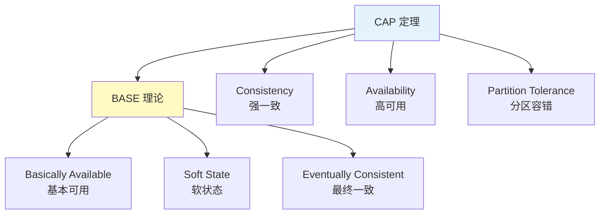
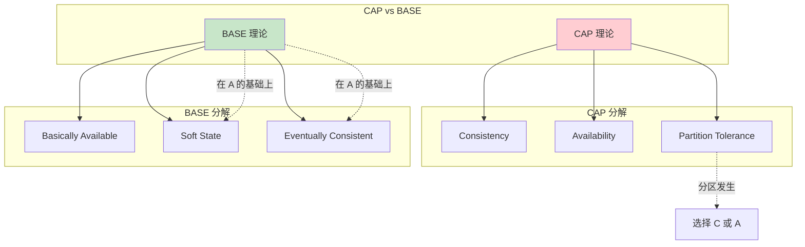
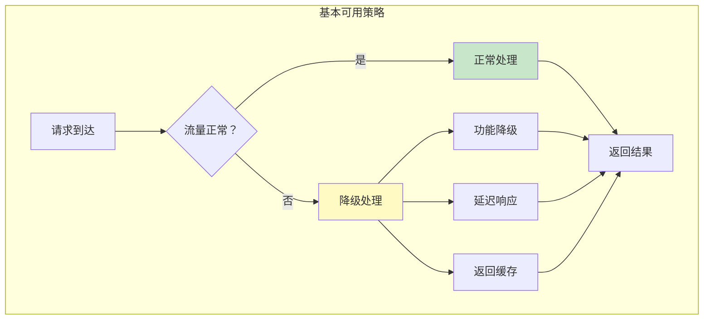
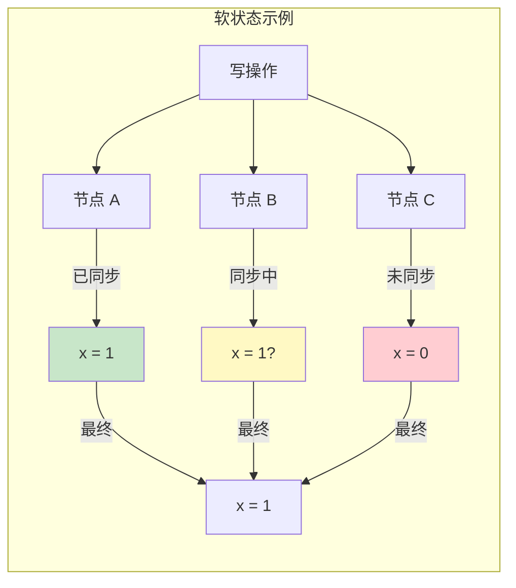
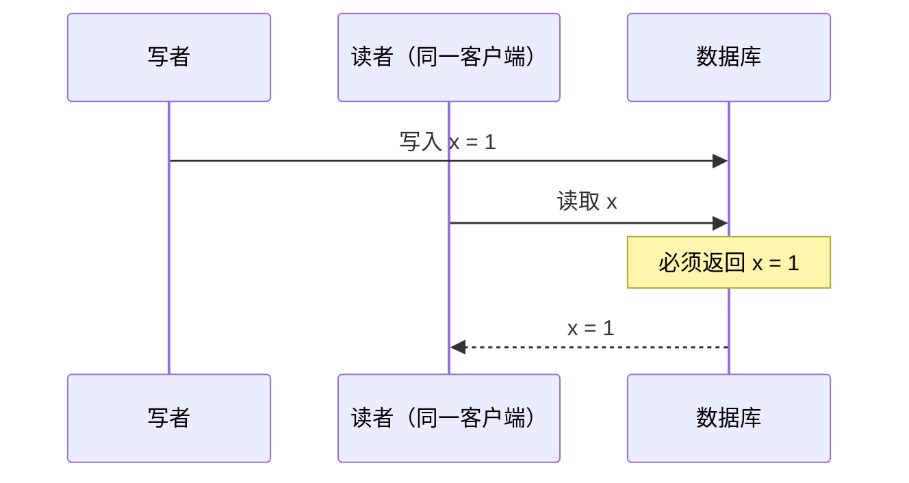
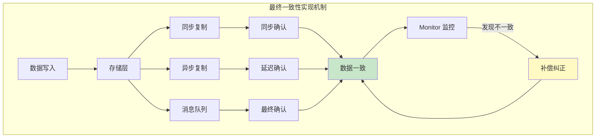
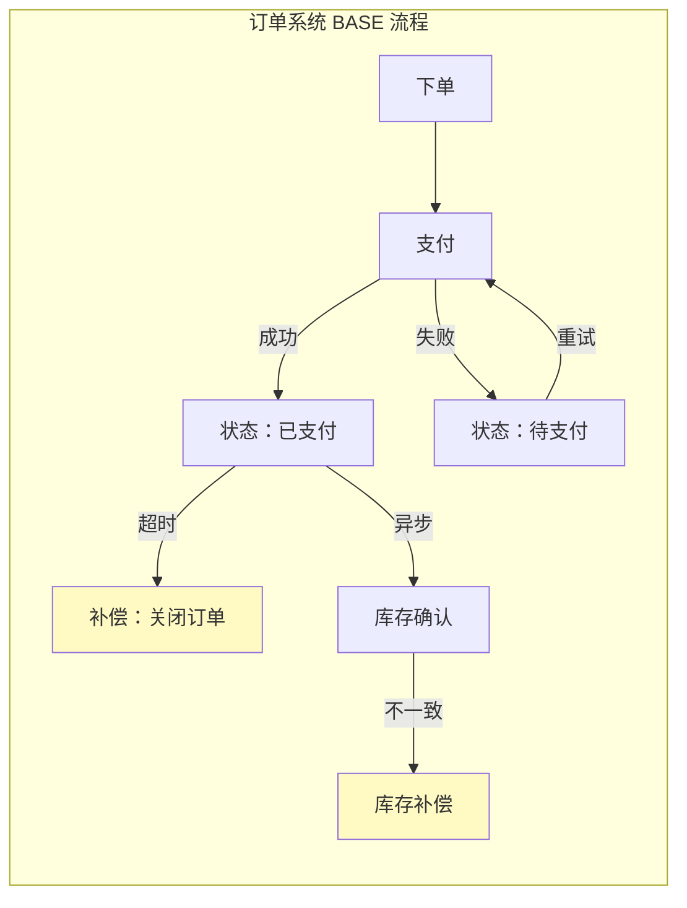

# BASE 理论

> **目标级别**：P6
> **面试频率**：🔴 高频
> **面试官最关心的 3 个问题**：
> 1. BASE 理论是什么？
> 2. BASE 和 CAP 是什么关系？
> 3. BASE 如何实现？

面试官问：「你了解 BASE 理论吗？」你说「基本可用、软状态、最终一致」——然后面试官紧接着追问「那 BASE 和 CAP 有什么关系？最终一致是什么意思？能保证多久？」你沉默了。

BASE 理论是 CAP 定理的妥协方案，是工业界分布式系统的主流选择。

## 一、BASE 理论的定义

### 1.1 理论来源

BASE = Basically Available, Soft state, Eventually consistent

由 eBay 架构师 Dan Pritchett 在 2008 年提出，是 CAP 定理在工程实践中的妥协方案。



### 1.2 三要素详解

|| 特性 | 定义 | 通俗理解 |
||------|------|----------|
| **BA - Basically Available** | 基本可用 | 分布式系统在故障时允许暂时不可用，但保证核心功能可用 | 「系统挂了，但还能用」 |
| **S - Soft State** | 软状态 | 系统的状态可以是中间状态，允许不同副本之间存在短暂的不一致 | 「数据可以暂时不一致」 |
| **E - Eventually Consistent** | 最终一致 | 系统在未来的某个时间点会达到一致状态，不需要实时一致 | 「迟早会一致的」 |

### 1.3 BASE 的核心思想

**CAP 定理**告诉我们：分布式系统在分区时必须在 C 和 A 之间选择。

**BASE 理论**的答案是：**接受短暂的不一致（软状态），在分区恢复后通过补偿机制达到一致（最终一致）。**

```
┌─────────────────────────────────────────────────────────┐
│                      BASE 核心思想                        │
├─────────────────────────────────────────────────────────┤
│  不追求强一致                                              │
│      ↓                                                    │
│  允许软状态                                                │
│      ↓                                                    │
│  追求最终一致                                              │
│      ↓                                                    │
│  通过补偿机制实现一致性                                      │
└─────────────────────────────────────────────────────────┘
```

## 二、BASE 与 CAP 的关系

### 2.1 对比分析

| 维度 | CAP | BASE |
|------|-----|------|
| **一致性** | 强一致 | 最终一致 |
| **可用性** | 分区时不可用 | 基本可用 |
| **可用程度** | 100% | 部分 |
| **一致性时间** | 实时 | 延迟 |
| **实现复杂度** | 高 | 中 |
| **适用场景** | 金融、订单 | 社交、电商 |

### 2.2 关系图解



### 2.3 CAP 的妥协方案

```
CAP 选择：
┌────────────────────────────────────────────────────────┐
│                     分布式系统                          │
├────────────────────────────────────────────────────────┤
│  情况 1：没有分区（P）                                   │
│    → 可以同时满足 C + A                                  │
│                                                        │
│  情况 2：发生分区（P）                                   │
│    → 必须选择：                                          │
│      - CP：牺牲 A，保证 C                                │
│      - AP：牺牲 C，保证 A                                │
│                                                        │
│  BASE 的选择：                                          │
│    → 牺牲强一致（软状态），但保证基本可用                  │
│    → 通过最终一致达到一致                                 │
└────────────────────────────────────────────────────────┘
```

## 三、BASE 的实现模型

### 3.1 基本可用实现

**基本可用**不是「不可用」，而是「降级服务」：

|| 降级方式 | 实现方法 | 示例 |
||----------|----------|------|
| **功能降级** | 关闭非核心功能 | 促销时关闭积分功能 |
| **质量降级** | 返回简化数据 | 返回缓存数据代替实时数据 |
| **延迟降级** | 增加响应时间 | 排队、限流 |
| **熔断降级** | 快速失败 | 保护下游服务 |



### 3.2 软状态实现

**软状态**是数据在不同副本之间存在中间状态：



**软状态的产生场景**：

1. **异步复制**：主从复制有延迟
2. **分布式事务**：两阶段提交的准备阶段
3. **缓存更新**：Cache Aside 模式
4. **批量写入**：批量操作的中间状态

### 3.3 最终一致实现

**最终一致**是 BASE 的核心，需要通过特定机制实现：

#### 3.3.1 因果一致（Causal Consistency）

保证有因果关系的操作顺序一致：

```
客户端 A：下单 → 支付（因果关系）
客户端 B：看到支付 → 看到下单（因果一致）

没有因果关系的操作：
客户端 C：查看商品（无因果） → 可能看到任意状态
```

#### 3.3.2 读己之所写（Read Your Writes）

保证自己写的数据立即可见：



#### 3.3.3 会话一致（Session Consistency）

保证在同一个会话中的一致性：

```
会话 1：
  BEGIN TRANSACTION
  UPDATE account SET balance = balance - 100
  SELECT balance  -- 必须看到自己的更新
  COMMIT
```

#### 3.3.4 单调读一致（Monotonic Read）

保证读取的数据不会回退：

```
时刻 1：读取 x = 1
时刻 2：写入 x = 2
时刻 3：读取 x = 2（不会回退到 1）
```

#### 3.3.5 单调写一致（Monotonic Write）

保证写操作的顺序：

```
写操作 1：写入 x = 1
写操作 2：写入 x = 2
→ 必须按顺序执行
```

### 3.4 最终一致性的实现机制



## 四、BASE 在实际系统中的应用

### 4.1 eBay 的 BASE 实践

Dan Pritchett 在 2008 年提出 BASE 理论，核心思想是：

> **通过业务妥协（功能降级）换取系统可用性**

eBay 的做法：

1. **业务拆分**：把大事务拆成小事务
2. **异步处理**：使用消息队列异步同步数据
3. **补偿机制**：通过补偿操作纠正不一致

```java
// eBay BASE 模式示例
public void createOrder(Order order) {
    // 1. 创建订单（本地事务）
    orderMapper.insert(order);

    // 2. 发送消息（本地消息表）
    messageMapper.insert(new Message(order));

    // 3. 异步处理库存扣减
    // 4. 最终一致性通过补偿实现
}
```

### 4.2 分布式锁的 BASE 实现

Redis 分布式锁是典型的 BASE 实践：

```java
// Redis 分布式锁（最终一致）
public boolean tryLock(String key, String value, long timeout) {
    // 1. 尝试获取锁（非阻塞）
    Boolean success = redis.setIfAbsent(key, value, timeout, TimeUnit.SECONDS);

    if (!success) {
        // 2. 锁已被占用，降级处理
        return false;
    }

    // 3. 锁可能由于 GC/网络延迟而过期（软状态）
    // 4. 通过 value 标识实现乐观锁（最终一致）

    return true;
}
```

### 4.3 订单系统的 BASE 实现



## 五、面试高频题

### 🔴 题目 1：BASE 理论是什么？

**参考回答**：

BASE 理论是 CAP 定理的工程实践妥协方案，包含三个要素：

1. **Basically Available（基本可用）**：允许系统在故障时暂时不可用，但保证核心功能可用
2. **Soft State（软状态）**：允许数据在不同副本之间存在中间状态
3. **Eventually Consistent（最终一致）**：不需要实时一致，但会在未来某个时间点达到一致

核心思想是：**牺牲强一致性，换取系统可用性**。

### 🔴 题目 2：BASE 和 CAP 是什么关系？

**参考回答**：

| 关系 | 说明 |
|------|------|
| BASE 是 CAP 的妥协 | CAP 要求强一致，BASE 接受最终一致 |
| BASE 选择 AP | 在分区时，BASE 选择可用性 |
| BASE 不放弃一致性 | BASE 通过最终一致达到一致性 |
| BASE 更适合工程实践 | 大多数互联网业务选择 BASE |

### 🔴 题目 3：最终一致的性能优势？

**参考回答**：

| 对比 | 强一致 | 最终一致 |
|------|--------|----------|
| **写入延迟** | 需要同步确认 | 异步复制，低延迟 |
| **读取延迟** | 需要访问主节点 | 任意副本读取 |
| **吞吐量** | 受限于同步节点数 | 可扩展到多节点 |
| **可用性** | 分区时不可写 | 分区时可写入 |
| **数据新鲜度** | 实时 | 可能过期 |

### 🟡 题目 4：如何实现最终一致性？

**参考回答**：

1. **异步复制**：主从复制，延迟同步
2. **消息队列**：写入消息队列，异步消费
3. **补偿机制**：定期检查不一致，通过补偿纠正
4. **版本向量**：记录数据版本，检测冲突
5. **向量时钟**：记录因果关系，解决冲突

## 六、常见错误与陷阱

### ⚠️ 陷阱 1：把最终一致当成无限制延迟

```
❌ 错误理解：
最终一致 = 可以无限延迟

✅ 正确理解：
最终一致有 SLA：
- 金融交易：秒级
- 电商订单：分钟级
- 日志同步：小时级
```

### ⚠️ 陷阱 2：BASE 适合所有场景

```
❌ 错误理解：
BASE 比 CAP 好，所有系统都用 BASE

✅ 正确理解：
- 金融、订单：需要强一致
- 社交、Feed：BASE 就够了
- BASE 是权衡，不是银弹
```

### ⚠️ 陷阱 3：忽略补偿机制

```
❌ 错误理解：
最终一致 = 不需要处理不一致

✅ 正确理解：
必须设计补偿机制：
- 定时任务检查
- 消息队列重试
- 人工干预
```

## 七、总结对比表

|| 维度 | 强一致（CAP CP） | 最终一致（BASE） |
||------|-----------------|------------------|
| **一致性级别** | 线性一致 | 因果/最终一致 |
| **可用性** | 分区时不可用 | 基本可用 |
| **性能** | 低 | 高 |
| **实现复杂度** | 高 | 中 |
| **数据新鲜度** | 实时 | 可能过期 |
| **适用场景** | 金融、订单、锁 | 社交、Feed、缓存 |

## 八、加分回答

> **💡 面试加分点**：
>
> 1. **DynamoDB 的四种一致性级别**：强一致读、最终一致读、事务性读、会话一致读
>
> 2. **Google Spanner**：通过 TrueTime API 实现外部一致性，在 CAP 上做出更精细的权衡
>
> 3. **Ant Design 的妥协哲学**：BASE 思想也适用于产品设计，不是每个功能都需要完美
>
> 4. **蚂蚁金服 Seata**：提供 AT、TCC、Saga 多种模式，根据业务场景选择一致性级别

## 九、延伸思考

### 面试官可能会继续追问

1. 「你项目用过最终一致性吗？怎么实现的？」
2. 「最终一致的系统如何处理冲突？」
3. 「如何保证 BASE 系统不会无限不一致？」
4. 「CAP 和 BASE 在你们系统设计中是怎么体现的？」
