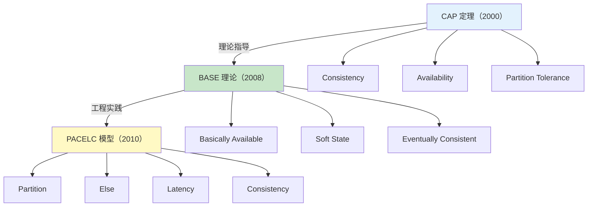
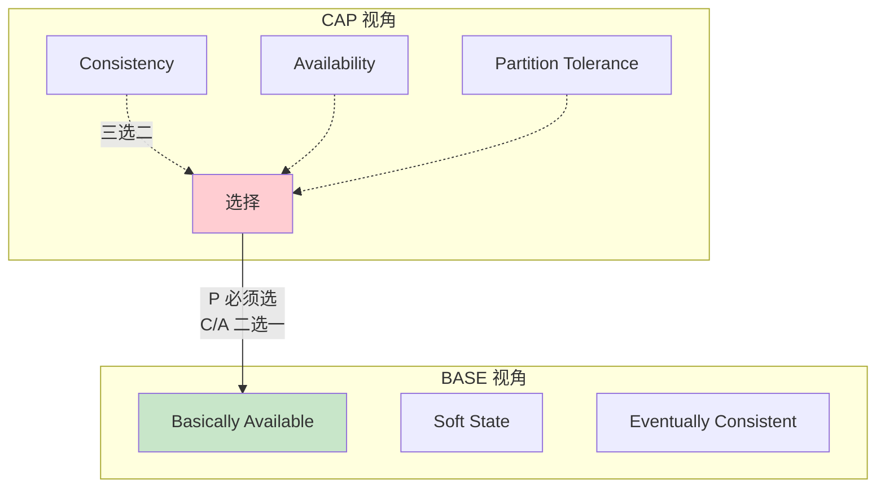
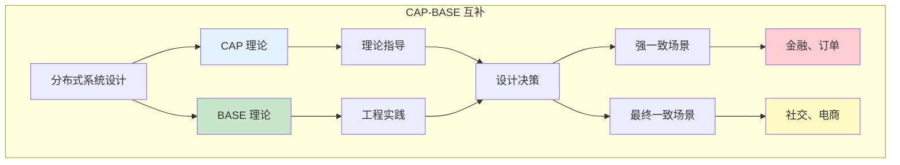
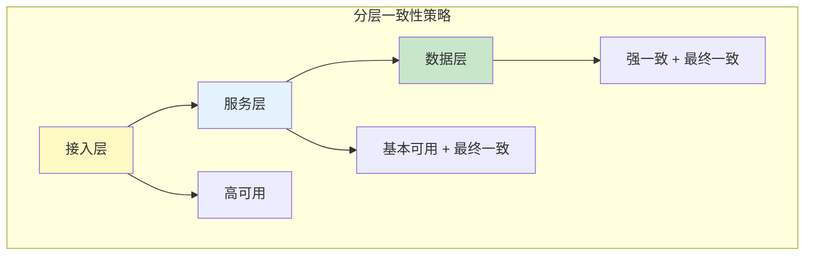
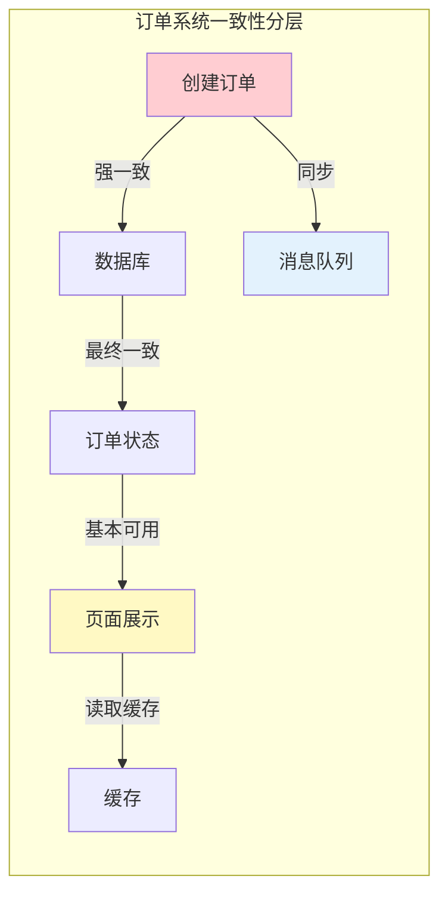

# CAP 与 BASE 的关系

> **目标级别**：P6
> **面试频率**：🔴 高频
> **面试官最关心的 3 个问题**：
> 1. CAP 和 BASE 是什么关系？
> 2. BASE 如何从 CAP 演化而来？
> 3. 如何选择 CAP 和 BASE？

面试官问：「CAP 和 BASE 有什么区别和联系？」你说「CAP 是一致性、可用性、分区容错，BASE 是基本可用、软状态、最终一致」——然后面试官紧接着追问「那 BASE 是怎么从 CAP 演化来的？它们的关系是什么？」你沉默了。

CAP 和 BASE 是分布式系统理论的两大基石，理解它们的关系才能真正掌握分布式架构。

## 一、CAP 与 BASE 的演化关系

### 1.1 理论脉络



### 1.2 CAP 的局限性

CAP 定理存在以下局限：

| 局限 | 说明 |
|------|------|
| **二选一假象** | 实际上 P 不可选，必须先选 P |
| **忽略延迟** | 没考虑系统延迟 |
| **忽视成本** | 一致性级别和成本关系 |
| **静态假设** | 实际是动态权衡 |

### 1.3 BASE 的出现

Dan Pritchett 在 eBay 的实践中发现问题：

1. **CAP 的强一致太难实现**：分布式事务成本太高
2. **业务可以妥协**：某些场景允许短暂不一致
3. **可用性更重要**：系统宕机比数据不一致更严重

BASE 理论应运而生：**用最终一致换取可用性**。

## 二、CAP 到 BASE 的演化

### 2.1 理论对比



### 2.2 核心转变

| 维度 | CAP | BASE |
|------|-----|------|
| **一致性** | 强一致 | 最终一致 |
| **可用性** | 100% | 基本可用 |
| **时间** | 实时 | 延迟 |
| **设计思路** | 理论模型 | 工程实践 |

### 2.3 演化流程

```
CAP 的困境：
┌─────────────────────────────────────────────────────────┐
│  网络分区发生（P）                                        │
│      ↓                                                  │
│  必须选择 C 或 A                                         │
│      ↓                                                  │
│  选择 C → 牺牲 A → 系统不可用                            │
│  选择 A → 牺牲 C → 数据不一致                            │
│      ↓                                                  │
│  问题：如何处理不一致？                                    │
└─────────────────────────────────────────────────────────┘

BASE 的答案：
┌─────────────────────────────────────────────────────────┐
│  接受不一致（软状态）                                    │
│      ↓                                                  │
│  保证基本可用（降级服务）                                 │
│      ↓                                                  │
│  通过补偿机制达到最终一致                                 │
│      ↓                                                  │
│  结果：系统可用 + 数据最终一致                            │
└─────────────────────────────────────────────────────────┘
```

## 三、CAP 与 BASE 的互补关系

### 3.1 互补图解



### 3.2 决策矩阵

| 业务场景 | CAP 选择 | BASE 选择 | 理由 |
|----------|----------|-----------|------|
| 银行转账 | CP | 强一致 | 资金不能错 |
| 订单系统 | CP/AP | 最终一致 | 允许短暂不一致 |
| 社交 Feed | AP | 最终一致 | 可用性优先 |
| 配置中心 | CP | 强一致 | 配置必须一致 |
| 搜索推荐 | AP | 最终一致 | 允许过期数据 |
| 分布式锁 | CP | 强一致 | 锁状态必须一致 |

## 四、工程实践：CAP 与 BASE 的结合

### 4.1 架构分层策略



### 4.2 混合策略示例

**订单系统**：

1. **订单创建**：强一致（CAP CP）
   - 订单号生成、库存扣减必须强一致
   - 使用分布式事务或 TCC

2. **订单状态更新**：最终一致（BASE）
   - 状态同步允许延迟
   - 使用消息队列异步更新

3. **页面展示**：基本可用（BASE）
   - 优先返回缓存数据
   - 允许短暂数据显示



## 五、面试高频题

### 🔴 题目 1：CAP 和 BASE 的关系是什么？

**参考回答**：

CAP 和 BASE 是理论与实践的关系：

1. **CAP 是理论基础**：说明分布式系统的基本约束
2. **BASE 是工程实践**：在 CAP 约束下的工程妥协方案
3. **关系**：BASE 从 CAP 演化而来，用最终一致换可用性

**核心区别**：
- CAP：讨论「能不能同时满足」
- BASE：讨论「如果不能同时满足，怎么办」

### 🔴 题目 2：如何理解 CAP 的三选二？

**参考回答**：

CAP 的「三选二」是一个误导性说法：

1. **P 必须选**：网络分区是客观存在的，分布式系统必须容忍分区
2. **真正的选择**：在 P 发生时，选择 C 还是 A
3. **CAP 的正确理解**：分布式系统在网络分区时，必须在 C 和 A 之间选择

```
┌─────────────────────────────────────────────────────────┐
│  没有分区：CA 可以同时满足                                 │
│  发生分区：必须在 C 和 A 之间选择                           │
└─────────────────────────────────────────────────────────┘
```

### 🔴 题目 3：什么场景用 CAP？什么场景用 BASE？

**参考回答**：

| 场景 | 理论选择 | 理由 |
|------|----------|------|
| 金融、订单、库存 | CAP CP + BASE 强一致 | 资金不能错，必须强一致 |
| 社交、Feed、评论 | CAP AP + BASE 最终一致 | 可用性优先，允许延迟 |
| 配置中心、服务注册 | CAP CP + BASE 强一致 | 配置必须一致 |
| 日志系统、监控 | CAP AP + BASE 最终一致 | 允许丢失部分数据 |

### 🟡 题目 4：BASE 的三个特性如何理解？

**参考回答**：

1. **Basically Available（基本可用）**：
   - 故障时保证核心功能可用
   - 通过功能降级、延迟降级实现

2. **Soft State（软状态）**：
   - 数据在不同节点可以是中间状态
   - 允许短暂的不一致

3. **Eventually Consistent（最终一致）**：
   - 不需要实时一致
   - 通过补偿、重试达到一致状态

## 六、常见错误与陷阱

### ⚠️ 陷阱 1：把 CAP 和 BASE 对立

```
❌ 错误理解：
CAP 和 BASE 是矛盾的

✅ 正确理解：
BASE 是 CAP 的工程实践版本
CAP 是理论，BASE 是实现
```

### ⚠️ 陷阱 2：认为 BASE 不保证一致性

```
❌ 错误理解：
BASE = 无一致性

✅ 正确理解：
BASE 保证最终一致
只是不保证实时一致
```

### ⚠️ 陷阱 3：忽略业务场景

```
❌ 错误理解：
BASE 比 CAP 好，都用 BASE

✅ 正确理解：
不同业务需要不同的策略：
- 金融：强一致
- 电商：混合策略
```

## 七、总结对比表

|| 维度 | CAP | BASE |
||------|-----|------|
| **定位** | 理论模型 | 工程实践 |
| **一致性** | 强一致 | 最终一致 |
| **可用性** | 100% 可用 | 基本可用 |
| **设计思路** | 先理论后实践 | 先实践后总结 |
| **适用场景** | 通用分布式 | 互联网业务 |
| **实现难度** | 高 | 中 |

## 八、加分回答

> **💡 面试加分点**：
>
> 1. **Google 的实践**：Spanner 在 CAP 上做精细化权衡，TrueTime API 实现外部一致
>
> 2. **Amazon DynamoDB**：支持可调一致性，用户可以选择一致性级别
>
> 3. **蚂蚁金服**：Seata 提供 AT、TCC、Saga 多种模式，CAP 和 BASE 混合使用
>
> 4. **CAP 的演进**：PACELC 模型增加了 Latency 维度，更符合实际场景
