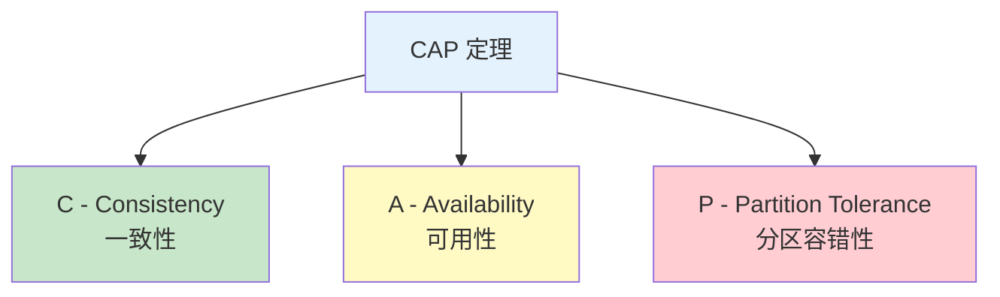
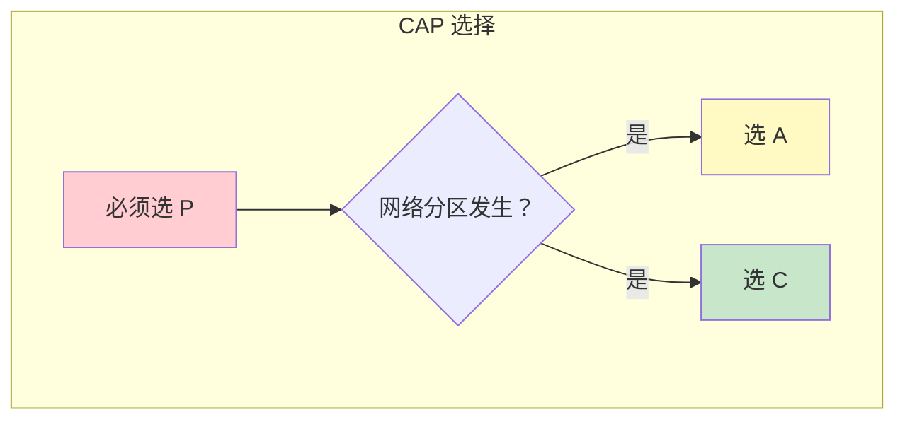
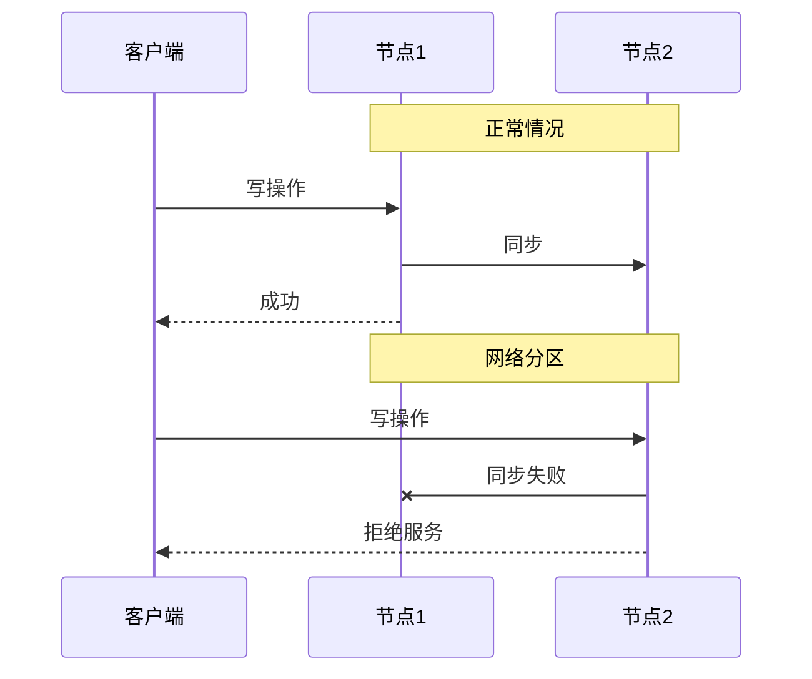
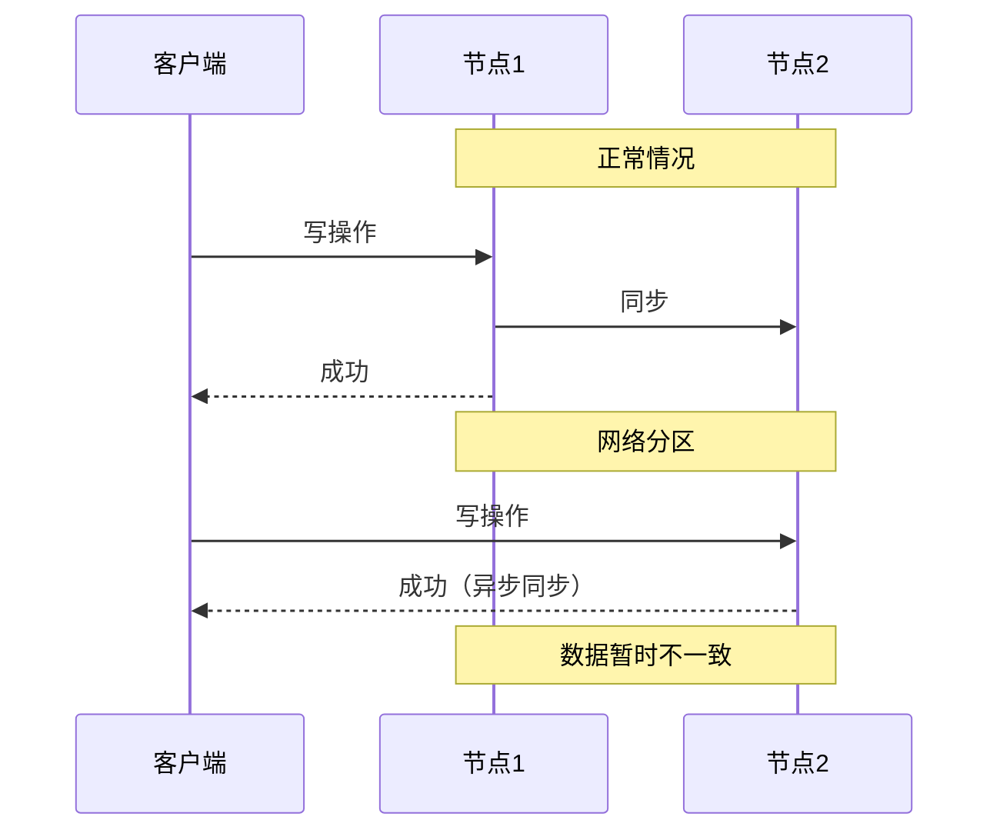
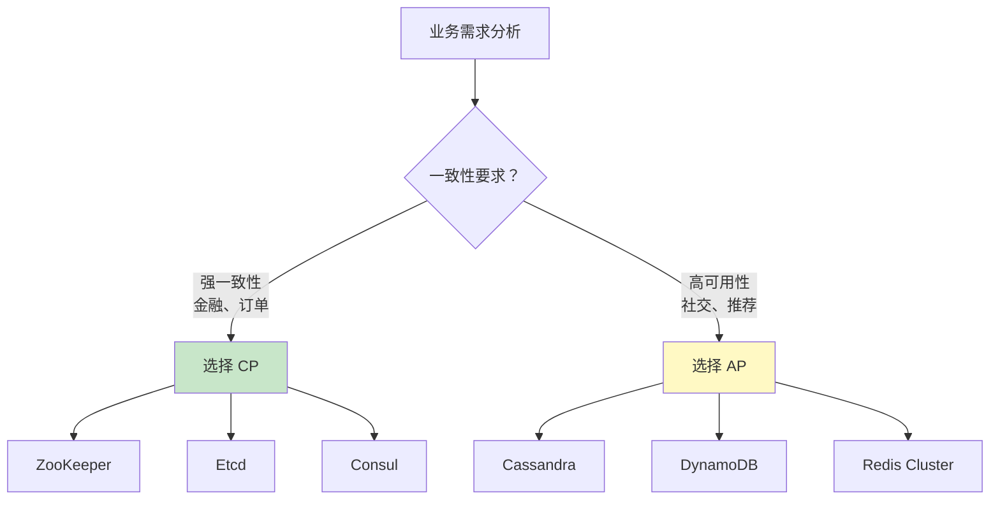

# CAP 定理

> **目标级别**：P6
> **面试频率**：🔴 高频
> **面试官最关心的 3 个问题**：
> 1. CAP 定理是什么？
> 2. CAP 三要素如何理解？
> 3. 分布式系统如何选择 C/A/P？

面试官问：「分布式系统有三大特性，CAP 定理说的是什么？」你说「一致性、可用性、分区容错」——然后面试官紧接着追问「那 CAP 定理是不是说分布式系统只能同时满足两个特性？为什么 CAP 不能同时满足？」你沉默了。

CAP 定理是分布式系统理论的基石，理解它才能理解分布式架构设计的核心矛盾。

## 一、CAP 定理的定义

### 1.1 定理内容

CAP 定理（Brewer's Theorem）由 Eric Brewer 在 2000 年提出，由 Seth Gilbert 和 Nancy Lynch 在 2002 年证明：

> **在一个分布式系统中，当且仅当存在网络分区时，必须在一致性（Consistency）和可用性（Availability）之间做出选择。**



### 1.2 三要素详解

|| 特性 | 定义 | 通俗理解 |
||------|------|----------|
| **C - Consistency** | 一致性 | 所有节点在同一时刻看到相同的数据 | 「要么都成功，要么都失败」 |
| **A - Availability** | 可用性 | 每个请求都能在有限时间内得到响应 | 「系统一直可用」 |
| **P - Partition Tolerance** | 分区容错 | 当网络分区发生时，系统仍能运行 | 「网络断了，系统还能用」 |

### 1.3 关键误解

**⚠️ 误解 1**：CAP 是三选二

很多人误以为 CAP 定理是说系统只能选择 C/A/P 中的两个。实际上：

- **网络分区（Partition）是客观存在的**，不是可选的
- 分布式系统必须容忍网络分区，所以 **P 是必选的**
- 真正的选择是：**在 P 发生时，选择 C 还是 A**



**⚠️ 误解 2**：CA 系统存在

如果系统不需要 P，那就不需要分布式，单机数据库就是 CA 系统。但这不是 CAP 定理讨论的范围。

**⚠️ 误解 3**：CAP 只能在 0 和 1 之间选择

现代分布式系统在 CAP 上的选择是 **连续谱**，不是非此即彼。例如：

- **强一致系统**：牺牲可用性，如 Zookeeper、HBase
- **最终一致系统**：牺牲一致性，如 Cassandra、DynamoDB
- **权衡系统**：在 P 发生时做权衡，如 MongoDB

## 二、CAP 的表现形式

### 2.1 CP 系统

当网络分区发生时，CP 系统会 **拒绝服务**（返回错误），以保证一致性。

**典型代表**：

- **ZooKeeper**：ZAB 协议保证一致性，分区时不可用
- **Etcd**：Raft 协议保证一致性
- **HBase**：强一致的分段存储
- **MongoDB**（复制集模式）：主节点故障时需要重新选举

**CP 系统的特点**：



### 2.2 AP 系统

当网络分区发生时，AP 系统会 **继续服务**，但可能返回过期数据（最终一致）。

**典型代表**：

- **Cassandra**：最终一致性
- **DynamoDB**：可调一致性
- **Riak**：去中心化存储
- **RocketMQ**：消息队列

**AP 系统的特点**：



## 三、CAP 在实际系统中的应用

### 3.1 数据库的 CAP 选择

|| 数据库 | CAP 类型 | 说明 |
||--------|----------|------|
| **MySQL Cluster** | CP | 分区时拒绝写入 |
| **MySQL Master-Slave** | AP | 主从复制，最终一致 |
| **MongoDB** | CP/AP 可选 | 取决于复制集配置 |
| **Cassandra** | AP | 最终一致性 |
| **Redis Cluster** | CP | Slot 迁移时不可用 |
| **ZooKeeper** | CP | 选主期间不可用 |
| **Etcd** | CP | Raft 协议保证一致 |

### 3.2 CAP 选择决策树



## 四、面试高频题

### 🔴 题目 1：CAP 定理是什么？

**参考回答**：

CAP 定理是分布式系统的基本定理，由 Eric Brewer 提出：

1. **C（Consistency）**：所有节点在同一时刻看到相同的数据
2. **A（Availability）**：每个请求都能在有限时间内得到响应
3. **P（Partition Tolerance）**：当网络分区发生时，系统仍能运行

关键点是：**网络分区是客观存在的**，分布式系统必须容忍分区，所以真正的选择是「在 P 发生时，选择 C 还是 A」。

### 🔴 题目 2：为什么 CAP 三要素不能同时满足？

**参考回答**：

假设存在一个同时满足 C、A、P 的系统：

1. 系统正常运行：可以同时满足 C 和 A
2. 发生网络分区：节点 N1 和 N2 无法通信
3. 客户端 C1 向 N1 写入数据 `x = 1`
4. 客户端 C2 向 N2 读取数据

要满足 **A（可用性）**：N2 必须返回数据
要满足 **C（一致性）**：N2 必须返回 `x = 1`

但 N2 无法确认 N1 的数据（分区发生），所以 **无法同时满足 C 和 A**。

### 🔴 题目 3：什么场景选择 CP？什么场景选择 AP？

**参考回答**：

| 场景 | CAP 选择 | 典型系统 |
|------|----------|----------|
| 金融交易、订单系统 | CP | ZooKeeper、Etcd |
| 社交 feed、推荐系统 | AP | Cassandra、DynamoDB |
| 分布式锁 | CP | ZooKeeper、Redis RedLock |
| 配置中心 | CP | Apollo、Nacos（CP 模式） |
| 消息队列 | AP | Kafka、RocketMQ |
| DNS 服务 | AP | CoreDNS |

### 🔴 题目 4：ZooKeeper 是 CP 还是 AP？

**参考回答**：

ZooKeeper 是 **CP 系统**：

1. **ZAB 协议**：保证 Leader 节点唯一，数据一致
2. **Leader 选举**：选举期间服务不可用
3. **过半机制**：写入需要过半节点确认

```mermaid
graph TB
    subgraph "ZooKeeper CP 特性"
        Z1["Leader"] --> Z2["Follower 1"]
        Z1 --> Z3["Follower 2"]
        Z2 --> Z4["写入需过半确认"]
        Z3 --> Z4
        Z4 --> Z5["数据一致"]
    end

    Note over Z1,Z3: 正常：可用 + 一致

    subgraph "网络分区"
        Z1_2["Leader"] -.->|"分区"| Z2_2["Follower 1"]
        Z1_2 -.->|"分区"| Z3_2["Follower 2"]
        Z2_2 --> Z4_2["无法选举新 Leader"]
    end

    style Z4 fill:#c8e6c9
    style Z4_2 fill:#ffcdd2
```

### 🟡 题目 5：Nacos 是 CP 还是 AP？

**参考回答**：

Nacos **同时支持 CP 和 AP**：

1. **CP 模式**：使用 Raft 协议，保证强一致性
2. **AP 模式**：使用 Distro 协议，保证高可用
3. **可动态切换**：`nacos.core.protocol.raft.mode`

```java
// Nacos CP 模式配置
nacos.core.protocol.raft.mode=cluster

// Nacos AP 模式配置（默认）
nacos.core.protocol.distro.enabled=true
```

## 五、CAP 的局限性与演进

### 5.1 CAP 的局限性

| 局限 | 说明 |
|------|------|
| **定义模糊** | C/A/P 的定义有多种，理解不一致 |
| **忽略延迟** | 只考虑成功/失败，没考虑延迟 |
| **忽视成本** | CAP 选择有性能、成本代价 |
| **静态假设** | 实际系统是动态权衡的 |

### 5.2 PACELC 模型

为了弥补 CAP 的不足，提出了 PACELC 模型（Partition, Availability, Consistency, Else, Latency, Consistency）：

> **If there is a partition (P), how does the system trade off availability (A) versus consistency (C)? Else (E), when there is no partition, how does the system trade off latency (L) versus consistency (C)?**

|| 系统 | PACELC 选择 |
|------|------|-------------|
| DynamoDB | PA/EC | 分区时选 P/A，否则选 E/L |
| Cassandra | PA/EC | 分区时选 P/A，否则选 E/L |
| BigTable | PC/EC | 分区时选 P/C，始终选 E/C |
| MongoDB | PA/EC 或 PC/EC | 可配置 |

## 六、常见错误与陷阱

### ⚠️ 陷阱 1：认为 CAP 是静态选择

```
❌ 错误理解：
系统设计时选择 CP 或 AP，然后一直保持

✅ 正确理解：
系统在运行时动态选择，分区发生时必须选
```

### ⚠️ 陷阱 2：忽略 P 的重要性

```
❌ 错误理解：
网络很少分区，可以忽略 P，选择 CA

✅ 正确理解：
网络分区不可避免，必须在设计时考虑
```

### ⚠️ 陷阱 3：把一致性等同于强一致

```
❌ 错误理解：
一致性 = 强一致

✅ 正确理解：
一致性有多种级别：
- 强一致：线性一致
- 顺序一致：因果一致
- 最终一致：短期不一致，长期一致
```

## 七、总结对比表

|| 维度 | CP 系统 | AP 系统 |
||------|---------|---------|
| **一致性** | 强一致 | 最终一致 |
| **可用性** | 分区时不可用 | 分区时可用 |
| **典型系统** | ZooKeeper, Etcd | Cassandra, DynamoDB |
| **适用场景** | 金融、订单、配置中心 | 社交、推荐、日志 |
| **数据新鲜度** | 实时 | 可能过期 |
| **故障恢复** | 需要重新选举 | 自动切换 |

## 八、加分回答

> **💡 面试加分点**：
>
> 1. **Google Spanner**：使用 TrueTime API + 两阶段提交，在 CAP 上做出更细粒度的权衡
>
> 2. **Amazon Aurora**：存储计算分离，通过 Redo Log 复制实现高可用和强一致
>
> 3. **蚂蚁金服 SOFAJRaft**：基于 Raft 的高性能实现，支持多种一致性级别
>
> 4. **Google Chubby**：分布式锁服务，选择 CP，通过 Paxos 保证一致性

## 九、延伸思考

### 面试官可能会继续追问

1. 「CAP 和 BASE 是什么关系？」
2. 「你项目中用过 CAP 相关的中间件吗？怎么选型的？」
3. 「ZooKeeper 选主期间为什么不可用？」
4. 「Redis Cluster 是 CAP 中的哪个？」
