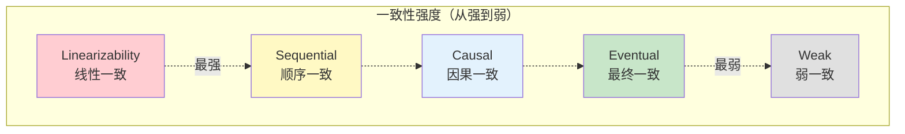
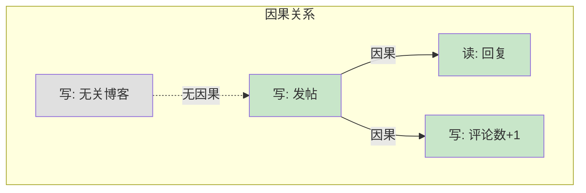
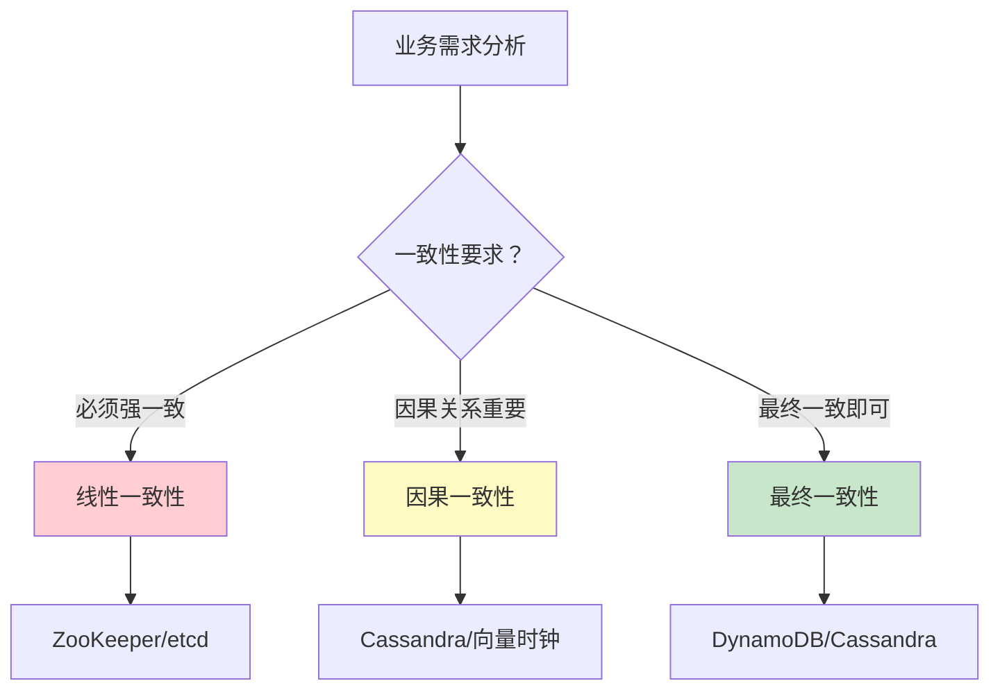

# 一致性模型对比

> **目标级别**：P6
> **面试频率**：🟡 中频
> **面试官最关心的 3 个问题**：
> 1. 有哪些一致性模型？
> 2. 强一致和最终一致有什么区别？
> 3. 如何选择一致性级别？

面试官问：「分布式系统的一致性模型有哪些？」你说「强一致、弱一致、最终一致」——然后面试官紧接着追问「那顺序一致、因果一致呢？它们有什么区别？」你沉默了。

一致性模型是分布式系统设计的核心，理解不同一致性模型的保证程度是面试 P6 的关键。

## 一、一致性模型概述

### 1.1 一致性模型谱系



### 1.2 一致性模型对比表

| 一致性模型 | 定义 | 保证程度 | 性能 | 典型系统 |
|-----------|------|----------|------|----------|
| **线性一致** | 所有操作原子执行，实时有序 | 实时全局顺序 | 最低 | ZooKeeper, etcd |
| **顺序一致** | 所有进程看到相同的操作顺序 | 进程间顺序 | 低 | 部分 NoSQL |
| **因果一致** | 有因果关系的操作有序 | 因果顺序 | 中 | Cassandra |
| **最终一致** | 所有副本最终相同 | 无实时保证 | 高 | DynamoDB, Cassandra |
| **弱一致** | 无任何保证 | 无 | 最高 | 纯内存系统 |

## 二、线性一致性（Linearizability）

### 2.1 定义

线性一致是最强的一致性模型：

> **所有操作在全局看起来是原子的，没有交错，像在单一时刻完成**

### 2.2 特点

1. **实时性**：操作生效时间是瞬间的
2. **全局顺序**：所有节点看到相同的操作顺序
3. **原子性**：操作要么完成，要么不发生

### 2.3 图解

```mermaid
sequenceDiagram
    participant C1 as 客户端1
    participant S as 服务器
    participant C2 as 客户端2

    Note over C1,S,C2: 线性一致性示例

    C1->>S: 写 x = 1 (T1)
    S-->>C1: 成功 (T2)
    Note over C1: T2 > T1

    C2->>S: 读 x (T3)
    Note over C2: T3 > T2
    S-->>C2: x = 1
```

### 2.4 典型系统

- **ZooKeeper**：ZAB 协议保证线性一致
- **etcd**：Raft 协议保证线性一致
- **Chubby**：Google 的分布式锁服务
- **Redis**：单节点操作是线性一致的

## 三、顺序一致性（Sequential Consistency）

### 3.1 定义

顺序一致放松了实时性要求：

> **所有进程看到相同的操作顺序，但这个顺序不需要和实时时间一致**

### 3.2 特点

1. **全局顺序**：所有进程看到相同的操作顺序
2. **放松实时**：不要求操作按真实时间排序
3. **进程内有序**：单个进程内的操作顺序不变

### 3.3 图解

```mermaid
graph LR
    subgraph "顺序一致性"
        P1["进程1"] -->|"写 x=1"| B["全局顺序"]
        P2["进程2"] -->|"写 y=2"| B
        P3["进程3"] -->|"读 x,y"| B

        B --> P1_1["读: x=1, y=0"]
        B --> P2_1["读: y=2, x=1"]
        B --> P3_1["读: x=1, y=2"]
    end

    Note over P1_1,P2_1,P3_1: 所有进程看到相同顺序
```

### 3.4 典型系统

- **Google Spanner**：通过 TrueTime 实现顺序一致
- **Memcache**：读操作可能读到旧值

## 四、因果一致性（Causal Consistency）

### 4.1 定义

因果一致只保证有因果关系的操作有序：

> **如果操作 A 导致操作 B，那么所有进程必须先看到 A 再看到 B**

### 4.2 因果关系的例子



**有因果关系的操作**：
- 发帖 → 评论
- 转账 → 查询余额
- 创建订单 → 支付

**无因果关系的操作**：
- 用户 A 发帖
- 用户 B 发帖

### 4.3 典型系统

- **Cassandra**：通过向量时钟实现因果一致
- **DynamoDB**：支持因果一致性读取
- **COPS**：专门实现因果一致的系统

## 五、最终一致性（Eventual Consistency）

### 5.1 定义

最终一致是最宽松的一致性模型：

> **如果没有新写入，所有副本最终会收敛到相同的值**

### 5.2 特点

1. **无实时保证**：读取可能返回任意版本
2. **收敛性**：最终所有副本相同
3. **冲突处理**：需要解决并发写入冲突

### 5.3 图解

```mermaid
graph TB
    subgraph "最终一致性"
        W["写操作"] --> N1["节点A"]
        W --> N2["节点B"]
        W --> N3["节点C"]

        N1 -->|"T1| N1_1["x=1"]
        N2 -->|"T1| N2_1["x=?"
        N3 -->|"T1| N3_1["x=?"]

        N2_1 -->|"T2| N2_2["x=1"]
        N3_1 -->|"T3| N3_2["x=1"]

        N1_1 & N2_2 & N3_2 -->|"最终"| CON["一致"]
    end

    style N1_1 fill:#c8e6c9
    style N2_2 fill:#c8e6c9
    style N3_2 fill:#c8e6c9
    style CON fill:#c8e6c9
```

### 5.4 典型系统

- **Amazon DynamoDB**：可调一致性
- **Cassandra**：最终一致（可配置）
- **Riak**：去中心化最终一致
- **DNS**：最终传播

## 六、会话一致性（Session Consistency）

### 6.1 定义

会话一致是最终一致的特例：

> **在同一个会话中，保证读写一致性**

### 6.2 会话一致的类型

| 类型 | 说明 |
|------|------|
| **读己之所写** | 能读到自己的写操作 |
| **单调读** | 读取不会回退 |
| **单调写** | 写操作按顺序执行 |

### 6.3 实现

```java
// 读己之所写实现
public class SessionConsistency {
    // 记录会话最后写入的版本
    private Map<String, Object> sessionWrites = new ConcurrentHashMap<>();

    public Object read(String key) {
        // 先检查会话中是否有未同步的写入
        if (sessionWrites.containsKey(key)) {
            return sessionWrites.get(key);
        }
        return database.read(key);
    }

    public void write(String key, Object value) {
        sessionWrites.put(key, value);
        database.write(key, value);
    }
}
```

## 七、一致性模型选择

### 7.1 决策树



### 7.2 场景对应表

| 场景 | 推荐一致性 | 理由 |
|------|-----------|------|
| 分布式锁 | 线性一致 | 锁状态必须严格一致 |
| 银行转账 | 线性一致 | 资金不能错 |
| 订单系统 | 因果一致 | 订单→支付必须有因果 |
| 社交 Feed | 最终一致 | 可以接受延迟 |
| 配置下发 | 线性一致 | 配置必须一致 |
| CDN | 最终一致 | 允许传播延迟 |

## 八、面试高频题

### 🔴 题目 1：线性一致和顺序一致的区别？

**参考回答**：

| 区别 | 线性一致 | 顺序一致 |
|------|----------|----------|
| **实时性** | 要求实时有序 | 不要求实时 |
| **全局时钟** | 需要 | 不需要 |
| **实现成本** | 高 | 中 |
| **典型系统** | ZooKeeper | 部分 NoSQL |

### 🟡 题目 2：因果一致怎么实现？

**参考回答**：

因果一致通常通过**向量时钟（Vector Clock）**实现：

```java
// 简化的向量时钟
public class VectorClock {
    private Map<String, Long> clock = new ConcurrentHashMap<>();

    public void increment(String nodeId) {
        clock.merge(nodeId, 1L, Long::sum);
    }

    public void update(String nodeId, long timestamp) {
        clock.put(nodeId, Math.max(clock.getOrDefault(nodeId, 0L), timestamp));
    }

    public boolean happensBefore(VectorClock other) {
        // 判断 other 是否在 this 之前
    }

    public VectorClock merge(VectorClock other) {
        // 合并两个向量时钟
    }
}
```

### 🟡 题目 3：最终一致性的冲突处理？

**参考回答**：

| 策略 | 说明 | 适用场景 |
|------|------|----------|
| **Last Write Wins** | 最后写入胜出 | 时间戳可靠 |
| **Vector Clock** | 向量时钟判断 | 因果关系 |
| **CRDT** | 无冲突数据类型 | 集合、计数器 |
| **人工介入** | 冲突告警 | 重要数据 |

## 九、常见错误与陷阱

### ⚠️ 陷阱 1：把最终一致当成无一致

```
❌ 错误理解：
最终一致 = 可以返回任意数据

✅ 正确理解：
最终一致保证最终收敛
只是不保证实时
```

### ⚠️ 陷阱 2：所有场景都用最强一致性

```
❌ 错误理解：
强一致最安全，都用线性一致

✅ 正确理解：
强一致性能差
应该根据业务选择合适的一致性
```

### ⚠️ 陷阱 3：忽略一致性实现成本

```
❌ 错误理解：
最终一致很简单，随便实现

✅ 正确理解：
最终一致需要处理：
- 冲突检测
- 冲突解决
- 数据收敛
```

## 十、总结对比表

| 维度 | 线性一致 | 顺序一致 | 因果一致 | 最终一致 |
|------|----------|----------|----------|----------|
| **保证程度** | 实时全局顺序 | 全局顺序 | 因果顺序 | 最终相同 |
| **实现难度** | 高 | 中 | 中 | 低 |
| **性能** | 低 | 中 | 中高 | 高 |
| **典型系统** | ZooKeeper | Spanner | Cassandra | DynamoDB |
| **适用场景** | 锁、配置 | 分布式事务 | 社交、评论 | Feed、日志 |

## 十一、加分回答

> **💡 面试加分点**：
>
> 1. **CRDT（Conflict-free Replicated Data Types）**：无冲突复制数据类型，数学证明不会冲突
>
> 2. **RedBlue PS**：操作分为 Red（需要强一致）和 Blue（最终一致），混合使用
>
> 3. **Google Spanner**：TrueTime API + 两阶段提交，实现跨机房线性一致
>
> 4. **Antidotes**：专门保证因果一致的分布式数据库
