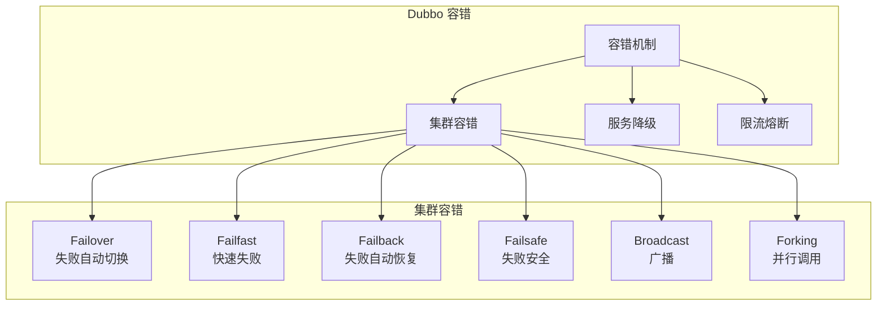
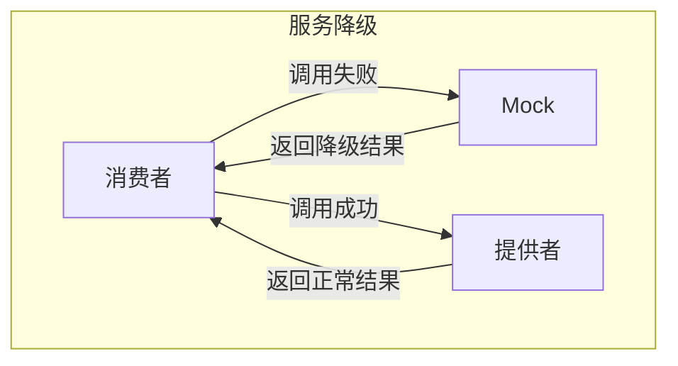

# Dubbo 容错机制

> **目标级别**：P6
> **面试频率**：🟡 中频
> **面试官最关心的 3 个问题**：
> 1. Dubbo 有哪些容错机制？
> 2. 集群容错和 RPC 降级有什么区别？
> 3. 如何配置服务降级？

面试官问：「Dubbo 的容错机制有哪些？」你说「Failover、Failback」——然后面试官紧接着追问「那 Hystrix 呢？和 Dubbo 的容错有什么区别？」你沉默了。

Dubbo 提供了完善的容错机制，理解它们才能保证服务的高可用。

## 一、Dubbo 容错机制概述

### 1.1 容错机制分类



### 1.2 集群容错策略

| 策略 | 说明 | 适用场景 |
|------|------|----------|
| **Failover** | 失败自动切换 | 读操作 |
| **Failfast** | 快速失败 | 非幂等操作 |
| **Failback** | 失败自动恢复 | 异步操作 |
| **Failsafe** | 失败安全 | 日志记录 |
| **Broadcast** | 广播所有 | 更新通知 |
| **Forking** | 并行调用 | 高可用 |

## 二、各容错策略详解

### 2.1 Failover（失败自动切换）

```java
// Failover 实现
public class FailoverClusterInvoker<T> extends AbstractClusterInvoker<T> {

    @Override
    public Result doInvoke(List<Invoker<T>> invokers, Invocation invocation) {
        int len = invokers.size();

        for (int i = 0; i < len; i++) {
            try {
                Result result = invokers.get(i).invoke(invocation);
                if (result.hasException()) {
                    throw result.getException();
                }
                return result;
            } catch (Exception e) {
                // 重试下一个
                if (i < len - 1) {
                    continue;
                }
            }
        }

        throw new RpcException("All providers failed");
    }
}
```

**配置**：

```java
@DubboReference(
    cluster = "failover",
    retries = 3,
    loadbalance = "roundrobin"
)
```

### 2.2 Failfast（快速失败）

```java
// Failfast 实现
public class FailfastClusterInvoker<T> extends AbstractClusterInvoker<T> {

    @Override
    public Result doInvoke(List<Invoker<T>> invokers, Invocation invocation) {
        Invoker<T> invoker = select(invokers);
        try {
            return invoker.invoke(invocation);
        } catch (Exception e) {
            // 直接抛出，不重试
            throw e;
        }
    }
}
```

**场景**：幂等操作，如删除订单

### 2.3 Failback（失败自动恢复）

```java
// Failback 实现
public class FailbackClusterInvoker<T> extends AbstractClusterInvoker<T> {

    private ScheduledExecutorService scheduledExecutor;

    @Override
    public Result doInvoke(List<Invoker<T>> invokers, Invocation invocation) {
        Invoker<T> invoker = select(invokers);
        try {
            return invoker.invoke(invocation);
        } catch (Exception e) {
            // 记录失败，加入重试队列
            addFailed(Invoker, invocation);
            return null;  // 返回 null，调用方感知
        }
    }

    private void addFailed(Invoker<T> invoker, Invocation invocation) {
        scheduledExecutor.schedule(() -> {
            try {
                invoker.invoke(invocation);
            } catch (Exception e) {
                // 继续重试
                addFailed(invoker, invocation);
            }
        }, retryPeriod, TimeUnit.SECONDS);
    }
}
```

### 2.4 Failsafe（失败安全）

```java
// Failsafe 实现
public class FailsafeClusterInvoker<T> extends AbstractClusterInvoker<T> {

    @Override
    public Result doInvoke(List<Invoker<T>> invokers, Invocation invocation) {
        try {
            Invoker<T> invoker = select(invokers);
            return invoker.invoke(invocation);
        } catch (Exception e) {
            // 记录日志，返回空结果
            return new RpcResult(null);
        }
    }
}
```

**场景**：日志记录、审计

### 2.5 Broadcast（广播）

```java
// Broadcast 实现
public class BroadcastClusterInvoker<T> extends AbstractClusterInvoker<T> {

    @Override
    public Result doInvoke(List<Invoker<T>> invokers, Invocation invocation) {
        Result result = null;

        for (Invoker<T> invoker : invokers) {
            try {
                result = invoker.invoke(invocation);
            } catch (Exception e) {
                // 记录异常，继续调用下一个
                logger.error("Broadcast failed", e);
            }
        }

        return result;
    }
}
```

**场景**：刷新配置、通知

### 2.6 Forking（并行调用）

```java
// Forking 实现
public class ForkingClusterInvoker<T> extends AbstractClusterInvoker<T> {

    @Override
    public Result doInvoke(List<Invoker<T>> invokers, Invocation invocation) {
        ExecutorService executor = Executors.newCachedThreadPool();

        List<Future<Result>> futures = new ArrayList<>();

        for (Invoker<T> invoker : invokers) {
            futures.add(executor.submit(() -> {
                return invoker.invoke(invocation);
            }));
        }

        // 等待第一个成功结果
        for (Future<Result> future : futures) {
            Result result = future.get(timeout, TimeUnit.SECONDS);
            if (result.hasException() == false) {
                return result;
            }
        }

        throw new RpcException("All providers failed");
    }
}
```

## 三、服务降级

### 3.1 服务降级原理



### 3.2 服务降级配置

```java
// 方式一：注解配置
@DubboReference(
    mock = "return null"
)

// 方式二：配置类
@DubboReference(
    mock = "com.example.MockService"
)

// 方式三：force 配置
@DubboReference(
    mock = "force:return null"
)
```

### 3.3 Mock 实现

```java
// Mock 实现类
@Component
public class OrderServiceMock implements OrderService {

    @Override
    public Order getOrder(Long orderId) {
        // 返回降级数据
        Order order = new Order();
        order.setId(orderId);
        order.setStatus(OrderStatus.UNKNOWN);
        order.setNote("降级返回数据");
        return order;
    }

    @Override
    public List<Order> listOrders(Long userId) {
        // 返回空列表
        return Collections.emptyList();
    }
}
```

## 四、限流与熔断

### 4.1 Dubbo 内置限流

```java
// 服务端限流
@DubboService(
    executes = 200,  // 限流
    actives = 100     // 并发限流
)

// 客户端限流
@DubboReference(
    connections = 10,  // 连接数
    timeout = 3000     // 超时
)
```

### 4.2 限流算法

```java
// 令牌桶算法
public class TokenBucketRateLimiter {

    private long bucketSize;
    private long refillRate;
    private AtomicLong tokens;

    public boolean tryAcquire() {
        while (true) {
            long current = tokens.get();
            if (current < 1) {
                return false;
            }

            if (tokens.compareAndSet(current, current - 1)) {
                return true;
            }
        }
    }
}
```

### 4.3 Sentinel 集成

```java
// Sentinel 配置
@SentinelResource(
    value = "orderService",
    fallback = "fallback",
    blockHandler = "blockHandler"
)
public Order getOrder(Long orderId) {
    return orderService.getOrder(orderId);
}

public Order fallback(Long orderId, Throwable e) {
    return new Order();
}

public Order blockHandler(Long orderId, BlockException e) {
    return null;
}
```

## 五、面试高频题

### 🔴 题目 1：Dubbo 有哪些容错机制？

**参考回答**：

Dubbo 的集群容错策略：

| 策略 | 说明 | 适用场景 |
|------|------|----------|
| **Failover** | 失败自动切换 | 读操作 |
| **Failfast** | 快速失败 | 幂等操作 |
| **Failback** | 失败自动恢复 | 异步操作 |
| **Failsafe** | 失败安全 | 日志 |
| **Broadcast** | 广播 | 更新通知 |
| **Forking** | 并行调用 | 高可用 |

### 🔴 题目 2：如何配置服务降级？

**参考回答**：

服务降级配置方式：

1. **注解配置**：`mock = "return null"`
2. **Mock 类**：`mock = "com.example.MockService"`
3. **强制降级**：`mock = "force:return null"`

### 🟡 题目 3：Failover 和 Failfast 有什么区别？

**参考回答**：

| 区别 | Failover | Failfast |
|------|----------|----------|
| **重试** | 有 | 无 |
| **性能影响** | 可能延迟 | 低 |
| **适用场景** | 读操作 | 幂等写操作 |
| **风险** | 重复执行 | 直接失败 |

## 六、常见错误与陷阱

### ⚠️ 陷阱 1：幂等操作用 Failover

```
❌ 错误理解：
Failover 最安全，都用它

✅ 正确理解：
Failover 可能导致重复执行
非幂等操作不能用
```

### ⚠️ 陷阱 2：降级就是返回 null

```
❌ 错误理解：
降级就是返回 null

✅ 正确理解：
降级可以返回默认值
降级可以走本地缓存
```

### ⚠️ 陷阱 3：不需要限流

```
❌ 错误理解：
Dubbo 框架会自动限流

✅ 正确理解：
需要手动配置限流策略
使用 Sentinel 等工具
```

## 七、总结对比表

| 策略 | 重试 | 延迟 | 适用场景 |
|------|------|------|----------|
| Failover | 有 | 可能大 | 读操作 |
| Failfast | 无 | 低 | 幂等写操作 |
| Failback | 异步 | 低 | 异步操作 |
| Failsafe | 无 | 低 | 日志记录 |
| Broadcast | - | 大 | 配置刷新 |
| Forking | 并行 | 低 | 高可用 |

## 八、加分回答

> **💡 面试加分点**：
>
> 1. **Sentinel 集成**：Dubbo 与 Sentinel 深度集成
>
> 2. **熔断器模式**：Hystrix vs Sentinel
>
> 3. **重试风暴**：设置合理的重试次数
>
> 4. **降级策略**：降级不是简单的 null，而是有业务意义的默认值
