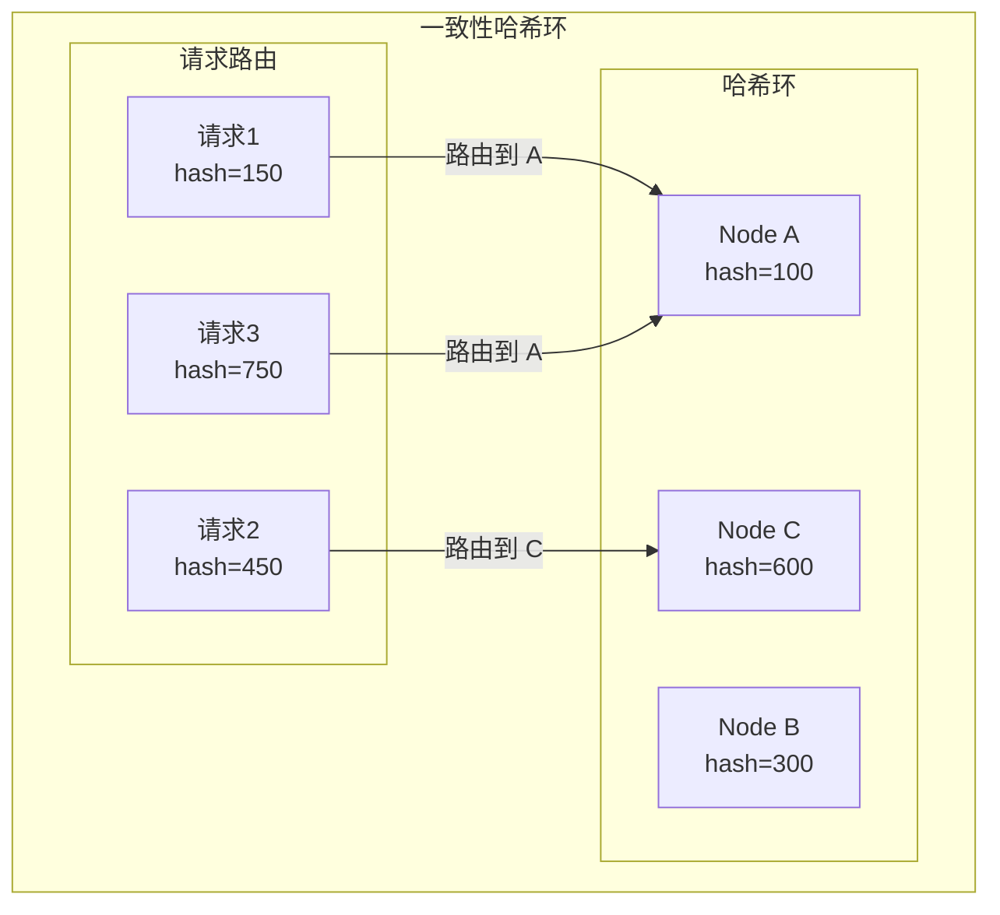
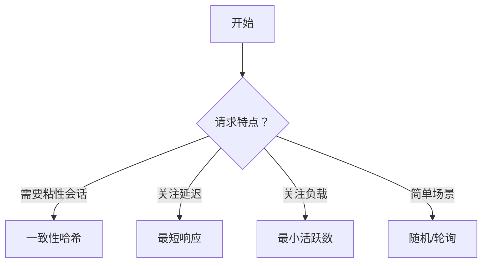

# Dubbo 负载均衡策略

> **目标级别**：P6
> **面试频率**：🔴 高频
> **面试官最关心的 3 个问题**：
> 1. Dubbo 有哪些负载均衡策略？
> 2. 一致性哈希负载均衡的原理？
> 3. 如何选择负载均衡策略？

面试官问：「Dubbo 的负载均衡策略有哪些？」你说「随机、加权轮询」——然后面试官紧接着追问「那一致性哈希呢？为什么哈希算法能保证节点变化时影响最小？」你沉默了。

负载均衡是微服务架构的核心，理解它才能做好服务治理。

## 一、Dubbo 负载均衡概述

### 1.1 负载均衡的作用

```mermaid
graph TB
    subgraph "负载均衡"
        C["消费者"]
        L["负载均衡器"]
        P1["提供者1"]
        P2["提供者2"]
        P3["提供者3"]
    end

    C --> L
    L --> P1
    L --> P2
    L --> P3

    Note over L: 分配请求到不同节点
```

### 1.2 Dubbo 负载均衡策略

| 策略 | 说明 | 特点 |
|------|------|------|
| **Random** | 随机 | 简单，默认策略 |
| **RoundRobin** | 加权轮询 | 均匀 |
| **LeastActive** | 最小活跃数 | 性能感知 |
| **ConsistentHash** | 一致性哈希 | 请求粘性 |
| **ShortestResponse** | 最短响应 | 延迟感知 |

## 二、各策略详解

### 2.1 Random（随机）

```java
public class RandomLoadBalance extends AbstractLoadBalance {

    @Override
    protected <T> Invoker<T> doSelect(List<Invoker<T>> invokers, URL url, Invocation invocation) {
        int length = invokers.size();
        boolean sameWeight = true;
        int[] weights = new int[length];

        // 计算权重
        for (int i = 0; i < length; i++) {
            int weight = getWeight(invokers.get(i), invocation);
            weights[i] = weight;

            if (sameWeight && i > 0 && weight != weights[i - 1]) {
                sameWeight = false;
            }
        }

        if (weight > 0 && !sameWeight) {
            // 加权随机
            int offset = ThreadLocalRandom.current().nextInt(weightSum);
            for (int i = 0; i < length; i++) {
                offset -= weights[i];
                if (offset < 0) {
                    return invokers.get(i);
                }
            }
        }

        // 纯随机
        return invokers.get(ThreadLocalRandom.current().nextInt(length));
    }
}
```

### 2.2 RoundRobin（加权轮询）

```java
public class RoundRobinLoadBalance extends AbstractLoadBalance {

    @Override
    protected <T> Invoker<T> doSelect(List<Invoker<T>> invokers, URL url, Invocation invocation) {
        String key = invokers.get(0).getUrl().getServiceKey();
        WeightedRoundRobin selected = getWeightedRoundRobin(key, invokers, invocation);

        // 更新当前轮询位置
        Long curSequence = sequences.get(key);
        sequences.put(key, curSequence + 1);

        return selected.invoker;
    }
}
```

### 2.3 LeastActive（最小活跃数）

```java
public class LeastActiveLoadBalance extends AbstractLoadBalance {

    @Override
    protected <T> Invoker<T> doSelect(List<Invoker<T>> invokers, URL url, Invocation invocation) {
        int length = invokers.size();
        int leastActive = -1;
        int leastCount = 0;
        int[] leastIndexes = new int[length];

        // 1. 找到最小活跃数
        for (int i = 0; i < length; i++) {
            Invoker<T> invoker = invokers.get(i);
            int active = getActive(invoker);

            if (active < leastActive) {
                leastActive = active;
                leastCount = 1;
                leastIndexes[0] = i;
            } else if (active == leastActive) {
                leastIndexes[leastCount++] = i;
            }
        }

        // 2. 随机选择
        if (leastCount == 1) {
            return invokers.get(leastIndexes[0]);
        }

        int offset = ThreadLocalRandom.current().nextInt(leastCount);
        return invokers.get(leastIndexes[offset]);
    }
}
```

### 2.4 ConsistentHash（一致性哈希）



**一致性哈希的原理**：

1. 将节点哈希值分布在哈希环上
2. 请求根据哈希值在环上顺时针查找节点
3. 节点变化时，只影响相邻的请求

```java
public class ConsistentHashLoadBalance extends AbstractLoadBalance {

    private final ConcurrentMap<String, TreeMap<Long, Invoker<T>>> hashMap =
        new ConcurrentHashMap<>();

    @Override
    protected <T> Invoker<T> doSelect(List<Invoker<T>> invokers, URL url, Invocation invocation) {
        String key = getMethodKey(invokers.get(0), invocation);
        TreeMap<Long, Invoker<T>> treeMap = hashMap.computeIfAbsent(key, k -> new TreeMap<>());

        // 生成请求哈希
        long hash = hash(invocation);

        // 顺时针查找
        Map.Entry<Long, Invoker<T>> entry = treeMap.ceilingEntry(hash);
        if (entry == null) {
            entry = treeMap.firstEntry();
        }

        return entry.getValue();
    }
}
```

### 2.5 ShortestResponse（最短响应）

```java
public class ShortestResponseLoadBalance extends AbstractLoadBalance {

    @Override
    protected <T> Invoker<T> doSelect(List<Invoker<T>> invokers, URL url, Invocation invocation) {
        int length = invokers.size();
        long bestResponseTime = Long.MAX_VALUE;
        int bestCount = 0;
        int[] leastIndexes = new int[length];

        // 找到最短响应时间
        for (int i = 0; i < length; i++) {
            Invoker<T> invoker = invokers.get(i);
            long responseTime = getResponseTime(invoker);

            if (responseTime < bestResponseTime) {
                bestResponseTime = responseTime;
                bestCount = 1;
                leastIndexes[0] = i;
            } else if (responseTime == bestResponseTime) {
                leastIndexes[bestCount++] = i;
            }
        }

        if (bestCount == 1) {
            return invokers.get(leastIndexes[0]);
        }

        // 随机选择
        int offset = ThreadLocalRandom.current().nextInt(bestCount);
        return invokers.get(leastIndexes[offset]);
    }
}
```

## 三、选择策略

### 3.1 决策树



### 3.2 场景选择

| 场景 | 推荐策略 | 理由 |
|------|----------|------|
| **简单调用** | Random | 简单均匀 |
| **长连接场景** | ConsistentHash | 保持连接 |
| **计算密集** | LeastActive | 分配到空闲节点 |
| **低延迟场景** | ShortestResponse | 选择响应快的 |
| **权重不同** | WeightedRoundRobin | 按能力分配 |

## 四、面试高频题

### 🔴 题目 1：Dubbo 有哪些负载均衡策略？

**参考回答**：

Dubbo 的负载均衡策略：

1. **Random（随机）**：加权随机，简单的默认策略
2. **RoundRobin（轮询）**：加权轮询，均匀分配
3. **LeastActive（最小活跃）**：选择活跃数最少的
4. **ConsistentHash（一致性哈希）**：请求粘性
5. **ShortestResponse（最短响应）**：选择响应时间最短的

### 🔴 题目 2：一致性哈希的原理是什么？

**参考回答**：

一致性哈希的原理：

1. **哈希环**：将节点和请求都哈希到环上
2. **顺时针查找**：请求沿环顺时针找到第一个节点
3. **虚拟节点**：引入虚拟节点解决分布不均
4. **最小化影响**：节点变化只影响相邻请求

### 🟡 题目 3：如何选择负载均衡策略？

**参考回答**：

| 场景 | 推荐策略 |
|------|----------|
| 简单调用 | Random |
| 长连接 | ConsistentHash |
| 计算密集 | LeastActive |
| 低延迟 | ShortestResponse |
| 权重不同 | WeightedRoundRobin |

## 五、常见错误与陷阱

### ⚠️ 陷阱 1：忽略权重配置

```
❌ 错误理解：
所有节点权重相同

✅ 正确理解：
可以通过权重调整分配比例
权重 = 0 表示禁用
```

### ⚠️ 陷阱 2：一致性哈希不需要虚拟节点

```
❌ 错误理解：
直接哈希节点就够了

✅ 正确理解：
节点少��分布不均
需要虚拟节点均衡
```

### ⚠️ 陷阱 3：LeastActive 是最好的

```
❌ 错误理解：
选活跃数最小的最合理

✅ 正确理解：
不同场景适合不同策略
没有万能策略
```

## 六、总结对比表

| 策略 | 特点 | 适用场景 |
|------|------|----------|
| Random | 简单均匀 | 一般场景 |
| RoundRobin | 均匀分配 | 权重不同 |
| LeastActive | 性能感知 | 异构机器 |
| ConsistentHash | 会话保持 | 长连接 |
| ShortestResponse | 延迟感知 | 低延迟 |

## 七、加分回答

> **💡 面试加分点**：
>
> 1. **虚拟节点数量**：通常 160 个虚拟节点
>
> 2. **加权算法实现**：基于滑动窗口的权重计算
>
> 3. **动态权重**：根据实时负载调整权重
>
> 4. **Dubbo 3.0 新特性**：服务级权重和负载均衡策略
