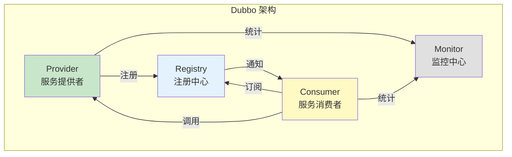
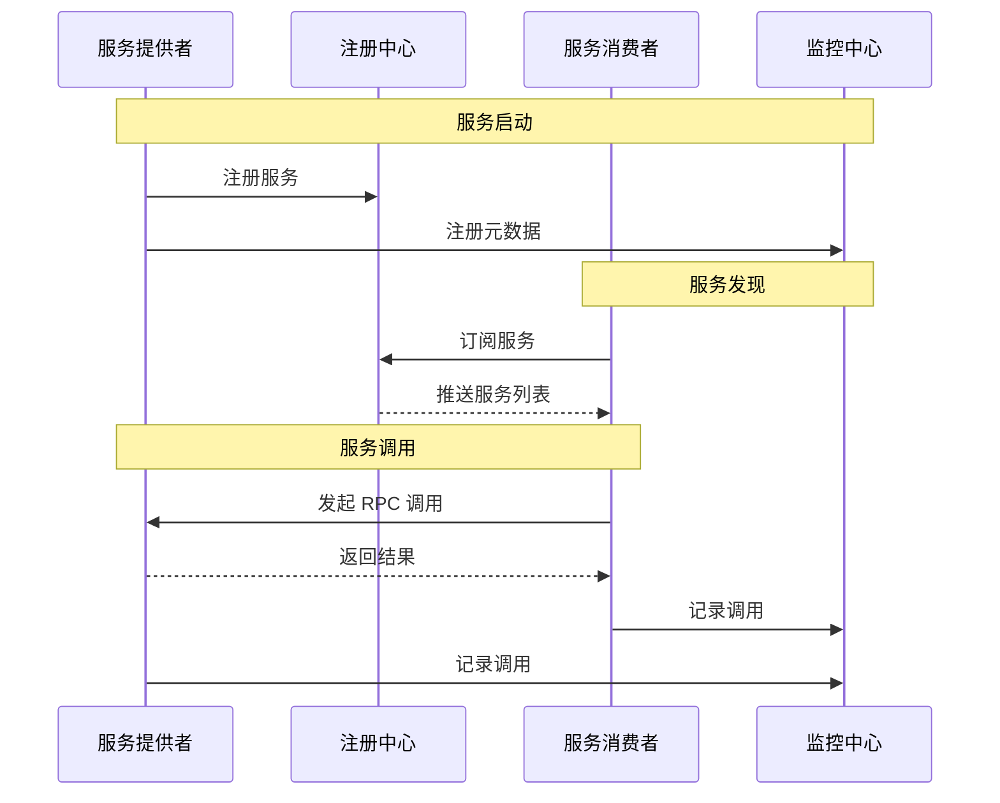
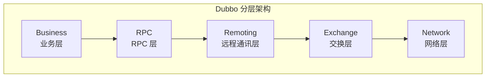
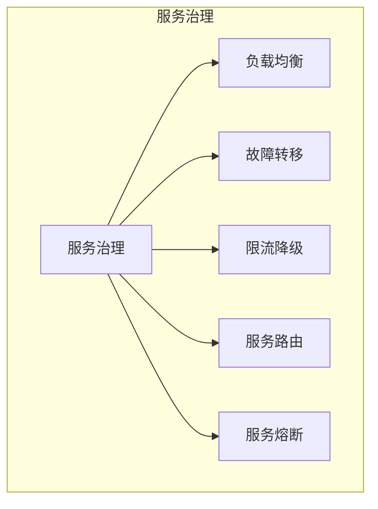

# Dubbo 架构与原理

> **目标级别**：P6
> **面试频率**：🔴 高频
> **面试官最关心的 3 个问题**：
> 1. Dubbo 的架构是怎样的？
> 2. Dubbo 的调用流程是什么？
> 3. Dubbo 和 Spring Cloud 有什么区别？

面试官问：「Dubbo 的架构是怎样的？」你说「服务提供者、消费者、注册中心」——然后面试官紧接着追问「那 Dubbo 的 RPC 协议是什么？序列化方式呢？有没有做过调优？」你沉默了。

Dubbo 是阿里巴巴开源的高性能 RPC 框架，是微服务架构的核心组件。

## 一、Dubbo 架构概述

### 1.1 核心角色



### 1.2 角色详解

| 角色 | 说明 | 职责 |
|------|------|------|
| **Provider** | 服务提供者 | 暴露服务，注册到注册中心 |
| **Consumer** | 服务消费者 | 订阅服务，调用提供者 |
| **Registry** | 注册中心 | 管理服务地址，通知变更 |
| **Monitor** | 监控中心 | 统计调用次数、延迟等 |
| **Container** | 容器 | 启动服务容器（可选） |

## 二、Dubbo 调用流程

### 2.1 完整调用流程



### 2.2 服务发现流程

```mermaid
graph TB
    subgraph "服务发现"
        C["消费者"]
        R["注册中心"]
        P["提供者列表"]
    end

    C -->|"1. 订阅"| R
    R -->|"2. 推送变更"| C
    C -->|"3. 本地缓存"| P
    C -->|"4. 负载均衡"| P

    Note over C: 本地缓存用于容错
```

## 三、Dubbo 核心组件

### 3.1 核心组件分层



### 3.2 各层职责

| 层级 | 说明 | 关键组件 |
|------|------|----------|
| **Business** | 业务接口层 | Service、Reference |
| **RPC** | RPC 层 | Proxy、Protocol、Invoker |
| **Remoting** | 远程通讯层 | Exchange、Transport |
| **Exchange** | 信息交换层 | HeaderExchange |
| **Network** | 网络层 | Netty、Mina |

## 四、Dubbo 协议与序列化

### 4.1 常用协议

| 协议 | 特点 | 适用场景 |
|------|------|----------|
| **Dubbo** | 高性能，NIO | Java 同构系统 |
| **HTTP** | 通用性强 | 跨语言 |
| **RMI** | JDK 标准 | Java 传统系统 |
| **Hessian** | 轻量 | 跨语言 |
| **gRPC** | 高性能 | 跨语言 |

### 4.2 序列化方式

| 序列化 | 性能 | 可读性 | 跨语言 |
|--------|------|--------|--------|
| **Hessian** | 好 | 一般 | 部分 |
| **Fastjson** | 好 | 好 | 部分 |
| **Protobuf** | 很好 | 差 | 是 |
| **Kryo** | 很好 | 差 | 部分 |
| **Java** | 一般 | 差 | 否 |

### 4.3 Dubbo 协议配置

```java
// 协议配置
@DubboService(
    protocol = {
        @Protocol(name = "dubbo", port = 20880),
        @Protocol(name = "rest", port = 8080)
    }
)

// 服务引用
@DubboReference(
    protocol = "dubbo",
    loadbalance = "roundrobin"
)
```

## 五、Dubbo 服务治理

### 5.1 服务治理能力



### 5.2 服务治理配置

```java
// 负载均衡
@DubboReference(loadbalance = "roundrobin")

// 集群容错
@DubboReference(cluster = "failover", retries = 3)

// 限流
@DubboService(mock = "force:return null")

// 服务路由
@DubboReference(route = @Route(rule = "condition: app=consumerA"))
```

## 六、面试高频题

### 🔴 题目 1：Dubbo 的架构是怎样���？

**参考回答**：

Dubbo 采用分层架构：

1. **业务层**：服务接口定义
2. **RPC 层**：Proxy、Protocol、Invoker
3. **远程通讯层**：Exchange、Transport
4. **网络层**：Netty、Mina

核心角色：
- Provider：服务提供者
- Consumer：服务消费者
- Registry：注册中心
- Monitor：监控中心

### 🔴 题目 2：Dubbo 和 Spring Cloud 有什么区别？

**参考回答**：

| 维度 | Dubbo | Spring Cloud |
|------|-------|--------------|
| **定位** | RPC 框架 | 微服务全家桶 |
| **通信方式** | RPC | HTTP/REST |
| **性能** | 高 | 一般 |
| **生态** | 阿里系 | Spring 生态 |
| **学习成本** | 中 | 低 |
| **适用场景** | Java 同构 | 跨语言 |

### 🟡 题目 3：Dubbo 的调用流程是什么？

**参考回答**：

1. Provider 启动，向 Registry 注册服务
2. Consumer 启动，向 Registry 订阅服务
3. Registry 推送服务列表给 Consumer
4. Consumer 基于负载均衡选择 Provider
5. Consumer 发起 RPC 调用
6. Provider 处理请求，返回结果
7. Monitor 统计调用数据

## 七、常见错误与陷阱

### ⚠️ 陷阱 1：Dubbo 协议性能高是银弹

```
❌ 错误理解：
Dubbo 协议性能一定最高

✅ 正确理解：
性能取决于：
- 序列化方式
- 网络 IO
- 连接池配置
```

### ⚠️ 陷阱 2：忽略注册中心的作用

```
❌ 错误理解：
注册中心只是存地址的

✅ 正确理解：
注册中心：
- 服务注册/发现
- 健康检查
- 路由规则
```

### ⚠️ 陷阱 3：服务治理配置不生效

```
❌ 错误理解：
配置了服务治理就生效

✅ 正确理解：
需要匹配正确的版本和配置方式
```

## 八、总结对比表

| 维度 | Dubbo | gRPC | Spring Cloud |
|------|-------|------|--------------|
| **通信协议** | 自定义 | HTTP/2 | HTTP |
| **序列化** | 多种 | Protobuf | JSON |
| **性能** | 高 | 高 | 一般 |
| **生态** | 阿里系 | Google | Spring |
| **服务治理** | 完善 | 弱 | 完善 |
| **跨语言** | 一般 | 是 | 是 |

## 九、加分回答

> **💡 面试加分点**：
>
> 1. **Dubbo 3.0**：Triple 协议，基于 HTTP/2
>
> 2. **Dubbo 内核**：ExtensionLoader 机制
>
> 3. **Dubbo 与 Spring Cloud 融合**：Spring Cloud Alibaba
>
> 4. **性能优化**：连接复用、异步调用
