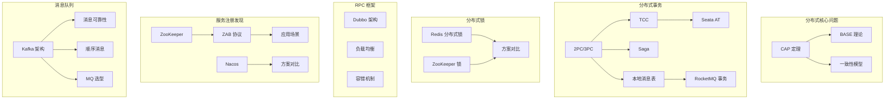
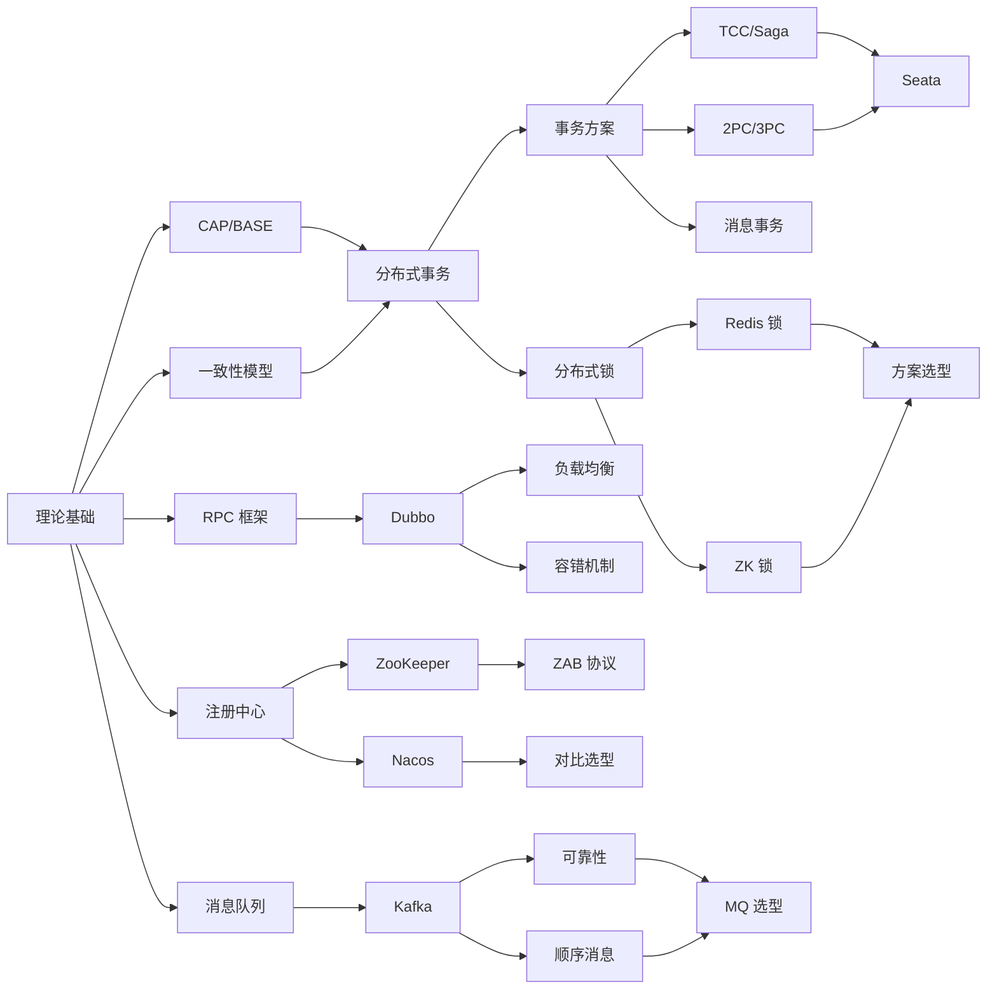

# 分布式架构 30 题

> **目标级别**：P6/P7
> **面试频率**：🔴 高频
> **面试官最关心的 3 个问题**：
> 1. CAP 定理是什么？如何选择？
> 2. 分布式事务有哪些解决方案？
> 3. 如何实现分布式锁？

面试官问：「分布式系统有哪三大难题？」你说「一致性、可用性、分区容错」——然后面试官紧接着追问「CAP 定理你理解吗？那 BASE 理论呢？它们之间有什么关系？」你沉默了。

分布式系统是现代架构的基石，理解 CAP、BASE、分布式事务、分布式锁等核心概念，是每个后端工程师迈向 P6/P7 的必经之路。

## 面试知识图谱

## 题目分类

### 一、分布式理论（5 题）

| 序号 | 题目 | 频率 | 难度 |
|------|------|------|------|
| 1 | [CAP 定理](/questions/distributed/cap) | 🔴 高频 | P6 |
| 2 | [BASE 理论](/questions/distributed/base) | 🔴 高频 | P6 |
| 3 | [CAP 与 BASE 的关系](/questions/distributed/cap-base) | 🔴 高频 | P6 |
| 4 | [一致性模型对比](/questions/distributed/consistency) | 🟡 中频 | P6 |
| 5 | [PACELC 定理](/questions/distributed/pacelc) | 🟢 低频 | P7 |

### 二、分布式事务（7 题）

| 序号 | 题目 | 频率 | 难度 |
|------|------|------|------|
| 6 | [2PC 两阶段提交](/questions/distributed/2pc) | 🔴 高频 | P6 |
| 7 | [2PC 的阻塞问题与缺陷](/questions/distributed/2pc-problems) | 🔴 高频 | P6 |
| 8 | [3PC 三阶段提交](/questions/distributed/3pc) | 🟡 中频 | P6 |
| 9 | [TCC 事务原理](/questions/distributed/tcc) | 🔴 高频 | P6 |
| 10 | [TCC 空回滚与防悬挂](/questions/distributed/tcc-pitfalls) | 🟡 中频 | P6 |
| 11 | [Saga 事务](/questions/distributed/saga) | 🟡 中频 | P6 |
| 12 | [本地消息表](/questions/distributed/local-message-table) | 🟡 中频 | P6 |
| 13 | [RocketMQ 事务消息](/questions/distributed/rocketmq-transaction) | 🟡 中频 | P6 |
| 14 | [Seata AT 模式](/questions/distributed/seata) | 🔴 高频 | P6 |
| 15 | [分布式事务方案选型](/questions/distributed/transaction-selection) | 🔴 高频 | P7 |

### 三、分布式锁（3 题）

| 序号 | 题目 | 频率 | 难度 |
|------|------|------|------|
| 16 | [Redis 分布式锁](/questions/distributed/redis-lock) | 🔴 高频 | P6 |
| 17 | [ZooKeeper 分布式锁](/questions/distributed/zk-lock) | 🔴 高频 | P6 |
| 18 | [分布式锁方案对比](/questions/distributed/lock-comparison) | 🔴 高频 | P6 |

### 四、Dubbo 框架（3 题）

| 序号 | 题目 | 频率 | 难度 |
|------|------|------|------|
| 19 | [Dubbo 架构与原理](/questions/distributed/dubbo) | 🔴 高频 | P6 |
| 20 | [Dubbo 负载均衡策略](/questions/distributed/dubbo-loadbalance) | 🔴 高频 | P6 |
| 21 | [Dubbo 容错机制](/questions/distributed/dubbo-fault) | 🟡 中频 | P6 |

### 五、ZooKeeper（3 题）

| 序号 | 题目 | 频率 | 难度 |
|------|------|------|------|
| 22 | [ZooKeeper 数据模型](/questions/distributed/zk-model) | 🟡 中频 | P6 |
| 23 | [ZAB 协议](/questions/distributed/zab) | 🟡 中频 | P6 |
| 24 | [ZooKeeper 应用场景](/questions/distributed/zk-scenarios) | 🟡 中频 | P6 |

### 六、服务注册发现（2 题）

| 序号 | 题目 | 频率 | 难度 |
|------|------|------|------|
| 25 | [Nacos 服务发现与配置](/questions/distributed/nacos) | 🔴 高频 | P6 |
| 26 | [Nacos 与 Eureka/Consul 对比](/questions/distributed/registry-comparison) | 🟡 中频 | P6 |

### 七、消息队列（4 题）

| 序号 | 题目 | 频率 | 难度 |
|------|------|------|------|
| 27 | [Kafka 架构与分区](/questions/distributed/kafka) | 🔴 高频 | P6 |
| 28 | [Kafka 消息可靠性](/questions/distributed/kafka-reliability) | 🔴 高频 | P6 |
| 29 | [Kafka 顺序消息](/questions/distributed/kafka-order) | 🟡 中频 | P6 |
| 30 | [消息队列选型对比](/questions/distributed/mq-selection) | 🔴 高频 | P6 |

## 学习路径建议

### 第一阶段：理论奠基（P5 → P6）

1. [CAP 定理](/questions/distributed/cap) → [BASE 理论](/questions/distributed/base) → [一致性模型](/questions/distributed/consistency)
2. 理解分布式系统的核心矛盾：一致性与可用性的权衡

### 第二阶段：事务实战（P6）

1. [2PC/3PC](/questions/distributed/2pc) → [TCC](/questions/distributed/tcc) → [Saga](/questions/distributed/saga)
2. [Seata AT 模式](/questions/distributed/seata) → [方案选型](/questions/distributed/transaction-selection)
3. 掌握各种分布式事务方案的适用场景

### 第三阶段：锁与协调（P6）

1. [Redis 分布式锁](/questions/distributed/redis-lock) → [ZooKeeper 分布式锁](/questions/distributed/zk-lock)
2. [Dubbo 架构](/questions/distributed/dubbo) → [负载均衡](/questions/distributed/dubbo-loadbalance) → [容错](/questions/distributed/dubbo-fault)
3. [Nacos](/questions/distributed/nacos) → [注册中心对比](/questions/distributed/registry-comparison)

### 第四阶段：消息队列（P6 → P7）

1. [Kafka 架构](/questions/distributed/kafka) → [消息可靠性](/questions/distributed/kafka-reliability)
2. [顺序消息](/questions/distributed/kafka-order) → [MQ 选型](/questions/distributed/mq-selection)
3. 深入理解消息队列的高可用设计

## 高频面试追问链

### CAP/BASE 追问链

> **第一层**：CAP 定理是什么？
> **第二层**：CAP 三要素只能同时满足两个，那分布式系统怎么选？
> **第三层**：BASE 理论是什么？它和 CAP 是什么关系？
> **第四层**：PACELC 定理考虑过吗？

### 分布式事务追问链

> **第一层**：分布式事务有哪些解决方案？
> **第二层**：2PC 和 3PC 有什么区别？
> **第三层**：TCC 的空回滚和防悬挂是怎么实现的？
> **第四层**：Seata AT 模式和 XA 有什么区别？

### 分布式锁追问链

> **第一层**：Redis 分布式锁怎么实现？
> **第二层**：如何保证 Redis 分布式锁的可靠性？
> **第三层**：RedLock 了解吗？有什么问题？
> **第四层**：ZooKeeper 分布式锁的实现原理是什么？

## 常见面试陷阱

**⚠️ 陷阱 1**：认为 CAP 三选二是一个静态选择

- CAP 不是说系统可以在 C/A/P 中随意选两个
- 实际上，分区是客观存在的，系统必须在 P 下选择 C 或 A
- 「三选二」是理论模型，不是设计约束

**⚠️ 陷阱 2**：把分布式事务当成单机事务的替代品

- 分布式事务开销远大于单机事务
- 应该优先考虑业务拆分，避免分布式事务
- 只有真正需要跨服务一致性时，才考虑分布式事务

**⚠️ 陷阱 3**：分布式锁只考虑加锁，不考虑解锁

- 加锁只是第一步，还需要考虑：锁续期、锁释放、锁等待、公平锁
- Redis 锁的 SETNX + EXPIRE 不是原子的，可能导致死锁
- ZooKeeper 的临时节点可以自动清理，但性能不如 Redis

## 加分回答

> **💡 面试加分点**：如果能说出工业界的最佳实践，会给面试官留下深刻印象：
>
> 1. **蚂蚁金服的分布式事务实践**：Seata 在双十一的落地经验
>
> 2. **Google 的 Spanner**：TrueTime + 两阶段提交实现外部一致性
>
> 3. **Amazon Aurora**：存储计算分离架构下的分布式事务优化
>
> 4. **阿里云 DingTalk**：异地多活架构下的 CAP 权衡

## 延伸学习

- [MySQL 事务隔离级别](/questions/mysql/isolation-levels)
- [MySQL MVCC 原理](/questions/mysql/mvcc)
- [Redis 持久化机制](/questions/redis/persistence)
