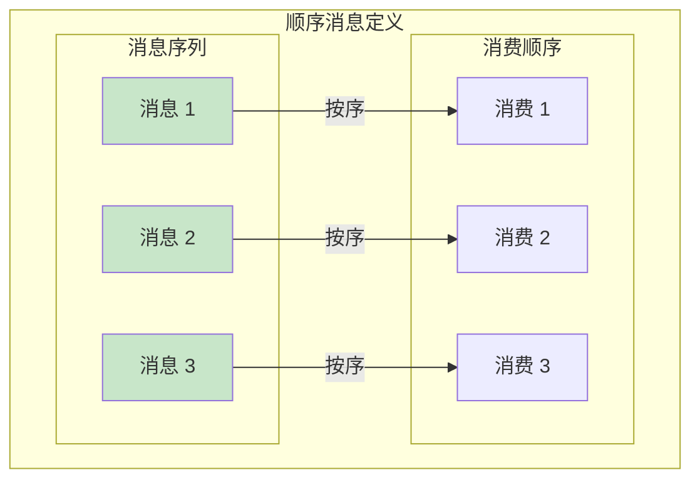
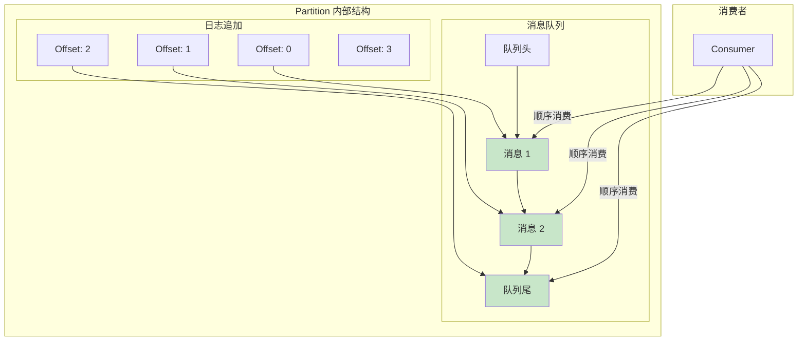
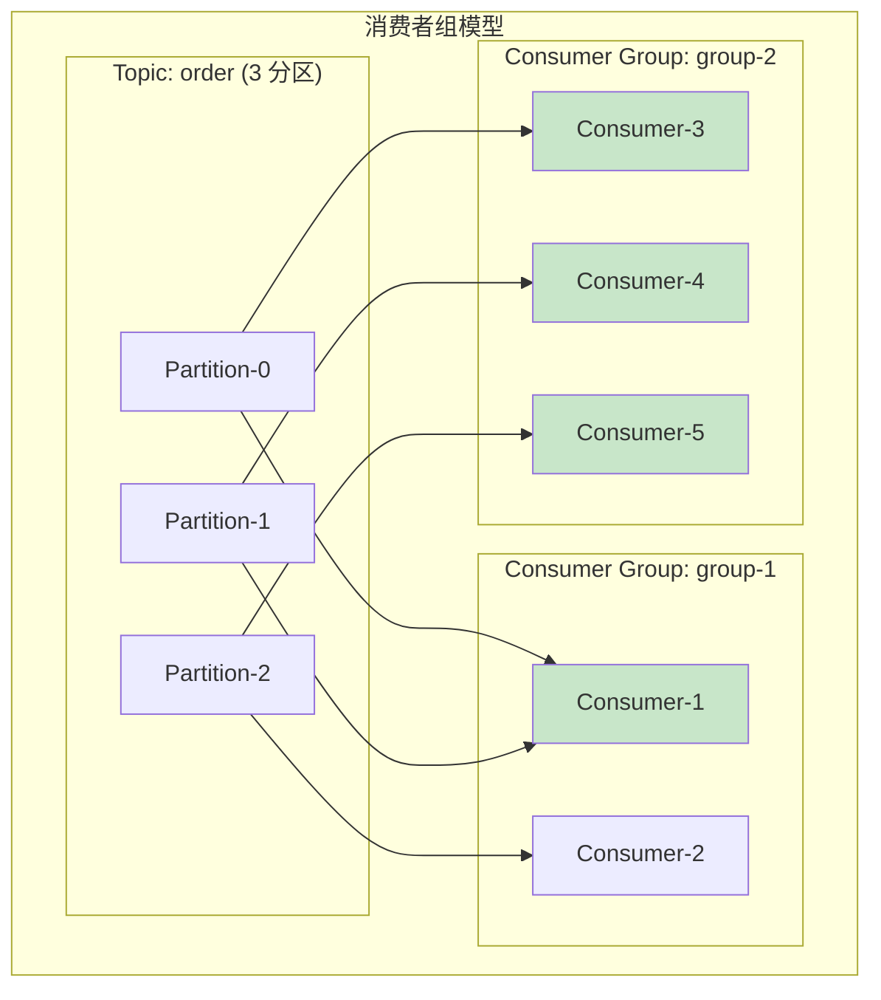
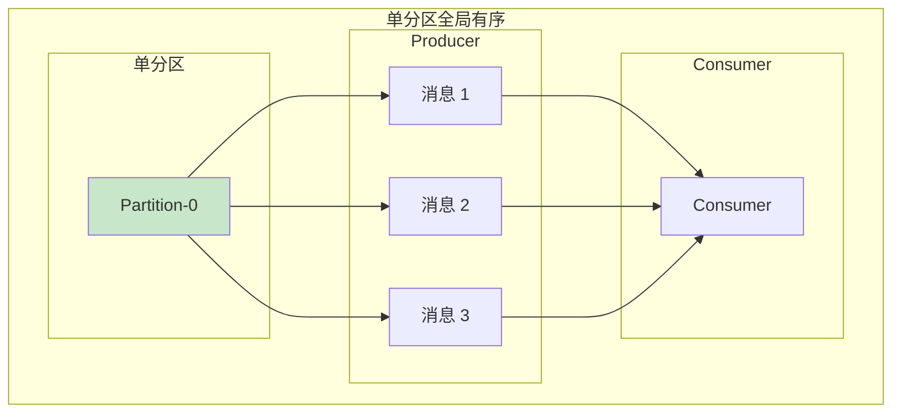
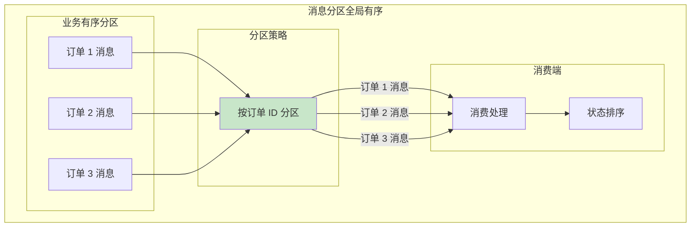

# Kafka 顺序消息

> **目标级别**：P6
> **面试频率**：🟡 中频
> **面试官最关心的 3 个问题**：
> 1. Kafka 能保证消息顺序吗？
> 2. 如何实现单分区有序？
> 3. 如何实现跨分区的全局有序？

面试官问：「Kafka 能保证消息顺序吗？」你说「能」——然后面试官紧接着追问「那跨分区的消息能保证顺序吗？为什么同一个分区内有序？如果要保证全局有序该怎么设计？」你沉默了。

Kafka 的顺序消息是面试中的高频陷阱题，需要深入理解其分区机制和顺序保证。

## 一、顺序消息基础

### 1.1 顺序消息的定义



**顺序消息**指消息的生产顺序和消费顺序一致。

### 1.2 Kafka 顺序保证级别

|| 保证级别 | 说明 | 实现方式 |
|------|---------|------|----------|
| **分区内有序** | 同一分区内消息有序 | Kafka 默认保证 |
| **全局有序** | 所有消息全局有序 | 需特殊设计 |
| **业务有序** | 相同 Key 消息有序 | Key 分区策略 |

### 1.3 分区内有序原理



## 二、分区与顺序

### 2.1 多分区导致乱序

```mermaid
graph TB
    subgraph "多分区乱序"
        subgraph "Producer"
            P1["发送消息 A"]
            P2["发送消息 B"]
            P3["发送消息 C"]
        end

        subgraph "分区策略"
            K["Key: user-1"]
        end

        P1 -->|"Key=A"| K
        P2 -->|"Key=B"| K
        P3 -->|"Key=C"| K

        K -->|"哈希分区"| PT0["Partition-0<br/>A"]
        K -->|"哈希分区"| PT1["Partition-1<br/>C"]
        K -->|"哈希分区"| PT2["Partition-2<br/>B"]

        Note over PT0,PT2: 消息 B 和 C 在不同分区
        Note over PT0,PT2: 消费顺序不确定
    end

    style PT0 fill:#c8e6c9
    style PT1 fill:#e3f2fd
    style PT2 fill:#e3f2fd
```

### 2.2 分区策略代码

```java
// Kafka 分区策略
public class KafkaPartitionStrategy {

    /**
     * 1. 默认哈希分区
     */
    public void defaultPartitioner() {
        // 相同 Key 去同一分区
        // 不同 Key 可能去不同分区
        // 消息顺序：同 Key 有序，不同 Key 可能乱序
    }

    /**
     * 2. 自定义分区器 - 按业务字段分区
     */
    public class OrderPartitioner implements Partitioner {

        @Override
        public int partition(String topic, Object key, byte[] keyBytes,
                           Object value, byte[] valueBytes, Cluster cluster) {
            if (value instanceof Order) {
                Order order = (Order) value;
                String orderId = order.getOrderId();

                // 同一订单的消息去同一分区，保证有序
                return Math.abs(orderId.hashCode()) % getPartitionCount(topic, cluster);
            }

            // 无订单信息，按 Key 哈希
            return key != null ?
                Math.abs(key.hashCode()) % getPartitionCount(topic, cluster) :
                new Random().nextInt(getPartitionCount(topic, cluster));
        }
    }

    /**
     * 3. 全局有序分区策略
     */
    public class GlobalOrderPartitioner implements Partitioner {

        @Override
        public int partition(String topic, Object key, byte[] keyBytes,
                           Object value, byte[] valueBytes, Cluster cluster) {
            // 单分区实现全局有序
            // 注意：严重影响吞吐量
            return 0;
        }
    }
}
```

### 2.3 单分区配置

```bash
# 创建单分区 Topic - 全局有序
kafka-topics.sh --create \
  --topic order-global \
  --partitions 1 \
  --replication-factor 3

# 或修改现有 Topic
kafka-topics.sh --alter \
  --topic order-service \
  --partitions 1
```

```java
// Producer 配置 - 全局有序
Properties props = new Properties();
props.put("bootstrap.servers", "localhost:9092");

// 自定义分区器 - 强制单分区
props.put("partitioner.class", "com.example.GlobalOrderPartitioner");

// 或使用默认策略 + 单分区 Topic
```

## 三、消费者顺序消费

### 3.1 消费者组消费模型



**消费顺序规则**：
- 同一分区同时只有一个 Consumer 能消费
- 同一分区内消息按 Offset 顺序消费
- 不同分区间消费顺序不确定

### 3.2 顺序消费代码

```java
// 顺序消费最佳实践
public class OrderlyConsumer {

    private KafkaConsumer<String, String> consumer;

    /**
     * 1. 按 Offset 顺序消费
     */
    public void consumeByOffset() {
        while (true) {
            // poll 返回的消息已按 Offset 排序
            ConsumerRecords<String, String> records = consumer.poll(Duration.ofMillis(1000));

            for (ConsumerRecord<String, String> record : records) {
                // 处理消息
                processMessage(record);
            }

            // 同步提交 offset
            consumer.commitSync();
        }
    }

    /**
     * 2. 顺序处理业务逻辑
     */
    private void processMessage(ConsumerRecord<String, String> record) {
        String key = record.key();
        String value = record.value();

        // 关键：按业务顺序处理
        // 例如：订单状态机流转
        switch (getCurrentState(key)) {
            case "待支付":
                handleUnpaid(record);
                break;
            case "已支付":
                handlePaid(record);
                break;
            case "已发货":
                handleShipped(record);
                break;
            default:
                handleUnknown(record);
        }
    }

    /**
     * 3. 幂等处理 - 避免重复处理
     */
    private void processMessageIdempotent(ConsumerRecord<String, String> record) {
        String messageId = record.key();

        // 检查是否已处理（Redis 幂等键）
        if (redis.exists("processed:" + messageId)) {
            return;
        }

        // 业务处理
        doProcess(record);

        // 标记已处理
        redis.setex("processed:" + messageId, 7 * 24 * 3600, "1");
    }
}
```

## 四、全局有序方案

### 4.1 单分区方案



**优点**：
- 天然保证全局有序
- 实现简单

**缺点**：
- 并发度低，吞吐量受限
- 消费者成为瓶颈

### 4.2 消息分区方案



**实现方式**：
- 按业务 Key（如订单 ID）分区
- 同一业务的消息在同一分区
- 消费端按业务逻辑排序

### 4.3 消费端排序方案

```java
// 消费端排序处理
public class SortedConsumer {

    private KafkaConsumer<String, String> consumer;

    /**
     * 消费端全局排序处理
     */
    public void consumeWithSort() {
        // 1. 拉取消息
        ConsumerRecords<String, String> records = consumer.poll(Duration.ofMillis(1000));

        // 2. 按业务顺序排序
        List<ConsumerRecord<String, String>> sortedRecords = new ArrayList<>();
        records.forEach(sortedRecords::add);

        // 3. 按业务时间戳排序
        sortedRecords.sort((r1, r2) -> {
            Order o1 = parseOrder(r1.value());
            Order o2 = parseOrder(r2.value());
            return o1.getCreateTime().compareTo(o2.getCreateTime());
        });

        // 4. 按序处理
        for (ConsumerRecord<String, String> record : sortedRecords) {
            processMessage(record);
        }

        // 5. 提交 offset
        consumer.commitSync();
    }

    /**
     * 业务时间戳排序实现
     */
    public void consumeWithTimestampSort() {
        ConsumerRecords<String, String> records = consumer.poll(Duration.ofMillis(1000));

        // 按消息时间戳分组
        Map<String, List<ConsumerRecord<String, String>>> recordsByKey =
            new HashMap<>();

        records.forEach(record -> {
            String key = record.key();
            recordsByKey.computeIfAbsent(key, k -> new ArrayList<>()).add(record);
        });

        // 同 Key 消息按时间戳排序处理
        recordsByKey.forEach((key, keyRecords) -> {
            keyRecords.sort((r1, r2) -> {
                // 按消息中的业务时间戳排序
                return Long.compare(
                    extractTimestamp(r1.value()),
                    extractTimestamp(r2.value())
                );
            });

            keyRecords.forEach(this::processMessage);
        });

        consumer.commitSync();
    }
}
```

## 五、常见顺序问题

### 5.1 顺序问题场景

```mermaid
graph TB
    subgraph "顺序问题场景"
        subgraph "问题 1：多 Consumer"
            M1["Consumer-1"] -->|"消费消息 1"| D1["处理"]
            M2["Consumer-2"] -->|"消费消息 2"| D2["处理"]
            Note over M1,M2: 消费顺序不确定
        end

        subgraph "问题 2：Rebalance"
            R1["Rebalance 前<br/>Consumer 拉取消息"]
            R2["Rebalance 后<br/>新 Consumer 重新拉取"]
            Note over R1,R2: 可能重复消费
        end

        subgraph "问题 3：并发处理"
            C1["并发处理消息"]
            C2["消息 1"] -->|"异步"| P1["处理 1"]
            C2 -->|"异步"| P2["处理 2"]
            Note over C1: 处理完成顺序不确定
        end
    end

    style R2 fill:#fff9c4
```

### 5.2 问题解决方案

| 问题 | 原因 | 解决方案 |
|------|------|---------|
| **消费乱序** | 多 Consumer | 消费者单实例或单分区消费 |
| **Rebalance 丢消息** | 分区重分配 | 手动提交 offset + 幂等 |
| **并发处理乱序** | 异步处理 | 顺序处理 + 状态机 |
| **跨分区乱序** | 分区策略 | 按 Key 分区 + 消费端排序 |

```java
// 顺序问��解决代码
public class OrderlySolution {

    /**
     * 1. 单分区消费 - 保证严格有序
     */
    public void singlePartitionConsume() {
        // 消费者数量 <= 分区数
        // 单个消费者消费单个分区
    }

    /**
     * 2. 按业务 Key 消费
     */
    public void consumeByKey() {
        // 消息按 Key 分区
        // 同 Key 消息在同一分区
        // 消费端按 Key 分组处理
    }

    /**
     * 3. 状态机保证顺序
     */
    public void stateMachineConsume(ConsumerRecord<String, String> record) {
        String key = record.key();
        String value = record.value();

        // 获取当前状态
        String currentState = getCurrentState(key);

        // 状态机流转
        switch (currentState) {
            case "待支付":
                if (isPayMessage(value)) {
                    updateState(key, "已支付");
                }
                break;
            case "已支付":
                if (isShipMessage(value)) {
                    updateState(key, "已发货");
                }
                break;
            // ...
        }
    }

    /**
     * 4. 顺序处理模板
     */
    public void orderedProcess(List<ConsumerRecord<String, String>> records) {
        // 1. 按业务时间戳排序
        records.sort(Comparator.comparing(this::extractTimestamp));

        // 2. 顺序处理
        for (ConsumerRecord<String, String> record : records) {
            try {
                processMessage(record);
            } catch (Exception e) {
                // 3. 失败处理：记录并跳过，不阻塞后续消息
                logError(record, e);
                // 可选：放入重试队列
            }
        }

        // 4. 提交 offset
        consumer.commitSync();
    }
}
```

## 六、面试高频题

### 🔴 题目 1：Kafka 能保证消息顺序吗？

**参考回答**：

| 保证级别 | 是否保证 | 说明 |
|------|---------|------|
| **分区内有序** | ✅ 保证 | Kafka 默认保证 |
| **同 Key 有序** | ✅ 保证 | 相同 Key 去同一分区 |
| **跨分区有序** | ❌ 不保证 | 不同分区消费顺序不确定 |
| **全局有序** | ⚠️ 需设计 | 需单分区或消费端排序 |

> **追问 1**：如何保证分区内有序？
>
> - Kafka 默认保证，无需额外配置
> - 同一分区内消息按 Offset 顺序消费

> **追问 2**：跨分区如何保证有序？
>
> - 方案 1：单分区（性能差）
> - 方案 2：按业务 Key 分区，消��端排序
> - 方案 3：状态机处理

### 🟡 题目 2：如何实现全局有序？

**参考回答**：

实现全局有序的三种方案：

1. **单分区方案**：
   - Topic 只设置 1 个分区
   - 吞吐量受限

2. **按业务 Key 分区**：
   - 按业务 ID（如订单 ID）分区
   - 同订单消息有序
   - 消费端按时间戳排序

3. **消费端排序**：
   - 消费端按业务时间戳排序处理
   - 需处理乱序消息

### 🟡 题目 3：Rebalance 期间消息顺序会乱吗？

**参考回答**：

**可能产生的问题**：

1. **消息重复**：Rebalance 前拉取的消息可能重复消费
2. **消费延迟**：Rebalance 期间消费暂停
3. **进度丢失**：未提交的 offset 在 Rebalance 后丢失

**处理方案**：
- 手动提交 offset
- 业务层幂等处理
- 合理配置 Rebalance 超时时间

## 七、常见错误与陷阱

### ⚠️ 陷阱 1：多 Consumer 导致乱序

```
❌ 错误理解：
Kafka 消息是有序的，任何 Consumer 消费都保证有序

✅ 正确理解：
- 只有同一分区内有序
- 多 Consumer 消费不同分区会乱序
- 需单个 Consumer 顺序消费
```

### ⚠️ 陷阱 2：Rebalance 不影响顺序

```
❌ 错误理解：
Rebalance 只是重新分配分区，不影响顺序

✅ 正确理解：
- Rebalance 可能导致消息重复
- Rebalance 期间消费暂停
- Rebalance 后可能重新拉取已消费消息
```

### ⚠️ 陷阱 3：消息乱序不影响业务

```
❌ 错误理解：
消息顺序只是展示顺序，不影响业务逻辑

✅ 正确理解：
- 订单状态机依赖消息顺序
- 消息乱序可能导致状态错误
- 支付通知在订单创建之前到达会导致失败
```

### ⚠️ 陷阱 4：单分区解决所有问题

```
❌ 错误理解：
为了保证有序，直接用单分区

✅ 正确理解：
- 单分区严重影响吞吐量
- 应该按业务 Key 分区
- 在消费端处理顺序问题
```

## 八、总结对比表

| 方案 | 有序性 | 吞吐量 | 实现复杂度 | 适用场景 |
|------|--------|--------|-----------|---------|
| **单分区** | 全局有序 | 低 | 低 | 强有序、低流量场景 |
| **按 Key 分区** | 同 Key 有序 | 高 | 中 | 大多数业务场景 |
| **消费端排序** | 可保证 | 高 | 高 | 复杂顺序要求 |
| **状态机** | 可保证 | 高 | 高 | 状态流转场景 |

## 九、加分回答

> **💡 面试加分点**：
>
> 1. **Kafka 事务消息**：Exactly-Once 语义保证消息处理的幂等性和顺序性
>
> 2. **RocketMQ 顺序消息**：原生支持严格顺序消息，与 Kafka 的区别
>
> 3. **消费端幂等设计**：消息处理与数据库事务的结合
>
> 4. **顺序消息性能优化**：批量拉取 + 顺序处理的性能平衡
