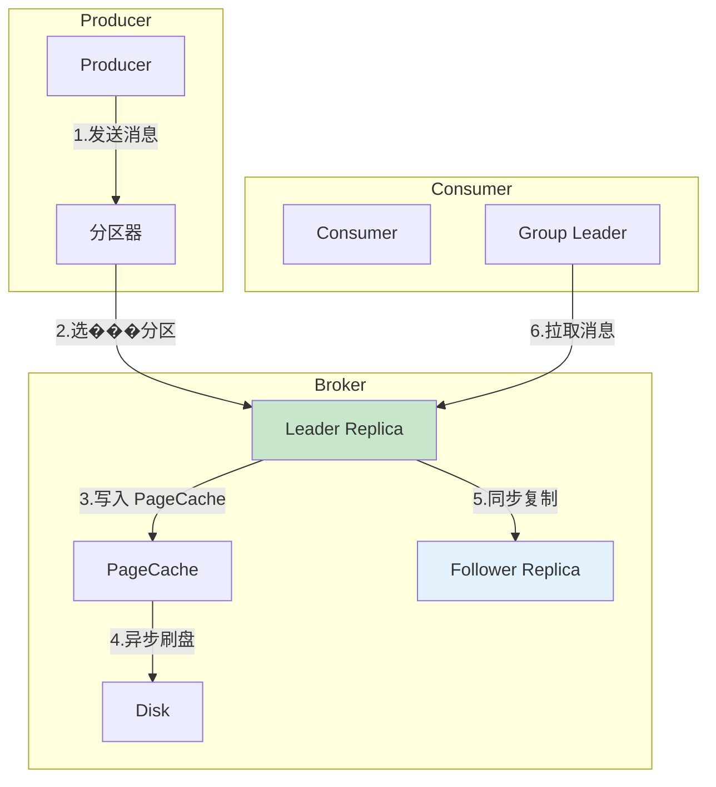
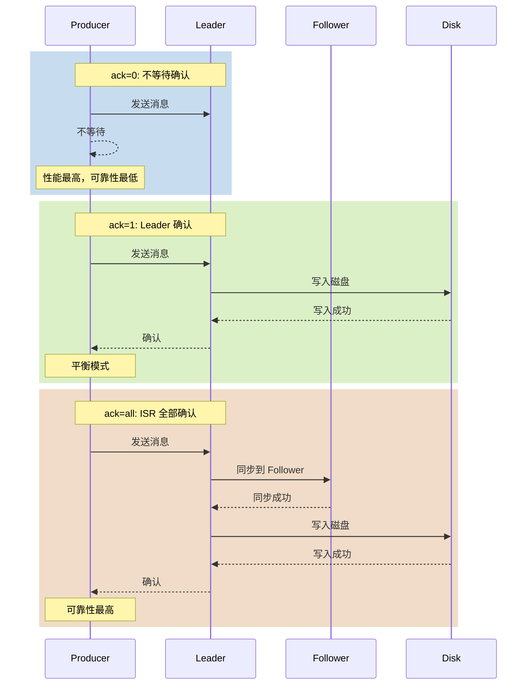
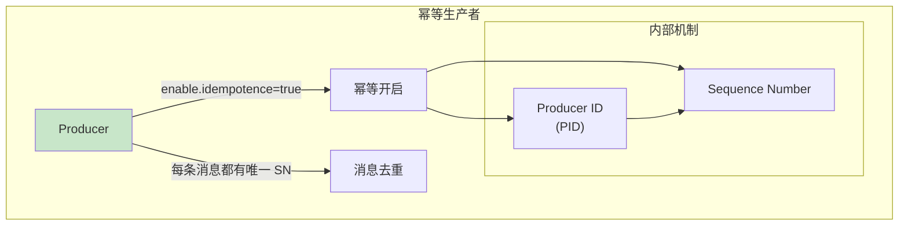
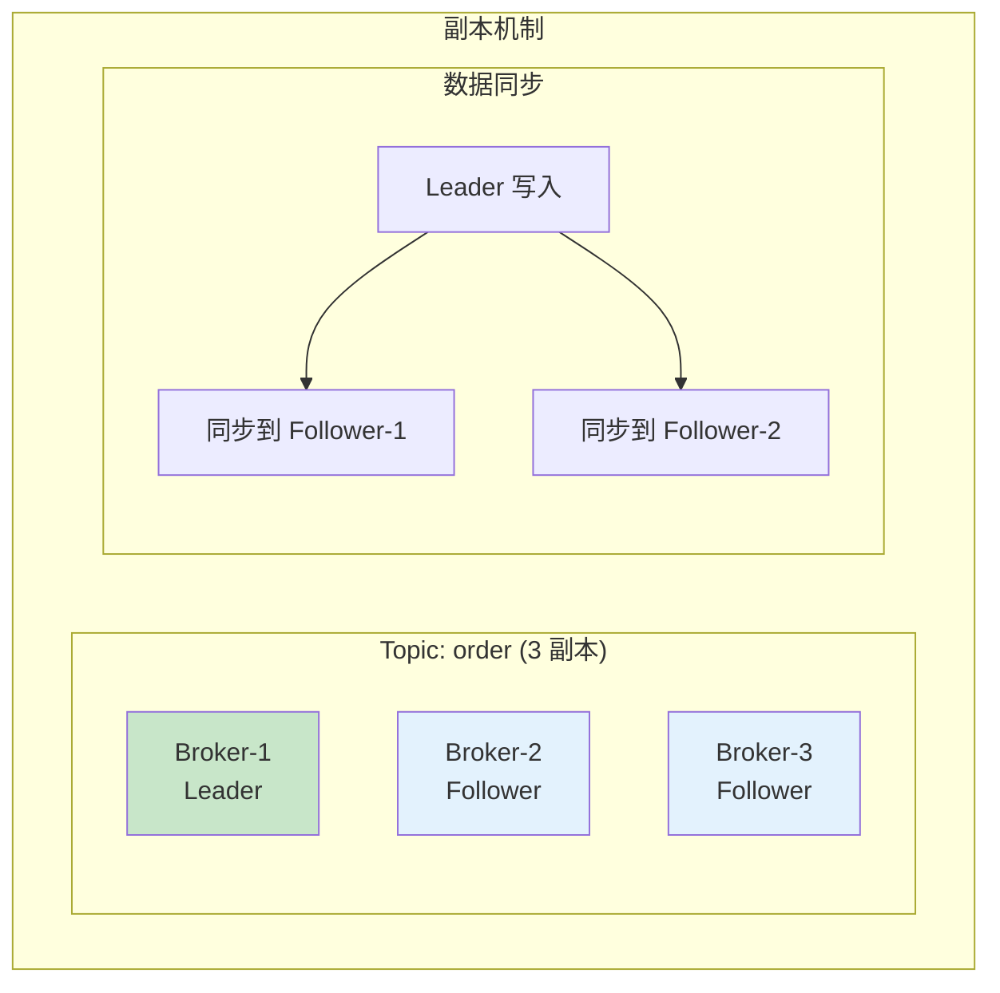
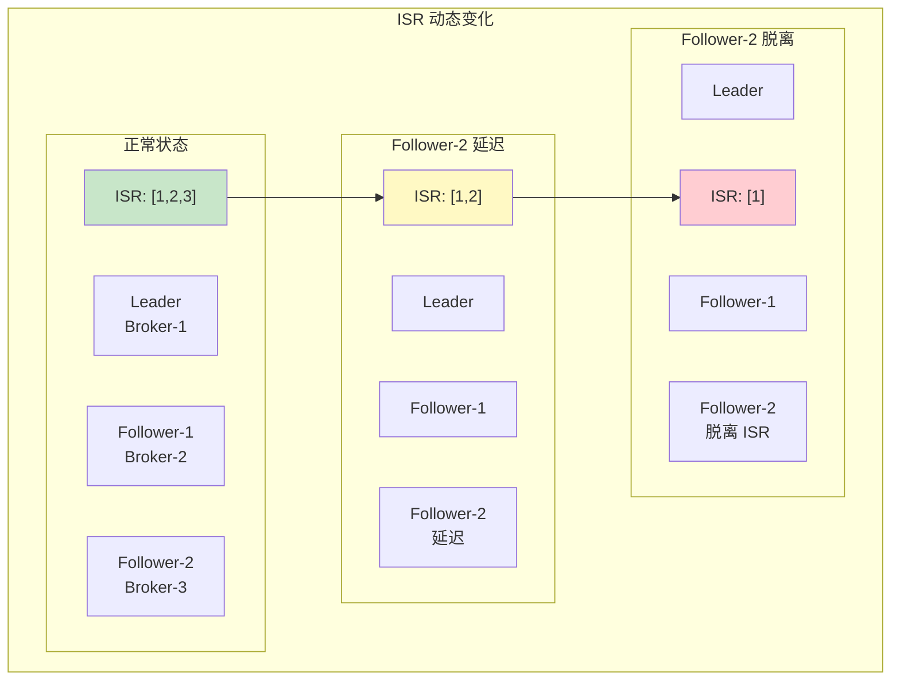
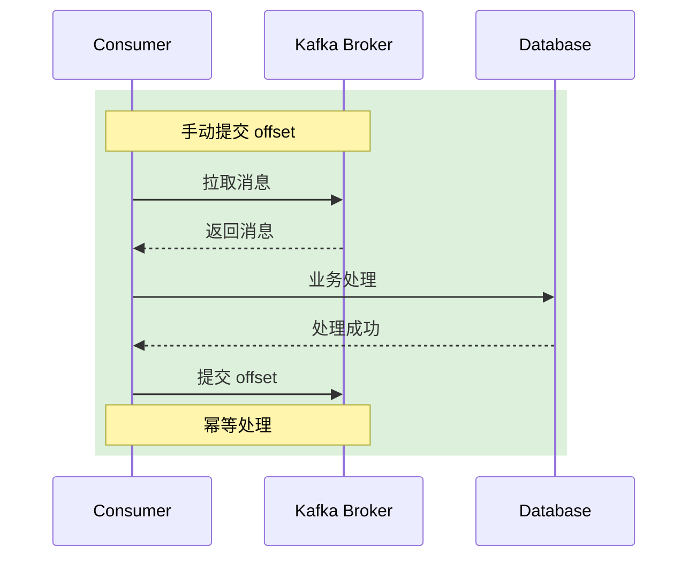
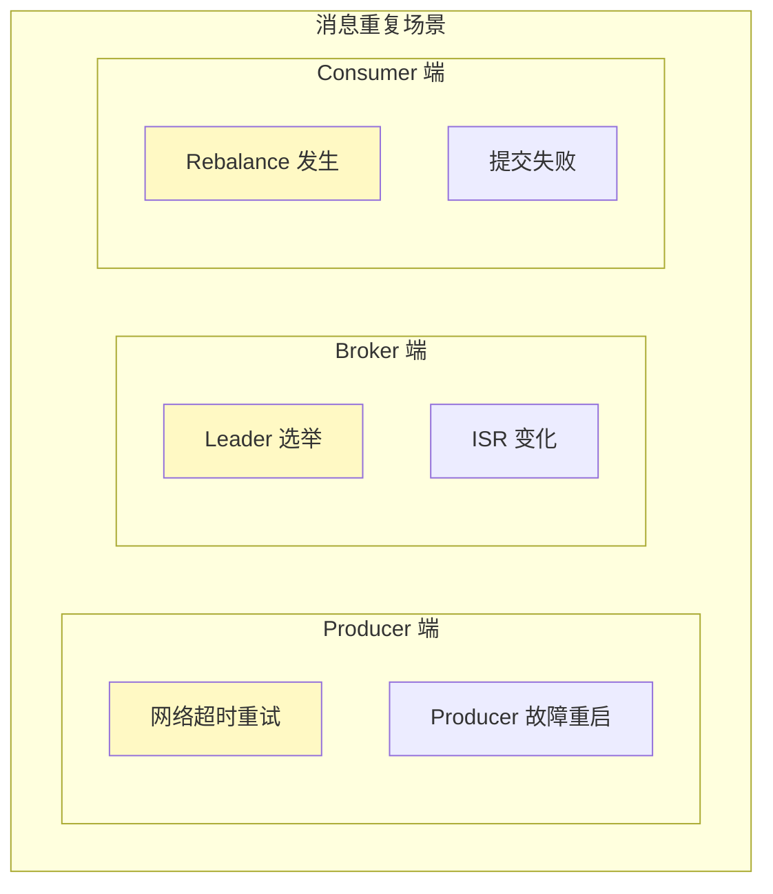

# Kafka 消息可靠性

> **目标级别**：P6
> **面试频率**：🔴 高频
> **面试官最关心的 3 个问题**：
> 1. Kafka 如何保证消息不丢失？
> 2. Kafka 的 ack 配置有哪些？有什么区别？
> 3. 如何处理消息重复消费的问题？

面试官问：「Kafka 消息丢失过吗？」你说「没丢过」——然后面试官紧接着追问「你怎么保证的？ack=0 和 ack=1 有什么区别？什么时候会丢消息？」你沉默了。

Kafka 的消息可靠性是生产环境的重中之重，需要深入理解各个环节的可靠性保障机制。

## 一、消息可靠性链路

### 1.1 消息流转全链路



### 1.2 各环节可靠性

|| 环节 | 可靠性措施 | 风险点 |
|------|------|-----------|--------|
| **Producer 发送** | ack 配置 | 网络故障 |
| **Broker 存储** | 副本机制 | 磁盘损坏 |
| **Consumer 消费** | 手动提交 | 消费失败 |
| **Consumer Group** | Rebalance | Rebalance 丢失 |

## 二、Producer 可靠性

### 2.1 ack 配置策略



### 2.2 ack 配置代码

```java
// Producer 配置 - 可靠性级别
Properties props = new Properties();
props.put("bootstrap.servers", "localhost:9092");
props.put("key.serializer", "org.apache.kafka.common.serialization.StringSerializer");
props.put("value.serializer", "org.apache.kafka.common.serialization.StringSerializer");

/**
 * ack 配置 - 核心参数
 */
// 1. acks=0: 不等待确认（可能丢消息）
props.put("acks", "0");

// 2. acks=1: Leader 确认（可能丢消息）
props.put("acks", "1");

// 3. acks=all (-1): ISR 全部确认（不丢消息）
props.put("acks", "all");

/**
 * 重试配置
 */
props.put("retries", 3);                    // 重试次数
props.put("retry.backoff.ms", 100);          // 重试间隔
props.put("max.in.flight.requests.per.connection", 5);  // 飞行中请求数

/**
 * 幂等配置
 */
props.put("enable.idempotence", true);        // 开启幂等
```

### 2.3 可靠性配置对比

|| acks | 可靠性 | 性能 | 适用场景 |
|------|------|--------|------|---------|
| **0** | 最低 | 最高 | 日志采集、监控 |
| **1** | 中等 | 较高 | 一般业务 |
| **all/-1** | 最高 | 较低 | 核心业务 |

### 2.4 幂等生产者



```java
// 开启幂等后，Producer 自动处理以下问题：
// 1. 同一 Producer 发送的重复消息会被去重
// 2. 分区级别消息顺序得到保证
// 3. 无需额外开发幂等逻辑

// 注意：幂等只保证单 Producer 单分区内的去重
// 跨 Producer 或跨分区需要业务层幂等
```

## 三、Broker 可靠性

### 3.1 副本机制



### 3.2 副本配置

```bash
# broker 级别配置
replication.factor=3              # 副本数
min.insync.replicas=2            # 最小 ISR 数

# Topic 级别配置
# 创建 Topic 时指定
kafka-topics.sh --create \
  --topic order-service \
  --partitions 6 \
  --replication-factor 3 \
  --config min.insync.replicas=2
```

```java
// Topic 配置参数
public class TopicConfig {
    // 副本因子：副本数量
    public static final String REPLICATION_FACTOR = "replication.factor";

    // 最小 ISR：必须确认的副本数
    public static final String MIN_INSYNC_REPLICAS = "min.insync.replicas";

    // unclean.leader.election：是否允许非 ISR 副本成为 Leader
    public static final String UNCLEAN_LEADER_ELECTION = "unclean.leader.election.enable";

    // 建议配置
    public static Topic createTopic() {
        // 副本数 3
        // 最小 ISR 2
        // 禁止非 ISR 选举
    }
}
```

### 3.3 ISR 机制详解



**ISR 动态调整条件**：

| 参数 | 说明 | 调整行为 |
|------|------|---------|
| `replica.lag.max.messages` | 最大延迟消息数 | 超限踢出 ISR |
| `replica.lag.time.max.ms` | 最大延迟时间 | 超限踢出 ISR |
| `replica.speed.max.bytes` | 最大同步速度 | 自动加入 ISR |

## 四、Consumer 可靠性

### 4.1 消费流程



### 4.2 手动提交 offset

```java
// 手动提交 offset - 可靠性配置
public class ReliableConsumer {

    private KafkaConsumer<String, String> consumer;

    public void init() {
        Properties props = new Properties();
        // 手动提交配置
        props.put("enable.auto.commit", false);    // 关闭自动提交

        // 手动提交方式
        // 1. 同步提交
        // 2. 异步提交
        // 3. 异步+同步混合提交
    }

    /**
     * 同步提交 - 最可靠但慢
     */
    public void consumeSync() {
        while (true) {
            ConsumerRecords<String, String> records = consumer.poll(Duration.ofMillis(1000));

            for (ConsumerRecord<String, String> record : records) {
                processMessage(record);
            }

            // 同步提交，确认处理完再提交
            consumer.commitSync();
        }
    }

    /**
     * 异步提交 - 速度快但可能有重复
     */
    public void consumeAsync() {
        while (true) {
            ConsumerRecords<String, String> records = consumer.poll(Duration.ofMillis(1000));

            for (ConsumerRecord<String, String> record : records) {
                processMessage(record);
            }

            // 异步提交，不等待
            consumer.commitAsync((offsets, exception) -> {
                if (exception != null) {
                    // 处理异常，可能需要重试
                    handleCommitError(exception);
                }
            });
        }
    }

    /**
     * 推荐：异步+同步混合提交
     */
    public void consumeMixed() {
        while (true) {
            ConsumerRecords<String, String> records = consumer.poll(Duration.ofMillis(1000));

            for (ConsumerRecord<String, String> record : records) {
                processMessage(record);
            }

            // 异步提交
            consumer.commitAsync((offsets, exception) -> {
                // 忽略一般异常
            });

            // 定期同步提交兜底
            if (shouldSyncCommit()) {
                consumer.commitSync();
            }
        }
    }
}
```

### 4.3 消费可靠性最佳实践

```java
public class ConsumerReliablePattern {

    /**
     * 可靠消费模板
     */
    public void reliableConsume() {
        while (true) {
            ConsumerRecords<String, String> records = consumer.poll(Duration.ofMillis(1000));

            for (ConsumerRecord<String, String> record : records) {
                try {
                    // 1. 幂等处理
                    if (isProcessed(record)) {
                        continue;
                    }

                    // 2. 业务处理
                    doProcess(record);

                    // 3. 标记已处理
                    markProcessed(record);

                } catch (Exception e) {
                    // 4. 异常处理策略
                    handleException(record, e);
                }
            }

            // 5. 提交 offset
            consumer.commitSync();
        }
    }

    private boolean isProcessed(ConsumerRecord<String, String> record) {
        // 检查消息是否已处理（幂等键）
        String key = record.key();
        return redis.exists("processed:" + key);
    }

    private void doProcess(ConsumerRecord<String, String> record) {
        // 业务处理逻辑
        // ��议使用数据库幂等键
    }

    private void handleException(ConsumerRecord<String, String> record, Exception e) {
        // 1. 重试 N 次
        // 2. 死信队列
        // 3. 告警通知
    }
}
```

## 五、消息重复与幂等

### 5.1 重复消息场景



### 5.2 幂等解决方案

| 方案 | 实现方式 | 适用场景 |
|------|---------|---------|
| **数据库唯一键** | INSERT ON DUPLICATE | 有数据库的场景 |
| **Redis 幂等键** | SETNX | 无数据库的场景 |
| **消息 ID 去重** | 去重表 | 需要查询历史 |
| **业务状态机** | 状态流转 | 状态可判断 |

```java
// 幂等键去重 - Redis 方案
public class IdempotentProcessor {

    private JedisPool jedisPool;

    public void processMessage(String messageId, String content) {
        // 1. 检查是否已处理
        String key = "msg:idempotent:" + messageId;
        Boolean isNew = jedisPool.getResource().setnx(key, "1");

        if (!isNew) {
            // 已处理，直接返回
            return;
        }

        // 2. 设置过期时间
        jedisPool.getResource().expire(key, 7 * 24 * 3600);

        // 3. 业务处理
        doProcess(content);
    }
}
```

## 六、面试高频题

### 🔴 题目 1：Kafka 如何保证消息不丢失？

**参考回答**：

消息不丢失需要三个环节都做好：

1. **Producer 端**：
   - 设置 `acks=all`（所有 ISR 确认）
   - 设置 `retries >= 3`
   - 开启幂等 `enable.idempotence=true`

2. **Broker 端**：
   - 副本数 `replication.factor >= 3`
   - 最小 ISR `min.insync.replicas >= 2`
   - 禁用非 ISR 选举 `unclean.leader.election=false`

3. **Consumer 端**：
   - 手动提交 offset
   - 业务处理完成后提交
   - 幂等处理

> **追问 1**：acks=1 会丢消息吗？
>
> - 可能丢消息的场景：
>   - Leader 写入后宕机
>   - Follower 还没同步完成
> - 解决方案：使用 acks=all

> **追问 2**：如何处理消息重复？
>
> - 业务层幂等处理
> - 唯一键去重
> - 状态机判断

### 🔴 题目 2：Kafka 的 ack 配置有哪些？有什么区别？

**参考回答**：

| acks | 含义 | 可靠性 | 性能 |
|------|------|--------|------|
| **0** | 不等待确认 | 最低 | 最高 |
| **1** | Leader 确认 | 中等 | 较高 |
| **all (-1)** | ISR 全部确认 | 最高 | 较低 |

> **追问**：什么场景用 acks=0？
>
> - 监控指标、日志采集
> - 允许少量消息丢失
> - 对性能要求极高

### 🟡 题目 3：Rebalance 期间会丢消息吗？

**参考回答**：

Rebalance 可能导致消息重复，不一定丢失：

1. **发生时机**：
   - Consumer 加入/离开 Group
   - 分区数变化
   - 订阅的 Topic 变化

2. **消息丢失风险**：
   - Rebalance 前已拉取但未提交 offset 的消息
   - Rebalance 后新 Consumer 可能从头消费

3. **处理方案**：
   - 使用 `max.poll.interval.ms` 控制处理时间
   - 业务层幂等处理

## 七、常见错误与陷阱

### ⚠️ 陷阱 1：只配置 acks=all 不够

```
❌ 错误理解：
acks=all 配置了就不会丢消息

✅ 正确理解：
还需要配合：
- retries >= 3
- min.insync.replicas >= 2
- unclean.leader.election=false
```

### ⚠️ 陷阱 2：min.insync.replicas=1

```
❌ 错误配置：
min.insync.replicas=1

✅ 正确配置：
min.insync.replicas >= 2
（否则 acks=all 失效）
```

### ⚠️ 陷阱 3：Consumer 自动提交 offset

```
❌ 错误配置：
enable.auto.commit=true

✅ 正确配置：
enable.auto.commit=false
手动提交，在业务处理后提交
```

### ⚠️ 陷阱 4：忽视 Rebalance 影响

```
❌ 错误理解：
Rebalance 只是重新分配分区

✅ 正确理解：
可能导致：
- 消息重复消费
- 处理进度回退
- 消费延迟
```

## 八、总结对比表

| 环节 | 关键配置 | 可靠性 |
|------|---------|--------|
| **Producer** | acks=all, retries=3, idempotence=true | ⭐���⭐ |
| **Broker** | replication.factor=3, min.insync.replicas=2 | ⭐⭐⭐ |
| **Consumer** | manual commit, idempotent processing | ⭐⭐⭐ |
| **整体** | 端到端可靠性保障 | ⭐⭐⭐ |

## 九、加分回答

> **💡 面试加分点**：
>
> 1. **Exactly-Once 语义**：Kafka Transactions 实现端到端 exactly-once
>
> 2. **Kafka 可靠性调优**：batch.size、linger.ms、compression.type 综合调优
>
> 3. **生产故障排查**：消费滞后、Rebalance 频繁的排查思路
>
> 4. **多副本 Leader 选举**：Controller 机制和 Leader 选举流程
