# Kafka 架构与分区

> **目标级别**：P6
> **面试频率**：🔴 高频
> **面试官最关心的 3 个问题**：
> 1. Kafka 的整体架构是怎样的？
> 2. Kafka 的分区策略有哪些？
> 3. Kafka 是怎么实现高吞吐量的？

面试官问：「Kafka 为什么能支持这么高的吞吐量？」你说「因为快」——然后面试兵紧接着追问「具体是怎么实现的？零拷贝是什么原理？顺序写磁盘为什么快？」你沉默了。

Kafka 是大数据领域最常用的消息队列，其高吞吐量、高可靠性的设计值得深入理解。

## 一、Kafka 核心概念

### 1.1 消息模型

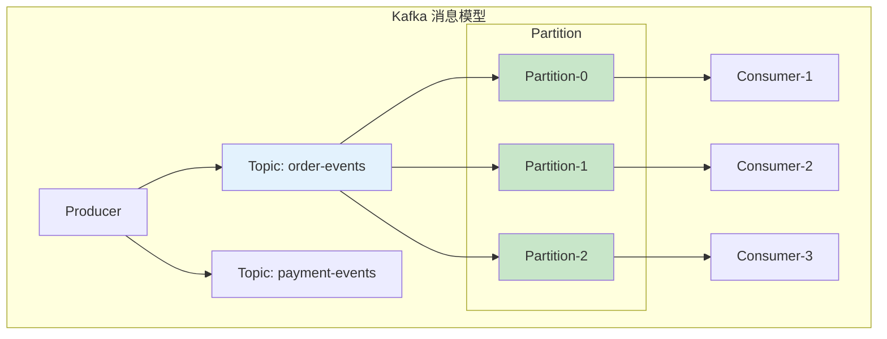

### 1.2 核心概念表

|| 概念 | 说明 |
|------|------|------|
| **Topic** | 消息主题，逻辑分类 | 如 order-events |
| **Partition** | 分区，物理存储单元 | 每个 Partition 有序 |
| **Replica** | 分区副本，保证可靠性 | Leader + Follower |
| **Offset** | 消息偏移量 | Consumer 消费进度 |
| **Consumer Group** | 消费者组 | 负载均衡消费 |
| **Producer** | 消息生产者 | 发送消息到 Topic |
| **Broker** | Kafka 服务节点 | 存储分区数据 |

### 1.3 Topic 与 Partition

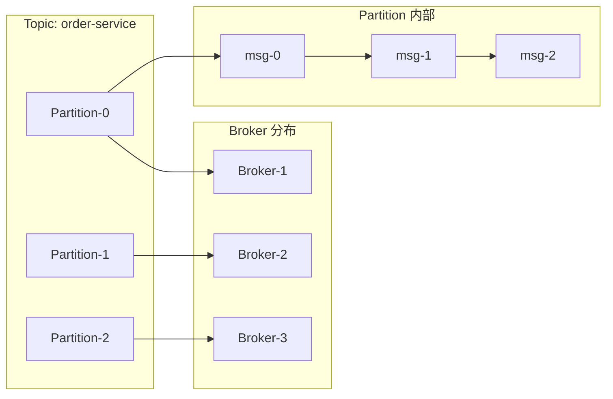

## 二、Kafka 架构

### 2.1 整体架构

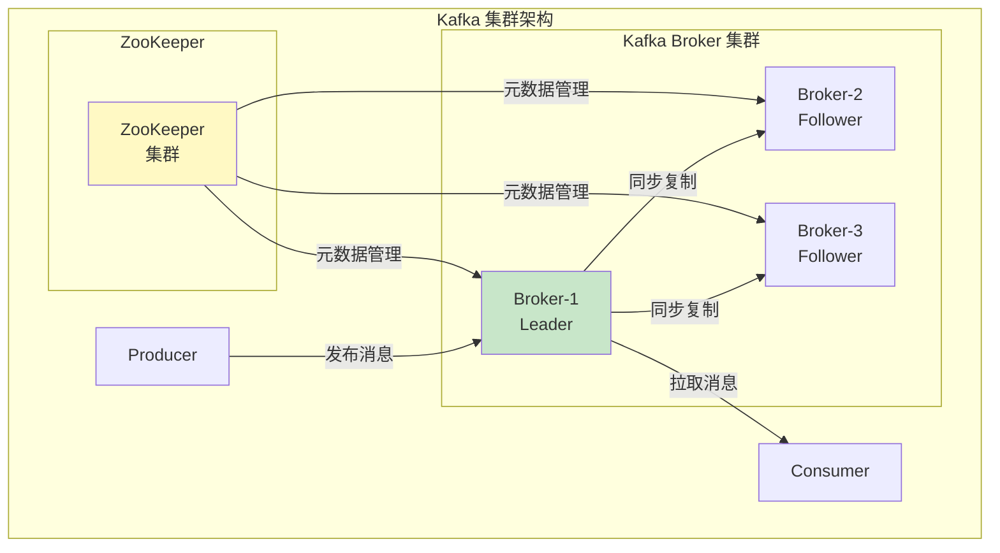

### 2.2 分区副本机制

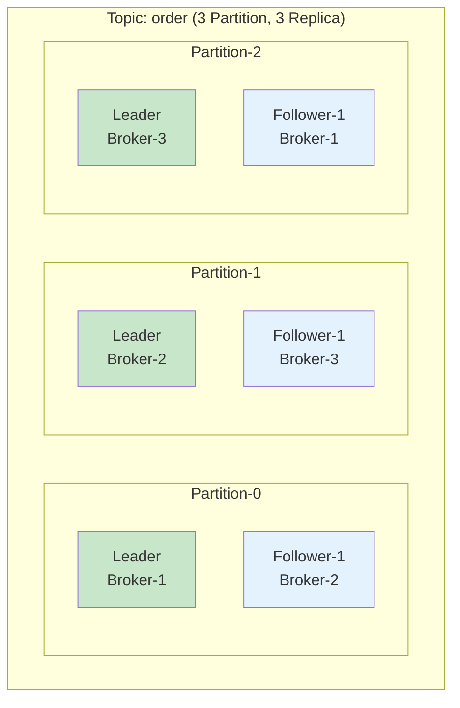

### 2.3 ISR 机制

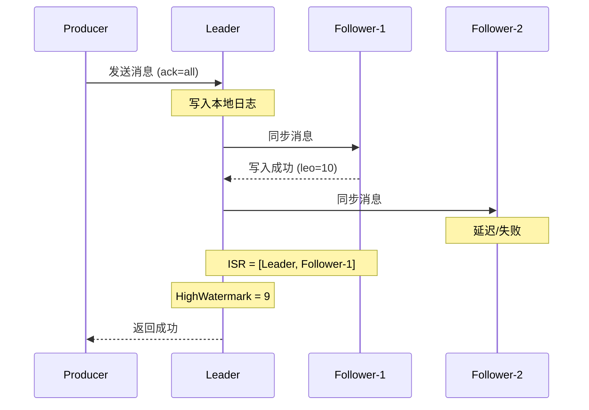

**ISR（In-Sync Replicas）**：
- 与 Leader 保持同步的副本集合
- `replica.lag.max.messages`：最大延迟消息数
- `replica.lag.time.max.ms`：最大延迟时间
- ISR 动态变化，自动调整

## 三、Kafka 高性能原理

### 3.1 顺序写磁盘

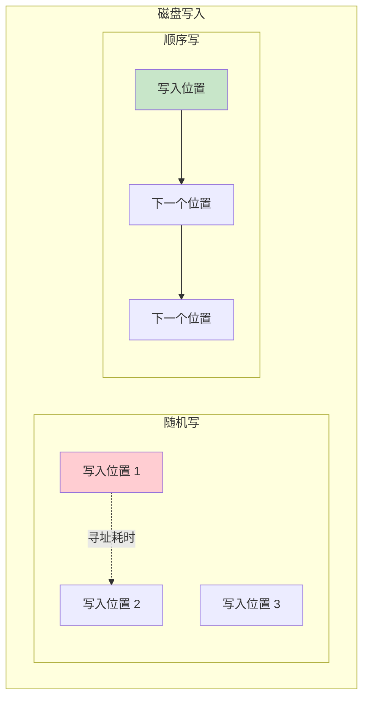

| 写入方式 | 磁盘速度 | 磁盘速度 |
|---------|---------|---------|
| **随机写** | ~0.1 ms/次 | 磁盘寻道 |
| **顺序写** | ~0.05 ms/次 | 无寻道 |

### 3.2 零拷贝技术

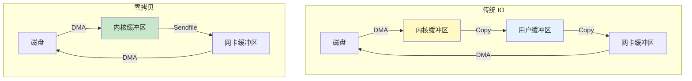

**零拷贝（Zero Copy）**：
- 使用 Linux `sendfile` 系统调用
- 数据从磁盘直接发送到网卡
- 绕过用户态，减少 2 次 CPU 拷贝
- 减少上下文切换

### 3.3 PageCache + 顺序写

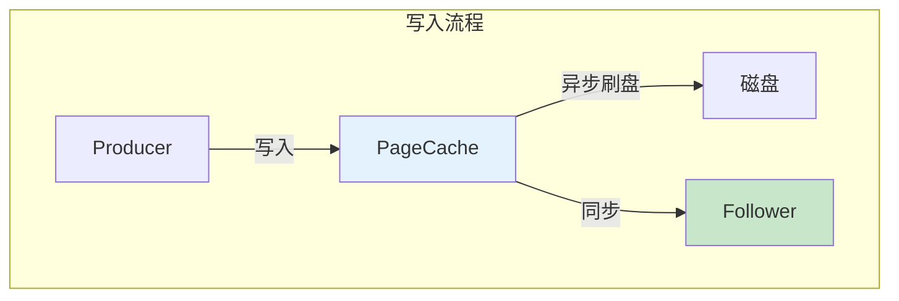

**PageCache 机制**：
- 写入先到 PageCache，不立即落盘
- 顺序追加写入，利用磁盘顺序特性
- Consumer 从 PageCache 读取，热数据命中率高
- 异步刷盘，后台批量合并写入

## 四、分区策略

### 4.1 分区策略类型

|| 策略 | 说明 | 使用场景 |
|------|------|------|----------|
| **轮询** | 依次写入各分区 | 均匀分布 |
| **随机** | 随机选择分区 | 负载均衡 |
| **哈希** | 消息 Key 哈希 | 相同 Key 有序 |
| **自定义** | 实现 Partitioner | 特殊需求 |

### 4.2 分区代码实现

```java
// Producer 配置
Properties props = new Properties();
props.put("bootstrap.servers", "localhost:9092");
props.put("key.serializer", "org.apache.kafka.common.serialization.StringSerializer");
props.put("value.serializer", "org.apache.kafka.common.serialization.StringSerializer");

/**
 * 分区策略配置
 */
// 1. 指定分区
props.put("partitioner.class", "org.apache.kafka.clients.producer.internals.DefaultPartitioner");

// 2. 自定义分区器
props.put("partitioner.class", "com.example.CustomPartitioner");
```

```java
// 自定义分区器
public class CustomPartitioner implements Partitioner {

    @Override
    public int partition(String topic, Object key, byte[] keyBytes,
                        Object value, byte[] valueBytes, Cluster cluster) {
        // 1. 按 Key 哈希分区（相同 Key 去同一分区）
        if (key != null) {
            return Math.abs(key.hashCode()) % cluster.partitionCountForTopic(topic);
        }

        // 2. 按业务字段分区
        if (value instanceof Order) {
            Order order = (Order) value;
            String region = order.getRegion();
            return getRegionPartition(region, cluster, topic);
        }

        // 3. 默认轮询
        return new Random().nextInt(cluster.partitionCountForTopic(topic));
    }

    private int getRegionPartition(String region, Cluster cluster, String topic) {
        List<PartitionInfo> partitions = cluster.partitionsForTopic(topic);
        // 北方区域去 Partition-0
        if ("NORTH".equals(region)) {
            return 0;
        }
        // 南方区域去 Partition-1
        if ("SOUTH".equals(region)) {
            return 1;
        }
        return 2;
    }
}
```

### 4.3 消费者分区分配

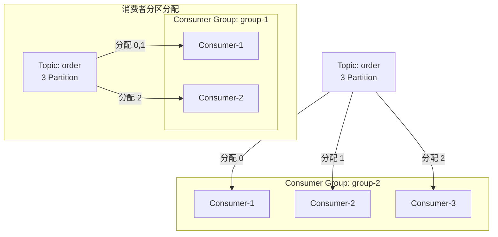

**分区分配策略**：

| 策略 | 说明 | 适用场景 |
|------|------|----------|
| **Range** | 按 Topic 范围分配 | 简单场景 |
| **RoundRobin** | 跨 Topic 轮询 | 多 Topic |
| **StickyAssignor** | 保持分配的稳定性 | 避免 Rebalance |

## 五、Leader 选举

### 5.1 控制器选举

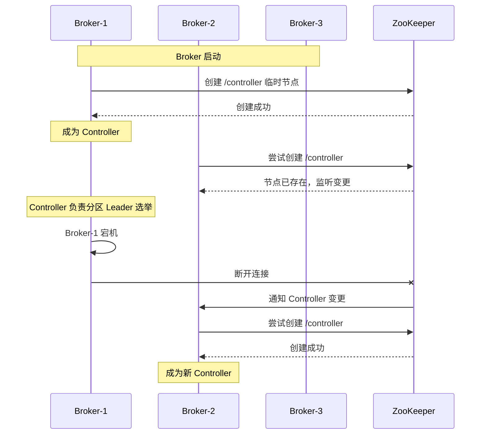

### 5.2 分区 Leader 选举

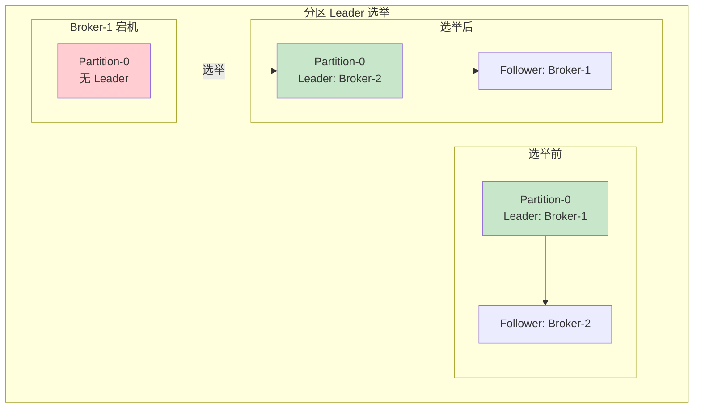

## 六、面试高频题

### 🔴 题目 1：Kafka 的整体架构是怎样的？

**参考回答**：

Kafka 架构包含以下核心组件：

1. **Broker**：Kafka 服务节点，负责存储消息
2. **Topic**：消息主题，用于消息分类
3. **Partition**：分区，Topic 的物理存储单元
4. **Replica**：分区副本，保证数据可靠性
5. **Producer**：消息生产者
6. **Consumer**：消息消费者
7. **Consumer Group**：消费者组，实现负载均衡
8. **ZooKeeper**：元数据管理，Controller 选举

> **追问 1**：分区数和副本数如何设置？
>
> - 分区数：建议 3-10 个，与消费者数量匹配
> - 副本数：一般 3 个，保证可靠性
> - 分区数影响并发度，但会增加元数据开销

> **追问 2**：ISR 是什么？
>
> - In-Sync Replicas，与 Leader 保持同步的副本集合
> - 通过 `replica.lag.max.messages` 和 `replica.lag.time.max.ms` 控制

### 🔴 题目 2：Kafka 为什么能实现高吞吐量？

**参考回答**：

Kafka 高性能的关键技术：

1. **顺序写磁盘**：追加写，避免磁盘随机寻址
2. **零拷贝**：使用 `sendfile`，减少 CPU 拷贝
3. **PageCache**：利用内存缓存，热数据不落盘
4. **批量处理**：消息批量发送和压缩
5. **稀疏索引**：稀疏索引快速定位消息
6. **多 Reactor**：网络多线程处理

> **追问 1**：什么是零拷贝？
>
> - Linux `sendfile` 系统调用
> - 数据从磁盘到网卡绕过用户态
> - 减少 2 次 CPU 拷贝和上下文切换

> **追问 2**：PageCache 是什么？
>
> - 操作系统内存缓存
> - 写入先到 PageCache，异步刷盘
> - 读取优先从 PageCache，命中率高

### 🟡 题目 3：Kafka 的分区策略有哪些？

**参考回答**：

1. **轮询策略**：依次写入各分区，负载均衡
2. **随机策略**：随机选择分区
3. **哈希策略**：按消息 Key 哈希，保证相同 Key 有序
4. **自定义策略**：实现 `Partitioner` 接口

## 七、常见错误与陷阱

### ⚠️ 陷阱 1：分区数设置不合理

```
❌ 错误配置：
分区数设为 100

✅ 正确配置：
分区数与消费者数量匹配
过多分区增加元数据开销
```

### ⚠️ 陷阱 2：忽视 ISR 配置

```
❌ 错误理解：
ISR 只包含 Leader 也能保证一致性

✅ 正确理解：
ISR 必须包含 Leader 和至少一个 Follower
否则数据可能丢失
```

### ⚠️ 陷阱 3：分区数大于 Broker 数

```
❌ 错误配置：
3 个 Broker，分区数 10

✅ 正确配置：
分区数应小于等于 Broker 数的整数倍
确保分区均匀分布
```

### ⚠️ 陷阱 4：消息顺序依赖分区数

```
❌ 错误理解：
同一个 Key 的消息一定有序

✅ 正确理解：
只有发送到同一分区才有序
分区数变化会打乱顺序
```

## 八、总结对比表

|| 维度 | Kafka | RabbitMQ | RocketMQ |
|------|------|-------|----------|---------|
| **吞吐量** | 百万级/秒 | 万级/秒 | 十万级/秒 |
| **消息持久化** | 文件系统 | 内存+文件 | 文件系统 |
| **延迟** | 毫秒级 | 微秒级 | 毫秒级 |
| **分区数** | 支持 | 不支持 | 支持 |
| **消费模式** | Pull | Push/Pull | Pull |
| **顺序消息** | 单分区有序 | 不保证 | 支持 |
| **事务消息** | 支持 | 不支持 | 支持 |
| **延迟消息** | 需插件 | 支持 | 支持 |

## 九、加分回答

> **💡 面试加分点**：
>
> 1. **Kafka 3.0 KRaft**：去掉 ZooKeeper，元数据管理内置
>
> 2. **Kafka 日志结构**：稀疏索引 + 顺序写的极致优化
>
> 3. **消费者 Rebalance**：分区分配策略的演进
>
> 4. **生产调优**：batch.size、linger.ms、compression.type
