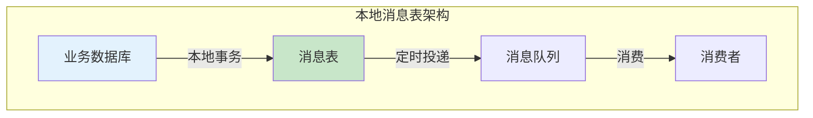
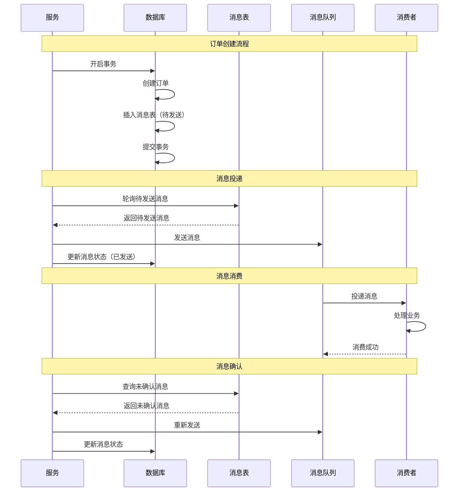
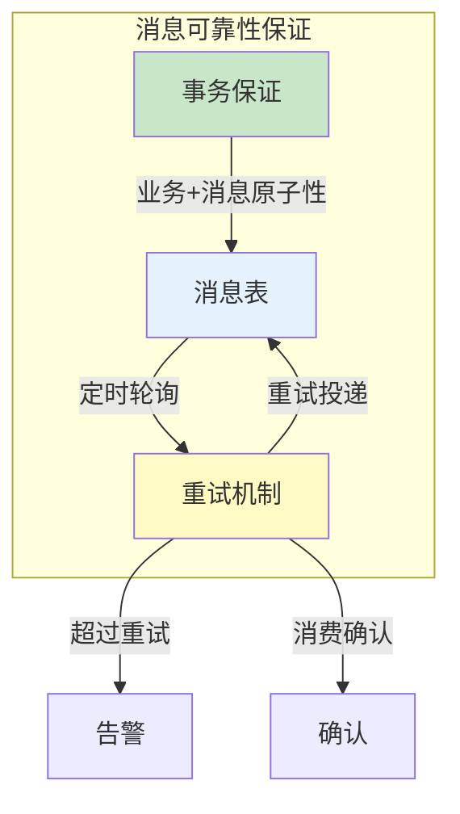

# 本地消息表

> **目标级别**：P6
> **面试频率**：🟡 中频
> **面试官最关心的 3 个问题**：
> 1. 本地消息表是什么原理？
> 2. 本地消息表如何保证可靠性？
> 3. 本地消息表有什么优缺点？

面试官问：「本地消息表了解吗？」你说「知道，是一种分布式事务方案」——然后面试官紧接着追问「那消息表怎么保证消息不丢失？定时轮询有什么问题？」你沉默了。

本地消息表是实现最终一致性的经典方案，适合异步化程度高的场景。

## 一、本地消息表的基本原理

### 1.1 什么是本地消息表

本地消息表是一种实现最终一致性的方案，将消息存储在业务数据库中：

- **本地事务**：业务操作和消息存储在同一数据库
- **消息投递**：后台任务轮询消息表，投递到 MQ
- **可靠性保证**：通过本地事务保证消息不丢失



### 1.2 核心思想

```
┌─────────────────────────────────────────────────────────┐
│                  本地消息表核心思想                        │
├─────────────────────────────────────────────────────────┤
│                                                         │
│  1. 业务操作和消息存储在同一事务中                         │
│     → 要么同时成功，要么同时失败                           │
│                                                         │
│  2. 后台任务轮询消息表                                   │
│     → 投递消息到 MQ                                      │
│                                                         │
│  3. 消费端消费消息                                       │
│     → 执行下游业务                                       │
│                                                         │
│  4. 消息确认机制                                         │
│     → 消费成功后更新消息状态                              │
│                                                         │
└─────────────────────────────────────────────────────────┘
```

## 二、本地消息表实现流程

### 2.1 完整流程图



### 2.2 消息表结构

```sql
CREATE TABLE local_message (
    id              BIGINT PRIMARY KEY AUTO_INCREMENT,
    message_id      VARCHAR(64) NOT NULL UNIQUE,  -- 消息唯一 ID
    topic           VARCHAR(128) NOT NULL,          -- 消息主题
    tag             VARCHAR(64),                     -- 消息标签
    body            TEXT NOT NULL,                   -- 消息内容
    status          TINYINT NOT NULL DEFAULT 0,      -- 消息状态
    retry_count     INT DEFAULT 0,                   -- 重试次数
    max_retry       INT DEFAULT 3,                   -- 最大重试
    create_time     DATETIME DEFAULT CURRENT_TIMESTAMP,
    update_time     DATETIME DEFAULT CURRENT_TIMESTAMP ON UPDATE CURRENT_TIMESTAMP,
    next_retry_time DATETIME,                        -- 下次重试时间
    INDEX idx_status_time (status, next_retry_time)
);

-- 消息状态
-- 0: 待发送
-- 1: 已发送
-- 2: 消费成功
-- 3: 消费失败
-- 4: 已放弃
```

### 2.3 业务代码实现

```java
@Service
public class OrderService {

    @Autowired
    private OrderRepository orderRepository;

    @Autowired
    private MessageRepository messageRepository;

    @Autowired
    private MqProducer mqProducer;

    @Transactional
    public Order createOrder(OrderRequest request) {
        // 1. 创建订单
        Order order = new Order();
        order.setId(generateOrderId());
        order.setStatus(OrderStatus.CREATED);
        orderRepository.save(order);

        // 2. 扣减库存（同步）
        inventoryService.deductStock(request.getProductId(), request.getQuantity());

        // 3. 插入消息表（与订单创建在同一事务）
        LocalMessage message = new LocalMessage();
        message.setMessageId(UUID.randomUUID().toString());
        message.setTopic("order-created");
        message.setBody(JSON.toJSONString(order));
        message.setStatus(MessageStatus.PENDING);
        message.setNextRetryTime(LocalDateTime.now());
        messageRepository.save(message);

        // 4. 提交事务（订单创建 + 消息插入原子性）
        return order;
    }
}
```

### 2.4 消息投递实现

```java
@Component
public class MessageScheduler {

    @Autowired
    private MessageRepository messageRepository;

    @Autowired
    private MqProducer mqProducer;

    // 定时任务轮询消息表
    @Scheduled(fixedDelay = 1000)
    public void pollAndSend() {
        // 1. 查询待发送消息
        List<LocalMessage> messages = messageRepository.findPendingMessages(
            LocalDateTime.now(),
            100  // 每次最多处理 100 条
        );

        for (LocalMessage message : messages) {
            try {
                // 2. 发送消息到 MQ
                boolean success = mqProducer.send(
                    message.getTopic(),
                    message.getTag(),
                    message.getBody()
                );

                if (success) {
                    // 3. 更新消息状态
                    message.setStatus(MessageStatus.SENT);
                } else {
                    // 4. 处理发送失败
                    handleSendFailure(message);
                }
            } catch (Exception e) {
                handleSendFailure(message);
            }
        }
    }

    private void handleSendFailure(LocalMessage message) {
        message.setRetryCount(message.getRetryCount() + 1);

        if (message.getRetryCount() >= message.getMaxRetry()) {
            // 超过最大重试次数
            message.setStatus(MessageStatus.ABANDONED);
        } else {
            // 设置下次重试时间（指数退避）
            long delay = (long) Math.pow(2, message.getRetryCount()) * 1000;
            message.setNextRetryTime(LocalDateTime.now().plusSeconds(delay));
        }

        messageRepository.save(message);
    }
}
```

### 2.5 消息消费实现

```java
@Service
public class OrderConsumer {

    @Autowired
    private InventoryService inventoryService;

    @Autowired
    private MessageRepository messageRepository;

    @Autowired
    private MqProducer mqProducer;

    @MqListener(topic = "order-created")
    public void handleOrderCreated(OrderMessage message) {
        try {
            // 1. 执行业务逻辑
            inventoryService.confirmDeduct(
                message.getProductId(),
                message.getQuantity()
            );

            // 2. 发送消费确认消息
            mqProducer.send("order-confirmed", message.getOrderId());

        } catch (Exception e) {
            // 3. 消费失败，抛出异常触发重试
            throw new RuntimeException("消费失败", e);
        }
    }

    // 定时处理未确认的消息
    @Scheduled(fixedDelay = 5000)
    public void handleUnconfirmedMessages() {
        List<LocalMessage> messages = messageRepository.findUnconfirmedMessages(
            LocalDateTime.now().minusMinutes(5),
            50
        );

        for (LocalMessage message : messages) {
            // 查询消费者状态
            Boolean confirmed = checkConsumerConfirmation(message.getMessageId());

            if (confirmed) {
                message.setStatus(MessageStatus.CONFIRMED);
                messageRepository.save(message);
            } else if (message.getRetryCount() < message.getMaxRetry()) {
                // 重新投递
                message.setRetryCount(message.getRetryCount() + 1);
                message.setNextRetryTime(LocalDateTime.now().plusMinutes(1));
                messageRepository.save(message);
            }
        }
    }
}
```

## 三、本地消息表的可靠性保证

### 3.1 消息不丢失



**保证机制**：

1. **本地事务**：业务操作和消息插入在同一事务
2. **消息状态**：待发送 → 已发送 → 消费确认
3. **定时轮询**：补偿未发送的消息
4. **消费确认**：确保消息被正确消费

### 3.2 消息不重复

```java
// 消费端幂等处理
public class IdempotentConsumer {

    private Set<String> processedMessages = ConcurrentHashMap.newKeySet();

    public void processMessage(String messageId, Runnable handler) {
        // 幂等检查
        if (processedMessages.contains(messageId)) {
            return;
        }

        try {
            handler.run();
            processedMessages.add(messageId);
        } catch (Exception e) {
            throw e;
        }
    }
}

// 数据库幂等检查
public boolean processMessage(String messageId, String content) {
    // 查询是否已处理
    int count = messageLogRepository.countByMessageId(messageId);
    if (count > 0) {
        return true;  // 已处理，跳过
    }

    // 业务处理
    doBusiness(content);

    // 记录处理日志
    messageLogRepository.save(new MessageLog(messageId));

    return false;
}
```

## 四、本地消息表的优缺点

### 4.1 优点

| 优点 | 说明 |
|------|------|
| **可靠投递** | 本地事务保证消息不丢失 |
| **简单实现** | 不需要额外的 MQ 事务消息 |
| **解耦** | 业务和消息投递解耦 |
| **最终一致** | 通过重试达到最终一致 |
| **低侵入** | 对业务代码侵入小 |

### 4.2 缺点

| 缺点 | 说明 |
|------|------|
| **轮询延迟** | 消息投递依赖定时任务 |
| **消息表** | 需要额外的数据库表 |
| **查询开销** | 定时轮询有数据库查询开销 |
| **弱实时性** | 不适合强实时场景 |

## 五、面试高频题

### 🔴 题目 1：本地消息表的原理是什么？

**参考回答**：

本地消息表的核心原理：

1. **本地事务**：业务操作和消息存储在同一数据库事务中
2. **消息投递**：后台任务轮询消息表，投递到 MQ
3. **消息确认**：消费端消费后确认，消息表更新状态
4. **重试机制**：未发送/未确认的消息定时重试

**关键点**：通过本地事务保证「业务成功 → 消息一定被记录」

### 🔴 题目 2：如何保证消息不丢失？

**参考回答**：

保证消息不丢失的机制：

1. **本地事务原子性**：业务操作和消息插入在同一事务
2. **消息状态管理**：待发送 → 已发送 → 消费确认
3. **定时轮询**：补偿超时未发送的消息
4. **消费确认**：确保消息被正确消费
5. **重试机制**：失败消息自动重试

### 🟡 题目 3：本地消息表有什么优缺点？

**参考回答**：

**优点**：
- 实现简单，不依赖 MQ 事务
- 可靠投递，本地事务保证
- 对业务侵入小

**缺点**：
- 有轮询延迟，不适合强实时场景
- 需要额外的消息表
- 数据库查询开销

## 六、常见错误与陷阱

### ⚠️ 陷阱 1：事务范围太大

```
❌ 错误理解：
把所有操作都放在一个事务里

✅ 正确理解：
事务应该只包含必要的操作
远程调用不应放在事务内
```

### ⚠️ 陷阱 2：忽略消息重复

```
❌ 错误理解：
消息只会被消费一次

✅ 正确理解：
网络问题可能导致重复投递
必须保证幂等
```

### ⚠️ 陷阱 3：轮询间隔不合理

```
❌ 错误理解：
轮询间隔越小越好

✅ 正确理解：
轮询间隔要考虑：
- 数据库负载
- 消息实时性
- 系统容量
```

## 七、总结对比表

| 维度 | 本地消息表 | MQ 事务消息 | TCC |
|------|-----------|-------------|-----|
| **实现复杂度** | 低 | 中 | 高 |
| **事务保证** | 最终一致 | 最终一致 | 强一致 |
| **实时性** | 低（轮询） | 高 | 高 |
| **业务侵入** | 低 | 中 | 高 |
| **消息可靠性** | 高 | 高 | N/A |

## 八、加分回答

> **💡 面试加分点**：
>
> 1. **消息幂等的多种实现**：数据库唯一键、去重表、Redis 缓存
>
> 2. **轮询优化**：批量查询、索引优化、分片处理
>
> 3. **延迟投递**：使用 DelayQueue 实现延迟消息
>
> 4. **RocketMQ 事务消息**：本地消息表可以看作是简化版的 RocketMQ 事务消息
