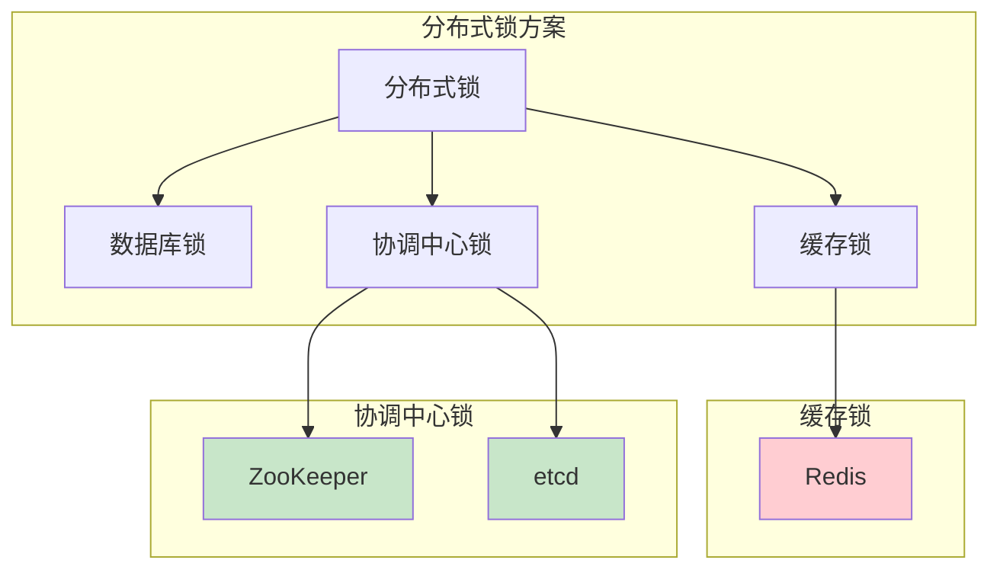
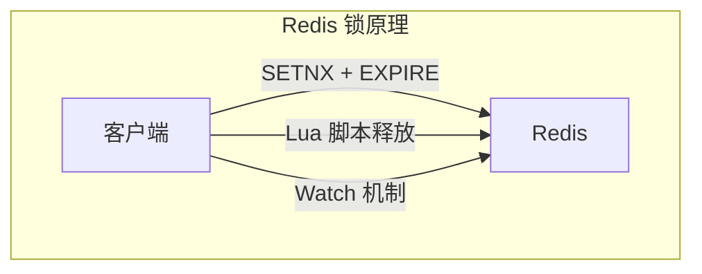
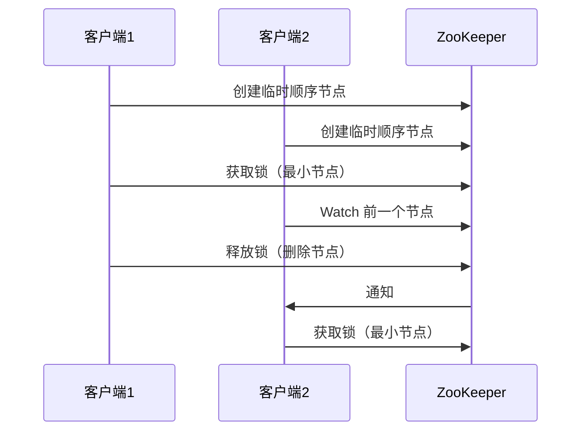
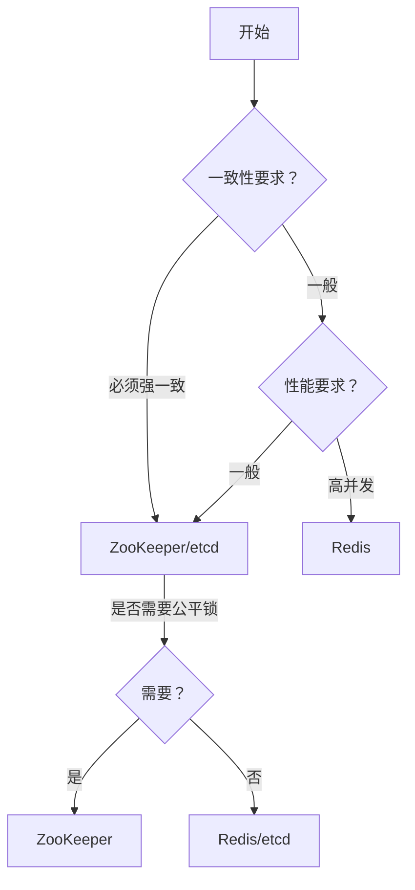
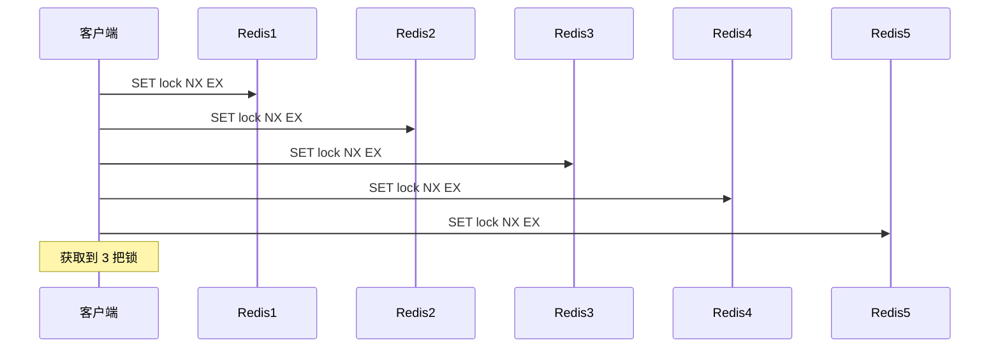

# 分布式锁方案对比

> **目标级别**：P6
> **面试频率**：🔴 高频
> **面试官最关心的 3 个问题**：
> 1. 分布式锁有哪些方案？
> 2. Redis 和 ZooKeeper 锁怎么选？
> 3. RedLock 有什么问题？

面试官问：「分布式锁方案那么多，你项目里用的是什么？」你说「Redis」——然后面试官紧接着追问「为什么选 Redis？有没有考虑过 ZooKeeper？Redis 锁有什么坑？」你沉默了。

分布式锁方案选型是面试高频考点，需要理解每种方案的特点和适用场景。

## 一、分布式锁方案总览

### 1.1 方案分类



### 1.2 方案对比表

| 方案 | 可靠性 | 性能 | 复杂度 | 特点 |
|------|--------|------|--------|------|
| **数据库** | 低 | 低 | 低 | 简单，但性能差 |
| **Redis** | 一般 | 高 | 中 | 性能好，需防坑 |
| **ZooKeeper** | 高 | 中 | 中 | 可靠性高 |
| **etcd** | 高 | 中 | 中 | Raft 保证 |

## 二、Redis 分布式锁

### 2.1 原理



### 2.2 优缺点

| 优点 | 缺点 |
|------|------|
| 性能高 | 可靠性一般 |
| 实现简单 | 主从切换可能丢锁 |
| 支持集群 | 需要防坑（续期、误删） |
| 生态成熟 | 不保证公平性 |

### 2.3 可靠性问题

| 问题 | 解决方案 |
|------|----------|
| 锁过期业务未完成 | 看门狗续期 |
| 主从切换丢锁 | RedLock |
| 误删他人锁 | 唯一 value + Lua |

## 三、ZooKeeper 分布式锁

### 3.1 原理



### 3.2 优缺点

| 优点 | 缺点 |
|------|------|
| 可靠性高 | 性能较低 |
| 公平锁 | 实现复杂 |
| 自动释放 | 依赖 ZooKeeper |
| 无羊群效应 | 不支持批量操作 |

## 四、etcd 分布式锁

### 4.1 原理

etcd 基于 Raft 协议保证一致性，使用 Lease + Watch 机制：

```java
// etcd 锁实现
public class EtcdLock {

    private Client client;

    public boolean lock(String key, long leaseId) {
        // 1. 创建 key-value，带 lease
        client.put(key, value, PutOption.withLeaseId(leaseId));

        // 2. 获取当前所有 key
        List<KeyValue> kvs = client.get(key).get().getKvs();

        // 3. 判断是否是最小 key
        if (isMinKey(kvs, key)) {
            return true;
        }

        // 4. Watch 前一个 key
        watchPrevKey(prevKey);
        return false;
    }
}
```

### 4.2 优缺点

| 优点 | 缺点 |
|------|------|
| Raft 一致性 | 生态不如 Redis |
| 高可靠 | 学习成本 |
| 支持租约 | 性能中等 |

## 五、数据库分布式锁

### 5.1 实现方式

```sql
-- 数据库分布式锁
SELECT * FROM distributed_lock
WHERE lock_name = 'xxx'
FOR UPDATE;

-- 或者
INSERT INTO distributed_lock (lock_name, owner, expire_time)
VALUES ('xxx', 'client_id', NOW() + INTERVAL 1 MINUTE)
ON DUPLICATE KEY UPDATE owner = 'client_id';
```

### 5.2 优缺点

| 优点 | 缺点 |
|------|------|
| 实现简单 | 性能差 |
| 可靠性一般 | 锁粒度粗 |
| 无需额外组件 | 连接消耗 |

## 六、选型决策

### 6.1 决策树



### 6.2 场景选型

| 场景 | 推荐方案 | 理由 |
|------|----------|------|
| **高并发秒杀** | Redis | 性能高 |
| **分布式选举** | ZooKeeper | 可靠性高 |
| **配置锁** | ZooKeeper | 可靠性高 |
| **一般业务锁** | Redis | 性能高 |
| **金融交易** | ZooKeeper/etcd | 必须强一致 |

## 七、RedLock 详解

### 7.1 RedLock 算法



### 7.2 RedLock 的问题

| 问题 | 说明 |
|------|------|
| **时钟漂移** | 不同机器时钟可能漂移 |
| **性能下降** | 需操作多个 Redis |
| **复杂度高** | 需要处理更多异常 |
| **Martin 质疑** | 分布式系统专家对安全性提出质疑 |

### 7.3 RedLock vs ZK 锁

| 维度 | RedLock | ZooKeeper |
|------|---------|-----------|
| **可靠性** | 一般 | 高 |
| **性能** | 高 | 中 |
| **实现复杂度** | 高 | 中 |
| **公平性** | 不公平 | 公平 |

## 八、面试高频题

### 🔴 题目 1：分布式锁有哪些方案？

**参考回答**：

分布式锁方案分为三类：

1. **数据库锁**：基于数据库实现，性能差
2. **缓存锁**：基于 Redis 实现，性能高
3. **协调中心锁**：基于 ZooKeeper/etcd，可靠性高

### 🔴 题目 2：Redis 和 ZooKeeper 锁怎么选？

**参考回答**：

| 场景 | 推荐 | 理由 |
|------|------|------|
| 高并发 | Redis | 性能高 |
| 强一致 | ZooKeeper | CP 系统 |
| 公平锁 | ZooKeeper | 顺序节点 |
| 一般场景 | Redis | 简单高效 |

### 🔴 题目 3：RedLock 有什么问题？

**参考回答**：

RedLock 的问题：

1. **时钟漂移**：不同机器时钟漂移可能导致锁失效
2. **性能下降**：需操作多个 Redis
3. **复杂度高**：实现和维护复杂
4. **争议**：Martin Kleppmann 对其安全性提出质疑

## 九、常见错误与陷阱

### ⚠️ 陷阱 1：Redis 锁不需要续期

```
❌ 错误理解：
锁过期自动释放，业务就结束了

✅ 正确理解：
业务执行时间可能超过锁过期时间
需要看门狗续期
```

### ⚠️ 陷阱 2：Redis 锁绝对可靠

```
❌ 错误理解：
Redis 锁很可靠

✅ 正确理解：
Redis 锁有可靠性问题
主从切换可能丢锁
```

### ⚠️ 陷阱 3：所有场景都用 ZooKeeper

```
❌ 错误理解：
ZooKeeper 锁最可靠

✅ 正确理解：
ZooKeeper 性能较低
高并发场景不适合
```

## 十、总结对比表

| 维度 | Redis | ZooKeeper | etcd | 数据库 |
|------|-------|-----------|------|--------|
| **可靠性** | 一般 | 高 | 高 | 低 |
| **性能** | 高 | 中 | 中 | 低 |
| **实现** | 简单 | 中 | 中 | 简单 |
| **一致性** | 弱 | 强 | 强 | 弱 |
| **公平性** | 不公平 | 公平 | 公平 | 不公平 |
| **适用场景** | 高并发 | 高可靠 | 高可靠 | 一般 |

## 十一、加分回答

> **💡 面试加分点**：
>
> 1. **Curator 框架**：ZooKeeper 客户端，提供锁实现
>
> 2. **分布式系统不可能三角**：CAP 权衡
>
> 3. **生产环境建议**：Redis + ZooKeeper 双保险
>
> 4. **业务拆分优先**：尽量用业务方式解决，减少锁使用
