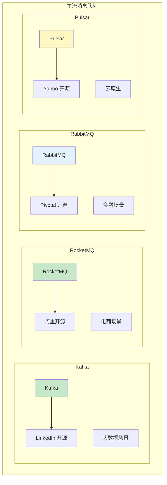
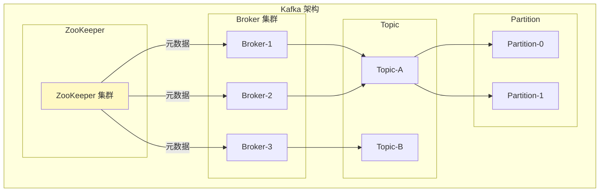
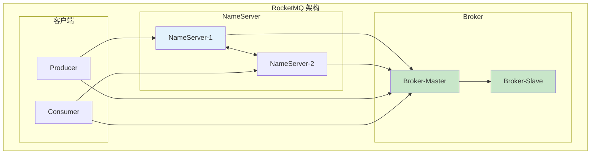
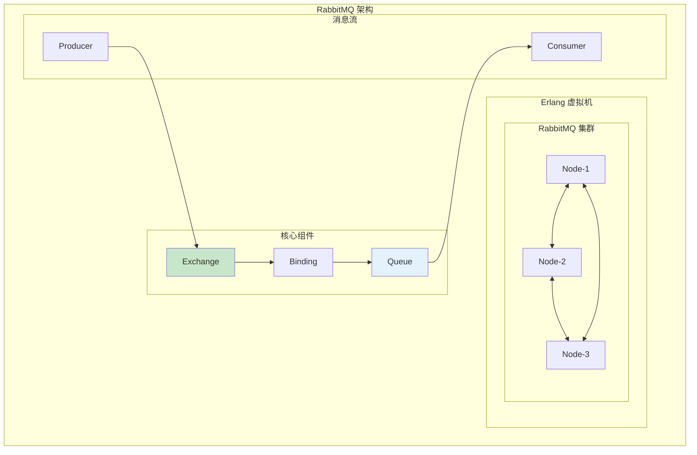
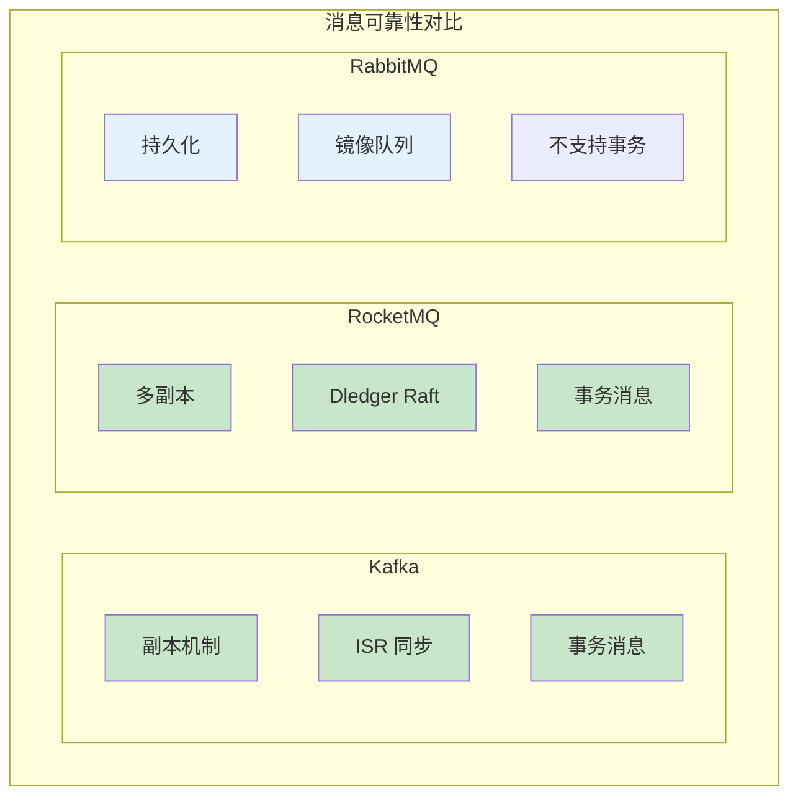
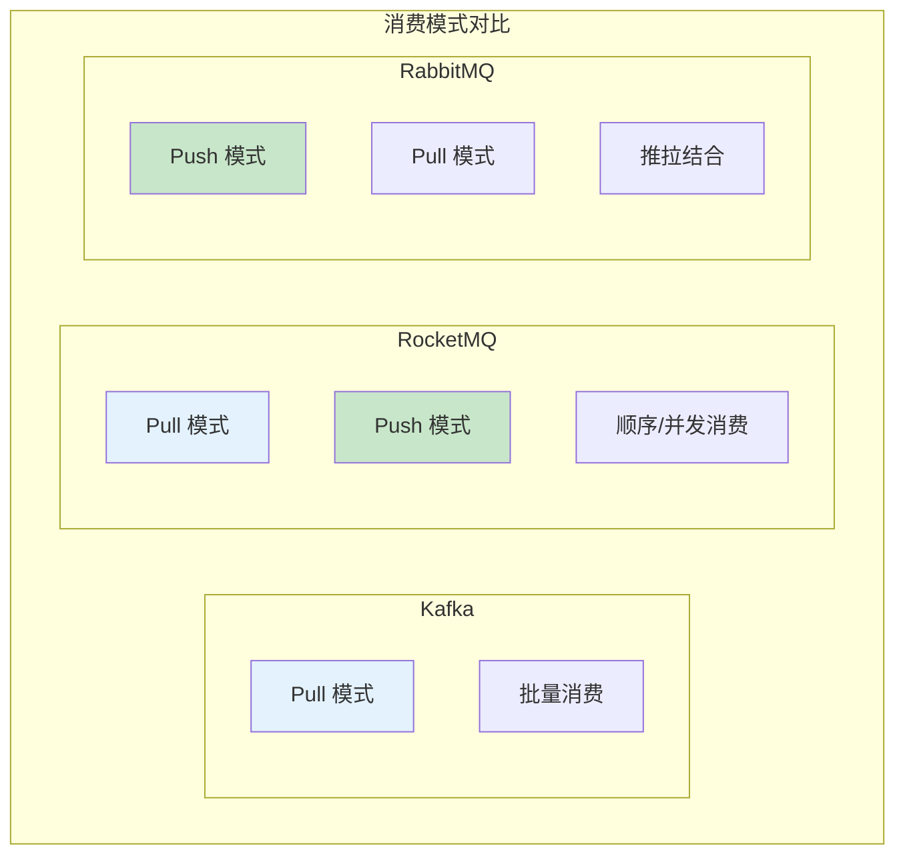
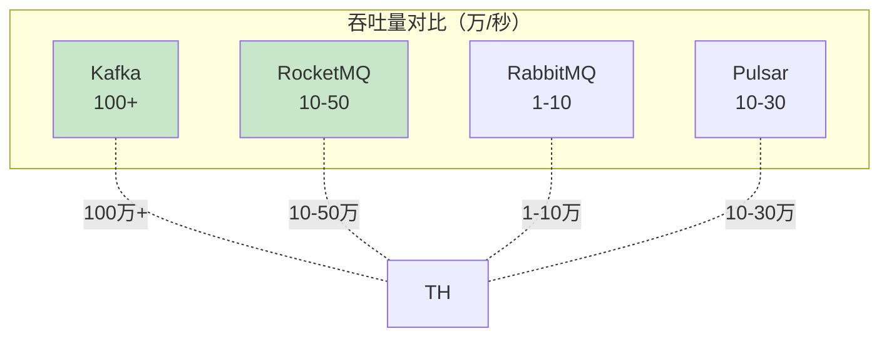
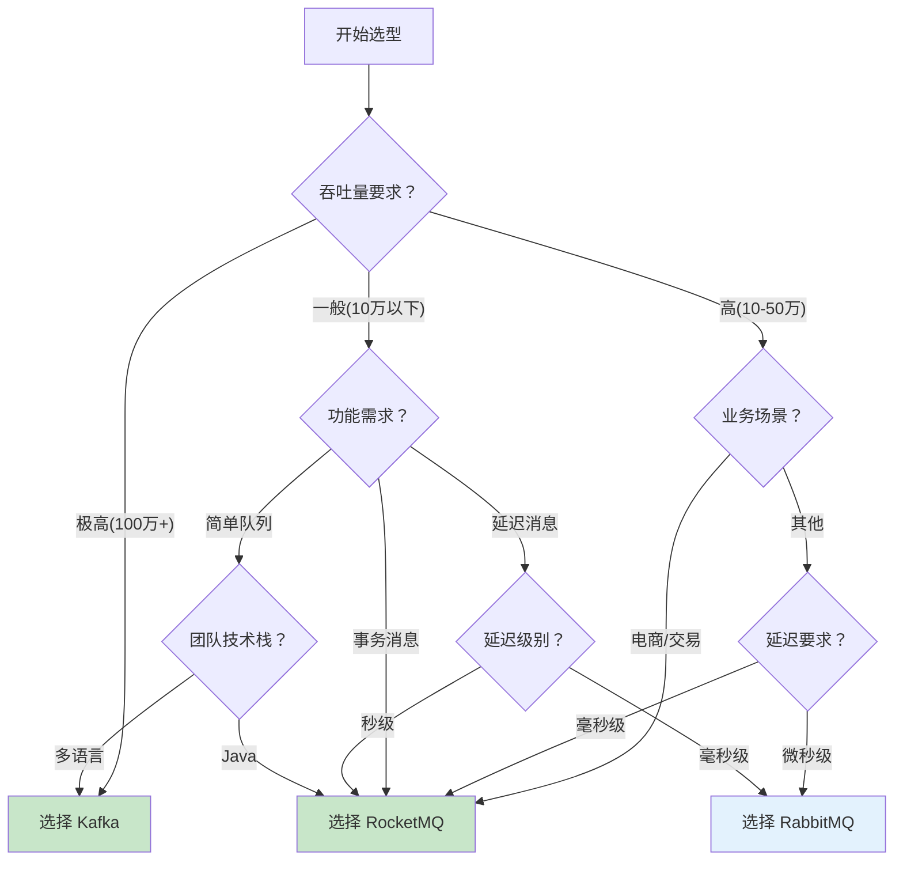

# 消息队列选型对比

> **目标级别**：P6
> **面试频率**：🔴 高频
> **面试官最关心的 3 个问题**：
> 1. 主流消息队列有哪些？各有什么特点？
> 2. 如何根据业务场景选择消息队列？
> 3. Kafka 和 RocketMQ 有什么区别？

面试官问：「你们项目用的是什么消息队列？」你说「Kafka」——然后面试官紧接着追问「为什么选 Kafka？RocketMQ 不是更适合业务消息吗？RabbitMQ 和它们有什么区别？」你沉默了。

消息队列是微服务架构的核心组件，选型需要综合考虑业务场景、技术栈、团队能力等多方面因素。

## 一、主流消息队列概述

### 1.1 四大主流 MQ



### 1.2 核心特性对比

| 特性 | Kafka | RocketMQ | RabbitMQ | Pulsar |
|------|-------|----------|----------|--------|
| **吞吐量** | 百万级/秒 | 十万级/秒 | 万级/秒 | 十万级/秒 |
| **延迟** | 毫秒级 | 毫秒级 | 微秒级 | 毫秒级 |
| **消息持久化** | 文件顺序写 | 文件顺序写 | 内存+文件 | BookKeeper |
| **高可用** | 多副本 | 多副本 | 主从 | 多副本 |
| **消息回溯** | 支持 | 支持 | 不支持 | 支持 |
| **延迟消息** | 需插件 | 原生支持 | 插件支持 | 原生支持 |
| **事务消息** | 支持 | 原生支持 | 不支持 | 支持 |

## 二、架构对比

### 2.1 Kafka 架构



### 2.2 RocketMQ 架构



### 2.3 RabbitMQ 架构



### 2.4 架构对比表

| 维度 | Kafka | RocketMQ | RabbitMQ | Pulsar |
|------|-------|----------|----------|--------|
| **元数据管理** | ZooKeeper | NameServer | 内置 | ZooKeeper/BookKeeper |
| **存储方式** | 分布式日志 | 分布式日志 | Erlang Mnesia | BookKeeper |
| **复制方式** | ISR | Raft/Dledger | 镜像队列 | Quorum |
| **主从切换** | 自动 | 自动 | 手动 | 自动 |
| **多租户** | 不支持 | 支持 | 不支持 | 支持 |

## 三、核心功能对比

### 3.1 消息可靠性



| 可靠性特性 | Kafka | RocketMQ | RabbitMQ |
|-----------|-------|----------|----------|
| **消息持久化** | ✅ | ✅ | ✅ |
| **副本机制** | ✅ ISR | ✅ Raft | ✅ 镜像队列 |
| **消息回溯** | ✅ | ✅ | ❌ |
| **事务消息** | ✅ | ✅ 原生 | ❌ |
| **死信队列** | ❌ | ✅ | ✅ |
| **延迟消息** | ❌ 需插件 | ✅ 原生 | ✅ 插件 |

### 3.2 消息顺序性

| 顺序类型 | Kafka | RocketMQ | RabbitMQ |
|---------|-------|----------|----------|
| **全局有序** | ❌ 需单分区 | ✅ 支持 | ✅ |
| **分区有序** | ✅ 按分区 | ✅ 按队列 | ✅ 按队列 |
| **同 Key 有序** | ✅ | ✅ | ❌ |

### 3.3 消费模式



| 消费模式 | Kafka | RocketMQ | RabbitMQ |
|---------|-------|----------|----------|
| **Push** | ❌ | ✅ | ✅ |
| **Pull** | ✅ | ✅ | ✅ |
| **广播消费** | ✅ Consumer Group | ✅ 广播模式 | ✅ Exchange |
| **集群消费** | ✅ Consumer Group | ✅ 集群模式 | ✅ |

## 四、性能对比

### 4.1 吞吐量对比



### 4.2 延迟对比

| 维度 | Kafka | RocketMQ | RabbitMQ |
|------|-------|----------|----------|
| **P99 延迟** | < 10ms | < 5ms | < 1ms |
| **抖动** | 较小 | 较小 | 较大 |
| **适用场景** | 大数据、流处理 | 业务消息 | 低延迟场景 |

### 4.3 资源消耗

| 维度 | Kafka | RocketMQ | RabbitMQ |
|------|-------|----------|----------|
| **内存消耗** | 低（PageCache） | 中 | 高（Mnesia） |
| **磁盘 IO** | 顺序写高效 | 顺序写高效 | 随机写较低 |
| **CPU** | 低 | 中 | 高 |

## 五、选型决策

### 5.1 选型决策树



### 5.2 场景推荐表

| 场景 | 推荐方案 | 原因 |
|------|---------|------|
| **日志采集** | Kafka | 高吞吐、持久化 |
| **实时计算** | Kafka | 流处理生态 |
| **电商交易** | RocketMQ | 事务消息、顺序消息 |
| **订单系统** | RocketMQ | 可靠性、事务支持 |
| **金融支付** | RocketMQ/RabbitMQ | 低延迟、可靠性 |
| **消息通知** | RocketMQ | 延迟消息、死信队列 |
| **低延迟场景** | RabbitMQ | 微秒级延迟 |
| **多语言环境** | Kafka/RabbitMQ | 多语言客户端 |

## 六、深入对比

### 6.1 Kafka vs RocketMQ

| 维度 | Kafka | RocketMQ |
|------|-------|----------|
| **定位** | 大数据、流处理 | 业务消息、交易系统 |
| **吞吐量** | 更高 | 稍低 |
| **事务消息** | 支持但复杂 | 原生支持，更完善 |
| **延迟消息** | 不支持 | 原生支持 |
| **消费模式** | Pull | Pull + Push |
| **消息回溯** | 支持 | 支持 |
| **死信队列** | 不支持 | 支持 |
| **运维复杂度** | 较高 | 中等 |
| **Java 集成** | 官方客户端 | Spring Boot Starter |

### 6.2 RocketMQ vs RabbitMQ

| 维度 | RocketMQ | RabbitMQ |
|------|----------|----------|
| **吞吐量** | 更高 | 较低 |
| **延迟** | 毫秒级 | 微秒级 |
| **事务消息** | 原生支持 | 不支持 |
| **延迟消息** | 秒级 | 毫秒级 |
| **消息回溯** | 支持 | 不支持 |
| **高可用** | 主从自动切换 | 主从需配置 |
| **多语言支持** | 一般 | 更好 |
| **运维难度** | 中等 | 较低 |

### 6.3 功能特性对比表

| 功能特性 | Kafka | RocketMQ | RabbitMQ |
|---------|-------|----------|----------|
| **消息持久化** | ✅ | ✅ | ✅ |
| **消息回溯** | ✅ | ✅ | ❌ |
| **死信队列** | ❌ | ✅ | ✅ |
| **延迟消息** | ❌ | ✅ 秒级 | ✅ 毫秒级 |
| **事务消息** | ✅ | ✅ | ❌ |
| **顺序消息** | ✅ 单分区 | ✅ 全局有序 | ✅ |
| **广播消费** | ✅ | ✅ | ✅ |
| **消息追踪** | ❌ 需插件 | ✅ | ❌ |
| **多租户** | ❌ | ✅ | ❌ |
| **消息过滤** | ✅ | ✅ | ❌ |

## 七、面试高频题

### 🔴 题目 1：如何根据业务场景选择消息队列？

**参考回答**：

选型决策建议：

| 场景 | 推荐方案 | 关键因素 |
|------|---------|---------|
| **日志采集/大数据** | Kafka | 吞吐量、生态 |
| **电商交易/订单** | RocketMQ | 事务、可靠性 |
| **金融支付** | RocketMQ/RabbitMQ | 低延迟、可靠性 |
| **低延迟消息** | RabbitMQ | 微秒级延迟 |
| **延迟任务** | RocketMQ | 原生延迟消息 |

### 🔴 题目 2：Kafka 和 RocketMQ 有什么区别？

**参考回答**：

| 区别 | Kafka | RocketMQ |
|------|-------|----------|
| **定位** | 大数据、流处理 | 业务消息 |
| **吞吐量** | 百万级/秒 | 十万级/秒 |
| **事务消息** | 支持但复杂 | 原生支持 |
| **延迟消息** | 不支持 | 支持 |
| **消息回溯** | 支持 | 支持 |
| **消费模式** | Pull | Pull + Push |
| **Java 生态** | 一般 | Spring Boot 集成好 |

> **追问**：什么时候选 Kafka？什么时候选 RocketMQ？
>
> - 选 Kafka：大数据场景、日志采集、流处理
> - 选 RocketMQ：业务消息、订单系统、交易场景

### 🟡 题目 3：RabbitMQ 有什么特点？

**参考回答**：

RabbitMQ 特点：

**优点**：
- 延迟低（微秒级）
- 功能丰富（Exchange、Binding）
- 易用性好
- 多语言支持好

**缺点**：
- 吞吐量较低（万级/秒）
- 不支持事务消息
- 不支持消息回溯
- Erlang 开发，运维复杂

**适用场景**：
- 低延迟需求
- 金融场景
- 简单队列需求

## 八、常见错误与陷阱

### ⚠️ 陷阱 1：迷信高吞吐量

```
❌ 错误理解：
Kafka 吞吐量最高，所以所有场景都选 Kafka

✅ 正确理解：
- 吞吐量满足业务需求即可
- RocketMQ 功能更丰富
- 业务场景更重要
```

### ⚠️ 陷阱 2：忽视运维成本

```
❌ 错误理解：
选型只考虑功能，性能

✅ 正确理解：
- 考虑团队技术栈
- 考虑运维难度
- 考虑社区支持
```

### ⚠️ 陷阱 3：不考虑事务需求

```
❌ 错误理解：
消息队列都是一样的，选哪个都一样

✅ 正确理解：
- RocketMQ 原生支持事务消息
- Kafka 事务支持较复杂
- 交易场景必须考虑事务
```

### ⚠️ 陷阱 4：忽视延迟需求

```
❌ 错误理解：
消息队列延迟都差不多

✅ 正确理解：
- RabbitMQ 延迟最低（微秒级）
- Kafka/RocketMQ 毫秒级
- 低延迟场景选 RabbitMQ
```

## 九、总结对比表

| 维度 | Kafka | RocketMQ | RabbitMQ | Pulsar |
|------|-------|----------|----------|--------|
| **吞吐量** | ⭐⭐⭐⭐⭐ | ⭐⭐⭐⭐ | ⭐⭐ | ⭐⭐⭐⭐ |
| **延迟** | ⭐⭐⭐ | ⭐⭐⭐⭐ | ⭐⭐⭐⭐⭐ | ⭐⭐⭐⭐ |
| **可靠性** | ⭐⭐⭐⭐⭐ | ⭐⭐⭐⭐⭐ | ⭐⭐⭐⭐ | ⭐⭐⭐⭐⭐ |
| **功能丰富度** | ⭐⭐⭐ | ⭐⭐⭐⭐⭐ | ⭐⭐⭐⭐ | ⭐⭐⭐⭐ |
| **易用性** | ⭐⭐⭐ | ⭐⭐⭐⭐ | ⭐⭐⭐⭐⭐ | ⭐⭐⭐ |
| **多语言支持** | ⭐⭐⭐⭐ | ⭐⭐⭐ | ⭐⭐⭐⭐⭐ | ⭐⭐⭐⭐ |
| **社区活跃** | ⭐⭐⭐⭐⭐ | ⭐⭐⭐⭐ | ⭐⭐⭐⭐ | ⭐⭐⭐ |
| **适用场景** | 大数据 | 业务消息 | 通用 | 云原生 |

## 十、加分回答

> **💡 面试加分点**：
>
> 1. **Kafka Streams**：轻量级流处理框架，与 Kafka 深度集成
>
> 2. **RocketMQ 5.0**：云原生架构，Proactor 模式
>
> 3. **Pulsar 优势**：存储计算分离，Topic 级别弹性扩缩容
>
> 4. **消息队列趋势**：Serverless、多云原生、事件驱动
