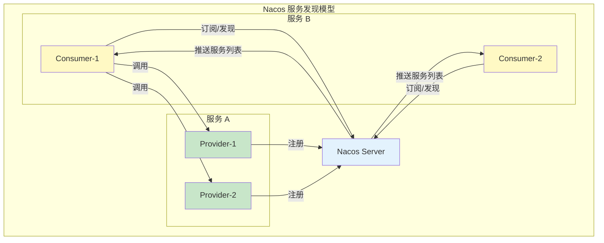
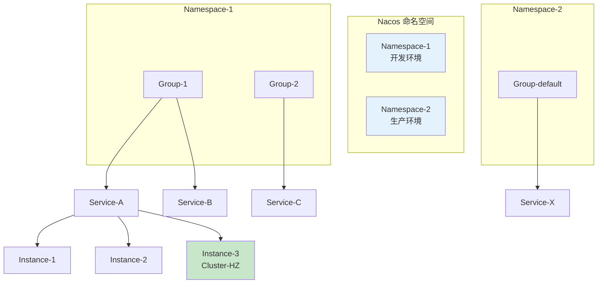
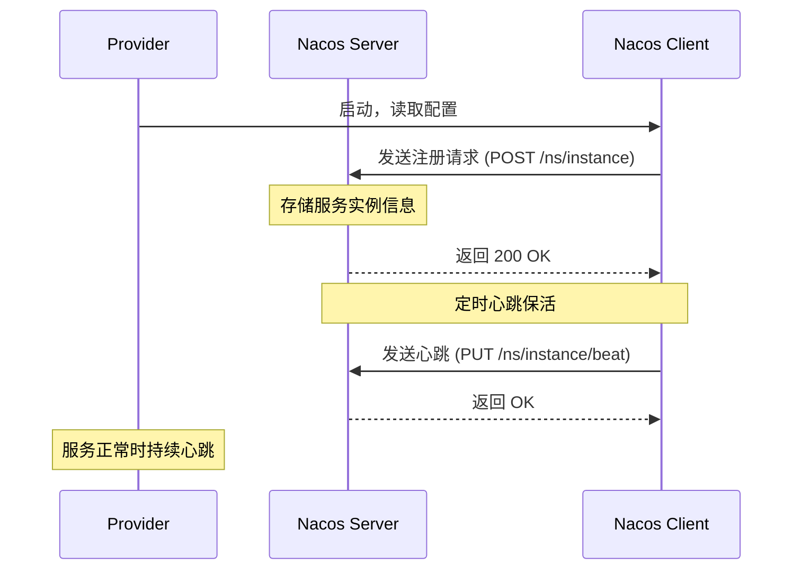
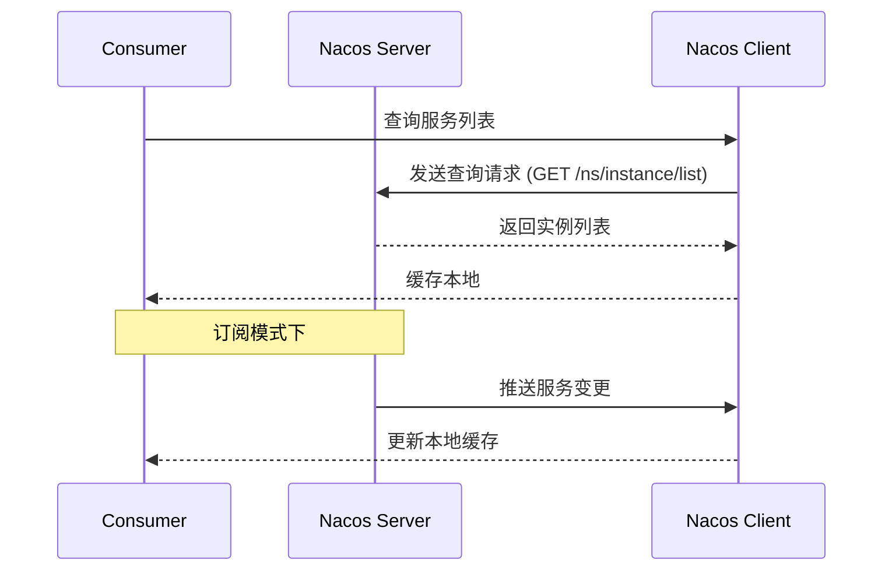
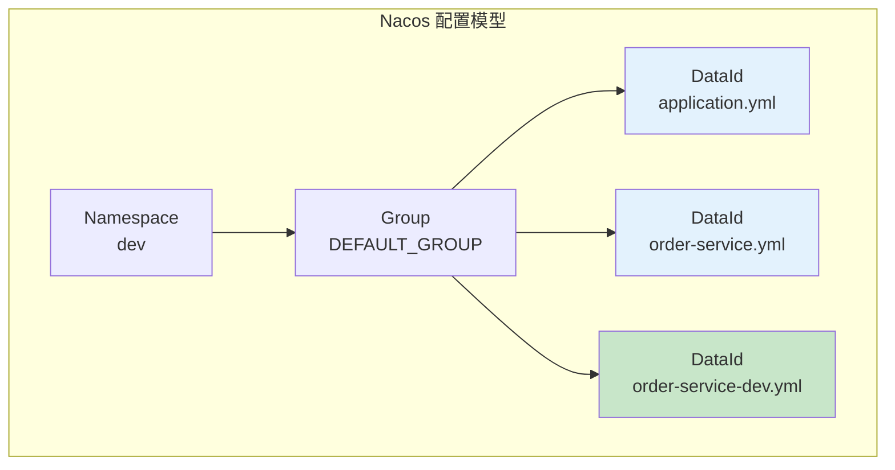
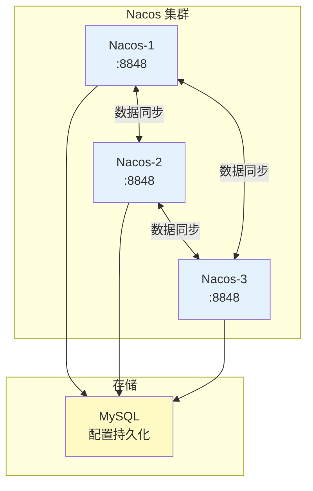

# Nacos 服务发现与配置

> **目标级别**：P6
> **面试频率**：🔴 高频
> **面试官最关心的 3 个问题**：
> 1. Nacos 的服务发现机制是怎样的？
> 2. Nacos 如何实现配置管理和热更新？
> 3. Nacos 和 Eureka 有什么区别？

面试官问：「Nacos 的服务发现是怎么工作的？」你说「客户端注册到注册中心」——然后面试官紧接着追问「那 Nacos 的健康检查是怎么实现的？临时实例和持久实例有什么区别？」你沉默了。

Nacos 是阿里开源的服务发现与配置管理平台，是 Spring Cloud Alibaba 的核心组件，面试中出现频率极高。

## 一、Nacos 核心概念

### 1.1 服务发现模型



### 1.2 核心概念

|| 概念 | 说明 |
|------|------|------|
| **服务（Service）** | 微服务的逻辑抽象 | 如 order-service、user-service |
| **实例（Instance）** | 服务的具体进程 | IP + Port + Port |
| **元数据（Metadata）** | 实例的标签信息 | version、group、cluster |
| **集群（Cluster）** | 实例的逻辑分组 | 用于地域亲和、负载均衡 |
| **命名空间（Namespace）** | 隔离不同环境 | dev、test、prod |

### 1.3 服务分级模型



## 二、服务注册与发现

### 2.1 服务注册流程



### 2.2 服务发现流程



### 2.3 服务注册代码

```java
// 服务提供者注册
@RestController
@RequestMapping("/order")
public class OrderController {

    @Autowired
    private NamingService namingService;

    @PostConstruct
    public void register() throws NacosException {
        // 注册服务实例
        namingService.registerInstance(
            "order-service",              // 服务名
            "127.0.0.1",                  // IP
            8080,                         // Port
            "DEFAULT"                     // Cluster
        );
    }

    @PreDestroy
    public void deregister() throws NacosException {
        // 注销服务实例
        namingService.deregisterInstance(
            "order-service",
            "127.0.0.1",
            8080
        );
    }
}
```

```java
// 服务消费者订阅
@Service
public class OrderService {

    @Autowired
    private NamingService namingService;

    public List<Instance> getOrderInstances() throws NacosException {
        // 查询服务实例列表
        return namingService.selectInstances(
            "order-service",  // 服务名
            true              // 是否只返回健康实例
        );
    }

    public Instance getOneInstance() throws NacosException {
        // 获取一个健康实例（负载均衡）
        return namingService.selectOneHealthyInstance("order-service");
    }
}
```

## 三、健康检查机制

### 3.1 健康检查类型

|| 类型 | 说明 | 适用场景 |
|------|------|------|----------|
| **TCP** | 检测端口连通性 | 通用场景 |
| **HTTP** | 检测 HTTP 接口 | Web 服务 |
| **MySQL** | 执行 SQL 检测 | 数据库连接池 |
| **自定义** | 自定义检测逻辑 | 特殊业务 |

### 3.2 健康检查流程

```mermaid
graph TB
    subgraph "健康检查流程"
        NS["Nacos Server"]
        I1["Instance-1<br/>健康"]
        I2["Instance-2<br/>健康"]
        I3["Instance-3<br/>不健康"]
    end

    NS -->|"TCP 检测"| I1
    NS -->|"TCP 检测"| I2
    NS -->|"TCP 检测"| I3

    I1 -->>|"正常响应"| NS
    I2 -->>|"正常响应"| NS
    I3 -->>|"无响应/超时"| NS

    NS -->|"从列表移除"| I3

    style I3 fill:#ffcdd2
```

### 3.3 实例类型对比

|| 临时实例 | 持久实例 |
|------|---------|---------|
| **注册方式** | 主动心跳保活 | 永久注册 |
| **删除方式** | 心跳停止自动删除 | 需主动注销 |
| **健康检查** | 服务端主动检测 | 无需检测 |
| **适用场景** | 一般微服务 | DNS 服务、数据库 |
| **数据存储** | 注册中心内存 | 注册中心磁盘 |

## 四、配置管理

### 4.1 配置管理模型



### 4.2 配置获取代码

```java
@Configuration
@EnableConfigurationProperties
public class NacosConfig {

    @Autowired
    private ConfigService configService;

    /**
     * 获取配置
     */
    public String getConfig() throws NacosException {
        // dataId, group, timeout
        return configService.getConfig(
            "order-service.yaml",  // DataId
            "DEFAULT_GROUP",        // Group
            5000                    // 超时 ms
        );
    }

    /**
     * 监听配置变更
     */
    public void addListener() throws NacosException {
        configService.addListener(
            "order-service.yaml",
            "DEFAULT_GROUP",
            new Listener() {
                @Override
                public Executor getExecutor() {
                    return Executors.newSingleThreadExecutor();
                }

                @Override
                public void receiveConfigInfo(String configInfo) {
                    // 配置变更回调
                    System.out.println("配置变更: " + configInfo);
                }
            }
        );
    }
}
```

### 4.3 Spring Cloud 集成

```java
// application.yml 配置
spring:
  cloud:
    nacos:
      discovery:
        server-addr: 127.0.0.1:8848
        namespace: dev
        group: DEFAULT_GROUP
        cluster-name: HANGZHOU
      config:
        server-addr: 127.0.0.1:8848
        file-extension: yaml
        namespace: dev
        group: DEFAULT_GROUP
        refresh-enabled: true  // 开启自动刷新
```

```java
// @RefreshScope 实现配置热更新
@RestController
@RefreshScope
public class OrderController {

    @Value("${order.timeout:3000}")
    private int orderTimeout;

    @Value("${order.max-retry:3}")
    private int maxRetry;

    @GetMapping("/config")
    public Map<String, Object> getConfig() {
        Map<String, Object> config = new HashMap<>();
        config.put("timeout", orderTimeout);
        config.put("maxRetry", maxRetry);
        return config;
    }
}
```

## 五、集群部署

### 5.1 集群架构



### 5.2 集群部署配置

```bash title="cluster.conf"
# 集群节点配置
192.168.1.1:8848
192.168.1.2:8848
192.168.1.3:8848
```

```yaml title="application.properties"
# 数据库配置
spring.datasource.platform=mysql
db.num=1
db.url.0=jdbc:mysql://192.168.1.100:3306/nacos?characterEncoding=utf8
db.user.0=nacos
db.password.0=nacos
```

## 六、面试高频题

### 🔴 题目 1：Nacos 的服务发现机制是怎样的？

**参考回答**：

Nacos 的服务发现基于注册中心模式：

1. **服务注册**：Provider 启动时向 Nacos Server 注册自己的 IP、Port、服务名等信息
2. **服务订阅**：Consumer 启动时向 Nacos Server 订阅所需服务
3. **心跳保活**：Provider 定期发送心跳，如果心跳停止则实例被剔除
4. **服务通知**：当服务列表变更时，Nacos Server 主动推送变更给 Consumer

> **追问 1**：Nacos 和 Eureka 有什么区别？
>
> - Eureka 是 AP 模型，Nacos 同时支持 AP 和 CP
> - Eureka 只有客户端心跳，Nacos 支持服务端主动检测
> - Nacos 有配置管理功能，Eureka 没有

> **追问 2**：临时实例和持久实例的区别？
>
> - 临时实例：心跳停止自动删除，用于一般微服务
> - 持久实例：需主动注销，用于 DNS 服务等

### 🔴 题目 2：Nacos 如何实现配置热更新？

**参考回答**：

1. **配置存储**：配置存储在 Nacos Server，支持多环境隔离
2. **配置监听**：客户端通过长轮询监听配置变更
3. **自动刷新**：使用 `@RefreshScope` 注解，配置变更时自动刷新 Bean
4. **生效方式**：本地缓存 + 动态更新，业务无感知

```java
@RestController
@RefreshScope
public class ConfigController {
    // 配置变更后，这个 Bean 会重新创建
    @Value("${config.key}")
    private String configKey;
}
```

> **追问**：配置变更的优先级是怎样的？
>
> - 遵循覆盖原则：DataId > Group > Namespace
> - 配置文件加载顺序：shared-dataids > extend-dataids > 自动匹配

### 🟡 题目 3：Nacos 的健康检查是怎么实现的？

**参考回答**：

Nacos 支持多种健康检查方式：

1. **临时实例**：服务端主动检测（TCP/HTTP/MySQL）
2. **持久实例**：依赖客户端主动心跳上报
3. **自定义检查**：实现 `HealthChecker` 接口

健康检查间隔默认 5 秒，连续 3 次不健康则标记为不健康。

## 七、常见错误与陷阱

### ⚠️ 陷阱 1：混淆临时实例和持久实例

```
❌ 错误理解：
临时实例和持久实例只是生命周期不同

✅ 正确理解：
- 临时实例：心跳停止自动删除，无需服务端主动检测
- 持久实例：需主动注销，但可以享受服务端健康检测
```

### ⚠️ 陷阱 2：配置热更新不生效

```
❌ 错误实现：
@Value 直接注入，没有使用 @RefreshScope

✅ 正确实现：
@Value + @RefreshScope 配合使用
或使用 @ConfigurationProperties
```

### ⚠️ 陷阱 3：健康检查配置错误

```
❌ 错误配置：
健康检查类型与实际服务不匹配

✅ 正确配置：
- HTTP 服务使用 HTTP 检测
- TCP 服务使用 TCP 检测
- 数据库连接使用 MySQL 检测
```

### ⚠️ 陷阱 4：namespace 和 group 混用

```
❌ 错误理解：
namespace 和 group 功能相同

✅ 正确理解：
- Namespace：环境隔离（dev/test/prod）
- Group：业务分组（不同业务线）
```

## 八、总结对比表

|| 维度 | Nacos | Eureka | Consul |
|------|------|-------|--------|--------|
| **一致性模型** | AP + CP | AP | CP |
| **配置管理** | 支持 | 不支持 | 支持 |
| **健康检查** | 主动 + 被动 | 被动 | 主动 |
| **多环境** | Namespace | 无 | Namespaces |
| **社区活跃** | 高 | 低（已停止维护） | 高 |
| **Java 生态** | Spring Cloud Alibaba | Spring Cloud | 通用 |

## 九、加分回答

> **💡 面试加分点**：
>
> 1. **Nacos 2.0 升级**：gRPC 通信，提升性能 2 倍
>
> 2. **Nacos CP 模式**：通过 Raft 协议实现领导者选举和数据同步
>
> 3. **Nacos 配置变更原理**：长轮询 + Md5 比对，减少无效推送
>
> 4. **生产实践**：多集群部署 + DNS-Foo 客户端负载均衡
