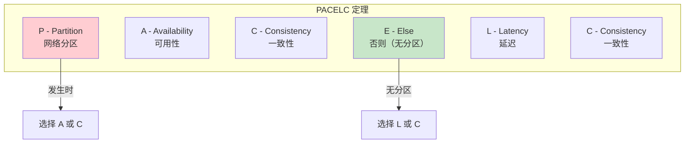
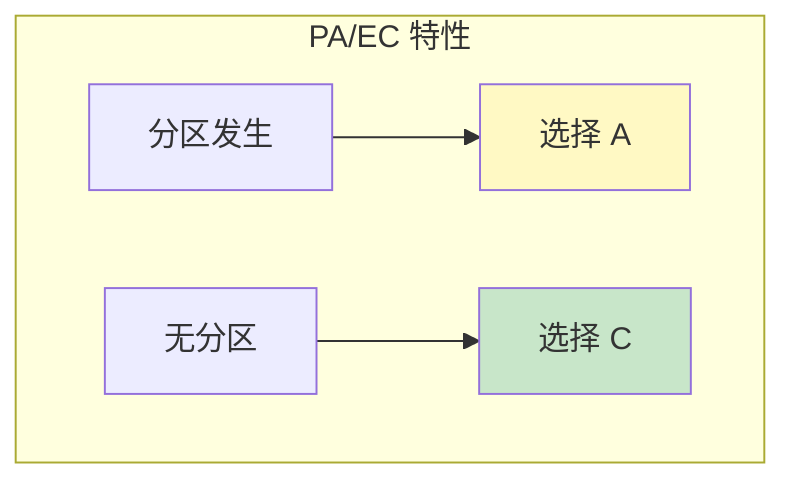
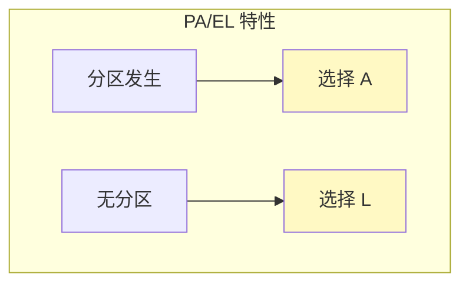
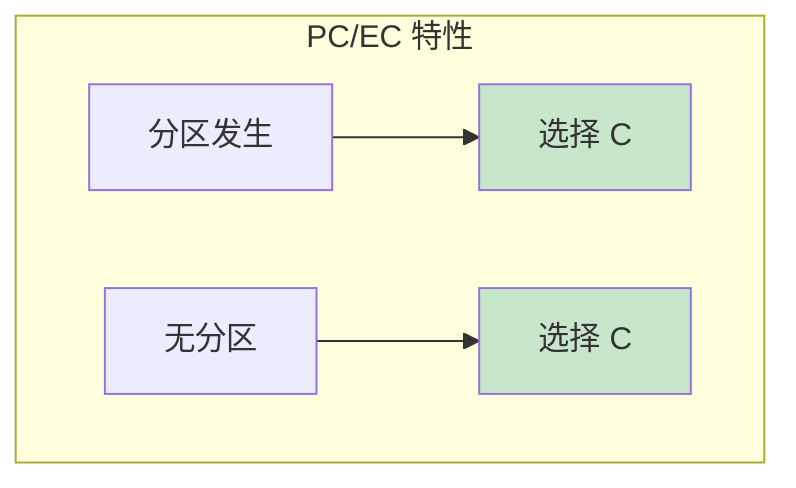
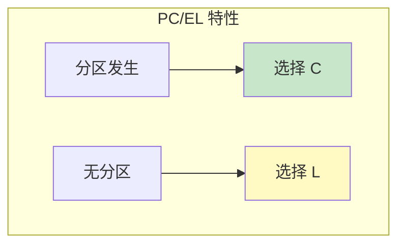
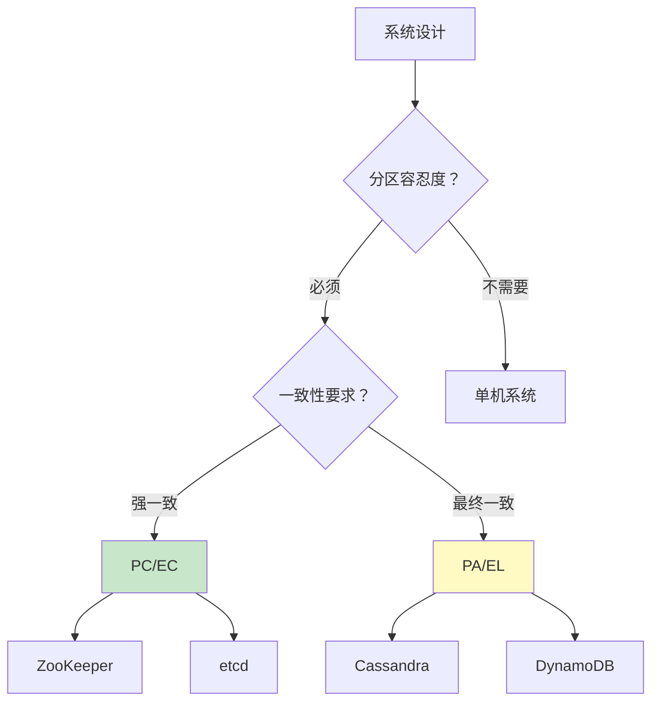
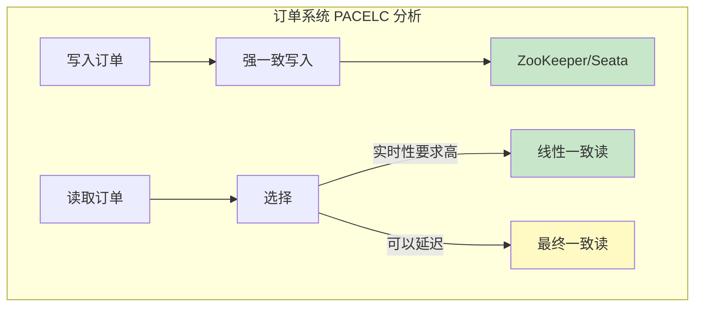

# PACELC 模型

> **目标级别**：P7
> **面试频率**：🟢 低频
> **面试官最关心的 3 个问题**：
> 1. PACELC 模型是什么？
> 2. PACELC 和 CAP 的区别？
> 3. PACELC 如何指导系统设计？

面试官问：「你了解 PACELC 模型吗？」你说「不太了解」——然后面试官紧接着追问「那你只知道 CAP 咯？那 CAP 有什么局限性？」你沉默了。

PACELC 是 CAP 定理的进化版本，增加了 Latency 维度，更符合实际工程场景。

## 一、PACELC 的定义

### 1.1 模型来源

PACELC = **P**artition, **A**vailability, **C**onsistency, **E**lse, **L**atency, **C**onsistency

由 Daniel J. Abadi 在 2010 年提出，用于弥补 CAP 定理忽略 Latency 的问题。

### 1.2 核心内容



### 1.3 公式表达

> **If there is a partition (P), how does the system trade off availability (A) versus consistency (C)? Else (E), when there is no partition, how does the system trade off latency (L) versus consistency (C)?**

```
┌─────────────────────────────────────────────────────────┐
│                    PACELC 模型                          │
├─────────────────────────────────────────────────────────┤
│  分区发生（P）：                                          │
│    PA → 牺牲 C，保证 A（高可用优先）                       │
│    PC → 牺牲 A，保证 C（强一致优先）                       │
│                                                         │
│  无分区（E）：                                            │
│    EL → 牺牲 C，保证 L（低延迟优先）                       │
│    EC → 牺牲 L，保证 C（强一致优先）                       │
└─────────────────────────────────────────────────────────┘
```

## 二、CAP 与 PACELC 的区别

### 2.1 CAP 的局限性

CAP 定理只考虑了分区（Partition）情况：

| 局限 | 说明 |
|------|------|
| **忽略延迟** | 没考虑系统延迟 |
| **假设简化** | 假设分区只有 C/A 选择 |
| **忽视成本** | 没考虑一致性成本 |

### 2.2 PACELC 的改进

PACELC 在 CAP 基础上增加了 Latency 维度：

```mermaid
graph TB
    subgraph "CAP 模型"
        C1["C: Consistency"]
        A1["A: Availability"]
        P1["P: Partition"]
    end

    subgraph "PACELC 模型"
        P2["P: Partition"]
        A2["A: Availability"]
        C2["C: Consistency"]
        E["E: Else"]
        L["L: Latency"]
        C3["C: Consistency"]
    end

    style L fill:#fff9c4

    Note over C1,L: PACELC = CAP + Latency
```

### 2.3 对比表

| 维度 | CAP | PACELC |
|------|-----|--------|
| **分区时选择** | C vs A | C vs A |
| **无分区时选择** | 无 | C vs L |
| **考虑因素** | 2 个 | 4 个 |
| **实际指导** | 弱 | 强 |

## 三、PACELC 的四种选择

### 3.1 PA/EC 系统

**高可用 + 低延迟**

| 选择 | 说明 |
|------|------|
| **PA** | 分区时选择高可用 |
| **EC** | 无分区时选择强一致（牺牲延迟） |

**典型系统**：BigTable, HBase, MongoDB（多数副本）



### 3.2 PA/EL 系统

**高可用 + 低延迟**

| 选择 | 说明 |
|------|------|
| **PA** | 分区时选择高可用 |
| **EL** | 无分区时选择低延迟（牺牲一致性） |

**典型系统**：Cassandra, DynamoDB, Riak



### 3.3 PC/EC 系统

**强一致 + 低延迟**

| 选择 | 说明 |
|------|------|
| **PC** | 分区时选择强一致 |
| **EC** | 无分区时选择强一致（牺牲延迟） |

**典型系统**：ZooKeeper, etcd



### 3.4 PC/EL 系统

**强一致 + 低延迟**

| 选择 | 说明 |
|------|------|
| **PC** | 分区时选择强一致 |
| **EL** | 无分区时选择低延迟（牺牲一致性） |

**典型系统**：MongoDB（少数副本）



## 四、PACELC 在实际系统中的应用

### 4.1 数据库的 PACELC 分类

|| 数据库 | PACELC | 说明 |
|------|--------|--------|------|
| **DynamoDB** | PA/EL | 分区可用，无分区低延迟 |
| **Cassandra** | PA/EL | 最终一致优先 |
| **MongoDB** | PC/EC 或 PC/EL | 可配置 |
| **BigTable** | PC/EC | 强一致 |
| **HBase** | PC/EC | 强一致 |
| **ZooKeeper** | PC/EC | 强一致 |
| **etcd** | PC/EC | Raft 强一致 |

### 4.2 PACELC 决策图



### 4.3 系统设计示例

**电商订单系统**：



## 五、面试高频题

### 🟡 题目 1：PACELC 模型是什么？

**参考回答**：

PACELC 是 CAP 的进化版，增加了 Latency 维度：

1. **分区发生（P）**：选择可用性（A）还是一致性（C）
2. **无分区（E）**：选择低延迟（L）还是一致性（C）

核心思想：**即使没有分区，一致性和延迟也存在权衡**

### 🟡 题目 2：PACELC 和 CAP 的区别？

**参考回答**：

| 区别 | CAP | PACELC |
|------|-----|--------|
| **考虑因素** | C/A/P 三个 | C/A/P/L 四个 |
| **无分区情况** | 忽略 | 考虑 L vs C |
| **实际指导** | 较弱 | 较强 |
| **适用场景** | 理论分析 | 工程实践 |

### 🟢 题目 3：DynamoDB 是什么 PACELC 类型？

**参考回答**：

DynamoDB 是 **PA/EL** 类型：

1. **分区时选择 A**：高可用优先，允许读取过期数据
2. **无分区时选择 L**：低延迟优先，牺牲一致性

这使得 DynamoDB 适合：
- 社交 Feed
- 游戏排行榜
- 购物车
- 会话存储

## 六、常见错误与陷阱

### ⚠️ 陷阱 1：只看 CAP 不看 PACELC

```
❌ 错误理解：
理解 CAP 就够了

✅ 正确理解：
实际系统需要考虑延迟
PACELC 更符合工程实际
```

### ⚠️ 陷阱 2：忽略无分区情况

```
❌ 错误理解：
只要分区时选择正确就行了

✅ 正确理解：
无分区时也要权衡
延迟和一致性同样重要
```

### ⚠️ 陷阱 3：把所有系统归为同一类

```
❌ 错误理解：
所有 NoSQL 都是 PA/EL

✅ 正确理解：
不同系统有不同的权衡
需要具体分析
```

## 七、总结对比表

| PACELC 类型 | 分区时 | 无分区时 | 典型系统 | 适用场景 |
|-------------|--------|----------|----------|----------|
| **PA/EC** | 选 A | 选 C | BigTable, HBase | 强一致需求 |
| **PA/EL** | 选 A | 选 L | DynamoDB, Cassandra | 高性能场景 |
| **PC/EC** | 选 C | 选 C | ZooKeeper, etcd | 配置中心、锁 |
| **PC/EL** | 选 C | 选 L | MongoDB(少数) | 混合场景 |

## 八、加分回答

> **💡 面试加分点**：
>
> 1. **DynamoDB 的可调一致性**：用户可以选择强一致读或最终一致读，体现了 PACELC 的思想
>
> 2. **Aurora 的读写分离**：写操作强一致，读操作可以配置一致性级别
>
> 3. **CockroachDB**：默认 PC/EC，但支持 SERIALIZABLE 隔离级别
>
> 4. **FaunaDB**：提供事务一致性，支持 PACELC 所有象限
