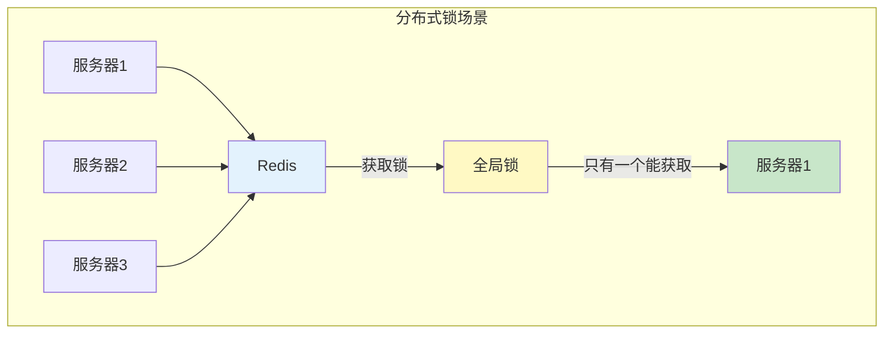
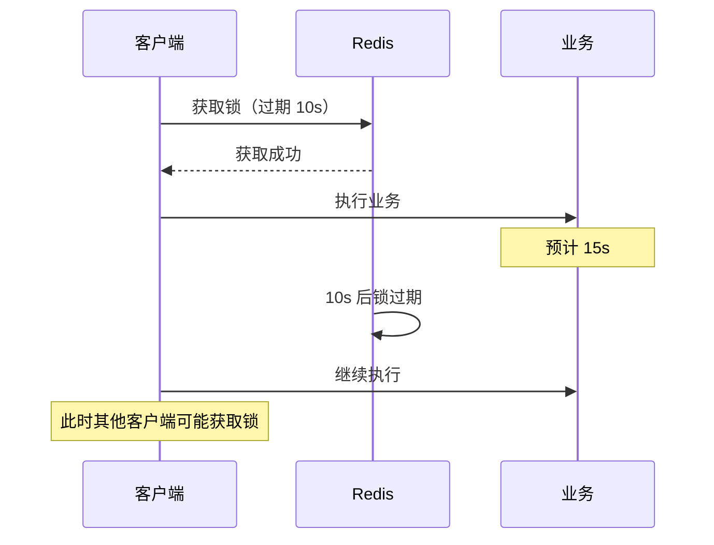
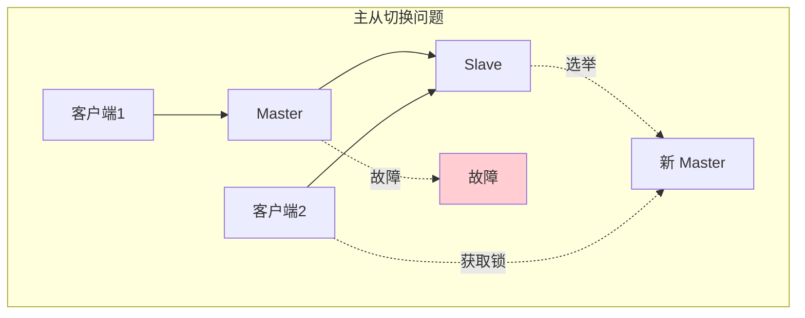
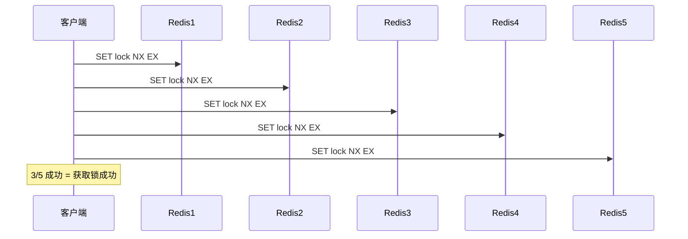

# Redis 分布式锁

> **目标级别**：P6
> **面试频率**：🔴 高频
> **面试官最关心的 3 个问题**：
> 1. Redis 分布式锁怎么实现？
> 2. 如何保证 Redis 分布式锁的可靠性？
> 3. RedLock 了解吗？有什么问题？

面试官问：「Redis 分布式锁怎么实现？」你说「用 SETNX」——然后面试官紧接着追问「那 SETNX + EXPIRE 是原子操作吗？如果锁过期了业务还没执行完怎么办？」你沉默了。

Redis 分布式锁是面试高频考点，需要理解其原理、可靠性问题和解决方案。

## 一、Redis 分布式锁基础

### 1.1 分布式锁的需求



### 1.2 分布式锁的必须特性

| 特性 | 说明 |
|------|------|
| **互斥性** | 同一时刻只有一个客户端能获取锁 |
| **防死锁** | 锁最终能释放，不会一直占用 |
| **可重入** | 同一个客户端可以多次获取锁 |
| **高性能** | 获取/释放锁要快 |
| **公平性** | 按请求顺序获取锁（可选） |

### 1.3 基本实现

```java
public class RedisLock {

    private Jedis jedis;

    public boolean lock(String key, String value, long expireTime) {
        // SETNX + EXPIRE 不是原子操作！
        Long result = jedis.setnx(key, value);
        if (result == 1) {
            jedis.expire(key, expireTime);
            return true;
        }
        return false;
    }

    public void unlock(String key, String value) {
        // 简单删除，不是原子操作！
        if (value.equals(jedis.get(key))) {
            jedis.del(key);
        }
    }
}
```

## 二、Redis 分布式锁进阶

### 2.1 SET NX EX 实现

```java
public class RedisLockV2 {

    private Jedis jedis;

    /**
     * 获取锁
     * @param key 锁的 key
     * @param value 锁的值（用于标识）
     * @param expireTime 过期时间（秒）
     */
    public boolean lock(String key, String value, long expireTime) {
        // SET key value NX EX seconds
        // 原子操作：SETNX + EXPIRE
        String result = jedis.set(key, value, "NX", "EX", expireTime);
        return "OK".equals(result);
    }

    /**
     * 释放锁
     * @param key 锁的 key
     * @param value 锁的值
     */
    public void unlock(String key, String value) {
        // 使用 Lua 脚本保证原子性
        String script =
            "if redis.call('get', KEYS[1]) == ARGV[1] then " +
            "    return redis.call('del', KEYS[1]) " +
            "else " +
            "    return 0 " +
            "end";

        jedis.eval(script, 1, key, value);
    }
}
```

### 2.2 Lua 脚本实现

```lua
-- 加锁脚本
-- SET key value NX EX seconds
-- 已经是原子操作

-- 解锁脚本
if redis.call('get', KEYS[1]) == ARGV[1] then
    return redis.call('del', KEYS[1])
else
    return 0
end
```

## 三、可靠性问题与解决方案

### 3.1 问题一：锁过期，业务未完成



**解决方案：锁续期**

```java
public class RedisLockWithRenew {

    private Jedis jedis;
    private String lockKey;
    private String lockValue;
    private long expireTime;
    private ScheduledExecutorService executor;

    public boolean lock(String key, String value, long expireTime) {
        this.lockKey = key;
        this.lockValue = value;
        this.expireTime = expireTime;

        String result = jedis.set(key, value, "NX", "EX", expireTime);
        if ("OK".equals(result)) {
            // 启动续期任务
            startRenewTask();
            return true;
        }
        return false;
    }

    private void startRenewTask() {
        executor = Executors.newScheduledThreadPool(1);
        executor.scheduleAtFixedRate(() -> {
            // 续期：延长过期时间
            String currentValue = jedis.get(lockKey);
            if (lockValue.equals(currentValue)) {
                jedis.expire(lockKey, expireTime);
            }
        }, expireTime / 3, expireTime / 3, TimeUnit.SECONDS);
    }

    public void unlock() {
        // 取消续期任务
        if (executor != null) {
            executor.shutdown();
        }

        // 释放锁
        String script = "if redis.call('get', KEYS[1]) == ARGV[1] then " +
                        "    return redis.call('del', KEYS[1]) " +
                        "else return 0 end";
        jedis.eval(script, 1, lockKey, lockValue);
    }
}
```

### 3.2 问题二：主从切换数据丢失



**解决方案：RedLock**

```java
public class RedLock {

    private List<Jedis> jedisList;
    private int quorum;

    public boolean lock(String key, String value, long expireTime) {
        String script = "if redis.call('set', KEYS[1], ARGV[1], 'NX', 'EX', ARGV[2]) then return 1 else return 0 end";

        int successCount = 0;
        long startTime = System.currentTimeMillis();

        // 向 N 个 Redis 实例获取锁
        for (Jedis jedis : jedisList) {
            try {
                Object result = jedis.eval(script, 1, key, value, expireTime);
                if (result.equals(1L)) {
                    successCount++;
                }
            } catch (Exception e) {
                // 记录失败
            }
        }

        // 超过半数成功
        return successCount >= quorum;
    }
}
```

### 3.3 完整可靠实现

```java
public class RedisDistributedLock {

    private JedisPool jedisPool;
    private ThreadLocal<String> lockValue = new ThreadLocal<>();

    /**
     * 获取锁（带重试）
     */
    public boolean lock(String key, long expireTime, long retryTimes, long retryInterval) {
        for (int i = 0; i < retryTimes; i++) {
            String value = UUID.randomUUID().toString();
            if (doLock(key, value, expireTime)) {
                lockValue.set(value);
                return true;
            }

            try {
                Thread.sleep(retryInterval);
            } catch (InterruptedException e) {
                Thread.currentThread().interrupt();
                return false;
            }
        }
        return false;
    }

    private boolean doLock(String key, String value, long expireTime) {
        try (Jedis jedis = jedisPool.getResource()) {
            String result = jedis.set(key, value, "NX", "EX", expireTime);
            return "OK".equals(result);
        }
    }

    /**
     * 释放锁
     */
    public boolean unlock(String key) {
        String value = lockValue.get();
        if (value == null) {
            return false;
        }

        String script = "if redis.call('get', KEYS[1]) == ARGV[1] then " +
                        "    return redis.call('del', KEYS[1]) " +
                        "else return 0 end";

        try (Jedis jedis = jedisPool.getResource()) {
            Object result = jedis.eval(script, 1, key, value);
            lockValue.remove();
            return result.equals(1L);
        }
    }
}
```

## 四、RedLock 详解

### 4.1 RedLock 算法



### 4.2 RedLock 的问题

| 问题 | 说明 |
|------|------|
| **性能下降** | 需要操作多个 Redis |
| **时钟漂移** | 不同机器时钟可能漂移 |
| **复杂度高** | 需要处理更多异常 |
| **争议** | Martin Kleppmann 对 RedLock 提出质疑 |

## 五、面试高频题

### 🔴 题目 1：Redis 分布式锁怎么实现？

**参考回答**：

Redis 分布式锁的基本实现：

```java
// 加锁
String result = jedis.set(key, value, "NX", "EX", expireTime);

// 解锁（Lua 脚本）
if redis.call('get', KEYS[1]) == ARGV[1] then
    return redis.call('del', KEYS[1])
else
    return 0
end
```

关键点：
- 使用 `SET key value NX EX seconds` 保证原子性
- 使用唯一 value 标识锁持有者
- 使用 Lua 脚本释放锁，防止误删

### 🔴 题目 2：如何保证 Redis 分布式锁的可靠性？

**参考回答**：

保证可靠性的关键点：

1. **原子性加锁**：使用 `SET key value NX EX`
2. **唯一标识**：使用 UUID 作为 value，防止误删
3. **锁续期**：看门狗机制，业务未完成时续期
4. **主从一致性**：使用 RedLock（多 Redis）
5. **可重入**：记录锁持有次数

### 🔴 题目 3：RedLock 了解吗？

**参考回答**：

RedLock 是 Redis 作者提出的多 Redis 分布式锁方案：

1. **原理**：向 N 个独立的 Redis 实例获取锁，超过半数成功即认为获取成功
2. **优点**：提高可用性，避免单点故障
3. **问题**：
   - 性能下降（需操作多个 Redis）
   - 时钟漂移问题
   - 复杂度高
   - Martin Kleppmann 对其安全性提出质疑

## 六、常见错误与陷阱

### ⚠️ 陷阱 1：SETNX + EXPIRE 不是原子操作

```
❌ 错误实现：
setnx(key, value)
expire(key, seconds)

✅ 正确实现：
jedis.set(key, value, "NX", "EX", seconds)
```

### ⚠️ 陷阱 2：释放锁时没有检查 owner

```
❌ 错误实现：
del(key)  // 直接删除

✅ 正确实现：
if get(key) == value then del(key)
```

### ⚠️ 陷阱 3：锁过期但业务未完成

```
❌ 错误理解：
锁过期后业务就自动结束了

✅ 正确理解：
需要锁续期机制（看门狗）
业务执行时间可能超过锁过期时间
```

## 七、总结对比表

| 维度 | 单机 Redis | RedLock |
|------|-----------|---------|
| **可靠性** | 一般 | 高 |
| **性能** | 高 | 较低 |
| **复杂度** | 低 | 高 |
| **适用场景** | 一般场景 | 高可用要求 |

## 八、加分回答

> **💡 面试加分点**：
>
> 1. **Redisson**：成熟的 Redis 分布式锁实现，支持看门狗
>
> 2. **ZooKeeper 对比**：Redis 性能好但一致性弱
>
> 3. **分布式锁的 Trade-off**：CAP 权衡
>
> 4. **生产级实现要素**：重试、续期、公平性
