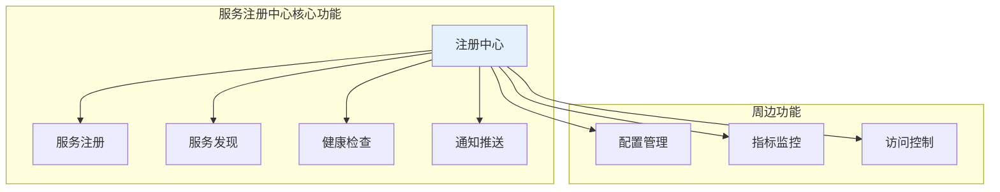
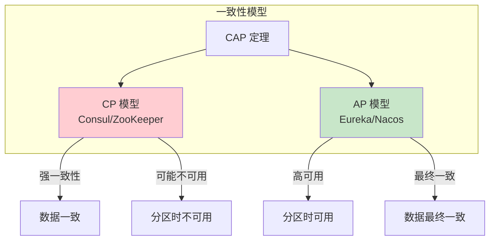
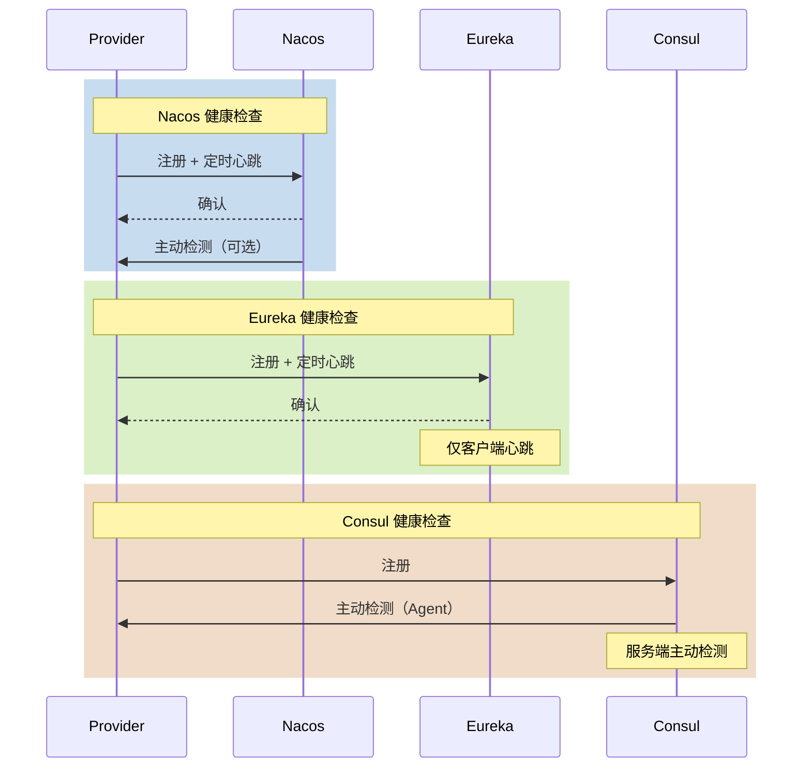
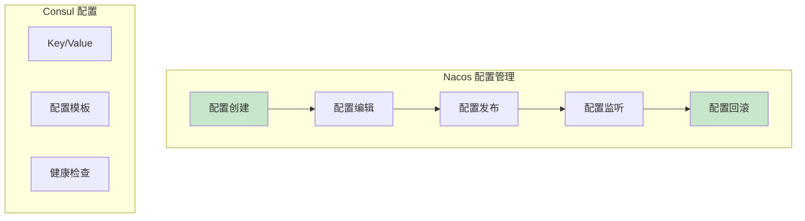
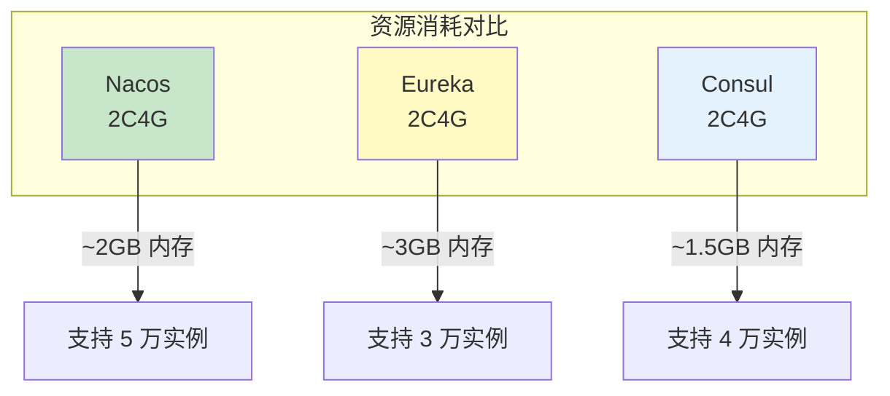
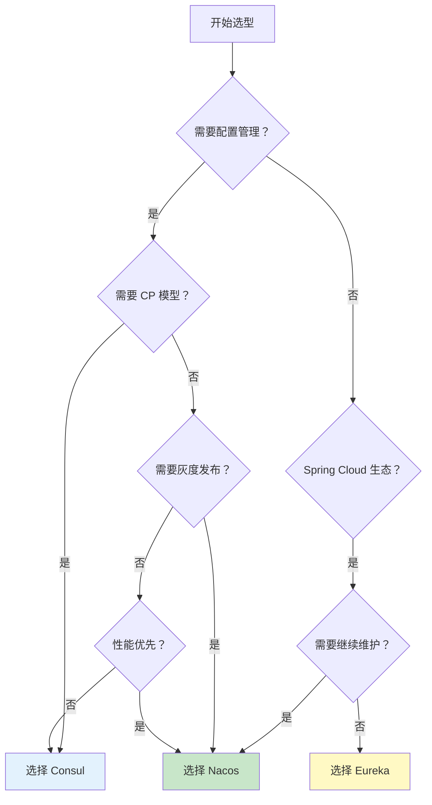
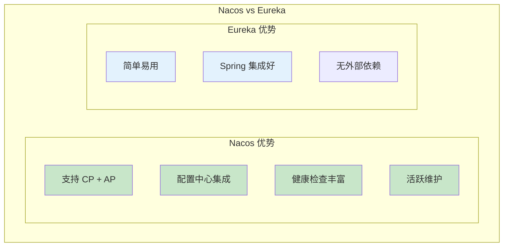

# Nacos 与 Eureka/Consul 对比

> **目标级别**：P6
> **面试频率**：🟡 中频
> **面试官最关心的 3 个问题**：
> 1. 主流服务注册中心有哪些？各有什么特点？
> 2. Nacos 和 Eureka 有什么区别？
> 3. 如何选择服务注册中心？

面试官问：「你们项目用的是什么注册中心？」你说「Nacos」——然后面试官紧接着追问「为什么选 Nacos 而不是 Eureka？它们有什么区别？」你沉默了。

服务注册中心的选型是微服务架构的重要决策，需要理解各方案的特点和适用场景。

## 一、注册中心概述

### 1.1 核心功能



### 1.2 主流注册中心

|| 注册中心 | 开发公司 | 主流版本 | 开源时间 |
|------|---------|---------|----------|---------|
| **Eureka** | Netflix/Netflix | 2.x | 2012 |
| **Nacos** | Alibaba | 2.x | 2018 |
| **Consul** | HashiCorp | 1.x | 2014 |
| **ZooKeeper** | Apache | 3.x | 2008 |
| **etcd** | CoreOS | 3.x | 2014 |

## 二、核心特性对比

### 2.1 一致性模型



### 2.2 一致性模型对比表

|| 维度 | Nacos | Eureka | Consul | ZooKeeper |
|------|------|-------|--------|--------|-----------|
| **一致性模型** | AP + CP | AP | CP | CP |
| **切换方式** | 可配置 | 仅 AP | 仅 CP | 仅 CP |
| **领导者选举** | Raft | 无 | Raft | Zab |
| **数据同步** | 多数派 | 异步复制 | Raft log | Zab 协议 |

### 2.3 健康检查对比



| 健康检查 | Nacos | Eureka | Consul |
|---------|-------|--------|--------|
| **客户端心跳** | 支持 | 支持 | 支持 |
| **服务端检测** | 支持 | 不支持 | 支持 |
| **TCP 检测** | 支持 | 不支持 | 支持 |
| **HTTP 检测** | 支持 | 不支持 | 支持 |
| **MySQL 检测** | 支持 | 不支持 | 支持 |
| **自定义检测** | 支持 | 不支持 | 支持 |

## 三、功能特性对比

### 3.1 功能矩阵

|| 功能 | Nacos | Eureka | Consul |
|------|------|-------|--------|--------|
| **服务注册** | ✅ | ✅ | ✅ |
| **服务发现** | ✅ | ✅ | ✅ |
| **健康检查** | ✅ | ✅ | ✅ |
| **配置管理** | ✅ | ❌ | ✅ |
| **多环境隔离** | Namespace | 无 | Namespace |
| **分组管理** | Group | 无 | Datacenter |
| **权重配置** | ✅ | ❌ | ❌ |
| **灰度发布** | ✅ | ❌ | ❌ |
| **DNS-Foo** | ✅ | ❌ | ✅ |

### 3.2 配置管理功能



Nacos 配置管理优势：
- 配置历史版本管理
- 配置回滚功能
- 配置变更监听
- 配置加密存储

## 四、性能对比

### 4.1 性能测试数据

|| 维度 | Nacos | Eureka | Consul |
|------|------|-------|--------|--------|
| **注册 QPS** | 20000+ | 15000+ | 10000+ |
| **查询 QPS** | 50000+ | 40000+ | 30000+ |
| **实例规模** | 百万级 | 十万级 | 百万级 |
| **集群节点** | 3-5 个 | 3 个 | 3-5 个 |

### 4.2 资源消耗



## 五、使用场景对比

### 5.1 选型决策树



### 5.2 场景推荐

| 场景 | 推荐方案 | 原因 |
|------|---------|------|
| **新项目启动** | Nacos | 功能全面，维护活跃 |
| **Spring Cloud 迁移** | Nacos | 兼容性好，Spring Cloud Alibaba |
| **纯 Java 生态** | Eureka | Netflix 官方，集成简单 |
| **多语言环境** | Consul | 跨语言，Envoy 集成 |
| **K8s 环境** | Consul | K8s 原生支持 |
| **配置中心需求** | Nacos/Consul | 内置配置管理 |
| **已有 ZooKeeper** | Nacos | 替换平滑 |

## 六、深入对比

### 6.1 Nacos vs Eureka



| 对比维度 | Nacos | Eureka |
|---------|-------|--------|
| **一致性模型** | AP + CP 可切换 | 仅 AP |
| **配置管理** | 内置 | 需配合 Config |
| **健康检查** | 多重机制 | 仅客户端心跳 |
| **多环境隔离** | Namespace + Group | 无 |
| **权重路由** | 支持 | 不支持 |
| **灰度发布** | 支持 | 不支持 |
| **维护状态** | 活跃维护 | 停止维护 |
| **版本** | 2.x | 2.x |

### 6.2 Nacos vs Consul

| 对比维度 | Nacos | Consul |
|---------|-------|--------|
| **一致性模型** | AP + CP | 仅 CP |
| **Java 集成** | 原生友好 | 需额外适配 |
| **配置中心** | 完善 | 基础 KV |
| **多语言支持** | 一般 | 优秀 |
| **K8s 集成** | 一般 | 原生支持 |
| **服务网格** | 有限 | Envoy 深度集成 |
| **性能** | 高 | 中 |

### 6.3 详细功能对比表

|| 功能点 | Nacos | Eureka | Consul |
|------|-------|-------|--------|--------|
| **服务注册** | 主动/被动 | 主动 | 主动 |
| **服务发现** | 订阅/轮询 | 轮询 | 订阅 |
| **元数据** | 丰富 | 基础 | 基础 |
| **命名空间** | Namespace | 无 | Namespace |
| **分组** | Group | 无 | Datacenter |
| **权重** | 支持 | 不支持 | 不支持 |
| **健康检查** | TCP/HTTP/MySQL | HTTP | TCP/HTTP/Script |
| **一致性** | Raft | 无 | Raft |
| **配置中心** | 完善 | 需额外组件 | 基础 KV |
| **控制台** | 功能丰富 | 基础 | 功能完善 |

## 七、面试高频题

### 🔴 题目 1：Nacos 和 Eureka 有什么区别？

**参考回答**：

| 区别 | Nacos | Eureka |
|------|-------|--------|
| **一致性模型** | AP + CP 可切换 | 仅 AP |
| **配置管理** | 内置配置中心 | 需配合 Spring Cloud Config |
| **健康检查** | 支持服务端主动检测 | 仅客户端心跳 |
| **多环境** | Namespace + Group | 无 |
| **维护状态** | 活跃 | 已停止维护 |
| **功能丰富度** | 更丰富 | 基础 |

### 🔴 题目 2：如何选择服务注册中心？

**参考回答**：

选型决策建议：

1. **新项目**：推荐 Nacos，功能全面，维护活跃
2. **Spring Cloud 项目**：优先 Nacos，集成方便
3. **多语言项目**：推荐 Consul，跨语言支持好
4. **K8s 环境**：推荐 Consul，原生支持
5. **已有 ZooKeeper**：可以考虑 Nacos 迁移

### 🟡 题目 3：为什么 Eureka 停止维护后不推荐使用？

**参考回答**：

Eureka 停止维护的问题：

1. **安全问题**：漏洞无法修复
2. **新特性缺失**：无法享受社区新功能
3. **兼容性风险**：与新版 Spring Cloud 兼容性问题
4. **生产风险**：无官方支持，问题难排查

## 八、常见错误与陷阱

### ⚠️ 陷阱 1：认为 AP 就比 CP 好

```
❌ 错误理解：
AP 比 CP 更好，所以只用 Eureka

✅ 正确理解：
- AP：可用性优先，最终一致，适合一般微服务
- CP：一致性优先，分区不可用，适合金融、订单等强一致性场景
- Nacos 可以根据场景切换
```

### ⚠️ 陷阱 2：忽视配置管理功能

```
❌ 错误理解：
注册中心只做服务发现，不需要配置管理

✅ 正确理解：
- 配置管理是重要功能
- 减少外部依赖
- 统一管理更方便
```

### ⚠️ 陷阱 3：迷信国外技术

```
❌ 错误理解：
Consul 是 HashiCorp 出的，一定比 Nacos 好

✅ 正确理解：
- 国内项目推荐 Nacos
- 文档中文友好
- 社区支持更好
- 功能更适合国内业务
```

### ⚠️ 陷阱 4：忽视运维成本

```
❌ 错误理解：
注册中心搭好就不用管了

✅ 正确理解：
- 需要监控注册中心健康
- 容量规划
- 故障切换演练
```

## 九、总结对比表

| 维度 | Nacos | Eureka | Consul |
|------|-------|--------|--------|
| **一致性** | AP + CP | AP | CP |
| **配置中心** | ✅ 完善 | ❌ | ✅ 基础 |
| **健康检查** | ✅ 多重 | ⚠️ 单一 | ✅ 多重 |
| **多环境隔离** | ✅ Namespace | ❌ | ✅ Namespace |
| **多语言支持** | 一般 | 一般 | ✅ 优秀 |
| **K8s 支持** | 一般 | 一般 | ✅ 原生 |
| **Java 集成** | ✅ 优秀 | ✅ 优秀 | 一般 |
| **社区活跃** | ✅ 活跃 | ❌ 停止 | ✅ 活跃 |
| **文档** | 中文友好 | 英文 | 英文 |
| **适用场景** | 国内微服务 | 简单场景 | 多语言/K8s |

## 十、加分回答

> **💡 面试加分点**：
>
> 1. **Service Mesh 趋势**：注册中心与 Service Mesh 融合
>
> 2. **多注册中心方案**：主备注册中心，故障自动切换
>
> 3. **Nacos 2.0 升级**：gRPC 通信，性能翻倍
>
> 4. **生产选型经验**：根据团队技术栈和业务场景综合决策
