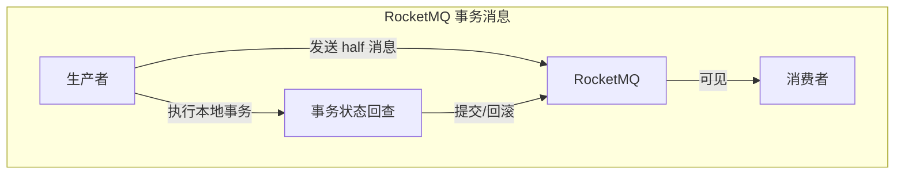
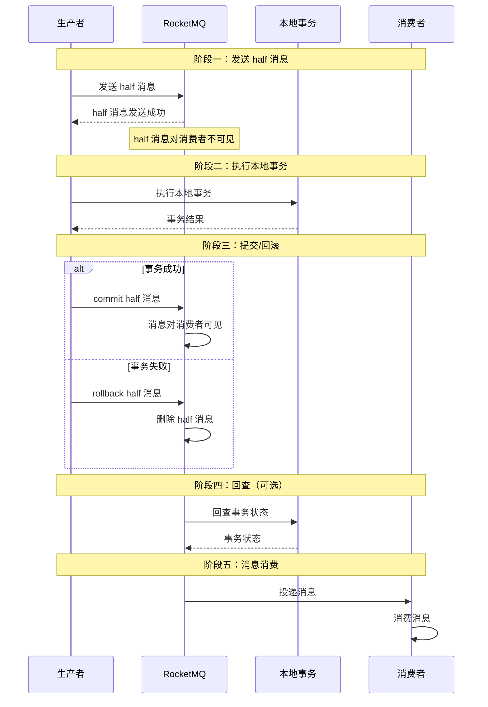
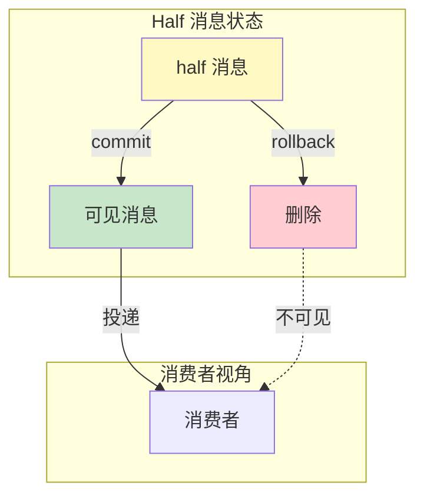
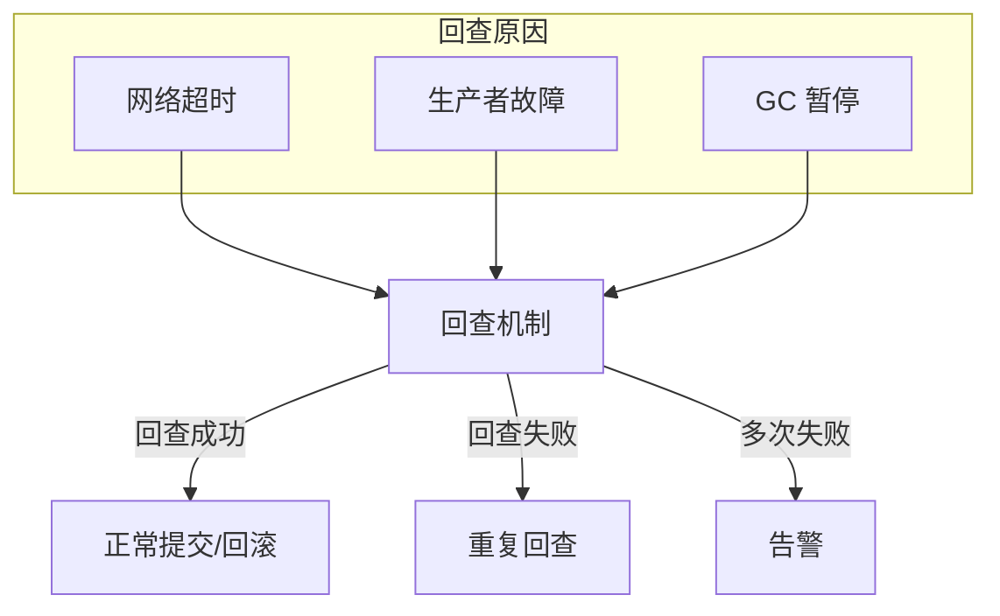

# RocketMQ 事务消息

> **目标级别**：P6
> **面试频率**：🟡 中频
> **面试官最关心的 3 个问题**：
> 1. RocketMQ 事务消息的原理是什么？
> 2. 事务消息的 half 消息是什么？
> 3. 事务消息如何保证最终一致？

面试官问：「RocketMQ 事务消息了解吗？」你说「知道，是 RocketMQ 的一个功能」——然后面试官紧接着追问「那 half 消息是什么？本地事务状态怎么回查？」你沉默了。

RocketMQ 事务消息是实现分布式事务的常用方案，是阿里巴巴双十一的核心技术。

## 一、RocketMQ 事务消息概述

### 1.1 什么是事务消息

RocketMQ 事务消息是一种可靠的消息投递机制，实现「本地事务 + 消息投递」的原子性：

- **half 消息**：本地事务执行前，先发送 half 消息（对消费者不可见）
- **本地事务**：执行本地业务逻辑
- **事务状态**：根据本地事务结果决定 commit 或 rollback half 消息
- **回查机制**：如果 half 消息未收到响应，定时回查本地事务状态



### 1.2 事务消息 vs 普通消息

| 特性 | 普通消息 | 事务消息 |
|------|----------|----------|
| **发送方式** | 发送即成功 | 两阶段提交 |
| **事务支持** | 无 | 有 |
| **失败处理** | 需业务处理 | 自动回滚 |
| **复杂度** | 低 | 高 |

## 二、RocketMQ 事务消息流程

### 2.1 完整流程图



### 2.2 事务消息代码实现

```java
public class TransactionProducer {

    public void sendTransactionMessage(Order order) {
        // 1. 创建事务消息
        Message message = new Message(
            "order-topic",
            "order-created",
            order.getId().toString(),
            JSON.toJSONBytes(order)
        );

        // 2. 发送事务消息
        TransactionSendResult result = producer.sendMessageInTransaction(
            message,
            new TransactionListener() {
                @Override
                public LocalTransactionState executeLocalTransaction(
                    Message msg,
                    Object arg
                ) {
                    // 执行本地事务
                    try {
                        // 1. 创建订单
                        orderService.createOrder((Order) arg);

                        // 2. 扣减库存
                        inventoryService.deductStock(
                            ((Order) arg).getProductId(),
                            ((Order) arg).getQuantity()
                        );

                        // 3. 返回提交
                        return LocalTransactionState.COMMIT_MESSAGE;

                    } catch (Exception e) {
                        // 事务失败，回滚
                        log.error("Transaction failed", e);
                        return LocalTransactionState.ROLLBACK_MESSAGE;
                    }
                }

                @Override
                public LocalTransactionState checkLocalTransaction(MessageExt msg) {
                    // 回查本地事务状态
                    String orderId = msg.getKeys();

                    // 查询订单状态
                    Order order = orderService.findById(orderId);

                    if (order != null) {
                        return LocalTransactionState.COMMIT_MESSAGE;
                    } else {
                        return LocalTransactionState.ROLLBACK_MESSAGE;
                    }
                }
            },
            order  // 传递给 executeLocalTransaction 的参数
        );
    }
}
```

### 2.3 生产者配置

```java
@Configuration
public class RocketMQConfig {

    @Bean
    public TransactionMQProducer transactionProducer() {
        TransactionMQProducer producer = new TransactionMQProducer("order-producer-group");

        // 设置 NameServer
        producer.setNamesrvAddr("localhost:9876");

        // 设置事务回查并发数
        producer.setExecutorService(
            new ThreadPoolExecutor(
                10, 50,
                60, TimeUnit.SECONDS,
                new LinkedBlockingQueue<>(1000)
            )
        );

        // 设置回查次数
        producer.setTransactionCheckInterval(30000L);  // 30秒
        producer.setTransactionCheckMax(15);  // 最多回查15次

        // 设置回查异常处理
        producer.setCheckExpireBlockPeriod(60000L);  // 消息过期时间

        return producer;
    }
}
```

## 三、half 消息详解

### 3.1 什么是 half 消息

**half 消息（half 消息）**：事务消息的中间状态，对消费者不可见。



### 3.2 half 消息的特点

| 特点 | 说明 |
|------|------|
| **不可见** | 消费者无法消费 |
| **可回滚** | 可以被 rollback 删除 |
| **可提交** | 可以被 commit 变为可见 |
| **超时处理** | 超时未响应会被回查或删除 |

### 3.3 half 消息的生命周期

```
┌─────────────────────────────────────────────────────────┐
│                    Half 消息生命周期                      │
├─────────────────────────────────────────────────────────┤
│                                                         │
│  1. 发送 half 消息                                       │
│     → 消息进入 RocketMQ                                  │
│     → 状态：Prepared                                     │
│     → 消费者不可见                                       │
│                                                         │
│  2. 执行本地事务                                         │
│     → 业务逻辑                                           │
│     → 返回事务结果                                       │
│                                                         │
│  3. 提交/回滚                                           │
│     → COMMIT_MESSAGE：消息可见                            │
│     → ROLLBACK_MESSAGE：消息删除                         │
│                                                         │
│  4. 回查（如果未收到响应）                                 │
│     → Broker 定时回查                                     │
│     → 根据状态决定提交或回滚                              │
│                                                         │
└─────────────────────────────────────────────────────────┘
```

## 四、事务状态回查机制

### 4.1 为什么要回查



### 4.2 回查参数配置

```java
// RocketMQ 回查配置
public class TransactionCheckConfig {

    // 回查间隔时间
    // 默认 30 秒
    producer.setTransactionCheckInterval(30000L);

    // 最大回查次数
    // 默认 15 次
    producer.setTransactionCheckMax(15);

    // 消息在多久后开始回查
    // 默认 30 秒
    producer.setTransactionTimeOut(30000L);

    // 消息检查线程池大小
    producer.setCheckThreadPoolMinSize(10);
    producer.setCheckThreadPoolMaxSize(50);
}
```

### 4.3 回查实现示例

```java
@Override
public LocalTransactionState checkLocalTransaction(MessageExt msg) {
    String transactionId = msg.getTransactionId();
    String orderId = msg.getKeys();

    try {
        // 1. 查询本地事务状态表
        TransactionLog log = transactionLogRepository.findByTransactionId(transactionId);

        if (log == null) {
            // 事务日志不存在，说明事务未执行
            // 返回 ROLLBACK
            return LocalTransactionState.ROLLBACK_MESSAGE;
        }

        // 2. 根据事务状态返回
        switch (log.getStatus()) {
            case COMMIT:
                return LocalTransactionState.COMMIT_MESSAGE;
            case ROLLBACK:
                return LocalTransactionState.ROLLBACK_MESSAGE;
            case UNKNOWN:
                // 未知状态，可能还在执行
                // 返回 UNKNOW，让 Broker 继续回查
                return LocalTransactionState.UNKNOW;
            default:
                return LocalTransactionState.UNKNOW;
        }

    } catch (Exception e) {
        log.error("Check transaction failed: {}", transactionId, e);
        // 查询失败，返回 UNKNOW 继续回查
        return LocalTransactionState.UNKNOW;
    }
}
```

## 五、RocketMQ vs 本地消息表

### 5.1 对比表

| 维度 | RocketMQ 事务消息 | 本地消息表 |
|------|------------------|------------|
| **实现复杂度** | 中 | 低 |
| **消息可靠性** | 高（RocketMQ 保证） | 高（本地事务保证） |
| **延迟** | 低（实时投递） | 中（轮询投递） |
| **运维成本** | 高（依赖 RocketMQ） | 低（纯数据库） |
| **回查机制** | 有 | 无（需自己实现） |
| **事务消息** | 原生支持 | 需自己实现 |

### 5.2 选择建议

| 场景 | 推荐方案 |
|------|----------|
| **已有 RocketMQ** | 使用 RocketMQ 事务消息 |
| **需要轻量方案** | 使用本地消息表 |
| **跨多系统** | RocketMQ 事务消息 |
| **简单场景** | 本地消息表 |

## 六、面试高频题

### 🔴 题目 1：RocketMQ 事务消息的原理是什么？

**参考回答**：

RocketMQ 事务消息的原理：

1. **发送 half 消息**：本地事务执行前，先发送 half 消息（对消费者不可见）
2. **执行本地事务**：执行业务逻辑，根据结果返回事务状态
3. **提交/回滚**：根据事务状态提交或回滚 half 消息
4. **事务回查**：如果未收到事务结果响应，RocketMQ 会定时回查

### 🔴 题目 2：half 消息是什么？

**参考回答**：

**half 消息**是事务消息的中间状态：

- **不可见**：消费者无法消费
- **可回滚**：可以被 rollback 删除
- **可提交**：可以被 commit 变为可见
- **超时处理**：超时未响应会被回查

**本质**：保证本地事务和消息投递的原子性

### 🟡 题目 3：本地事务状态如何回查？

**参考回答**：

回查机制的实现：

1. **事务状态表**：记录每笔事务的状态
2. **回查接口**：实现 `TransactionListener.checkLocalTransaction()`
3. **查询状态**：根据消息的 transactionId 查询事务状态
4. **返回状态**：COMMIT_MESSAGE / ROLLBACK_MESSAGE / UNKNOW

## 七、常见错误与陷阱

### ⚠️ 陷阱 1：本地事务和消息发送顺序错误

```
❌ 错误理解：
先执行本地事务，再发送 half 消息

✅ 正确理解：
必须先发送 half 消息，再执行本地事务
否则无法保证原子性
```

### ⚠️ 陷阱 2：回查接口不幂等

```
❌ 错误理解：
回查接口不需要幂等

✅ 正确理解：
回查可能被调用多次
必须保证幂等
```

### ⚠️ 陷阱 3：忽略事务超时

```
❌ 错误理解：
事务消息不会超时

✅ 正确理解：
half 消息有超时时间
超时后会被回查或删除
```

## 八、总结对比表

| 维度 | 普通消息 | 本地消息表 | RocketMQ 事务 |
|------|----------|------------|---------------|
| **事务支持** | 无 | 弱 | 强 |
| **实现复杂度** | 低 | 中 | 高 |
| **消息可靠性** | 中 | 高 | 高 |
| **延迟** | 低 | 中 | 低 |
| **运维成本** | 低 | 低 | 高 |

## 九、加分回答

> **💡 面试加分点**：
>
> 1. **RocketMQ 事务消息的局限**：单向消息、事务消息不支持延迟投递
>
> 2. **阿里的双十一实践**：事务消息在订单系统中的应用
>
> 3. **事务消息和本地消息表的对比**：各自适用场景
>
> 4. **其他 MQ 的事务消息**：Kafka 事务、RabbitMQ 事务
