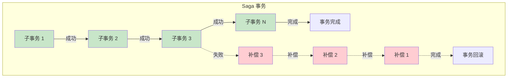
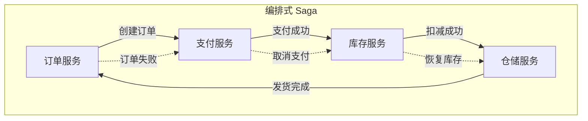
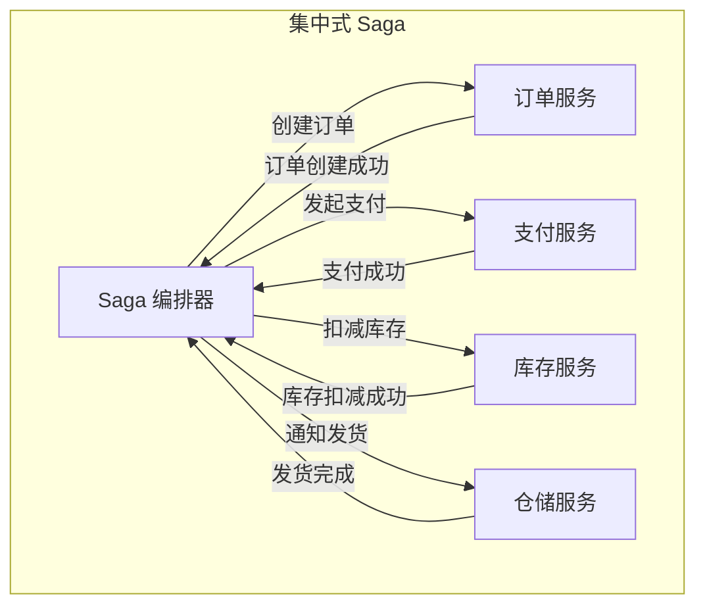
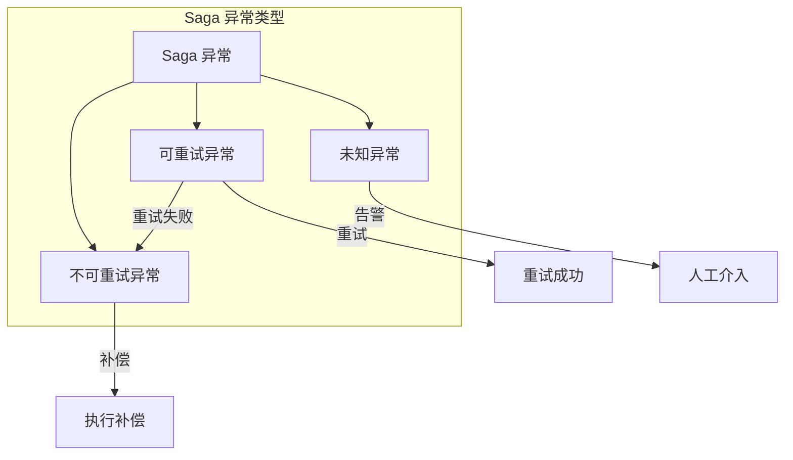
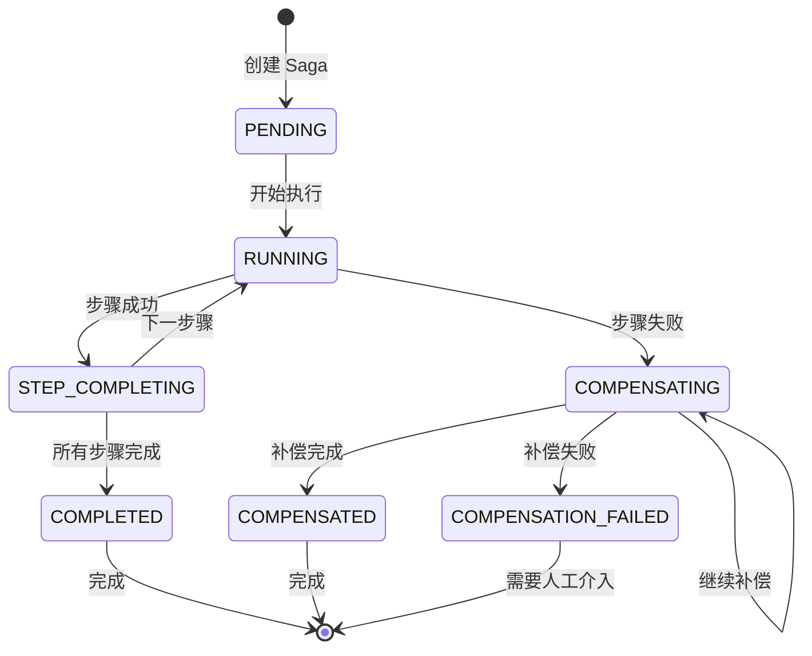

# Saga 事务

> **目标级别**：P6
> **面试频率**：🟡 中频
> **面试官最关心的 3 个问题**：
> 1. Saga 事务是什么？
> 2. Saga 和 TCC 有什么区别？
> 3. Saga 如何保证事务一致性？

面试官问：「Saga 事务了解吗？」你说「知道，是一种分布式事务方案」——然后面试官紧接着追问「那 Saga 的正向补偿和逆向回滚有什么区别？」你沉默了。

Saga 是长流程分布式事务的常用方案，适合处理跨多个服务的业务流程。

## 一、Saga 的基本概念

### 1.1 什么是 Saga

Saga 是一种分布式事务模式，将长事务拆分为多个本地事务，每个本地事务都有对应的补偿事务：

- **正向执行**：按顺序执行每个子事务
- **逆向补偿**：如果某个子事务失败，逆向执行已完成的补偿事务



### 1.2 Saga 的起源

Saga 最初由 Hector Garcia-Molina 和 Kenneth Salem 在 1987 年提出，用于处理长时间运行的事务（Long-running Transactions）。

### 1.3 Saga vs TCC vs 2PC

| 维度 | 2PC | TCC | Saga |
|------|-----|-----|------|
| **执行方式** | 两阶段提交 | 三阶段预留 | 顺序执行 + 补偿 |
| **资源锁定** | 数据库锁 | 业务预留 | 无锁定 |
| **阻塞时间** | 长 | 短 | 无 |
| **回滚方式** | 自动回滚 | 自定义回滚 | 正向补偿 |
| **适用场景** | 短事务 | 中等事务 | 长流程 |
| **业务侵入** | 低 | 高 | 中 |

## 二、Saga 的两种模式

### 2.1 编排式 Saga（Choreography）



**特点**：
- 服务间通过事件通信
- 无中央协调者
- 每个服务订阅其他服务的事件

### 2.2 编排式 Saga 代码示例

```java
// 订单服务
public class OrderService {

    @Autowired
    private EventPublisher publisher;

    public void createOrder(Order order) {
        // 创建订单
        orderRepository.save(order);

        // 发布订单创建事件
        publisher.publish(new OrderCreatedEvent(order));
    }

    @EventListener
    public void handlePaymentSuccess(PaymentSuccessEvent event) {
        // 更新订单状态
        orderService.updateStatus(event.getOrderId(), OrderStatus.PAID);

        // 发布库存扣减事件
        publisher.publish(new StockDeductRequest(event.getOrderId()));
    }

    @EventListener
    public void handlePaymentFailed(PaymentFailedEvent event) {
        // 取消订单
        orderService.cancel(event.getOrderId());
    }
}
```

### 2.3 集中式 Saga（Orchestration）



### 2.4 集中式 Saga 代码示例

```java
@Service
public class OrderSagaOrchestrator {

    @Autowired
    private OrderService orderService;
    @Autowired
    private PaymentService paymentService;
    @Autowired
    private StockService stockService;
    @Autowired
    private WarehouseService warehouseService;

    @Transactional
    public void createOrderSaga(OrderRequest request) {
        SagaContext context = new SagaContext();

        try {
            // 1. 创建订单
            Order order = orderService.create(request);
            context.setOrderId(order.getId());

            // 2. 扣减库存
            stockService.deduct(order.getProductId(), order.getQuantity());
            context.setStockDeducted(true);

            // 3. 发起支付
            paymentService.pay(order.getUserId(), order.getAmount());
            context.setPaymentDone(true);

            // 4. 通知发货
            warehouseService.notifyShip(order.getId());
            context.setShipNotified(true);

        } catch (Exception e) {
            // 补偿回滚
            rollback(context);
            throw e;
        }
    }

    private void rollback(SagaContext context) {
        if (context.isShipNotified()) {
            warehouseService.cancelShip(context.getOrderId());
        }
        if (context.isPaymentDone()) {
            paymentService.refund(context.getOrderId());
        }
        if (context.isStockDeducted()) {
            stockService.restore(context.getProductId(), context.getQuantity());
        }
        if (context.getOrderId() != null) {
            orderService.cancel(context.getOrderId());
        }
    }
}
```

## 三、Saga 的补偿机制

### 3.1 补偿事务的定义

```java
public interface Compensation<T> {

    /**
     * 执行正向操作
     */
    T execute();

    /**
     * 执行补偿操作
     */
    void compensate(T result);
}

// 示例：订单创建与取消
public class OrderCreation implements Compensation<Long> {

    private OrderService orderService;
    private OrderRequest request;

    @Override
    public Long execute() {
        Order order = orderService.create(request);
        return order.getId();
    }

    @Override
    public void compensate(Long orderId) {
        orderService.cancel(orderId);
    }
}
```

### 3.2 Saga 执行器实现

```java
public class SagaExecutor {

    private List<Compensation> steps = new ArrayList<>();

    public void addStep(Compensation step) {
        steps.add(step);
    }

    public void execute() {
        List<Object> results = new ArrayList<>();

        try {
            for (Compensation step : steps) {
                Object result = step.execute();
                results.add(result);
            }
        } catch (Exception e) {
            // 补偿回滚
            compensateReverse(results);
            throw e;
        }
    }

    private void compensateReverse(List<Object> results) {
        for (int i = results.size() - 1; i >= 0; i--) {
            try {
                steps.get(i).compensate(results.get(i));
            } catch (Exception e) {
                // 记录补偿失败
                log.error("Compensation failed for step {}", i, e);
            }
        }
    }
}
```

## 四、Saga 的异常处理

### 4.1 异常类型



### 4.2 异常处理策略

| 异常类型 | 处理策略 | 说明 |
|----------|----------|------|
| **可重试异常** | 自动重试 | 网络超时、临时故障 |
| **不可重试异常** | 补偿回滚 | 业务校验失败 |
| **未知异常** | 告警 + 人工介入 | 无法确定处理方式 |

### 4.3 幂等性处理

```java
public class IdempotentSaga {

    private Map<String, StepResult> executedSteps = new ConcurrentHashMap<>();

    public Object executeStep(String stepId, Supplier<Object> action) {
        // 幂等检查
        if (executedSteps.containsKey(stepId)) {
            StepResult result = executedSteps.get(stepId);
            if (result.isSuccess()) {
                return result.getResult();
            } else {
                throw new BusinessException("Step already failed: " + stepId);
            }
        }

        try {
            Object result = action.get();
            executedSteps.put(stepId, StepResult.success(result));
            return result;
        } catch (Exception e) {
            executedSteps.put(stepId, StepResult.failure(e));
            throw e;
        }
    }
}
```

## 五、Saga 的状态管理

### 5.1 Saga 状态机



### 5.2 状态持久化

```java
@Entity
public class SagaInstance {

    @Id
    private String sagaId;

    private String status;  // PENDING, RUNNING, COMPLETED, COMPENSATING, COMPENSATED

    @ElementCollection
    private List<StepSnapshot> steps;

    private Long createdAt;
    private Long updatedAt;

    public void addStepSnapshot(StepSnapshot snapshot) {
        this.steps.add(snapshot);
        this.updatedAt = System.currentTimeMillis();
    }
}

@Entity
public class StepSnapshot {

    private String stepId;
    private String stepType;
    private String status;  // PENDING, SUCCESS, COMPENSATED, FAILED
    private String result;  // 执行结果
    private String compensation;  // 补偿数据
    private Integer retryCount;
}
```

## 六、面试高频题

### 🔴 题目 1：Saga 事务是什么？

**参考回答**：

Saga 是一种分布式事务模式，将长事务拆分为多个本地事务：

1. **正向执行**：按顺序执行每个子事务
2. **逆向补偿**：如果某个子事务失败，逆向执行已完成的补偿事务

**特点**：
- 无锁设计，性能好
- 适合长流程事务
- 需要业务实现补偿逻辑

### 🔴 题目 2：Saga 和 TCC 有什么区别？

**参考回答**：

| 区别 | TCC | Saga |
|------|-----|------|
| **资源预留** | 有（Try 阶段预留） | 无 |
| **回滚方式** | 自定义回滚 | 正向补偿 |
| **阻塞时间** | 短（Try 阶段） | 无 |
| **适用场景** | 中等流程 | 长流程 |
| **业务侵入** | 高 | 中 |

### 🟡 题目 3：Saga 如何保证事务一致性？

**参考回答**：

Saga 通过以下机制保证事务一致性：

1. **状态持久化**：每个步骤的执行状态都持久化
2. **幂等性保证**：每个步骤支持重试
3. **补偿机制**：失败时逆向执行补偿
4. **异常处理**：区分可重试和不可重试异常
5. **人工介入**：无法自动处理时告警

## 七、常见错误与陷阱

### ⚠️ 陷阱 1：补偿逻辑不完整

```
❌ 错误理解：
补偿就是简单的撤销操作

✅ 正确理解：
补偿需要考虑：
- 幂等性
- 重试机制
- 补偿失败处理
```

### ⚠️ 陷阱 2：忽略幂等性

```
❌ 错误理解：
Saga 步骤只会执行一次

✅ 正确理解：
网络问题可能导致重复执行
必须保证幂等
```

### ⚠️ 陷阱 3：补偿超时处理

```
❌ 错误理解：
补偿超时后一直重试

✅ 正确理解：
需要设置最大重试次数
超过后告警人工介入
```

## 八、总结对比表

| 维度 | 2PC | TCC | Saga |
|------|-----|-----|------|
| **执行方式** | 两阶段提交 | 三阶段预留 | 顺序 + 补偿 |
| **资源锁定** | 数据库锁 | 业务预留 | 无 |
| **阻塞时间** | 长 | 短 | 无 |
| **回滚方式** | 自动回滚 | 自定义回滚 | 正向补偿 |
| **适用场景** | 短事务 | 中等事务 | 长流程 |
| **业务侵入** | 低 | 高 | 中 |
| **一致性保证** | 强一致 | 最终一致 | 最终一致 |

## 九、加分回答

> **💡 面试加分点**：
>
> 1. **Eventuate Tram**：Saga 框架，支持编排式和集中式
>
> 2. **Axon Framework**：支持 Saga 模式的 CQRS 框架
>
> 3. **ServiceComb Pack**：华为开源的 Saga 框架
>
> 4. **补偿事务的 ACID**：Saga 的补偿不是 ACID，而是 BASE
