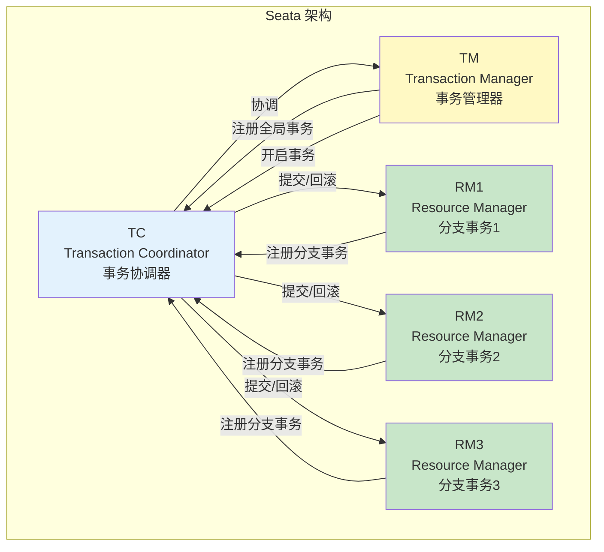
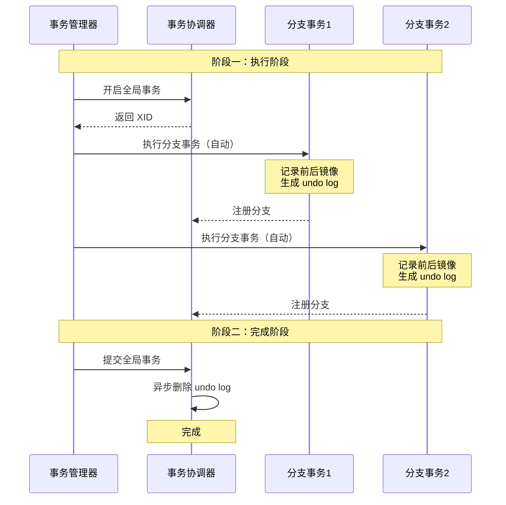
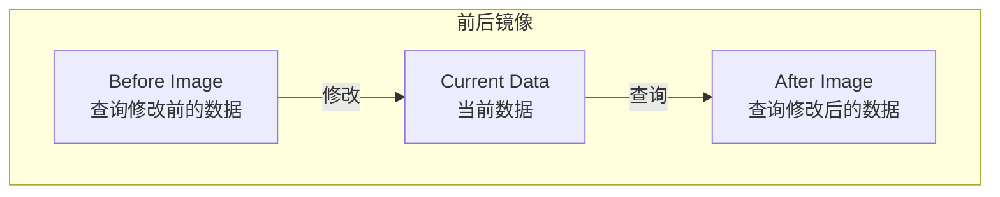
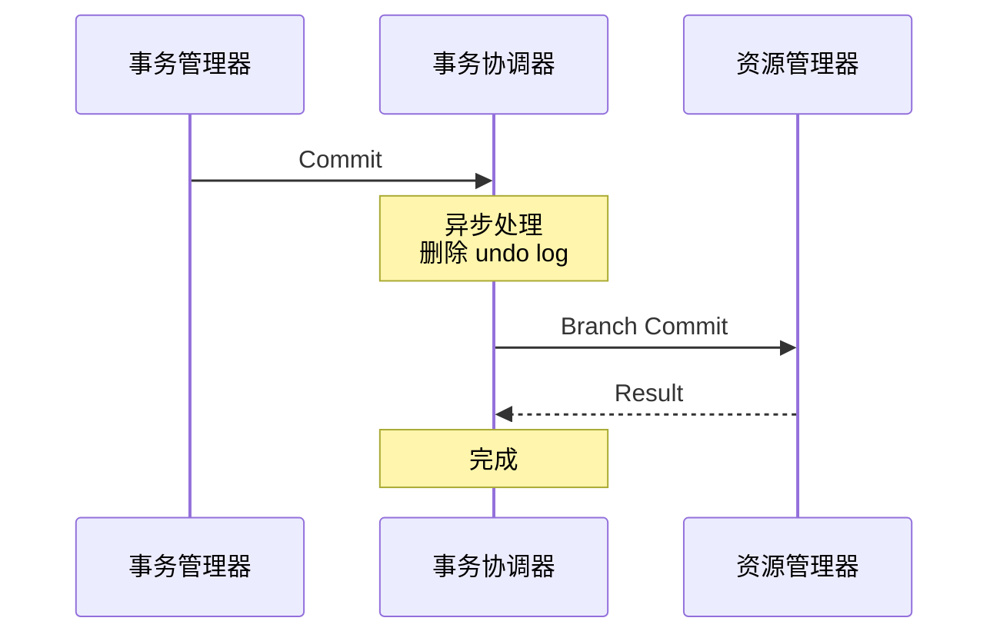
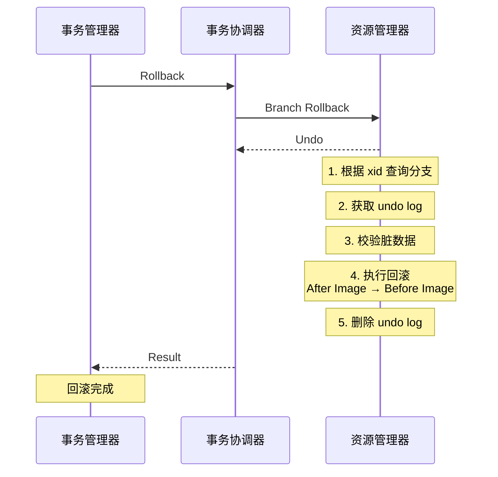
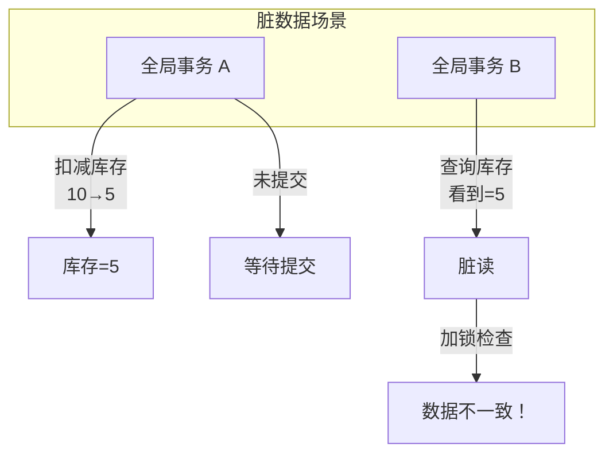

# Seata AT 模式

> **目标级别**：P6
> **面试频率**：🔴 高频
> **面试官最关心的 3 个问题**：
> 1. Seata AT 模式的原理是什么？
> 2. Seata AT 和 TCC 有什么区别？
> 3. Seata 如何实现分布式事务的？

面试官问：「Seata 了解吗？」你说「知道，是阿里的分布式事务框架」——然后面试官紧接着追问「那 AT 模式和 TCC 有什么区别？Seata 的 undo log 是怎么工作的？」你沉默了。

Seata 是阿里巴巴开源的分布式事务解决方案，AT 模式是其核心模式，对业务代码侵入极小。

## 一、Seata 概述

### 1.1 什么是 Seata

Seata（Simple Extensible Autonomous Transaction Architecture）是一款开源的分布式事务解决方案：

- **AT 模式**：无侵入的自动补偿模式
- **TCC 模式**：Try-Confirm-Cancel 模式
- **Saga 模式**：长事务模式
- **XA 模式**：基于 XA 协议的强一致模式



### 1.2 Seata 三大角色

| 角色 | 说明 | 职责 |
|------|------|------|
| **TC（Transaction Coordinator）** | 事务协调器 | 维护全局事务状态，协调提交/回滚 |
| **TM（Transaction Manager）** | 事务管理器 | 定义全局事务边界，开启/提交/回滚 |
| **RM（Resource Manager）** | 资源管理器 | 管理分支事务资源，向 TC 注册分支 |

### 1.3 AT 模式特点

| 特点 | 说明 |
|------|------|
| **无侵入** | 对业务代码零侵入 |
| **自动补偿** | 通过 undo log 自动回滚 |
| **性能高** | 无锁设计，异步执行 |
| **易用** | 配置简单，上手快 |

## 二、Seata AT 模式原理

### 2.1 AT 模式流程



### 2.2 核心概念

**前后镜像（Before Image / After Image）**：



**Undo Log 结构**：

```sql
CREATE TABLE undo_log (
    id              BIGINT PRIMARY KEY AUTO_INCREMENT,
    branch_id       BIGINT NOT NULL,
    xid             VARCHAR(100) NOT NULL,
    context         VARCHAR(128) NOT NULL,
    rollback_info   LONGBLOB NOT NULL,  -- 存储前后镜像
    log_status      INT NOT NULL,
    log_created     DATETIME NOT NULL,
    log_modified    DATETIME NOT NULL,
    UNIQUE KEY `ux_undo_log` (xid, branch_id)
);
```

### 2.3 分支事务执行

```java
// AT 模式自动处理
@GlobalTransactional
public void createOrder(Order order) {
    // 1. 扣减库存（AT 自动处理）
    inventoryMapper.decreaseStock(order.getProductId(), order.getQuantity());

    // 2. 创建订单（AT 自动处理）
    orderMapper.insert(order);

    // 3. 扣减余额（AT 自动处理）
    accountMapper.decreaseBalance(order.getUserId(), order.getAmount());
}

// 全局事务注解
// @GlobalTransactional = TM 开启全局事务
```

### 2.4 全局事务提交



**为什么异步删除？**

因为全局事务提交意味着所有分支都成功了，不需要回滚，所以可以异步删除 undo log。

## 三、Seata AT 模式回滚

### 3.1 回滚流程



### 3.2 回滚实现

```java
public class UndoLogManager {

    public void undo(DataSourceProxy dataSource, Xid xid, BranchId branchId) {
        // 1. 获取数据库连接
        Connection conn = dataSource.getConnection();

        // 2. 查询 undo log
        UndoLog undoLog = queryUndoLog(xid, branchId);

        // 3. 解析 undo log
        BranchUndoLog branchUndoLog = UndoLogParser.get().decode(undoLog.getRollbackInfo());

        // 4. 校验数据（检查当前数据是否与 after_image 一致）
        for (RowLock row : branchUndoLog.getAfterImage()) {
            RowLock current = queryCurrentData(conn, row);
            if (!row.equals(current)) {
                throw new CannotUndoException("Data has been modified");
            }
        }

        // 5. 执行回滚
        for (RowLock row : branchUndoLog.getBeforeImage()) {
            // 使用 before_image 覆盖当前数据
            updateData(conn, row);
        }

        // 6. 删除 undo log
        deleteUndoLog(xid, branchId);
    }
}
```

## 四、脏数据处理

### 4.1 脏数据场景



### 4.2 脏数据处理策略

| 策略 | 说明 |
|------|------|
| **最大努力通知** | 记录脏数据，人工处理 |
| **seata脏数据表** | 记录脏数据，后续补偿 |
| **设置超时** | 超时后自动回滚 |
| **人工干预** | 告警通知，人工处理 |

```java
// 脏数据配置
@Configuration
public class SeataConfig {

    @Bean
    public GlobalTransactionScanner globalTransactionScanner() {
        return new GlobalTransactionScanner(
            "order-service",  // 应用名称
            "my-tx-group",     // 事务组
            configuration     // 配置
        );
    }
}

// 自定义脏数据处理
@Configuration
public class DirtyDataHandler {

    @Bean
    public DirtyDataManager dirtyDataManager() {
        return new DirtyDataManager() {
            @Override
            public void addDirtyData(DirtyDataItem item) {
                // 保存脏数据到数据库
                dirtyDataRepository.save(new DirtyData(item));

                // 发送告警
                alertService.alert("发现脏数据: " + item);
            }
        };
    }
}
```

## 五、Seata AT vs TCC

### 5.1 对比表

| 维度 | Seata AT | TCC |
|------|----------|-----|
| **侵入性** | 零侵入 | 高侵入 |
| **实现方式** | 自动补偿 | 手动编码 |
| **锁粒度** | 细粒度 | 细粒度 |
| **性能** | 高 | 中 |
| **回滚方式** | undo log | 自定义补偿 |
| **适用场景** | 大多数场景 | 特殊场景 |

### 5.2 选择建议

| 场景 | 推荐模式 |
|------|----------|
| **大多数场景** | Seata AT |
| **需要人工干预** | Seata Saga |
| **资源不支持undo** | TCC |
| **强一致场景** | XA |

## 六、面试高频题

### 🔴 题目 1：Seata AT 模式的原理是什么？

**参考回答**：

Seata AT 模式的核心原理：

1. **两阶段提交**：
   - 第一阶段：解析 SQL，生成前后镜像，记录 undo log
   - 第二阶段：根据全局事务结果提交或回滚

2. **undo log**：
   - 记录数据修改前后的状态
   - 回滚时根据 undo log 恢复数据

3. **全局事务协调**：
   - TC 协调多个分支事务
   - 管理全局事务状态

### 🔴 题目 2：Seata AT 和 TCC 有什么区别？

**参考回答**：

| 区别 | Seata AT | TCC |
|------|----------|-----|
| **侵入性** | 零侵入，配置即可 | 高侵入，需实现三阶段 |
| **回滚方式** | 自动（undo log） | 手动（补偿逻辑） |
| **开发成本** | 低 | 高 |
| **适用范围** | 大多数场景 | 特殊场景 |
| **灵活性** | 一般 | 高 |

### 🟡 题目 3：undo log 是怎么工作的？

**参考回答**：

**undo log 工作流程**：

1. **记录前镜像**：执行 SQL 前，查询当前数据
2. **执行 SQL**：执行实际的修改
3. **记录后镜像**：执行 SQL 后，查询修改后的数据
4. **保存 undo log**：将前后镜像保存到 undo log 表
5. **回滚时**：根据前镜像恢复数据

## 七、常见错误与陷阱

### ⚠️ 陷阱 1：AT 模式不支持的 SQL

```
❌ 错误理解：
AT 模式支持所有 SQL

✅ 正确理解：
AT 模式有 SQL 限制：
- 不支持 SELECT FOR UPDATE
- 不支持跨库跨表查询
```

### ⚠️ 陷阱 2：全局事务范围太大

```
❌ 错误理解：
把所有操作都放在一个全局事务

✅ 正确理解：
全局事务范围应该尽量小
减少锁竞争和性能影响
```

### ⚠️ 陷阱 3：忽略脏数据

```
❌ 错误理解：
AT 模式不会产生脏数据

✅ 正确理解：
并发情况下可能产生脏数据
需要配置脏数据处理策略
```

## 八、总结对比表

| 维度 | 2PC | TCC | Seata AT | Saga |
|------|-----|-----|----------|------|
| **侵入性** | 低 | 高 | 零侵入 | 中 |
| **一致性** | 强一致 | 最终一致 | 最终一致 | 最终一致 |
| **性能** | 低 | 中 | 高 | 高 |
| **复杂度** | 中 | 高 | 低 | 中 |
| **适用场景** | 单库 | 跨服务 | 跨库 | 长流程 |

## 九、加分回答

> **💡 面试加分点**：
>
> 1. **Seata AT 的 SQL 解析**：使用 Antlr 解析 SQL
>
> 2. **Seata 高可用**：TC 支持集群部署
>
> 3. **Seata 在阿里的实践**：双十一大规模使用
>
> 4. **Seata 与 Spring Cloud**：与 Spring Cloud Alibaba 集成
