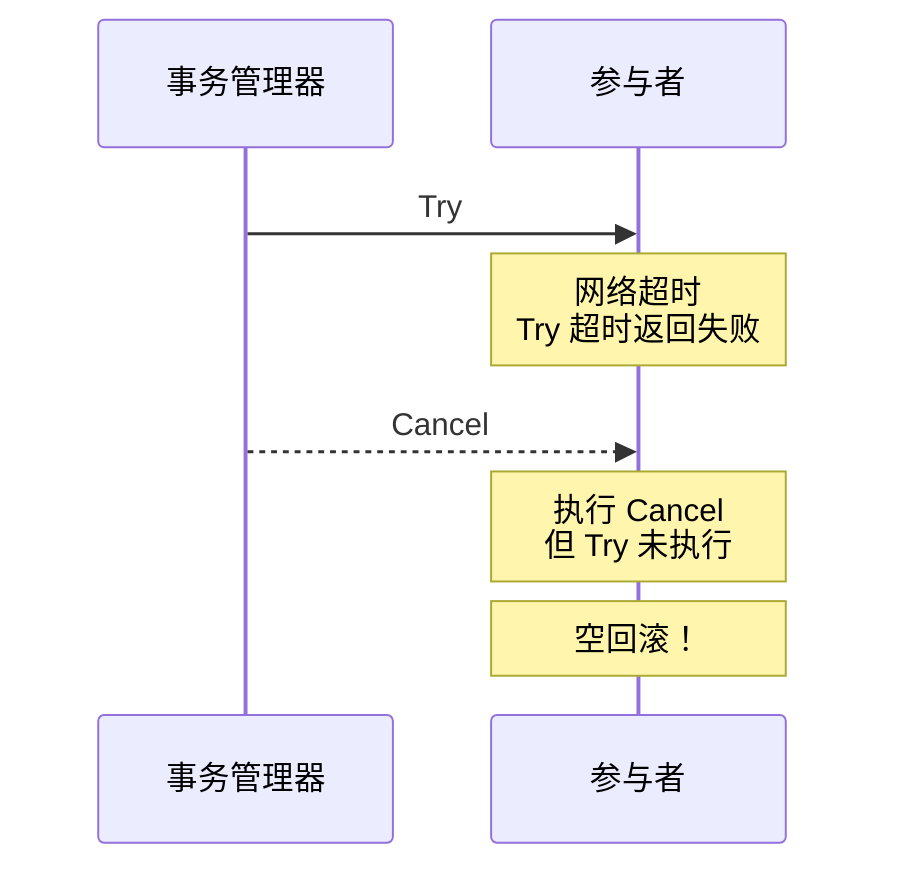
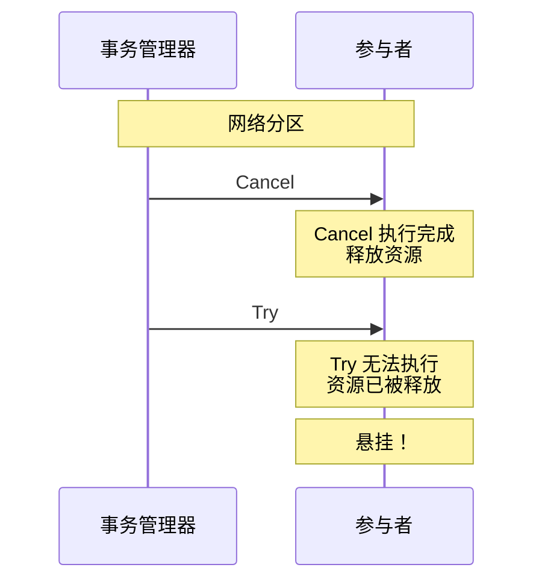
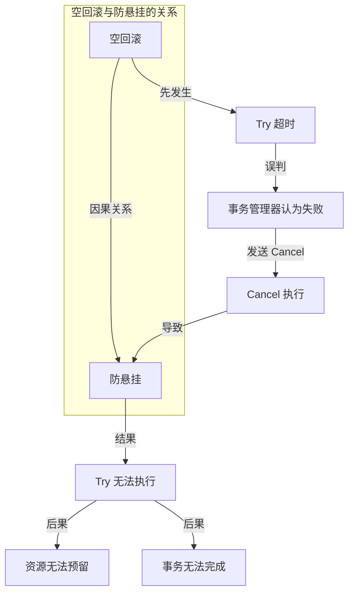
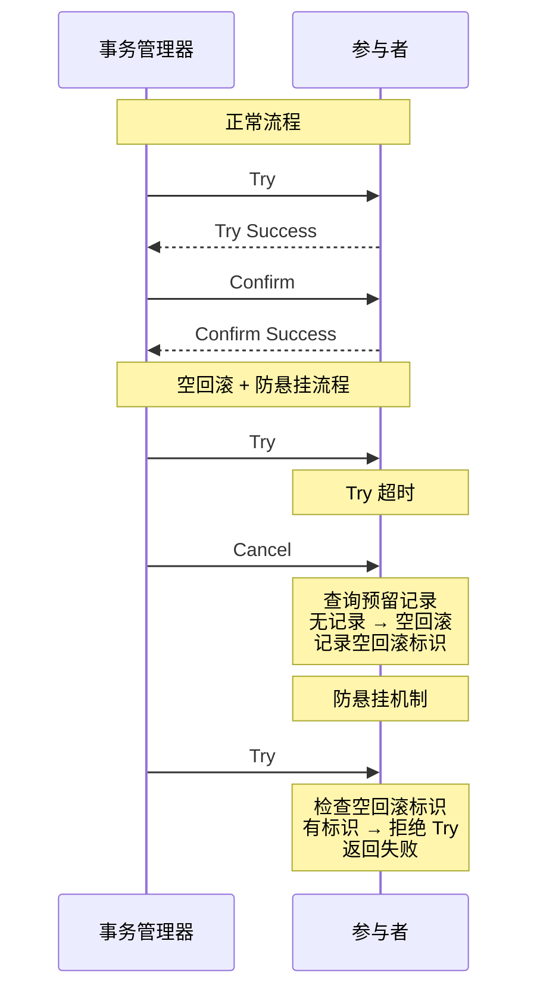
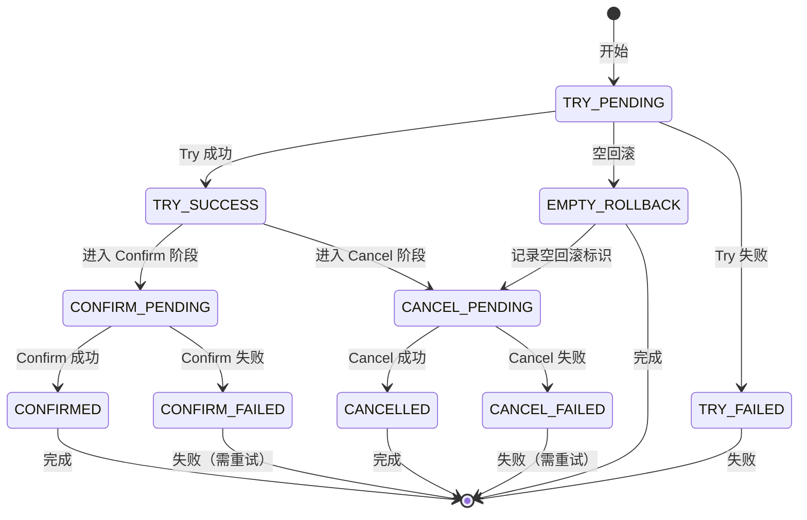

# TCC 空回滚与防悬挂

> **目标级别**：P6
> **面试频率**：🟡 中频
> **面试官最关心的 3 个问题**：
> 1. 什么是 TCC 的空回滚？
> 2. 什么是 TCC 的防悬挂？
> 3. 如何解决空回滚和防悬挂问题？

面试官问：「TCC 的空回滚和防悬挂是什么？」你说「就是字面意思」——然后面试官紧接着追问「那具体是怎么产生的？怎么解决？」你沉默了。

空回滚和防悬挂是 TCC 事务的经典问题，理解它们才能真正掌握 TCC。

## 一、空回滚问题

### 1.1 什么是空回滚

**空回滚（Empty Rollback）**：Try 阶段未执行，但 Cancel 阶段被执行了。



### 1.2 空回滚的产生场景

| 场景 | 说明 |
|------|------|
| **网络超时** | Try 消息发送后超时，事务管理器认为 Try 失败 |
| **节点故障** | Try 执行过程中节点故障 |
| **应用重启** | Try 执行后，应用重启丢失上下文 |

### 1.3 空回滚的问题

1. **数据不一致**：Cancel 回滚了不存在的操作
2. **业务错误**：Cancel 可能依赖 Try 的某些状态
3. **日志混乱**：空回滚可能掩盖真正的问题

### 1.4 空回滚的解决方案

```java
public class TccParticipant {

    // 预留记录存储
    private Map<String, ReservationRecord> reservationStore = new ConcurrentHashMap<>();

    public boolean cancel(BusinessContext context) {
        String txId = context.getTransactionId();

        // 1. 查询预留记录
        ReservationRecord record = reservationStore.get(txId);

        // 2. 如果没有预留记录，说明 Try 未执行
        if (record == null) {
            log.warn("Empty rollback detected: txId={}", txId);

            // 3. 记录空回滚标识
            saveEmptyRollbackFlag(txId);

            return true;  // 空回滚返回成功
        }

        // 4. 正常回滚
        return doRollback(record);
    }

    private void saveEmptyRollbackFlag(String txId) {
        // 记录空回滚标识，用于防悬挂
        emptyRollbackStore.put(txId, System.currentTimeMillis());
    }
}
```

## 二、防悬挂问题

### 2.1 什么是防悬挂

**防悬挂（Suspension Prevention）**：Cancel 先执行，Try 后执行，导致 Try 无法完成。



### 2.2 防悬挂的产生场景

| 场景 | 说明 |
|------|------|
| **网络延迟** | Cancel 消息比 Try 消息先到达 |
| **节点负载** | 节点处理 Cancel 比 Try 快 |
| **事务管理器重试** | Cancel 重试导致先执行 |

### 2.3 防悬挂的问题

1. **资源泄漏**：Try 无法预留资源
2. **事务无法完成**：事务一直处于未完成状态
3. **数据不一致**：部分操作未执行

### 2.4 防悬挂的解决方案

```java
public class AntiSuspensionTccParticipant {

    // 空回滚标识存储
    private Set<String> emptyRollbackFlags = ConcurrentHashMap.newKeySet();

    public boolean try(BusinessContext context) {
        String txId = context.getTransactionId();

        // 1. 检查是否有空回滚标识
        // 如果有，说明 Cancel 已执行，Try 不执行
        if (emptyRollbackFlags.contains(txId)) {
            log.warn("Suspension prevention: txId={}", txId);
            return false;
        }

        // 2. 执行正常的 Try
        return doTry(context);
    }

    public boolean cancel(BusinessContext context) {
        String txId = context.getTransactionId();

        // 1. 执行正常的 Cancel
        boolean result = doCancel(context);

        // 2. 如果 Cancel 成功（说明 Try 未执行），记录空回滚标识
        if (result) {
            emptyRollbackFlags.add(txId);
        }

        return result;
    }
}
```

## 三、空回滚与防悬挂的关系

### 3.1 关系图解



### 3.2 解决流程



## 四、完整代码实现

### 4.1 TCC 参与者实现

```java
public class TccParticipantImpl implements TccParticipant {

    // 预留记录存储
    private Map<String, ReservationRecord> reservations = new ConcurrentHashMap<>();

    // 空回滚标识存储
    private Set<String> emptyRollbackFlags = ConcurrentHashMap.newKeySet();

    @Override
    public boolean try_(BusinessContext context) {
        String txId = context.getTransactionId();

        // 防悬挂检查
        if (emptyRollbackFlags.contains(txId)) {
            log.warn("Suspension prevention: txId={}", txId);
            return false;
        }

        try {
            // 1. 执行预留操作
            ReservationRecord record = doReserve(context);

            // 2. 存储预留记录
            reservations.put(txId, record);

            // 3. 记录事务状态
            saveTransactionStatus(txId, TransactionStatus.TRY_SUCCESS);

            return true;
        } catch (Exception e) {
            log.error("Try failed: txId={}", txId, e);
            return false;
        }
    }

    @Override
    public boolean confirm(BusinessContext context) {
        String txId = context.getTransactionId();

        // 1. 查询预留记录
        ReservationRecord record = reservations.get(txId);
        if (record == null) {
            // Confirm 幂等
            log.warn("Confirm skipped: txId={}, no reservation found", txId);
            return true;
        }

        try {
            // 2. 执行确认操作
            doConfirm(record);

            // 3. 删除预留记录
            reservations.remove(txId);

            // 4. 清理空回滚标识
            emptyRollbackFlags.remove(txId);

            return true;
        } catch (Exception e) {
            log.error("Confirm failed: txId={}", txId, e);
            throw e;  // 需要重试
        }
    }

    @Override
    public boolean cancel(BusinessContext context) {
        String txId = context.getTransactionId();

        // 1. 查询预留记录
        ReservationRecord record = reservations.get(txId);

        if (record == null) {
            // 空回滚
            log.warn("Empty rollback: txId={}", txId);

            // 记录空回滚标识（用于防悬挂）
            emptyRollbackFlags.add(txId);

            // 保存取消状态
            saveTransactionStatus(txId, TransactionStatus.EMPTY_ROLLBACK);

            return true;
        }

        try {
            // 2. 执行回滚操作
            doRollback(record);

            // 3. 删除预留记录
            reservations.remove(txId);

            // 4. 清理空回滚标识
            emptyRollbackFlags.remove(txId);

            return true;
        } catch (Exception e) {
            log.error("Cancel failed: txId={}", txId, e);
            throw e;  // 需要重试
        }
    }

    // 定时清理过期标识（防止内存泄漏）
    @Scheduled(fixedRate = 60000)
    public void cleanupExpiredFlags() {
        long expireTime = System.currentTimeMillis() - 24 * 60 * 60 * 1000;
        emptyRollbackFlags.removeIf(
            flag -> emptyRollbackFlags.stream()
                .anyMatch(f -> f.equals(flag) && isExpired(f, expireTime))
        );
    }
}
```

### 4.2 事务状态机



## 五、面试高频题

### 🔴 题目 1：什么是 TCC 的空回滚？

**参考回答**：

**空回滚**：Try 阶段未执行，但 Cancel 阶段被执行了。

**产生原因**：
1. Try 消息发送后超时
2. 事务管理器误判 Try 失败
3. 发送 Cancel 到未执行 Try 的参与者

**解决方案**：
1. Cancel 时检查预留记录
2. 如果没有预留记录，记录空回滚标识
3. 返回成功，避免空回滚导致事务一直回滚

### 🔴 题目 2：什么是 TCC 的防悬挂？

**参考回答**：

**防悬挂**：Cancel 先执行，Try 后执行，导致 Try 无法完成。

**产生原因**：
1. 网络延迟导致 Cancel 比 Try 先到达
2. 节点处理 Cancel 比 Try 快
3. 事务管理器重试 Cancel

**解决方案**：
1. 利用空回滚标识
2. Try 执行前检查是否有空回滚标识
3. 如果有，说明 Cancel 已执行，拒绝 Try

### 🟡 题目 3：空回滚和防悬挂的关系？

**参考回答**：

**因果关系**：
1. 空回滚先发生
2. 空回滚记录标识
3. 防悬挂利用这个标识

**解决思路**：
- 先解决空回滚（记录标识）
- 再解决防悬挂（检查标识）

## 六、常见错误与陷阱

### ⚠️ 陷阱 1：空回滚不记录标识

```
❌ 错误理解：
空回滚直接返回成功就行

✅ 正确理解：
空回滚需要记录标识
用于后续的防悬挂检查
```

### ⚠️ 陷阱 2：防悬挂检查时机不对

```
❌ 错误理解：
Try 开始就检查标识

✅ 正确理解：
防悬挂检查应该在预留操作之前
检查标识，如果存在则拒绝
```

### ⚠️ 陷阱 3：标识不清理

```
❌ 错误理解：
标识记录后不用管

✅ 正确理解：
标识需要定期清理
否则会导致内存泄漏
```

## 七、总结对比表

| 问题 | 定义 | 原因 | 解决方案 |
|------|------|------|----------|
| **空回滚** | Try 未执行，Cancel 执行了 | 网络超时、节点故障 | 检查预留记录 |
| **防悬挂** | Cancel 先执行，Try 后执行 | 网络延迟、重试 | 检查空回滚标识 |

## 八、加分回答

> **💡 面试加分点**：
>
> 1. **TCC-Transaction 框架**：开源 TCC 框架，完整实现空回滚和防悬挂
>
> 2. **Seata TCC 模式**：阿里 Seata 的 TCC 实现
>
> 3. **标识存储优化**：使用 Redis 存储标识，支持集群环境
>
> 4. **超时机制优化**：合理的超时时间，减少空回滚和防悬挂的概率
