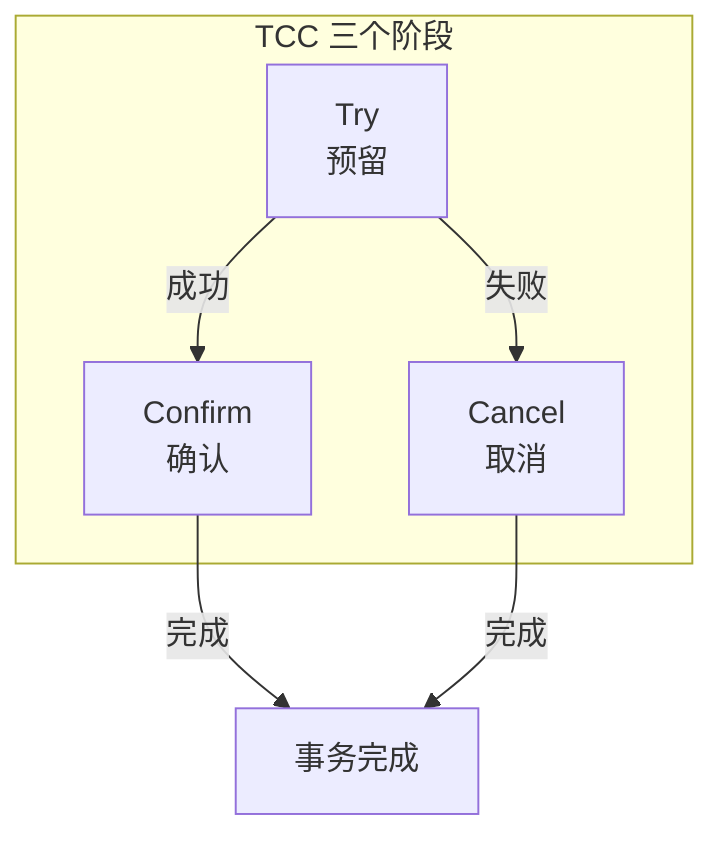
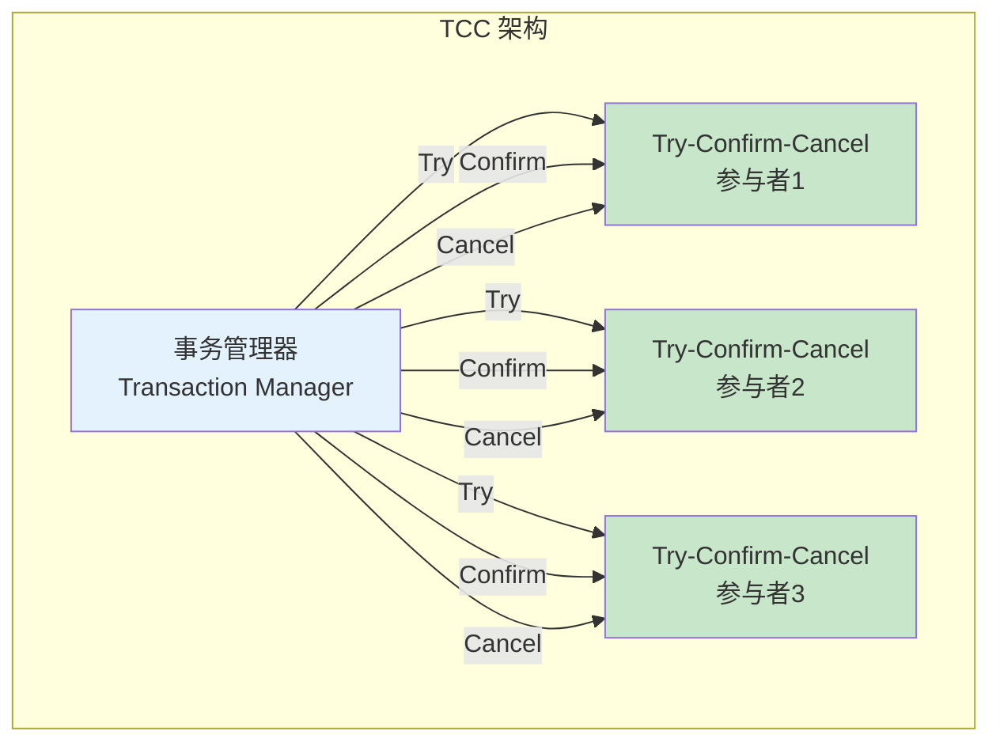
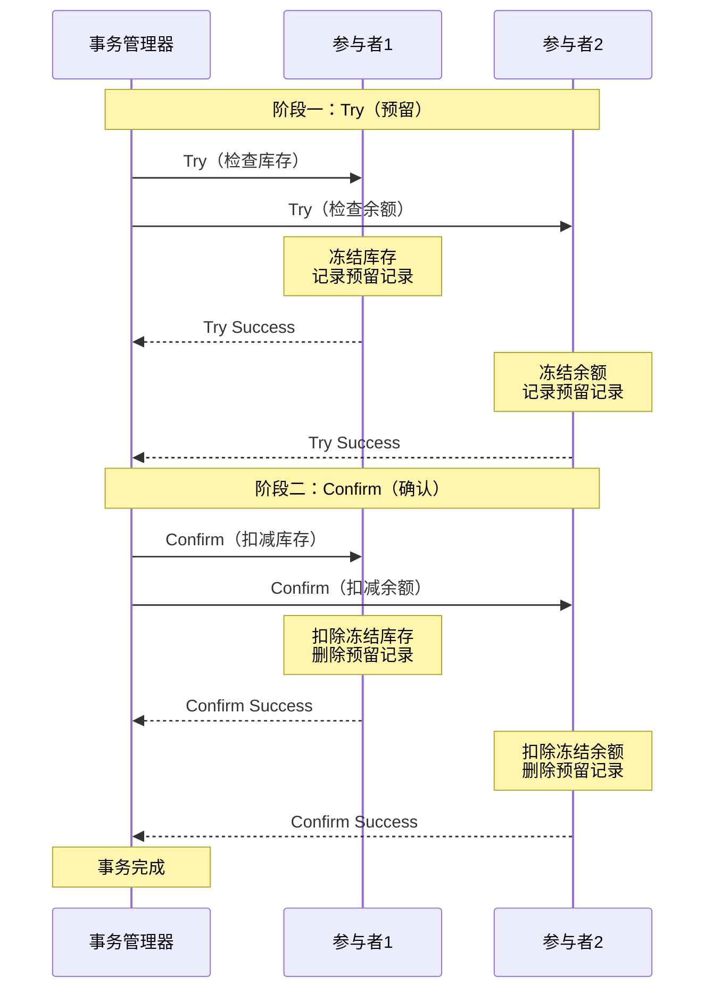
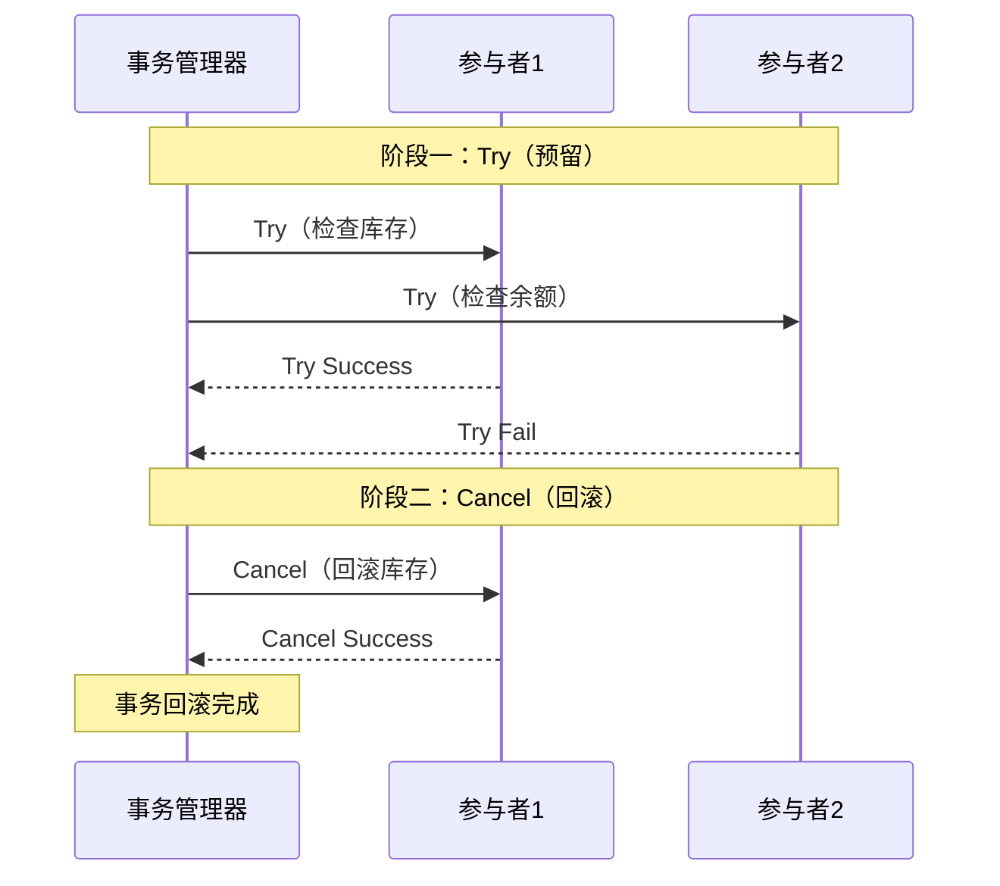

# TCC 事务原理

> **目标级别**：P6
> **面试频率**：🔴 高频
> **面试官最关心的 3 个问题**：
> 1. TCC 的三个阶段是什么？
> 2. TCC 和 2PC 有什么区别？
> 3. TCC 的 Try 阶段失败怎么处理？

面试官问：「分布式事务的 TCC 是什么？」你说「Try-Confirm-Cancel」——然后面试官紧接着追问「那 TCC 的空回滚是什么？防悬挂又是怎么回事？」你沉默了。

TCC 是目前互联网公司最常用的分布式事务方案，理解它是面试 P6 的必备技能。

## 一、TCC 的基本概念

### 1.1 什么是 TCC

TCC（Try-Confirm-Cancel）是一种柔性事务解决方案，将业务逻辑和事务处理分离：

- **Try（预留）**：预留资源，检查状态
- **Confirm（确认）**：确认执行，使用预留资源
- **Cancel（取消）**：取消执行，释放预留资源



### 1.2 TCC 与 2PC 的区别

| 区别 | 2PC | TCC |
|------|-----|-----|
| **执行位置** | 数据库层面 | 业务层面 |
| **资源锁定** | 数据库锁 | 业务预留 |
| **阻塞时间** | 长 | 短 |
| **回滚粒度** | 粗粒度 | 细粒度 |
| **业务侵入** | 低 | 高 |
| **适用场景** | 数据库事务 | 跨服务事务 |

### 1.3 TCC 架构图



## 二、TCC 的详细流程

### 2.1 正常流程



### 2.2 回滚流程



## 三、TCC 代码实现

### 3.1 TCC 接口定义

```java
public interface TccTransaction {

    /**
     * Try：预留资源
     * - 检查业务状态
     * - 预留业务资源
     */
    boolean try(BusinessContext context);

    /**
     * Confirm：确认执行
     * - 使用预留的资源
     * - 完成业务操作
     */
    boolean confirm(BusinessContext context);

    /**
     * Cancel：取消执行
     * - 释放预留的资源
     * - 回滚业务操作
     */
    boolean cancel(BusinessContext context);
}
```

### 3.2 业务实现示例

```java
@Service
public class OrderTccTransaction implements TccTransaction {

    @Autowired
    private InventoryService inventoryService;

    @Autowired
    private AccountService accountService;

    @Override
    public boolean try(BusinessContext context) {
        Long orderId = context.getOrderId();
        Integer productCount = context.getProductCount();
        BigDecimal amount = context.getAmount();

        try {
            // 1. 冻结库存
            boolean frozen = inventoryService.freezeStock(
                context.getProductId(),
                productCount
            );
            if (!frozen) {
                return false;
            }

            // 2. 冻结余额
            boolean reserved = accountService.reserveBalance(
                context.getUserId(),
                amount
            );
            if (!reserved) {
                // 回滚已冻结的库存
                inventoryService.unfreezeStock(
                    context.getProductId(),
                    productCount
                );
                return false;
            }

            // 3. 记录订单状态为 PROCESSING
            orderService.updateStatus(orderId, OrderStatus.PROCESSING);

            return true;
        } catch (Exception e) {
            return false;
        }
    }

    @Override
    public boolean confirm(BusinessContext context) {
        Long orderId = context.getOrderId();

        // 1. 创建订单
        orderService.createOrder(orderId);

        // 2. 扣除冻结的库存（真正扣减）
        inventoryService.confirmFrozenStock(
            context.getProductId(),
            context.getProductCount()
        );

        // 3. 扣除冻结的余额
        accountService.confirmReservedBalance(
            context.getUserId(),
            context.getAmount()
        );

        // 4. 更新订单状态为 COMPLETED
        orderService.updateStatus(orderId, OrderStatus.COMPLETED);

        return true;
    }

    @Override
    public boolean cancel(BusinessContext context) {
        Long orderId = context.getOrderId();

        // 1. 更新订单状态为 CANCELLED
        orderService.updateStatus(orderId, OrderStatus.CANCELLED);

        // 2. 释放冻结的库存
        inventoryService.unfreezeStock(
            context.getProductId(),
            context.getProductCount()
        );

        // 3. 释放冻结的余额
        accountService.releaseReservedBalance(
            context.getUserId(),
            context.getAmount()
        );

        return true;
    }
}
```

### 3.3 事务管理器实现

```java
public class TccTransactionManager {

    public boolean execute(BusinessContext context, TccTransaction... transactions) {

        // 阶段一：Try
        List<TccTransaction> successList = new ArrayList<>();
        for (TccTransaction t : transactions) {
            try {
                boolean result = t.try(context);
                if (result) {
                    successList.add(t);
                } else {
                    // Try 失败，回滚已成功的
                    rollback(successList, context);
                    return false;
                }
            } catch (Exception e) {
                rollback(successList, context);
                return false;
            }
        }

        // 阶段二：Confirm
        for (TccTransaction t : successList) {
            try {
                t.confirm(context);
            } catch (Exception e) {
                // Confirm 失败，记录日志，人工介入
                log.error("Confirm failed: {}", t, e);
            }
        }

        return true;
    }

    private void rollback(List<TccTransaction> successList, BusinessContext context) {
        for (TccTransaction t : successList) {
            try {
                t.cancel(context);
            } catch (Exception e) {
                // Cancel 失败，记录日志
                log.error("Cancel failed: {}", t, e);
            }
        }
    }
}
```

## 四、TCC 的关键问题

### 4.1 幂等性问题

```java
public class IdempotentTccTransaction implements TccTransaction {

    private Map<String, Boolean> executed = new ConcurrentHashMap<>();

    @Override
    public boolean confirm(BusinessContext context) {
        String txId = context.getTransactionId();

        // 幂等检查
        if (executed.containsKey(txId + "_confirm")) {
            return true;
        }

        // 执行确认
        doConfirm(context);

        // 记录执行状态
        executed.put(txId + "_confirm", true);

        return true;
    }

    @Override
    public boolean cancel(BusinessContext context) {
        String txId = context.getTransactionId();

        // 幂等检查
        if (executed.containsKey(txId + "_cancel")) {
            return true;
        }

        // 执行取消
        doCancel(context);

        // 记录执行状态
        executed.put(txId + "_cancel", true);

        return true;
    }
}
```

### 4.2 空回滚问题

```java
public class AntiEmptyRollbackHandler {

    public boolean cancel(BusinessContext context) {
        String txId = context.getTransactionId();

        // 1. 查询预留记录
        ReservationRecord record = queryReservation(txId);

        // 2. 如果没有预留记录，说明 Try 未执行
        if (record == null) {
            // 记录空回滚日志
            log.warn("Empty rollback detected: txId={}", txId);

            // 3. 记录空回滚标识，防止悬挂
            saveEmptyRollbackFlag(txId);

            return true;
        }

        // 正常回滚
        return doRollback(context, record);
    }
}
```

### 4.3 防悬挂问题

```java
public class AntiSuspensionHandler {

    public boolean try(BusinessContext context) {
        String txId = context.getTransactionId();

        // 1. 检查是否有空回滚标识
        if (hasEmptyRollbackFlag(txId)) {
            // 有空回滚标识，说明之前 Cancel 执行过，Try 不执行
            log.warn("Suspension detected: txId={}", txId);
            return false;
        }

        // 2. 执行正常的 Try
        return doTry(context);
    }
}
```

## 五、面试高频题

### 🔴 题目 1：TCC 的流程是什么？

**参考回答**：

TCC 分为三个阶段：

**1. Try（预留）**：
- 检查业务状态
- 预留业务资源（冻结/锁定）
- 所有参与者 Try 成功，才进入 Confirm

**2. Confirm（确认）**：
- 使用预留的资源
- 完成业务操作
- 如果失败，重试直到成功

**3. Cancel（取消）**：
- 释放预留的资源
- 回滚业务操作
- 如果失败，重试直到成功

### 🔴 题目 2：TCC 和 2PC 的区别？

**参考回答**：

| 区别 | 2PC | TCC |
|------|-----|-----|
| **执行位置** | 数据库层面 | 业务层面 |
| **资源锁定** | 数据库锁 | 业务预留 |
| **阻塞时间** | 长（整个事务期间） | 短（Try 阶段） |
| **回滚粒度** | 粗粒度 | 细粒度 |
| **业务侵入** | 低 | 高 |
| **适用范围** | 单数据库 | 跨服务 |
| **实现复杂度** | 低 | 高 |

### 🔴 题目 3：TCC 有什么问题？

**参考回答**：

| 问题 | 说明 |
|------|------|
| **业务侵入** | 需要业务实现 Try/Confirm/Cancel |
| **空回滚** | Try 未执行，Cancel 执行了 |
| **防悬挂** | Cancel 先执行，Try 后执行 |
| **幂等性** | Confirm/Cancel 需要幂等 |
| **资源预留** | 需要支持资源预留的中间状态 |

## 六、常见错误与陷阱

### ⚠️ 陷阱 1：Try 阶段做太多操作

```
❌ 错误理解：
Try 阶段执行完整的业务逻辑

✅ 正确理解：
Try 只做资源预留
业务逻辑在 Confirm 中执行
```

### ⚠️ 陷阱 2：忽略幂等性

```
❌ 错误理解：
Confirm/Cancel 只会执行一次

✅ 正确理解：
网络问题可能导致重复执行
必须保证幂等
```

### ⚠️ 陷阱 3：Try 失败不处理

```
❌ 错误理解：
Try 失败就完了

✅ 正确理解：
Try 失败需要返回明确结果
让事务管理器决定是否回滚
```

## 七、总结对比表

| 维度 | 2PC | TCC | Saga |
|------|-----|-----|------|
| **执行位置** | 数据库 | 业务 | 业务 |
| **资源锁定** | 数据库锁 | 业务预留 | 无 |
| **阻塞时间** | 长 | 短 | 无 |
| **回滚方式** | 自动回滚 | 自定义 | 补偿 |
| **业务侵入** | 低 | 高 | 中 |
| **适用场景** | 单数据库 | 跨服务 | 长流程 |

## 八、加分回答

> **💡 面试加分点**：
>
> 1. **Seata TCC 模式**：阿里开源的分布式事务框架，支持 TCC 模式
>
> 2. **ByteTCC**：国产 TCC 框架，支持嵌套事务
>
> 3. **TCC-Transaction**：重点解决空回滚、防悬挂、幂等问题
>
> 4. **TCC 的性能优化**：异步 Confirm、批量处理等
