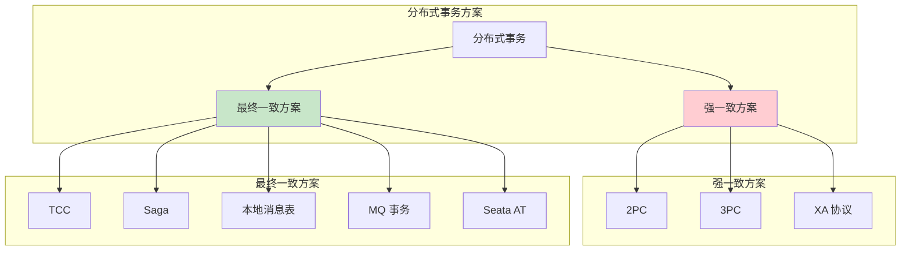
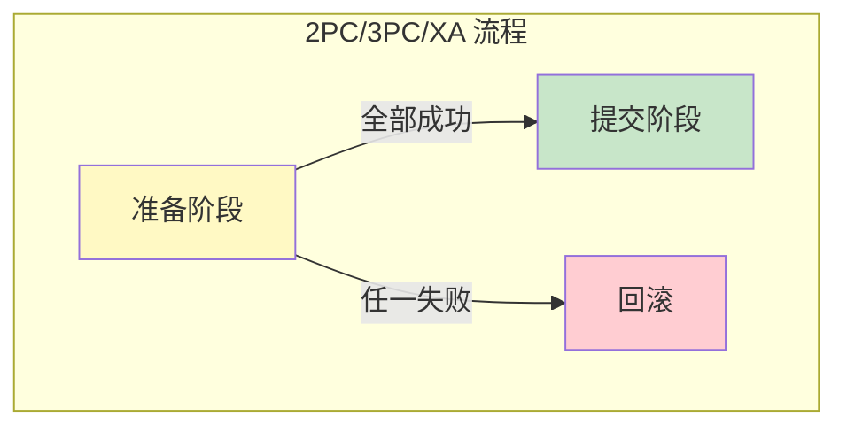
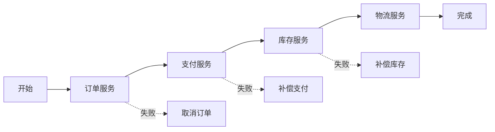
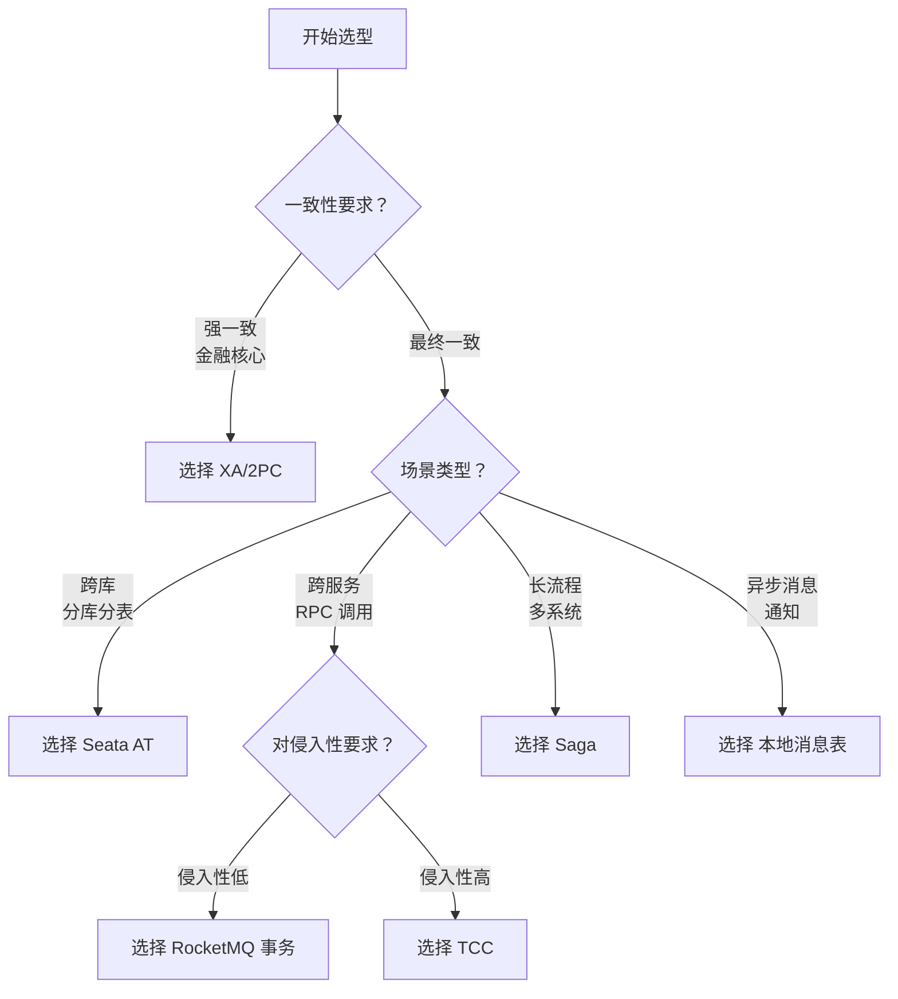
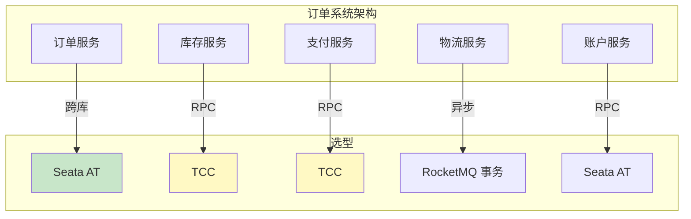
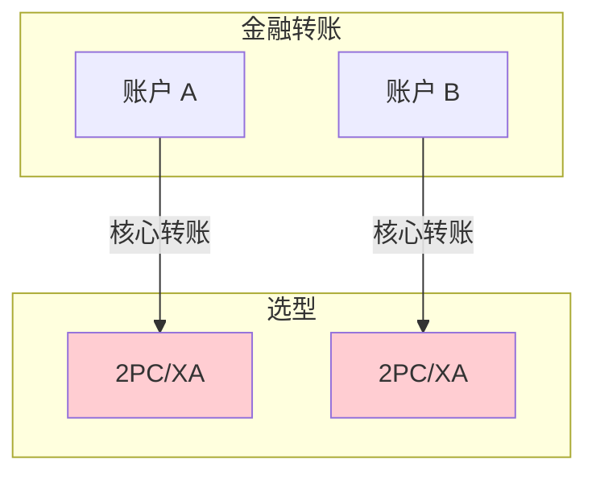
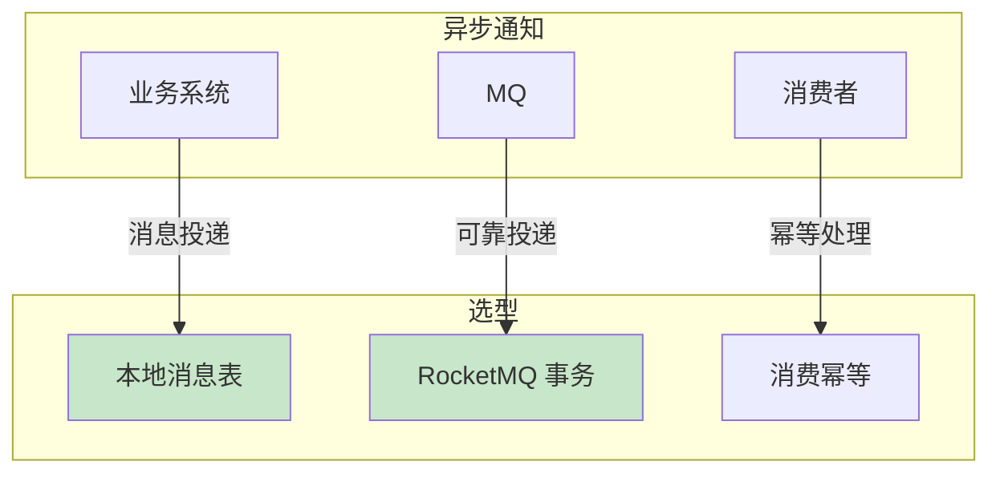

# 分布式事务方案选型

> **目标级别**：P7
> **面试频率**：🔴 高频
> **面试官最关心的 3 个问题**：
> 1. 分布式事务有哪些方案？
> 2. 不同方案的区别是什么？
> 3. 如何选择分布式事务方案？

面试官问：「分布式事务方案那么多，你项目里用的是什么？」你说「用的 Seata」——然后面试官紧接着追问「为什么选 Seata？有没有考虑过 TCC？为什么没用 RocketMQ 事务消息？」你沉默了。

分布式事务方案选型是 P7 面试的高频考点，需要理解每种方案的适用场景。

## 一、分布式事务方案总览

### 1.1 方案分类



### 1.2 方案对比表

| 方案 | 一致性 | 侵入性 | 性能 | 复杂度 | 适用场景 |
|------|--------|--------|------|--------|----------|
| **2PC** | 强一致 | 低 | 低 | 中 | 单库跨节点 |
| **3PC** | 强一致 | 低 | 中 | 中 | 减少阻塞 |
| **XA** | 强一致 | 低 | 低 | 中 | 数据库原生 |
| **TCC** | 最终一致 | 高 | 高 | 高 | 跨服务 |
| **Saga** | 最终一致 | 中 | 高 | 中 | 长流程 |
| **本地消息表** | 最终一致 | 低 | 中 | 低 | 异步场景 |
| **MQ 事务** | 最终一致 | 中 | 高 | 中 | MQ 场景 |
| **Seata AT** | 最终一致 | 零 | 高 | 低 | 跨库 |

## 二、方案详解

### 2.1 2PC/3PC/XA

**特点**：
- 强一致性保证
- 数据库原生支持
- 性能较差，有阻塞

**适用场景**：
- 银行转账
- 库存扣减
- 单库跨节点事务



### 2.2 TCC

**特点**：
- 最终一致性
- 业务侵入高
- 性能好，无阻塞

**适用场景**：
- 跨服务的业务
- 对性能要求高
- 业务可改造

```java
// TCC 需要业务实现三阶段
@TccTransaction
public interface TccOrderService {

    @TwoPhaseBusinessAction(
        name = "createOrder",
        commitMethod = "commit",
        rollbackMethod = "rollback"
    )
    boolean tryCreateOrder(BusinessActionContext ctx, Order order);

    boolean commit(BusinessActionContext ctx);

    boolean rollback(BusinessActionContext ctx);
}
```

### 2.3 Saga

**特点**：
- 最终一致性
- 无锁设计
- 适合长流程

**适用场景**：
- 业务流程长
- 涉及多个服务
- 不需要立即一致的



### 2.4 本地消息表

**特点**：
- 最终一致性
- 实现简单
- 有轮询延迟

**适用场景**：
- 异步化程度高
- 对实时性要求不高
- MQ 不支持事务消息

```sql
-- 消息表和业务表在同一数据库
CREATE TABLE local_message (
    id BIGINT PRIMARY KEY,
    message_id VARCHAR(64),
    status TINYINT,
    -- ...
);
```

### 2.5 RocketMQ 事务消息

**特点**：
- 最终一致性
- 依赖 RocketMQ
- 实时性好

**适用场景**：
- 已有 RocketMQ
- 跨系统消息通知
- 需要可靠消息投递

### 2.6 Seata AT

**特点**：
- 最终一致性
- 零侵入
- 性能好

**适用场景**：
- 跨库事务
- 对业务侵入要求低
- 大多数互联网场景

## 三、选型决策树

### 3.1 决策流程



### 3.2 决策因素

| 因素 | 说明 | 影响 |
|------|------|------|
| **一致性要求** | 强一致 vs 最终一致 | 选择范围 |
| **业务场景** | 跨库/跨服务/异步 | 具体方案 |
| **性能要求** | 高并发/低延迟 | 方案性能 |
| **改造成本** | 对现有代码侵入 | TCC vs AT |
| **运维能力** | 维护复杂系统 | 方案复杂度 |
| **团队经验** | 对方案熟悉程度 | 实施难度 |

## 四、实际场景选型

### 4.1 电商订单系统



**选型理由**：
- 订单 + 库存：Seata AT（跨库）
- 库存扣减：TCC（精确控制）
- 支付：TCC（资金敏感）
- 发货通知：RocketMQ 事务（异步）

### 4.2 金融转账系统



**选型理由**：
- 资金不能错，必须强一致
- 性能要求相对低
- 选择 XA/2PC 保证强一致

### 4.3 异步通知系统



**选型理由**：
- 异步场景，对实时性要求不高
- 本地消息表实现简单
- RocketMQ 事务更可靠

## 五、面试高频题

### 🔴 题目 1：分布式事务有哪些方案？

**参考回答**：

分布式事务方案分为两类：

**强一致方案**：
- 2PC/3PC：两阶段/三阶段提交
- XA 协议：数据库原生支持

**最终一致方案**：
- TCC：Try-Confirm-Cancel
- Saga：正向补偿
- 本地消息表：消息表 + 轮询
- MQ 事务：RocketMQ 事务消息
- Seata AT：自动补偿

### 🔴 题目 2：如何选择分布式事务方案？

**参考回答**：

选型决策树：

1. **一致性要求**：强一致 → XA；最终一致 → 其他
2. **业务场景**：
   - 跨库：Seata AT
   - 跨服务：TCC/Saga
   - 异步消息：MQ 事务/本地消息表
3. **改造成本**：低侵入 → Seata AT/MQ；高灵活 → TCC

### 🔴 题目 3：Seata AT 和 TCC 怎么选？

**参考回答**：

| 维度 | Seata AT | TCC |
|------|----------|-----|
| **侵入性** | 零侵入 | 高侵入 |
| **适用场景** | 跨库 | 跨服务 |
| **性能** | 高 | 高 |
| **灵活性** | 一般 | 高 |
| **建议** | 大多数场景优先 | 特殊场景 |

## 六、常见错误与陷阱

### ⚠️ 陷阱 1：所有场景都用强一致

```
❌ 错误理解：
分布式事务必须强一致

✅ 正确理解：
大多数场景最终一致就够了
强一致代价很高
```

### ⚠️ 陷阱 2：忽略业务改造

```
❌ 错误理解：
选最"好"的方案

✅ 正确理解：
要考虑业务改造成本
TCC 侵入性很高
```

### ⚠️ 陷阱 3：忽略性能影响

```
❌ 错误理解：
分布式事务开销不大

✅ 正确理解：
分布式事务有性能代价
热点数据要谨慎
```

## 七、总结对比表

| 维度 | 2PC/XA | TCC | Saga | Seata AT | 本地消息表 |
|------|--------|-----|------|----------|------------|
| **一致性** | 强 | 最终 | 最终 | 最终 | 最终 |
| **侵入性** | 低 | 高 | 中 | 零 | 低 |
| **性能** | 低 | 高 | 高 | 高 | 中 |
| **复杂度** | 中 | 高 | 中 | 低 | 低 |
| **回滚方式** | 自动 | 自定义 | 补偿 | 自动 | 消息 |
| **适用场景** | 单库 | 跨服务 | 长流程 | 跨库 | 异步 |

## 八、加分回答

> **💡 面试加分点**：
>
> 1. **蚂蚁金服的实践**：SOFAJRaft + Seata 的落地经验
>
> 2. **多方案混合**：根据不同业务选择不同方案
>
> 3. **业务拆分优先**：尽量避免分布式事务，通过业务拆分解决
>
> 4. **案例分析**：详细讲解自己项目中的选型决策过程
