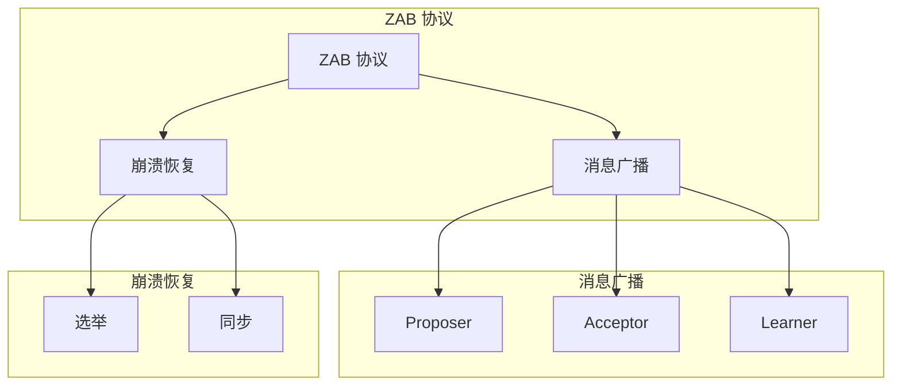
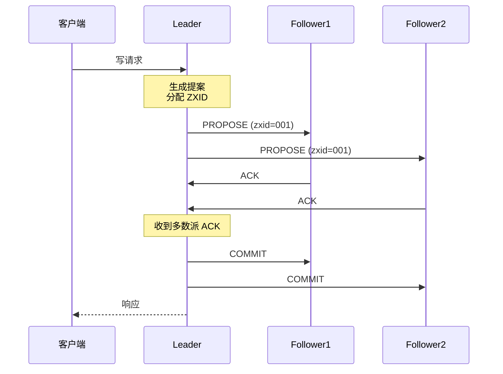
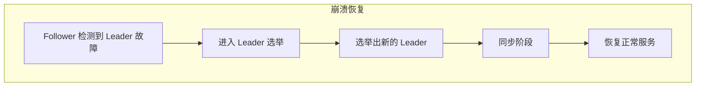
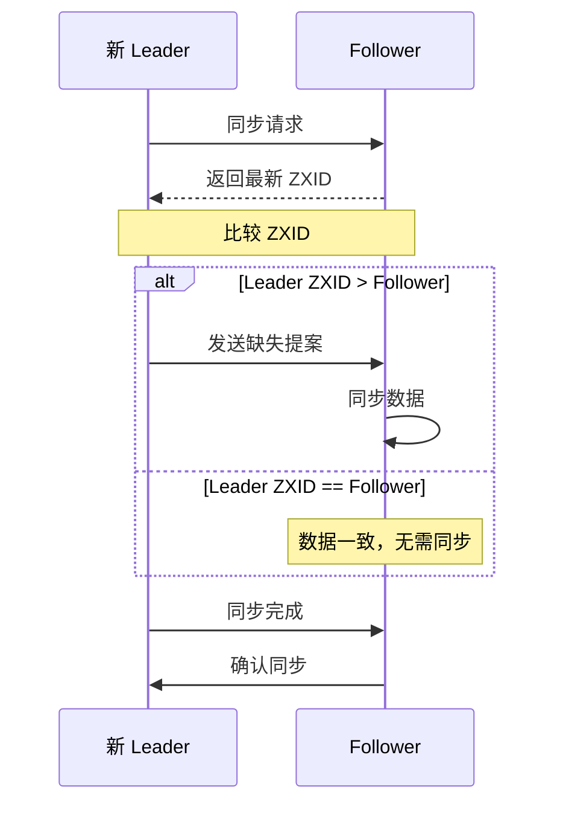
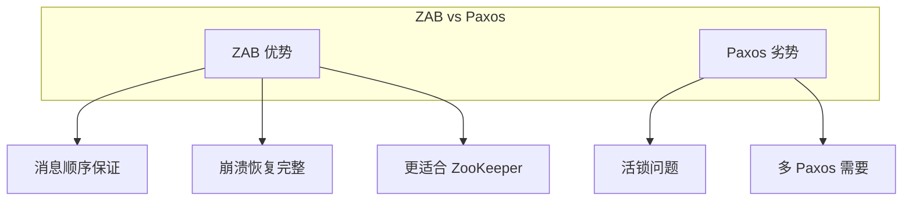

# ZAB 协议

> **目标级别**：P6
> **面试频率**：🟡 中频
> **面试官最关心的 3 个问题**：
> 1. ZAB 协议是什么？
> 2. ZAB 协议和 Paxos 有什么区别？
> 3. ZAB 协议如何保证一致性？

面试官问：「ZAB 协议了解吗？」你说「知道，是 ZooKeeper 的共识协议」——然后面试官紧接着追问「那 ZAB 的消息广播和崩溃恢复是怎么工作的？」你沉默了。

ZAB（ZooKeeper Atomic Broadcast）是 ZooKeeper 的核心协议，理解它才能理解 ZooKeeper 的高可用原理。

## 一、ZAB 协议概述

### 1.1 什么是 ZAB

ZAB（ZooKeeper Atomic Broadcast）是 ZooKeeper 的原子广播协议，用于实现分布式一致性：



### 1.2 ZAB 角色

| 角色 | 说明 |
|------|------|
| **Leader** | 领导者，负责写请求 |
| **Follower** | 跟随者，参与投票 |
| **Observer** | 观察者，不参与投票 |

## 二、消息广播（Atomic Broadcast）

### 2.1 消息广播流程



### 2.2 消息广播代码简化实现

```java
public class ZabBroadcast {

    private long zxid = 0;
    private Map<Long, Peer> peers = new ConcurrentHashMap<>();

    public void broadcast(byte[] message) {
        // 1. 生成 ZXID
        long currentZxid = ++zxid;

        // 2. 创建提案
        Proposal proposal = new Proposal(currentZxid, message);

        // 3. 发送提案给所有 Follower
        for (Peer peer : peers.values()) {
            peer.sendProposal(proposal);
        }

        // 4. 等待多数派 ACK
        int acks = 1;  // Leader 自己算一票
        for (Peer peer : peers.values()) {
            if (peer.hasAcked(currentZxid)) {
                acks++;
            }
        }

        // 5. 超过半数，发送 COMMIT
        if (acks > peers.size() / 2 + 1) {
            for (Peer peer : peers.values()) {
                peer.sendCommit(currentZxid);
            }
        }
    }
}
```

### 2.3 消息广播特性

| 特性 | 说明 |
|------|------|
| **原子性** | 要么全部节点都Commit，要么都不 |
| **顺序性** | 消息按 ZXID 顺序广播 |
| **可靠性** | 超过半数确认即可 |
| **高效** | 异步并行确认 |

## 三、崩溃恢复（Recovery）

### 3.1 崩溃恢复触发条件

| 条件 | 说明 |
|------|------|
| **Leader 崩溃** | Leader 无法响应 |
| **网络分区** | Leader 与多数派断开 |
| **过半机制** | 无法达到多数派确认 |

### 3.2 崩溃恢复流程



### 3.3 Leader 选举算法

**ZXID 选举**：优先选择 ZXID 最大的节点

```java
public class LeaderElection {

    public Peer electLeader(Map<Long, Peer> peers) {
        Peer leader = null;
        long maxZxid = -1;

        // 遍历所有 Peer，选择 ZXID 最大的
        for (Peer peer : peers.values()) {
            if (peer.getZxid() > maxZxid) {
                maxZxid = peer.getZxid();
                leader = peer;
            }
        }

        // 检查是否获得多数票
        int votes = 1;
        for (Peer peer : peers.values()) {
            if (peer.getVoteFor() == leader.getId()) {
                votes++;
            }
        }

        if (votes > peers.size() / 2) {
            return leader;
        }

        return null;  // 选举失败
    }
}
```

### 3.4 同步阶段



## 四、ZAB vs Paxos

### 4.1 对比表

| 维度 | ZAB | Paxos |
|------|-----|-------|
| **设计目标** | ZooKeeper 专用 | 通用共识 |
| **角色** | Leader/Follower | Proposer/Acceptor/Learner |
| **消息顺序** | 强保证 | 弱保证 |
| **崩溃恢复** | 完整支持 | 需额外实现 |
| **活性** | 更好 | 一般 |

### 4.2 ZAB 的优势



## 五、面试高频题

### 🔴 题目 1：ZAB 协议是什么？

**参考回答**：

ZAB（ZooKeeper Atomic Broadcast）是 ZooKeeper 的核心协议，包含两部分：

1. **消息广播**：Leader 接收写请求，广播给 Follower，超过半数确认后提交
2. **崩溃恢复**：Leader 崩溃后，重新选举新 Leader 并同步数据

### 🔴 题目 2：ZAB 和 Paxos 有什么区别？

**参考回答**：

| 区别 | ZAB | Paxos |
|------|-----|-------|
| **设计目标** | ZooKeeper 专用 | 通用共识 |
| **消息顺序** | 强保证 | 弱保证 |
| **崩溃恢复** | 完整 | 需额外实现 |
| **实现复杂度** | 低 | 高 |

### 🟡 题目 3：Leader 选举是怎么工作的？

**参考回答**：

Leader 选举过程：

1. **触发条件**：Follower 检测到 Leader 不可用
2. **投票生成**：每个节点投票给自己
3. **信息交换**：交换投票和 ZXID 信息
4. **多数派胜出**：获得超过半数票的节点成为 Leader
5. **同步数据**：新 Leader 与 Follower 同步数据

## 六、常见错误与陷阱

### ⚠️ 陷阱 1：ZAB 不保证强一致性

```
❌ 错误理解：
ZAB 保证强一致性

✅ 正确理解：
ZAB 是最终一致性
读可能读到旧数据
```

### ⚠️ 陷阱 2：Observer 不参与选举

```
❌ 错误理解：
Observer 参与 Leader 选举

✅ 正确理解：
Observer 不参与投票
只用于扩展读性能
```

### ⚠️ 陷阱 3：ZXID 只是递增编号

```
❌ 错误理解：
ZXID 只是简单的递增

✅ 正确理解：
ZXID = epoch + counter
epoch 表示任期
```

## 七、总结对比表

| 阶段 | 说明 | 关键点 |
|------|------|--------|
| **消息广播** | Leader 广播提案 | 超过半数确认 |
| **崩溃恢复** | 重新选举 + 同步 | ZXID 最大的胜出 |
| **Leader 选举** | 多数派投票 | ZXID + SID |
| **数据同步** | 同步缺失数据 | 追赶式同步 |

## 八、加分回答

> **💡 面试加分点**：
>
> 1. **Fast Leader Election**：ZooKeeper 优化的选举算法
>
> 2. **ZXID 结构**：epoch + counter 的设计
>
> 3. **Observer 作用**：扩展读性能，不参与投票
>
> 4. **脑裂问题**：ZooKeeper 通过过半机制避免脑裂
