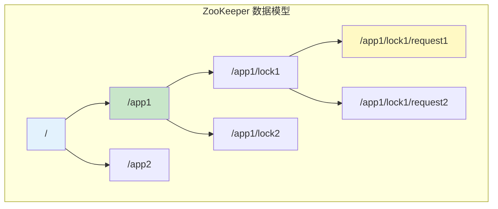
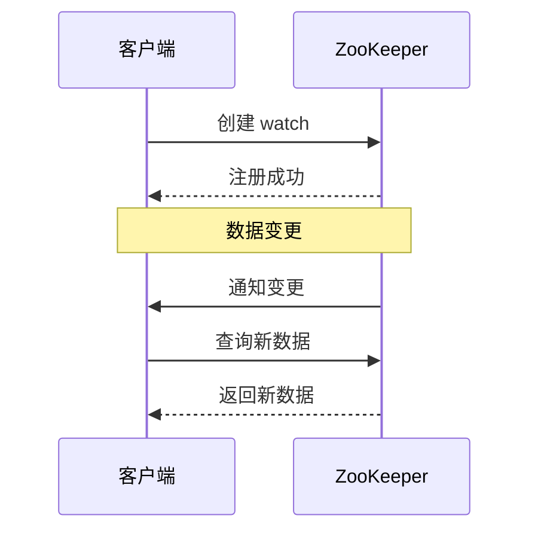
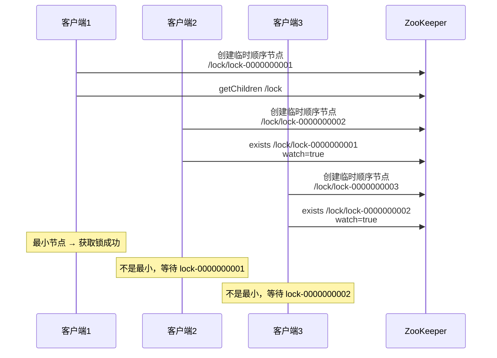
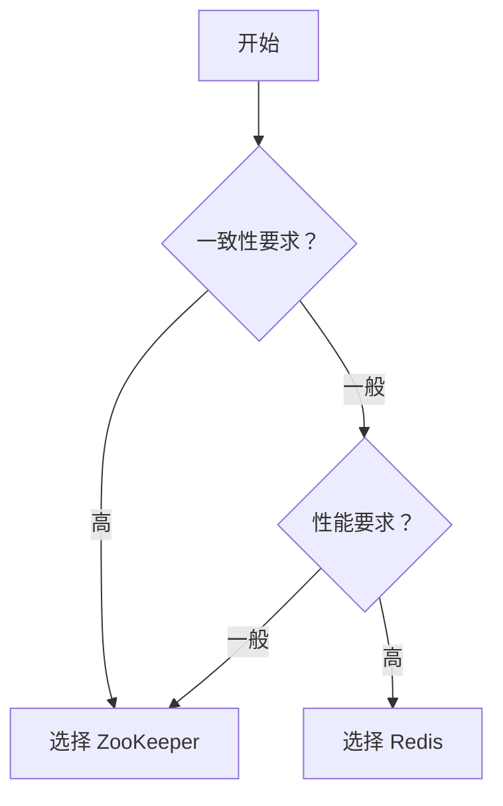

# ZooKeeper 分布式锁

> **目标级别**：P6
> **面试频率**：🔴 高频
> **面试官最关心的 3 个问题**：
> 1. ZooKeeper 分布式锁怎么实现？
> 2. ZooKeeper 锁和 Redis 锁有什么区别？
> 3. ZooKeeper 锁的原理是什么？

面试官问：「ZooKeeper 分布式锁了解吗？」你说「知道，用临时顺序节点」——然后面试官紧接着追问「那临时节点和持久节点有什么区别？羊群效应怎么解决？」你沉默了。

ZooKeeper 分布式锁以其高可靠性和简单实现著称，是分布式锁的经典方案。

## 一、ZooKeeper 数据模型

### 1.1 ZooKeeper 节点类型

| 节点类型 | 说明 | 生命周期 |
|----------|------|----------|
| **持久节点** | 创建后一直存在 | 显式删除 |
| **临时节点** | 客户端连接时存在 | 会话断开自动删除 |
| **持久顺序节点** | 持久 + 顺序编号 | 显式删除 |
| **临时顺序节点** | 临时 + 顺序编号 | 会话断开自动删除 |

### 1.2 ZooKeeper 节点结构



### 1.3 Watch 机制



## 二、ZooKeeper 分布式锁原理

### 2.1 锁的实现原理

ZooKeeper 分布式锁基于**临时顺序节点**和 **Watch 机制**：

1. **创建锁节点**：在指定路径下创建临时顺序节点
2. **获取锁**：判断自己是否是最小节点
3. **等待锁**：如果不是最小节点，Watch 前一个节点
4. **释放锁**：删除自己或会话断开自动删除

### 2.2 获取锁流程



### 2.3 代码实现

```java
public class ZooKeeperLock {

    private ZooKeeper zooKeeper;
    private String lockPath;
    private String currentNode;
    private CountDownLatch latch = new CountDownLatch(1);

    /**
     * 获取锁
     */
    public boolean lock() {
        try {
            // 1. 创建临时顺序节点
            currentNode = zooKeeper.create(
                lockPath + "/lock-",
                new byte[0],
                ZooDefs.Ids.OPEN_ACL_UNSAFE,
                CreateMode.EPHEMERAL_SEQUENTIAL
            );

            // 2. 获取所有子节点
            List<String> children = zooKeeper.getChildren(lockPath, false);

            // 3. 按顺序排序
            Collections.sort(children);

            // 4. 判断是否是最小节点
            String nodeName = currentNode.substring(currentNode.lastIndexOf("/") + 1);
            if (nodeName.equals(children.get(0))) {
                // 最小节点，获取锁成功
                return true;
            } else {
                // 不是最小节点，Watch 前一个节点
                String prevNode = getPrevNode(children, nodeName);
                watchNode(prevNode);

                // 等待通知
                latch.await();
                return true;
            }
        } catch (Exception e) {
            return false;
        }
    }

    /**
     * 释放锁
     */
    public void unlock() {
        try {
            // 删除当前节点
            zooKeeper.delete(currentNode, -1);
        } catch (Exception e) {
            // 记录异常
        }
    }

    /**
     * Watch 前一个节点
     */
    private void watchNode(String nodeName) throws Exception {
        zooKeeper.exists(
            lockPath + "/" + nodeName,
            event -> {
                if (event.getType() == Event.EventType.NodeDeleted) {
                    // 前一个节点被删除，唤醒等待
                    latch.countDown();
                }
            }
        );
    }

    /**
     * 获取前一个节点
     */
    private String getPrevNode(List<String> children, String nodeName) {
        int index = children.indexOf(nodeName);
        return children.get(index - 1);
    }
}
```

## 三、羊群效应与优化

### 3.1 什么是羊群效应

```mermaid
graph TB
    subgraph "羊群效应"
        L["/lock"]
        C1["Client1"]
        C2["Client2"]
        C3["Client3"]
        CN["ClientN"]
    end

    L --> C1
    L --> C2
    L --> C3
    L --> CN

    C1 -.->|"Watch"| L
    C2 -.->|"Watch"| L
    C3 -.->|"Watch"| L
    CN -.->|"Watch"| L

    Note over C1,CN: 惊群效应：大量 Watch 被触发
```

**问题**：当锁释放时，所有等待的客户端都收到通知，造成广播风暴。

### 3.2 优化方案

**每个客户端只 Watch 自己的前一个节点**：

```mermaid
graph TB
    subgraph "优化后的 Watch"
        L["/lock"]
        C1["Client1"]
        C2["Client2"]
        C3["Client3"]
    end

    L --> C1
    L --> C2
    L --> C3

    C1 -.->|"Watch"| L
    C2 -.->|"Watch C1"| C1
    C3 -.->|"Watch C2"| C2

    Note over C1,C3: 只有前一个节点被删除时才通知
```

## 四、ZooKeeper 锁 vs Redis 锁

### 4.1 对比表

| 维度 | ZooKeeper 锁 | Redis 锁 |
|------|-------------|----------|
| **可靠性** | 高 | 一般 |
| **实现复杂度** | 中 | 低 |
| **性能** | 较低 | 高 |
| **锁公平性** | 公平（顺序） | 不公平 |
| **主从切换** | 自动切换 | 需 RedLock |
| **羊群效应** | 可优化 | 存在 |
| **过期机制** | 会话级别 | TTL |

### 4.2 选型建议



## 五、面试高频题

### 🔴 题目 1：ZooKeeper 分布式锁怎么实现？

**参考回答**：

ZooKeeper 分布式锁基于临时顺序节点：

1. **创建节点**：在 `/lock` 下创建临时顺序节点
2. **判断最小**：获取所有子节点，判断自己是否最小
3. **等待通知**：如果不是最小，Watch 前一个节点
4. **获取锁**：前一个节点删除时收到通知
5. **释放锁**：删除自己或会话断开

### 🔴 题目 2：ZooKeeper 锁和 Redis 锁有什么区别？

**参考回答**：

| 区别 | ZooKeeper | Redis |
|------|-----------|-------|
| **可靠性** | 高 | 一般 |
| **性能** | 较低 | 高 |
| **锁公平性** | 公平 | 不公平 |
| **实现复杂度** | 中 | 低 |
| **过期机制** | 会话级别 | TTL |

### 🟡 题目 3：什么是羊群效应？怎么解决？

**参考回答**：

**羊群效应**：锁释放时，所有等待的客户端都收到通知，造成广播风暴。

**解决方案**：每个客户端只 Watch 自己的前一个节点，而不是父节点。这样只有前一个节点被删除时才会收到通知。

## 六、常见错误与陷阱

### ⚠️ 陷阱 1：使用持久节点

```
❌ 错误实现：
创建持久节点，锁释放时手动删除

✅ 正确实现：
使用临时顺序节点
会话断开时自动删除
```

### ⚠️ 陷阱 2：Watch 父节点

```
❌ 错误实现：
getChildren + watch 父节点

✅ 正确实现：
Watch 前一个节点
避免羊群效应
```

### ⚠️ 陷阱 3：忽略会话超时

```
❌ 错误理解：
锁会自动续期

✅ 正确理解：
ZooKeeper 锁依赖会话
会话断开自动释放
```

## 七、总结对比表

| 维度 | ZooKeeper 锁 | Redis 锁 |
|------|-------------|----------|
| **可靠性** | 高 | 一般 |
| **性能** | 较低 | 高 |
| **实现** | 复杂 | 简单 |
| **锁粒度** | 公平 | 不公平 |
| **羊群效应** | 可避免 | 难避免 |
| **适用场景** | 高可靠 | 高性能 |

## 八、加分回答

> **💡 面试加分点**：
>
> 1. **Apache Curator**：ZooKeeper 客户端框架，提供分布式锁实现
>
> 2. **ZooKeeper 的 CAP**：ZooKeeper 是 CP 系统，保证一致性
>
> 3. **临时节点原理**：依赖会话，会话断开自动删除
>
> 4. **性能优化**：批量操作、异步 API
