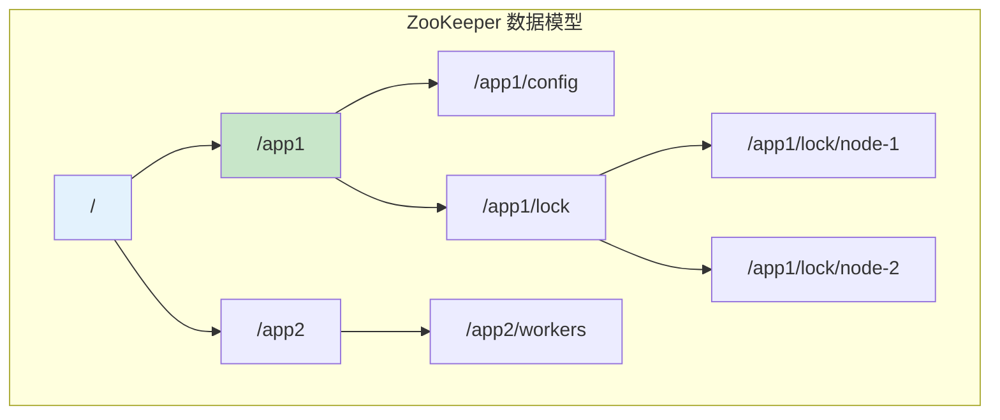
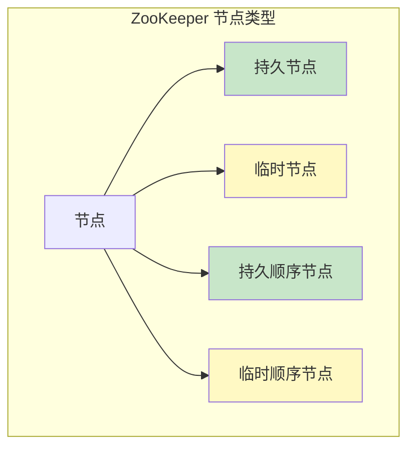
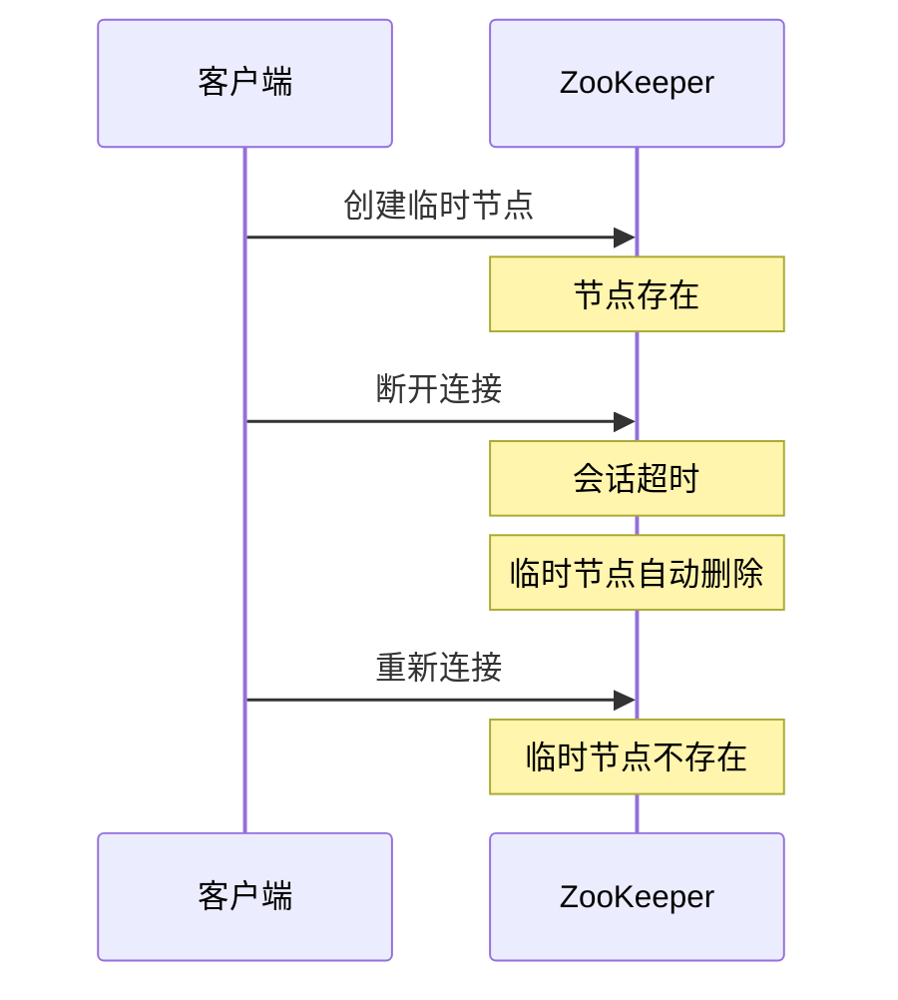
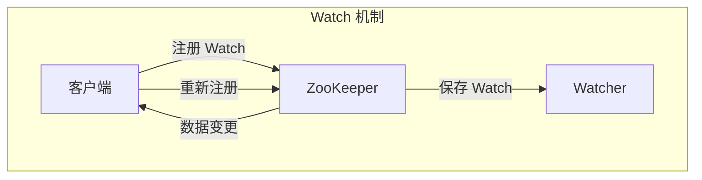

# ZooKeeper 数据模型

> **目标级别**：P6
> **面试频率**：🟡 中频
> **面试官最关心的 3 个问题**：
> 1. ZooKeeper 的数据模型是怎样的？
> 2. ZooKeeper 节点有哪些类型？
> 3. ZooKeeper 的 Watch 机制是什么？

面试官问：「ZooKeeper 的数据模型是什么？」你说「树形结构」——然后面试官紧接着追问「那临时节点和持久节点有什么区别？Watch 机制是怎么实现的？」你沉默了。

ZooKeeper 是分布式系统的协调服务，理解其数据模型是掌握 ZooKeeper 的基础。

## 一、ZooKeeper 数据模型概述

### 1.1 树形结构

ZooKeeper 的数据模型是一个层次化的目录结构，类似于 Unix 文件系统：



### 1.2 节点路径

- 路径分隔符：`/`
- 绝对路径：以 `/` 开头
- 路径长度：最大 65535 字节
- 节点名称：大小写敏感

## 二、节点类型

### 2.1 节点类型分类

| 节点类型 | 说明 | 生命周期 |
|----------|------|----------|
| **持久节点** | 创建后一直存在 | 显式删除 |
| **临时节点** | 客户端连接时存在 | 会话断开自动删除 |
| **持久顺序节点** | 持久 + 顺序编号 | 显式删除 |
| **临时顺序节点** | 临时 + 顺序编号 | 会话断开自动删除 |

### 2.2 节点类型详解



### 2.3 节点数据结构

```java
public class Znode {
    // 节点数据
    byte[] data;

    // 子节点列表
    List<String> children;

    // ACL 权限列表
    List<ACL> acl;

    // 节点状态
    Stat stat;
}

public class Stat {
    long czxid;      // 创建事务 ID
    long mzxid;      // 修改事务 ID
    long ctime;      // 创建时间
    long mtime;      // 修改时间
    int version;     // 版本号
    int cversion;    // 子节点版本
    int aversion;    // ACL 版本
    long ephemeralOwner;  // 临时节点所有者
    int dataLength;      // 数据长度
    int numChildren;     // 子节点数量
    long pzxid;          // 最后子节点修改事务 ID
}
```

### 2.4 临时节点特性



## 三、Watch 机制

### 3.1 Watch 机制原理



### 3.2 Watch 事件类型

| 事件类型 | 说明 | 触发条件 |
|----------|------|----------|
| **NodeCreated** | 节点创建 | create() |
| **NodeDeleted** | 节点删除 | delete() |
| **NodeDataChanged** | 数据变更 | setData() |
| **NodeChildrenChanged** | 子节点变更 | create()/delete() |
| **DataWatchRemoved** | Watch 移除 | - |
| **ChildWatchRemoved** | 子节点 Watch 移除 | - |

### 3.3 Watch 代码实现

```java
public class ZKWatchExample {

    private ZooKeeper zk;

    public void watchNode(String path) throws Exception {
        // 注册 Watch
        zk.exists(path, event -> {
            switch (event.getType()) {
                case NodeCreated:
                    System.out.println("节点创建: " + event.getPath());
                    break;
                case NodeDeleted:
                    System.out.println("节点删除: " + event.getPath());
                    break;
                case NodeDataChanged:
                    System.out.println("数据变更: " + event.getPath());
                    break;
            }

            // 重新注册 Watch
            try {
                zk.exists(event.getPath(), true);
            } catch (Exception e) {
                e.printStackTrace();
            }
        });
    }

    public void watchChildren(String path) throws Exception {
        // 监控子节点变化
        zk.getChildren(path, event -> {
            System.out.println("子节点变化: " + event.getPath());
            try {
                zk.getChildren(event.getPath(), true);
            } catch (Exception e) {
                e.printStackTrace();
            }
        });
    }
}
```

### 3.4 Watch 特性

| 特性 | 说明 |
|------|------|
| **一次性** | Watch 触发后自动失效 |
| **异步** | Watch 事件异步通知 |
| **有序** | Watch 事件按发送顺序 |
| **轻量** | Watch 只传输变更类型和路径 |

## 四、ACL 权限控制

### 4.1 ACL 权限

| 权限 | 说明 | 允许操作 |
|------|------|----------|
| **CREATE** | 创建 | create() |
| **READ** | 读取 | getData() / getChildren() |
| **WRITE** | 写入 | setData() |
| **DELETE** | 删除 | delete() |
| **ADMIN** | 管理 | setACL() |

### 4.2 ACL 认证

| 认证方式 | 说明 |
|----------|------|
| **world** | 所有用户 |
| **auth** | 已认证用户 |
| **digest** | 用户名:密码 |
| **ip** | IP 地址 |

### 4.3 ACL 配置

```java
// 设置 ACL
List<ACL> acls = new ArrayList<>();

// world 权限
acls.add(new ACL(Perms.ALL, new Id("world", "anyone")));

// digest 权限
acls.add(new ACL(Perms.READ | Perms.WRITE,
    new Id("digest", DigestAuthenticationProvider.generateDigest("user:password"))));

// IP 权限
acls.add(new ACL(Perms.READ, new Id("ip", "192.168.1.0/24")));

// 创建节点时设置 ACL
zk.create("/protected", data.getBytes(), acls, CreateMode.PERSISTENT);
```

## 五、面试高频题

### 🔴 题目 1：ZooKeeper 的数据模型是怎样的？

**参考回答**：

ZooKeeper 的数据模型是一个层次化的目录结构（树形结构）：

1. 根节点：`/`
2. 节点路径：类似于 Unix 文件系统
3. 每个节点可以存储数据和拥有子节点
4. 节点有版本号、ACL 等属性

### 🔴 题目 2：临时节点和持久节点有什么区别？

**参考回答**：

| 区别 | 临时节点 | 持久节点 |
|------|----------|----------|
| **生命周期** | 会话结束时自动删除 | 显式删除才消失 |
| **适用场景** | 临时状态、分布式锁 | 持久配置 |
| **子节点** | 不能有子节点 | 可以有子节点 |
| **实现** | 依赖会话 | 无依赖 |

### 🟡 题目 3：Watch 机制有什么特点？

**参考回答**：

Watch 的特点：

1. **一次性**：Watch 触发后自动失效，需要重新注册
2. **异步**：Watch 事件异步通知客户端
3. **轻量**：只传输变更类型和路径
4. **有序**：按发送顺序传递

## 六、常见错误与陷阱

### ⚠️ 陷阱 1：Watch 只触发一次

```
❌ 错误理解：
注册一次 Watch 就一直生效

✅ 正确理解：
Watch 是一次性的
每次收到事件后需要重新注册
```

### ⚠️ 陷阱 2：Watch 可靠性问题

```
❌ 错误理解：
Watch 不会丢失事件

✅ 正确理解：
Watch 事件可能丢失
建议使用 Curator 等成熟框架
```

### ⚠️ 陷阱 3：临时节点可以创建子节点

```
❌ 错误理解：
临时节点可以创建子节点

✅ 正确理解：
临时节点不能有子节点
子节点必须是持久节点
```

## 七、总结对比表

| 维度 | 持久节点 | 临时节点 |
|------|----------|----------|
| **生命周期** | 显式删除 | 会话断开自动删除 |
| **子节点** | 可以有 | 不能有 |
| **适用场景** | 持久配置 | 临时状态 |
| **版本号** | 有 | 无 |

## 八、加分回答

> **💡 面试加分点**：
>
> 1. **Curator 框架**：Apache Curator 提供更易用的 Watch 实现
>
> 2. **Watch 可靠性**：结合缓存和 Watch 实现可靠通知
>
> 3. **节点版本**：`version` 用于乐观锁实现
>
> 4. **ZooKeeper 应用**：分布式锁、配置中心、Master 选举
