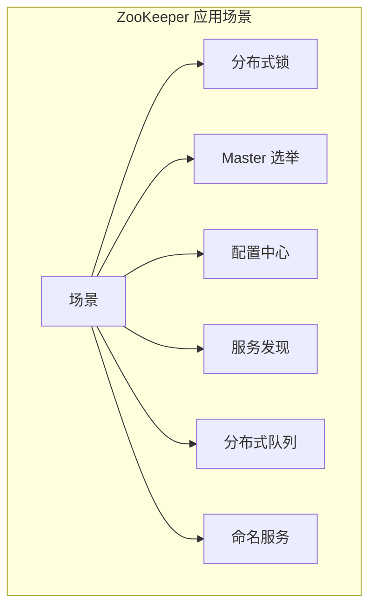
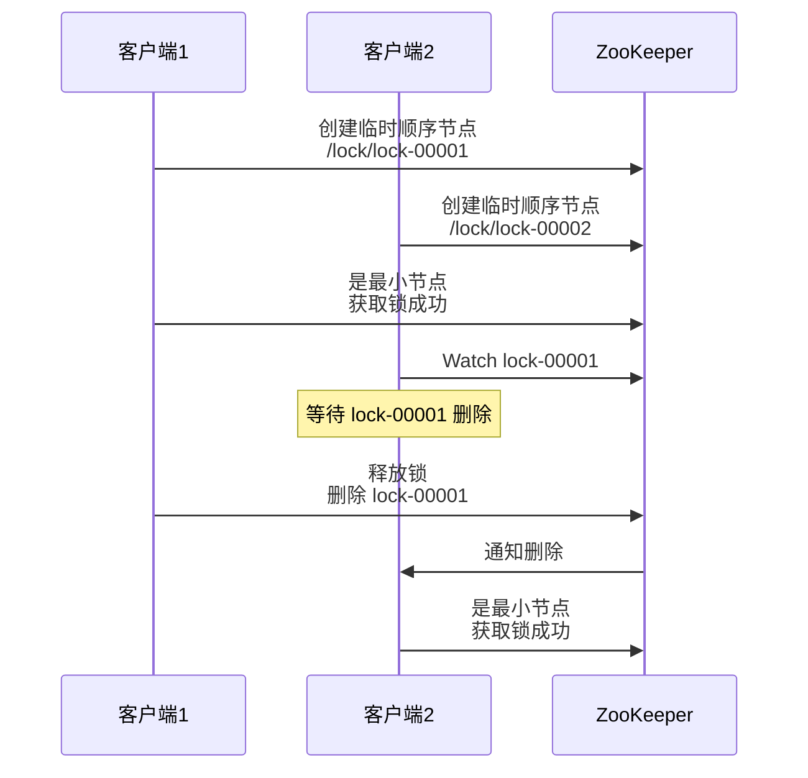
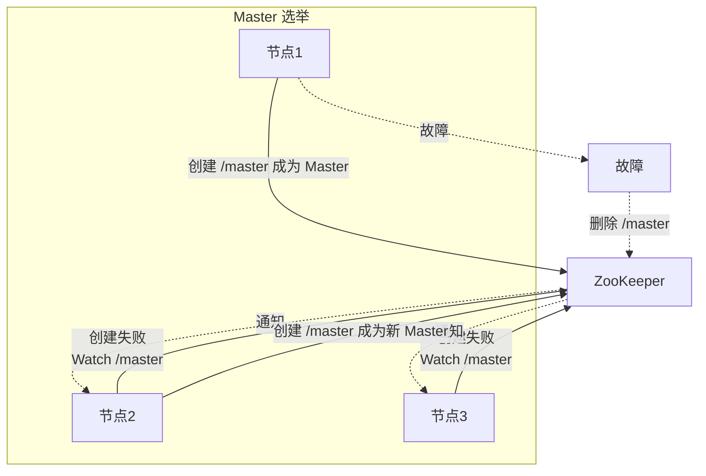
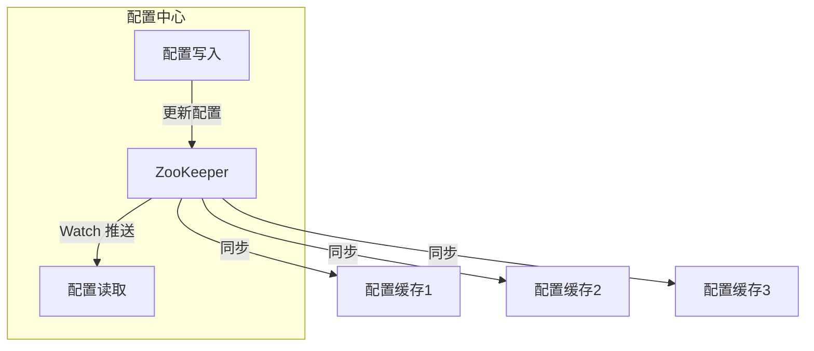

# ZooKeeper 应用场景

> **目标级别**：P6
> **面试频率**：🟡 中频
> **面试官最关心的 3 个问题**：
> 1. ZooKeeper 有哪些应用场景？
> 2. ZooKeeper 如何实现分布式锁？
> 3. ZooKeeper 如何实现配置中心？

面试官问：「ZooKeeper 有什么用？」你说「分布式协调」——然后面试官紧接着追问「那具体有哪些场景？分布式锁怎么实现？Master 选举呢？」你沉默了。

ZooKeeper 是分布式系统的基石，理解其应用场景才能真正掌握它。

## 一、ZooKeeper 典型应用场景



## 二、分布式锁

### 2.1 分布式锁实现

基于临时顺序节点实现：



### 2.2 代码实现

```java
public class ZKDistributedLock {

    private ZooKeeper zk;
    private String lockPath;
    private String currentNode;

    public boolean lock() {
        try {
            // 1. 创建临时顺序节点
            currentNode = zk.create(
                lockPath + "/lock-",
                null,
                ZooDefs.Ids.OPEN_ACL_UNSAFE,
                CreateMode.EPHEMERAL_SEQUENTIAL
            );

            // 2. 获取所有子节点
            List<String> children = zk.getChildren(lockPath, false);

            // 3. 排序
            Collections.sort(children);

            // 4. 判断是否是最小
            String nodeName = currentNode.substring(currentNode.lastIndexOf("/") + 1);
            if (nodeName.equals(children.get(0))) {
                return true;
            }

            // 5. Watch 前一个节点
            String prevNode = getPrevNode(children, nodeName);
            watchAndWait(prevNode);

            return true;
        } catch (Exception e) {
            return false;
        }
    }

    public void unlock() {
        try {
            zk.delete(currentNode, -1);
        } catch (Exception e) {
            // 记录日志
        }
    }
}
```

## 三、Master 选举

### 3.1 Master 选举实现



### 3.2 代码实现

```java
public class MasterElection {

    private ZooKeeper zk;
    private String masterPath = "/master";

    public boolean tryBecomeMaster() {
        try {
            // 尝试创建 Master 节点
            zk.create(
                masterPath,
                getId().getBytes(),
                ZooDefs.Ids.OPEN_ACL_UNSAFE,
                CreateMode.EPHEMERAL
            );
            return true;  // 成为 Master
        } catch (NodeExistsException e) {
            // 已存在，Watch 这个节点
            watchMaster();
            return false;  // 不是 Master
        }
    }

    private void watchMaster() {
        zk.exists(masterPath, event -> {
            if (event.getType() == EventType.NodeDeleted) {
                // Master 节点被删除，重新选举
                if (tryBecomeMaster()) {
                    System.out.println("成为新的 Master");
                }
            }
        });
    }
}
```

## 四、配置中心

### 4.1 配置中心实现



### 4.2 代码实现

```java
public class ZKConfigCenter {

    private ZooKeeper zk;
    private String configPath;
    private Map<String, byte[]> localCache = new ConcurrentHashMap<>();

    public void setConfig(String key, String value) {
        try {
            String path = configPath + "/" + key;
            if (zk.exists(path, false) != null) {
                zk.setData(path, value.getBytes(), -1);
            } else {
                zk.create(path, value.getBytes(),
                    ZooDefs.Ids.OPEN_ACL_UNSAFE,
                    CreateMode.PERSISTENT);
            }
        } catch (Exception e) {
            throw new RuntimeException("设置配置失败", e);
        }
    }

    public String getConfig(String key) {
        // 先查本地缓存
        if (localCache.containsKey(key)) {
            return new String(localCache.get(key));
        }

        try {
            String path = configPath + "/" + key;
            byte[] data = zk.getData(path, event -> {
                if (event.getType() == EventType.NodeDataChanged) {
                    // 配置变更，刷新本地缓存
                    try {
                        byte[] newData = zk.getData(path, true, null);
                        localCache.put(key, newData);
                    } catch (Exception e) {
                        // 处理异常
                    }
                }
            }, null);

            localCache.put(key, data);
            return new String(data);
        } catch (Exception e) {
            return null;
        }
    }
}
```

## 五、服务发现

### 5.1 服务发现实现

```mermaid
graph TB
    subgraph "服务发现"
        P["服务提供者"]
        C["服务消费者"]
        ZK["ZooKeeper"]
    end

    P -->|"注册"| ZK
    P -->|"心跳"| ZK

    C -->|"订阅"| ZK
    ZK -->|"推送"| C

    Note over C: 本地缓存<br/>负载均衡
```

### 5.2 代码实现

```java
public class ZKServiceDiscovery {

    private ZooKeeper zk;
    private String servicePath;

    public List<String> discover(String serviceName) {
        try {
            String path = servicePath + "/" + serviceName;
            List<String> providers = zk.getChildren(path, event -> {
                if (event.getType() == EventType.NodeChildrenChanged) {
                    // 服务列表变更，重新获取
                    discover(serviceName);
                }
            });

            return providers;
        } catch (Exception e) {
            return Collections.emptyList();
        }
    }
}
```

## 六、其他应用场景

### 6.1 命名服务

```java
// ZooKeeper 实现分布式唯一 ID
public class ZKNameService {

    private ZooKeeper zk;

    public String generateId(String namespace) {
        try {
            String path = "/id-generator/" + namespace;
            return zk.create(path, null,
                ZooDefs.Ids.OPEN_ACL_UNSAFE,
                CreateMode.PERSISTENT_SEQUENTIAL);
        } catch (Exception e) {
            throw new RuntimeException("生成 ID 失败", e);
        }
    }
}
```

### 6.2 分布式队列

```java
// ZooKeeper 实现分布式 FIFO 队列
public class ZKQueue {

    private ZooKeeper zk;
    private String queuePath;

    public void enqueue(String element) {
        try {
            zk.create(queuePath + "/element-",
                element.getBytes(),
                ZooDefs.Ids.OPEN_ACL_UNSAFE,
                CreateMode.PERSISTENT_SEQUENTIAL);
        } catch (Exception e) {
            throw new RuntimeException("入队失败", e);
        }
    }

    public String dequeue() {
        try {
            List<String> elements = zk.getChildren(queuePath, false);
            if (elements.isEmpty()) {
                return null;
            }

            Collections.sort(elements);
            String first = elements.get(0);

            byte[] data = zk.getData(queuePath + "/" + first, false, null);
            zk.delete(queuePath + "/" + first, -1);

            return new String(data);
        } catch (Exception e) {
            return null;
        }
    }
}
```

## 七、面试高频题

### 🔴 题目 1：ZooKeeper 有哪些应用场景？

**参考回答**：

ZooKeeper 的主要应用场景：

| 场景 | 说明 |
|------|------|
| **分布式锁** | 基于临时顺序节点的互斥锁 |
| **Master 选举** | 抢注 Master 节点实现选举 |
| **配置中心** | Watch 机制实现配置变更推送 |
| **服务发现** | 注册中心管理服务地址 |
| **命名服务** | 生成唯一 ID |
| **分布式队列** | 基于顺序节点的队列 |

### 🔴 题目 2：如何用 ZooKeeper 实现分布式锁？

**参考回答**：

分布式锁实现步骤：

1. **创建锁节点**：`/lock`
2. **获取锁**：创建临时顺序节点，判断是否最小
3. **等待锁**：Watch 前一个节点
4. **释放锁**：删除自己的节点

### 🟡 题目 3：ZooKeeper 如何实现配置中心？

**参考回答**：

配置中心实现：

1. **存储配置**：在 ZooKeeper 中创建节点存储配置
2. **读取配置**：客户端读取节点数据
3. **监听变更**：Watch 配置节点，变更时推送
4. **本地缓存**：客户端缓存配置，减少 ZooKeeper 压力

## 八、常见错误与陷阱

### ⚠️ 陷阱 1：ZooKeeper 可以存储大量数据

```
❌ 错误理解：
ZooKeeper 可以当数据库用

✅ 正确理解：
ZooKeeper 适合存储小数据
每个节点最大 1MB
```

### ⚠️ 陷阱 2：Watch 可靠性百分百

```
❌ 错误理解：
Watch 不会丢失

✅ 正确理解：
建议结合重连机制
使用 Curator 等成熟框架
```

### ⚠️ 陷阱 3：ZooKeeper 适合所有场景

```
❌ 错误理解：
ZooKeeper 是万能的

✅ 正确理解：
适合协调场景
不适合高频数据访问
```

## 九、总结对比表

| 场景 | 实现方式 | 特点 |
|------|----------|------|
| 分布式锁 | 临时顺序节点 | 公平、可重入 |
| Master 选举 | 临时节点抢注 | 简单、可靠 |
| 配置中心 | Watch 机制 | 实时推送 |
| 服务发现 | 注册中心 | 动态感知 |
| 命名服务 | 顺序节点 | 全局唯一 |

## 十、加分回答

> **💡 面试加分点**：
>
> 1. **Curator 框架**：Apache Curator 提供完善的 ZooKeeper 操作封装
>
> 2. **ZooKeeper 的 CAP**：ZooKeeper 是 CP 系统，保证一致性
>
> 3. **ZooKeeper 在中间件中的应用**：Kafka、HBase 使用 ZooKeeper
>
> 4. **最佳实践**：节点设计规范、权限控制、监控告警
