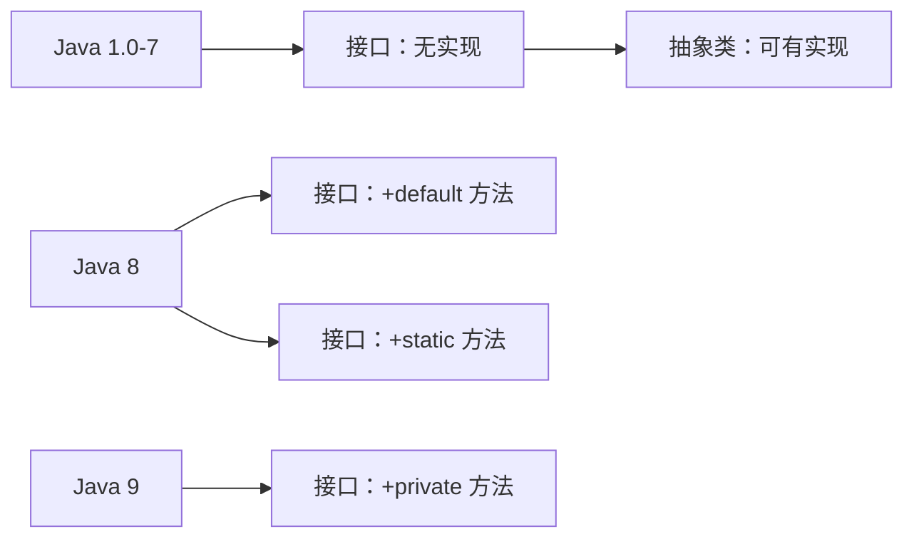
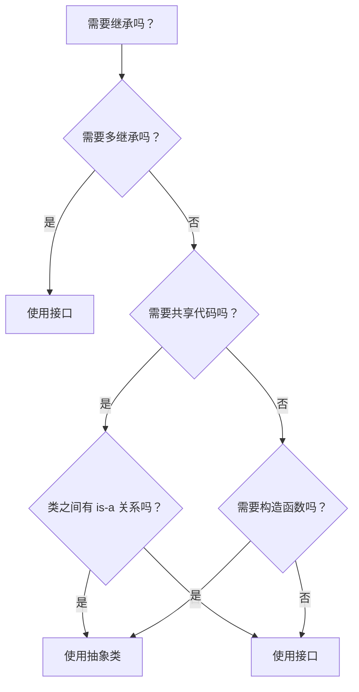

# 抽象类与接口区别

> **目标级别**：P5/P6
> **面试频率**：🔴 高频必考（>70%）

## 快速自测

面试官最关心的 3 个问题：

1. 抽象类和接口有什么区别？
2. Java 8 之后接口有哪些变化？
3. 什么时候用抽象类，什么时候用接口？

如果这三个问题你都能完整回答，可以跳过本文。

---

## 场景切入

面试官问：「抽象类和接口有什么区别？」你说「抽象类可以有实现，接口不能」——然后面试官追问「那 Java 8 之后接口可以有 default 方法了，区别还存在吗？」你愣了一下。

Java 8 引入 default 方法后，抽象类和接口的区别变得更微妙了。但核心区别依然存在。

## 一、Java 8 前后的变化

### 1.1 核心对比（Java 8+）

| 特性 | 抽象类 | 接口 |
|------|--------|------|
| 继承 | 单继承 | 多实现 |
| 字段 | 可以有各种字段 | 只能是 public static final |
| 方法 | 抽象方法 + 已实现方法 | 抽象方法 + default + static |
| 构造器 | 可以有 | 不能有 |
| 代码复用 | ✅ 支持 | ⚠️ default 方法支持 |
| 多态 | ✅ 支持 | ✅ 支持 |

### 1.2 演化历史



---

## 二、核心区别

### 2.1 继承数量

```java
// [!code warning] 抽象类：只能单继承
abstract class AbstractA { }
abstract class AbstractB { }

class MyClass extends AbstractA { }  // OK
// class MyClass extends AbstractA, AbstractB { }  // [!code error]

// 接口：可以多实现
interface InterfaceA { }
interface InterfaceB { }

class MyClass implements InterfaceA, InterfaceB { }  // [!code highlight] OK
```

### 2.2 字段类型

```java
// 抽象类：字段无限制
abstract class AbstractClass {
    int count = 0;              // OK
    private String name;        // OK
    static int staticCount;    // OK
}

// 接口：只能是 public static final（常量）
interface MyInterface {
    int COUNT = 100;                    // [!code highlight] 等价于 public static final int COUNT = 100;
    String NAME = "Test";               // [!code highlight] 必须初始化

    // private int value;  // [!code error] 不能有实例字段
}
```

### 2.3 方法类型

```java
abstract class AbstractClass {
    // 抽象方法：子类必须实现
    abstract void abstractMethod();

    // 已实现方法：子类可选重写
    void implementedMethod() { }

    // 构造器：可以有
    AbstractClass() { }
}

interface MyInterface {
    // 抽象方法：实现类必须实现
    void abstractMethod();

    // [!code highlight] default 方法（Java 8+）：实现类可选重写
    default void defaultMethod() {
        System.out.println("default implementation");
    }

    // [!code highlight] static 方法（Java 8+）：属于接口，不能被重写
    static void staticMethod() {
        System.out.println("static method");
    }

    // [!code highlight] private 方法（Java 9+）：用于抽取重复代码
    private void helperMethod() {
        // 辅助方法
    }
}
```

---

## 三、使用场景

### 3.1 选择决策树



### 3.2 场景对比表

| 场景 | 推荐 | 原因 |
|------|------|------|
| 多继承支持 | 接口 | 类只能单继承抽象类 |
| 共享实现代码 | 抽象类 | 支持完整实现 |
| 状态/属性 | 抽象类 | 可以有实例字段 |
| 多态行为 | 接口 | 定义类型契约 |
| API 定义 | 接口 | 更灵活的扩展性 |
| 版本兼容 | 接口 | default 方法向后兼容 |

---

## 四、抽象类示例

### 4.1 模板方法模式

```java
// [!code highlight] 抽象类：定义模板骨架
abstract class DataProcessor {
    // 模板方法：定义算法骨架
    public final void process() {
        readData();
        processData();
        saveData();
    }

    // [!code highlight] 抽象方法：子类必须实现
    abstract void readData();
    abstract void processData();

    // 已实现方法：可选重写
    void saveData() {
        System.out.println("保存数据");
    }
}

// 具体实现
class FileProcessor extends DataProcessor {
    @Override
    void readData() {
        System.out.println("读取文件");
    }

    @Override
    void processData() {
        System.out.println("处理文件数据");
    }
}
```

---

## 五、接口示例

### 5.1 多接口实现

```java
// [!code highlight] 接口：定义行为契约
interface Flyable {
    void fly();
}

interface Swimmable {
    void swim();
}

// [!code highlight] 多实现：可以组合多个行为
class Duck implements Flyable, Swimmable {
    @Override
    public void fly() {
        System.out.println("鸭子飞");
    }

    @Override
    public void swim() {
        System.out.println("鸭子游");
    }
}

// 普通鸭子不会飞
class NormalDuck implements Swimmable {
    @Override
    public void swim() {
        System.out.println("普通鸭子游");
    }
}
```

### 5.2 default 方法

```java
interface Logger {
    void log(String message);

    // [!code highlight] default 方法：提供默认实现
    default void logInfo(String message) {
        log("[INFO] " + message);
    }

    default void logError(String message) {
        log("[ERROR] " + message);
    }
}

// 实现类只需要实现核心方法
class ConsoleLogger implements Logger {
    @Override
    public void log(String message) {
        System.out.println(message);
    }
}

// [!code highlight] 也可以重写 default 方法
class CustomLogger implements Logger {
    @Override
    public void log(String message) {
        System.out.println("Custom: " + message);
    }

    @Override
    public void logInfo(String message) {
        log("[INFO] " + message.toUpperCase());  // [!code highlight] 自定义实现
    }
}
```

---

## 六、高频追问链

> **第一层**：抽象类和接口的区别是什么？
>
> **第二层**：Java 8 之后接口增加了什么？这些改变有什么意义？
>
> **第三层**：什么时候用抽象类，什么时候用接口？
>
> **第四层**：为什么抽象类可以有构造器而接口不能？

---

## 七、常见错误与陷阱

### ⚠️ 陷阱 1：混淆抽象类和接口的使用

```java
// 错误：把接口当抽象类用
interface DatabaseConnection {
    // [!code warning] 接口不能有构造器
    // DatabaseConnection() { }  // [!code error]

    // [!code warning] 接口字段默认是常量
    // private int timeout = 3000;  // [!code error]
    int TIMEOUT = 3000;  // 必须是常量
}
```

### ⚠️ 陷阱 2：default 方法的冲突

```java
interface A {
    default void method() { }
}

interface B {
    default void method() { }
}

// [!code error] 两个接口都有 default method，实现类必须重写
class MyClass implements A, B {
    @Override
    public void method() {
        // [!code highlight] 必须解决冲突
        A.super.method();  // 或 B.super.method()
    }
}
```

### ⚠️ 陷阱 3：抽象类实现接口却不实现方法

```java
interface Callback {
    void onSuccess(String result);
    void onError(Exception e);
}

// [!code warning] 抽象类实现接口可以不实现方法
abstract class AbstractCallback implements Callback {
    // [!code warning] 可以不实现方法
}

class ConcreteCallback extends AbstractCallback {
    @Override
    public void onSuccess(String result) {
        System.out.println(result);
    }

    @Override
    public void onError(Exception e) {
        e.printStackTrace();
    }
}
```

---

## 八、加分回答

💡 **超出预期的深度**：

### 1. 接口的 private 方法（Java 9+）

```java
interface Service {
    default void start() {
        // [!code highlight] private 方法抽取重复代码
        initialize();
        System.out.println("Service started");
    }

    default void stop() {
        initialize();
        System.out.println("Service stopped");
    }

    // [!code highlight] private 方法不能被外部访问
    private void initialize() {
        // 初始化逻辑
    }
}
```

### 2. 抽象类 vs 接口的设计考量

```java
// 抽象类设计：is-a 关系
// 表示「是什么」
abstract class Animal {
    abstract void eat();
}

class Dog extends Animal {  // Dog is an Animal
    @Override
    void eat() { }
}

// 接口设计：can-do 关系
// 表示「能做什么」
interface Flyable { void fly(); }
interface Swimmable { void swim(); }

class Duck extends Animal implements Flyable, Swimmable {  // Duck can fly and swim
    // ...
}
```

### 3. 接口的静态方法

```java
interface Factory {
    static Factory create() {
        return new DefaultFactory();  // [!code highlight] 工厂方法
    }
}

// [!code highlight] 调用
Factory factory = Factory.create();
```

---

## 九、扩展思考

面试结束前的延伸问题：

1. **Java 为什么不支持多继承？** —— 菱形继承问题
2. **default 方法会破坏接口的向后兼容吗？** —— 不会，添加 default 方法不破坏现有实现
3. **接口可以被实例化吗？** —— 可以，用匿名内部类
