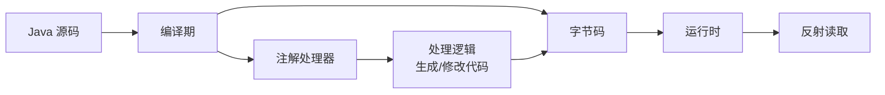
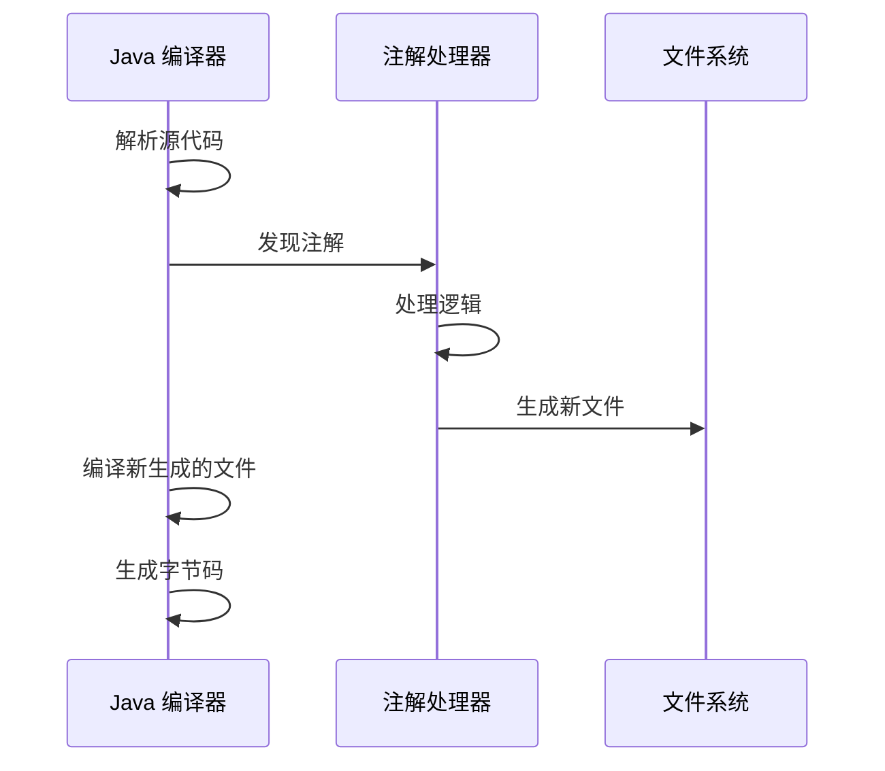
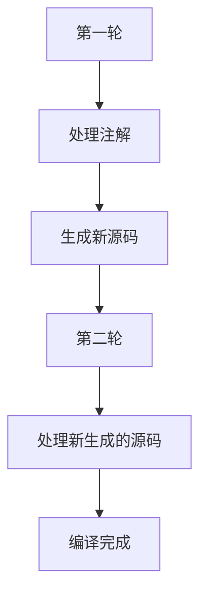

# 运行时注解与编译时注解

> **目标级别**：P5/P6
> **面试频率**：🟡 中频常考（40%-70%）

## 快速自测

面试官最关心的 3 个问题：

1. 运行时注解和编译时注解有什么区别？
2. 什么是注解处理器？有什么用？
3. Spring 大量使用运行时注解的原因是什么？

如果这三个问题你都能完整回答，可以跳过本文。

---

## 场景切入

面试官问：「Lombok 的 @Data 注解是怎么工作的？」你说「通过注解处理器」——然后面试官追问「那 Spring 的 @Component 为什么不用编译时注解？」你愣住了。

这个问题考察的是对注解处理机制的理解深度，以及框架设计者的权衡考量。

## 一、两种注解的本质区别

### 1.1 处理时机



| 类型 | 处理时机 | 工具 | 典型框架 |
|------|----------|------|----------|
| 编译时注解 | 编译期 | Annotation Processor | Lombok、Dagger |
| 运行时注解 | 运行时 | 反射 | Spring、MyBatis |

### 1.2 保留策略决定类型

```java
// 编译时注解：只在源码存在，编译后丢失
@Retention(RetentionPolicy.SOURCE)
public @interface CompileTimeAnnotation { }

// 运行时注解：保留到 JVM 运行
@Retention(RetentionPolicy.RUNTIME)  // [!code highlight]
public @interface RuntimeAnnotation { }
```

---

## 二、编译时注解

### 2.1 工作原理

```java
// 1. 定义注解
@Retention(RetentionPolicy.SOURCE)
@Target(ElementType.TYPE)
public @interface Builder {
    String prefix() default "";
}

// 2. 实现注解处理器
@SupportedAnnotationTypes("com.example.Builder")
@SupportedSourceVersion(SourceVersion.RELEASE_8)
public class BuilderProcessor extends AbstractProcessor {

    @Override
    public boolean process(Set<? extends TypeElement> annotations,
                          RoundEnvironment roundEnv) {
        for (Element element : roundEnv.getElementsAnnotatedWith(Builder.class)) {
            TypeElement typeElement = (TypeElement) element;

            // 生成 Builder 类的代码
            String builderCode = generateBuilder(typeElement);

            // 写入新文件
            writeFile(typeElement, builderCode);
        }
        return true;
    }
}
```

### 2.2 编译流程



### 2.3 Lombok 示例

```java
// 源码
@Data  // [!code highlight] Lombok 注解
public class User {
    private String name;
    private int age;
}

// 编译后生成的代码（伪代码）
public class User {
    private String name;
    private int age;

    public User() { }

    public String getName() { return name; }
    public void setName(String name) { this.name = name; }
    public int getAge() { return age; }
    public void setAge(int age) { this.age = age; }
    // [!code highlight] toString, equals, hashCode 等也生成了
}
```

---

## 三、运行时注解

### 3.1 工作原理

```java
// 1. 定义注解
@Retention(RetentionPolicy.RUNTIME)
@Target(ElementType.FIELD)
public @Autowired {
    // 无属性
}

// 2. 运行时通过反射读取
public class AutowiredAnnotationProcessor {

    public void process(Object bean) {
        for (Field field : bean.getClass().getDeclaredFields()) {
            if (field.isAnnotationPresent(Autowired.class)) {  // [!code highlight]
                field.setAccessible(true);
                Object dependency = createDependency(field.getType());
                field.set(bean, dependency);  // [!code highlight] 注入
            }
        }
    }
}
```

### 3.2 Spring 中的实现

```java
// Spring 的 AutowiredAnnotationBeanPostProcessor
public class AutowiredAnnotationBeanPostProcessor extends InstantiationAwareBeanPostProcessorAdapter {

    @Override
    public PropertyValues postProcessProperties(
            PropertyValues pvs, Object bean, String beanName) {

        // [!code highlight] 注入带 @Autowired 的字段
        InjectionMetadata metadata = findAutowiringMetadata(bean.getClass());
        metadata.inject(bean, beanName, pvs);
        return pvs;
    }
}
```

### 3.3 性能开销

```java
// 运行时注解的性能损耗
public Object postProcessAfterInitialization(Object bean, String beanName) {
    // [!code warning] 每次 Bean 初始化都要遍历所有字段
    for (Field field : bean.getClass().getDeclaredFields()) {
        if (field.isAnnotationPresent(Autowired.class)) {
            // 处理注入...
        }
    }

    // [!code warning] Spring 通过缓存优化：
    // 第一次处理后缓存 InjectionMetadata，后续直接使用
}
```

---

## 四、对比与选择

### 4.1 核心对比表

| 对比维度 | 编译时注解 | 运行时注解 |
|----------|------------|------------|
| 处理时机 | 编译期 | 运行时 |
| 性能 | 无运行时开销 | 有反射开销 |
| 灵活性 | 低（只能生成代码） | 高（可以动态处理） |
| 依赖关系 | 必须在编译前确定 | 可以在运行时获取 |
| 调试难度 | 高（生成的代码不可见） | 低（运行时代码可见） |
| 兼容性 | 编译器版本相关 | JVM 兼容 |

### 4.2 选择决策

| 场景 | 推荐类型 | 原因 |
|------|----------|------|
| 生成 getter/setter | 编译时 | 避免运行时反射 |
| 依赖注入 | 运行时 | 需要动态获取 Bean |
| 验证注解 | 运行时 | 需要访问实际值 |
| 代码生成 | 编译时 | 生成新类 |

---

## 五、高频追问链

> **第一层**：运行时注解和编译时注解有什么区别？
>
> **第二层**：注解处理器是怎么工作的？
>
> **第三层**：为什么 Spring 不用编译时注解？
>
> **第四层**：Lombok 的原理是什么？有什么优缺点？

---

## 六、常见错误与陷阱

### ⚠️ 陷阱 1：混淆保留策略

```java
// 定义为 SOURCE，却想运行时读取
@Retention(RetentionPolicy.SOURCE)  // [!code warning]
public @interface MyAnnotation { }

// 运行时代码
Class<?> clazz = MyClass.class;
clazz.getAnnotation(MyAnnotation.class);  // [!code error] 返回 null！
```

### ⚠️ 陷阱 2：编译时注解处理器的注册

```java
// [!code error] 错误的注册方式（在 Java 9+ 之前）
// 在 META-INF/services 注册处理器
// 文件名：javax.annotation.processing.Processor
// 内容：com.example.MyProcessor

// Java 9+ 使用模块系统
// 在 module-info.java 中配置
module com.example {
    annotationProcessor 'com.example.MyProcessor';  // [!code highlight]
}
```

### ⚠️ 陷阱 3：运行时注解的性能

```java
// 错误：在热点代码中频繁反射读取注解
@Deprecated  // [!code warning] 不要在频繁调用的方法上使用
public void process() { }

// 应该使用编译时检查或直接实现
```

---

## 七、加分回答

💡 **超出预期的深度**：

### 1. 编译时注解的编译顺序



### 2. 运行时注解的缓存优化

```java
// Spring 的优化：缓存注解元数据
public class AutowiredAnnotationBeanPostProcessor {

    private final Map<Class<?>, InjectionMetadata> injectionMetadataCache = new ConcurrentHashMap<>();

    private InjectionMetadata buildAutowiringMetadata(Class<?> clazz) {
        // [!code highlight] 第一次构建并缓存
        InjectionMetadata metadata = doBuildAutowiringMetadata(clazz);
        injectionMetadataCache.put(clazz, metadata);
        return metadata;
    }
}
```

### 3. 两者的混合使用：Dagger

Dagger 2 使用编译时注解来生成代码，然后使用生成的代码进行依赖注入：

```java
// 源码
class UserService {
    @Inject
    UserRepository repository;
}

// 编译后生成
class UserService_Factory implements Factory<UserService> {
    @Override
    public UserService get() {
        return new UserService(userRepository);  // [!code highlight] 工厂模式
    }
}
```

---

## 八、扩展思考

面试结束前的延伸问题：

1. **Java 9 模块系统对注解处理器有什么影响？** —— 需要显式导出
2. **如何用 APT 实现一个简单的依赖注入框架？** —— 在编译时生成注入代码
3. **为什么说 Lombok 是「魔法」，有什么风险？** —— 隐藏实现、IDE 支持问题、调试困难
