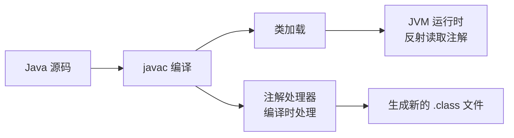
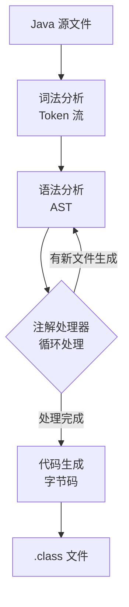

# 运行时注解与编译时注解

面试官问："Spring 的 @Autowired 注解是怎么工作的？"

候选人小蔡答："Spring 会扫描到这个注解，然后自动注入依赖。"

面试官追问："具体是怎么扫描的？扫描的时机是什么？"

小蔡说："启动的时候？"

面试官又问："那编译时注解是什么？有没有用过 Lombok？"

小蔡说："用过，Lombok 是编译时注解，会自动生成 getter/setter。"

面试官追问："Lombok 的原理是什么？生成的代码放在哪？"

小蔡答不上来了。

【面试官心理】
这道题考的是候选人对 Java 编译过程的理解。能说出"注解处理器（Annotation Processor）"和"Lombok 的编译时代码生成"的候选人，说明对 Java 编译工具链有研究。

## 一、运行时注解（RetentionPolicy.RUNTIME）🔴

### 1.1 典型应用：Spring 依赖注入

```java
// @Autowired 注解定义
@Retention(RetentionPolicy.RUNTIME)
@Target({ElementType.FIELD, ElementType.CONSTRUCTOR, ElementType.METHOD})
public @interface Autowired {
    boolean required() default true;
}

// Spring 的处理逻辑（简化版）
public class AutowiredAnnotationBeanPostProcessor {
    public void processInjection(Object bean) {
        Class<?> cls = bean.getClass();
        for (Field field : cls.getDeclaredFields()) {
            if (field.isAnnotationPresent(Autowired.class)) {
                // 反射读取注解
                Autowired autowired = field.getAnnotation(Autowired.class);
                // 从容器中找到对应类型的 Bean
                Object dependency = beanFactory.getBean(field.getType());
                // 反射注入
                field.setAccessible(true);
                field.set(bean, dependency);
            }
        }
    }
}
```

### 1.2 注解处理的时机



运行时注解的处理发生在**类加载后、Bean 初始化时**（Spring 容器启动阶段）。

### 1.3 反射读取注解

```java
// Class 对象获取
Class<?> cls = MyClass.class;

// 检查是否有某注解
boolean hasAnnotation = cls.isAnnotationPresent(MyAnnotation.class);

// 获取注解
MyAnnotation annotation = cls.getAnnotation(MyAnnotation.class);
String name = annotation.name(); // 读取注解属性

// 获取所有注解
Annotation[] all = cls.getAnnotations();

// 获取Declared注解（包括private）
MyAnnotation a = cls.getDeclaredAnnotation(MyAnnotation.class);
```

## 二、编译时注解（Annotation Processor）🔴

### 2.1 编译过程



注解处理器在编译过程中运行，可以：
1. 读取源代码中的注解
2. 生成新的源文件（`.java`）
3. 生成的源文件会继续参与编译过程

### 2.2 自定义注解处理器

```java
// 步骤一：创建注解
@Retention(RetentionPolicy.SOURCE) // 只需要 SOURCE 级别
@Target(ElementType.CLASS)
public @interface Builder {
    String prefix() default "";
}

// 步骤二：创建处理器
@SupportedAnnotationTypes("com.example.Builder")
@SupportedSourceVersion(SourceVersion.RELEASE_8)
public class BuilderProcessor extends AbstractProcessor {

    @Override
    public boolean process(Set<? extends TypeElement> annotations,
                           RoundEnvironment env) {
        for (Element element : env.getElementsAnnotatedWith(Builder.class)) {
            // 元素可能是类或接口
            TypeElement typeElement = (TypeElement) element;
            Builder builder = typeElement.getAnnotation(Builder.class);

            // 生成 Builder 类的代码
            String className = typeElement.getSimpleName() + "Builder";
            String sourceCode = generateBuilderCode(typeElement, builder);

            // 输出到文件
            writeSourceFile(className, sourceCode, element);
        }
        return true; // 返回 true 表示已处理
    }
}

// 步骤三：注册处理器
// 在 META-INF/services/javax.annotation.processing.Processor 文件中注册
```

### 2.3 生成的代码示例

```java
// 原始代码
@Builder
public class User {
    private String name;
    private int age;
}

// 注解处理器生成的代码（编译时生成）
public class UserBuilder {
    private String name;
    private int age;

    public UserBuilder name(String name) {
        this.name = name;
        return this;
    }

    public UserBuilder age(int age) {
        this.age = age;
        return this;
    }

    public User build() {
        return new User(name, age);
    }
}

// 使用
User user = new UserBuilder()
    .name("Alice")
    .age(30)
    .build();
```

## 三、Lombok 原理 🔴

### 3.1 Lombok 的工作方式

```java
// Lombok 使用 APT（Annotation Processing Tool）
// 编译时：Lombok 的 AnnotationProcessor 读取注解
// 生成 getter/setter/toString 等方法
// 将生成的方法写入 .class 文件（不是 .java 文件）

// 源码只有：
@Data
public class User {
    private String name;
    private int age;
}

// 编译后 .class 文件包含：
public class User {
    private String name;
    private int age;

    public User() { }

    public String getName() { return name; }
    public void setName(String name) { this.name = name; }
    // ... toString, equals, hashCode 等
}
```

### 3.2 Lombok 的编译选项

```xml
<!-- Maven 配置 -->
<plugin>
    <groupId>org.apache.maven.plugins</groupId>
    <artifactId>maven-compiler-plugin</artifactId>
    <version>3.8.1</version>
    <configuration>
        <annotationProcessorPaths>
            <path>
                <groupId>org.projectlombok</groupId>
                <artifactId>lombok</artifactId>
                <version>1.18.30</version>
            </path>
        </annotationProcessorPaths>
    </configuration>
</plugin>
```

### 3.3 Lombok 常用注解

```java
@Getter / @Setter      // 生成 getter/setter
@ToString             // 生成 toString()
@EqualsAndHashCode    // 生成 equals/hashCode
@NoArgsConstructor    // 生成无参构造器
@AllArgsConstructor   // 生成全参构造器
@RequiredArgsConstructor // 生成必需参数构造器
@Data                 // @Getter + @Setter + @ToString + @EqualsAndHashCode + @RequiredArgsConstructor
@Builder              // 生成建造者模式
@Slf4j                // 生成 private static final Logger log
```

:::tip 💡
能说出 Lombok 的 Annotation Processor 工作原理的候选人，说明对 Java 编译工具有深入了解。Lombok 是面试中的加分项。
:::

## 四、两种注解处理方式对比 🔴

| 维度 | 运行时注解 | 编译时注解 |
| --- | --- | --- |
| 处理时机 | JVM 运行时（类加载后） | javac 编译时 |
| 处理方式 | 反射（Reflection API） | 注解处理器（APT） |
| 性能 | 有反射开销 | 无运行时开销（编译时完成） |
| 生成代码 | 不生成代码，运行时处理 | 生成新的 .class 文件 |
| 典型应用 | Spring @Autowired, JUnit @Test | Lombok, MapStruct, Dagger |
| Retention | RUNTIME | SOURCE 或 CLASS |

## 五、追问升级

**面试官**："为什么 Lombok 用的是 SOURCE 级别而不是 RUNTIME 级别？"

```java
// Lombok 不需要 RUNTIME 级别，因为：
// 1. Lombok 不需要运行时反射处理
// 2. 在编译时生成 .class 文件，运行时已经是完整的方法
// 3. 如果用 RUNTIME，JVM 每次加载类都要处理这些注解，开销更大
// 4. SOURCE 级别：注解只在源码中存在，编译后完全消失，不影响 .class 文件大小
```

【面试官心理】
能说出 SOURCE/CLASS/RUNTIME 三种保留策略适用场景的候选人，说明对 Java 编译工具有系统性理解。这是 P6+ 的要求。

**面试官**："MapStruct 和 ModelMapper 有什么区别？"

```java
// MapStruct：编译时注解处理器
// 编译时生成类型安全的映射代码，没有反射开销
// 性能接近手写的 get/set 代码
@Mapper(componentModel = "spring")
public interface UserMapper {
    UserDTO toDTO(User user);
}

// ModelMapper：运行时反射
// 性能比 MapStruct 差，但更灵活
// 适合动态映射场景
```

MapStruct 是编译时注解处理的典型成功案例，能说出这个区别的候选人，面试官会认为有性能优化意识。
