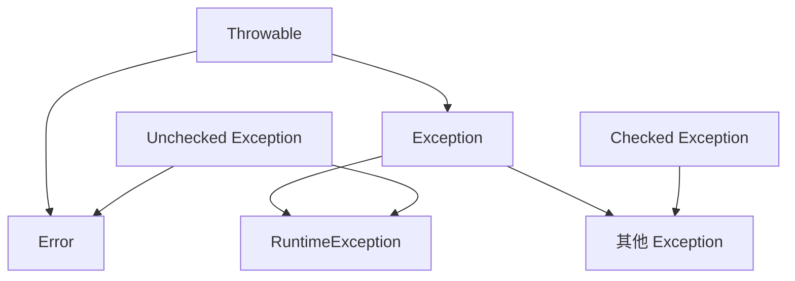
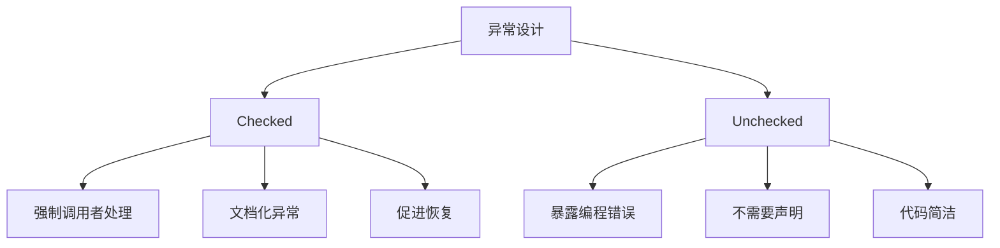

# checked 与 unchecked 异常区别

> **目标级别**：P5/P6
> **面试频率**：🔴 高频必考（>70%）

## 快速自测

面试官最关心的 3 个问题：

1. 什么是 checked 异常和 unchecked 异常？它们的继承关系是什么？
2. 为什么有些异常需要 try-catch，有些不需要？
3. checked 异常的设计有什么争议？

如果这三个问题你都能完整回答，可以跳过本文。

---

## 场景切入

面试官问：「checked 和 unchecked 异常的区别是什么？」你说「一个是编译时检查，一个是运行时检查」——然后面试官追问「那你写过自定义 checked 异常吗？什么情况下会选 checked 异常？」你沉默了。

这个问题考察的是实际开发经验。很多人只会用 JDK 自带的异常，却没思考过为什么要区分这两类。

## 一、概念定义

### 1.1 官方定义

| 类型 | 英文名 | 编译器检查 | 继承树位置 |
|------|--------|------------|------------|
| 受检查异常 | Checked Exception | 必须处理 | Exception 及其子类（不含 RuntimeException） |
| 非受检查异常 | Unchecked Exception | 不强制处理 | RuntimeException 及其子类 + Error |

### 1.2 异常分类图



---

## 二、核心区别对比

### 2.1 对比表

| 对比维度 | checked 异常 | unchecked 异常 |
|----------|--------------|---------------|
| 编译器处理 | 强制检查 | 不检查 |
| 必须处理 | 是（catch 或 throws） | 否 |
| 产生时机 | 编译时就能确定 | 运行时才能确定 |
| 典型异常 | IOException、SQLException | NullPointerException、IndexOutOfBoundsException |
| 设计意图 | 外部因素导致的可恢复错误 | 程序员错误导致的不可恢复错误 |

### 2.2 编译器检查示例

```java
// [!code error] 编译错误：未处理 checked 异常
public void readFile() throws FileReader {
    FileReader reader = new FileReader("test.txt");  // [!code error] FileNotFoundException
    reader.read();
    reader.close();
}

// [!code highlight] 正确做法1：try-catch
public void readFile() {
    try {
        FileReader reader = new FileReader("test.txt");
        reader.read();
        reader.close();
    } catch (FileNotFoundException e) {
        e.printStackTrace();
    } catch (IOException e) {
        e.printStackTrace();
    }
}

// [!code highlight] 正确做法2：throws 向上抛出
public void readFile() throws IOException {  // [!code highlight] 需要声明
    FileReader reader = new FileReader("test.txt");
    reader.read();
    reader.close();
}

// [!code warning] unchecked 异常不需要处理
public void accessArray() {
    int[] arr = new int[5];
    arr[10] = 1;  // ArrayIndexOutOfBoundsException，不需要 try-catch
}
```

---

## 三、为什么要区分 checked 和 unchecked？

### 3.1 设计哲学



### 3.2 典型使用场景

```java
// checked 异常适用场景：外部因素，可恢复
public void saveUser(User user) throws SQLException {
    Connection conn = getConnection();
    conn.prepareStatement("INSERT INTO users VALUES (?)")
        .setObject(1, user.getId());
    // 如果数据库连接失败，可以重试或使用备用方案
}

// unchecked 异常适用场景：编程错误，不可恢复
public void processOrder(Order order) {
    if (order == null) {
        throw new IllegalArgumentException("订单不能为空");  // [!code highlight]
    }
    // 程序员的错误，应该被修复而不是被捕获处理
}
```

---

## 四、高频追问链

> **第一层**：checked 和 unchecked 异常的区别是什么？
>
> **第二层**：为什么要设计 checked 异常？它的优缺点是什么？
>
> **第三层**：Java 为什么被批评过度使用 checked 异常？
>
> **第四层**：如果不用 checked 异常，还有什么替代方案？

---

## 五、checked 异常的争议

### 5.1 checked 异常的缺点

| 缺点 | 说明 |
|------|------|
| 样板代码 | try-catch 代码量大 |
| 异常膨胀 | 调用链中层传播导致方法签名污染 |
| 过度使用 | 很多情况下 RuntimeException 更合适 |
| 测试困难 | 需要 mock 异常场景 |

### 5.2 调用链污染问题

```java
// 一层一层向上传播，导致方法签名臃肿
void level1() throws IOException {
    level2();
}
void level2() throws IOException {  // [!code warning] 需要声明
    level3();
}
void level3() throws IOException {  // [!code warning] 需要声明
    level4();
}
void level4() throws IOException {  // [!code warning] 需要声明
    throw new IOException();  // 原始异常
}
```

### 5.3 解决方案

:::tip 方案一：包装为 RuntimeException
```java
void level4() throws RuntimeException {
    throw new RuntimeException(new IOException());  // [!code highlight] 包装
}
```
:::

:::tip 方案二：Java 8+ 简化处理
```java
try (Stream<String> lines = Files.lines(Paths.get("file.txt"))) {
    // 使用 Stream API 简化处理
} catch (IOException e) {
    // 只需处理一次
}
```
:::

---

## 六、常见错误与陷阱

### ⚠️ 陷阱 1：catch 中 return 导致 finally 先执行

```java
try {
    throw new Exception("test");
} catch (Exception e) {
    return;  // [!code warning] finally 仍然会执行
} finally {
    System.out.println("finally 执行");  // 先输出
}
// 然后才返回
```

### ⚠️ 陷阱 2：捕获 Throwable 或 Exception

```java
try {
    doSomething();
} catch (Throwable t) {  // [!code warning] 捕获范围太宽
    // 包括 Error 也被捕获
}
```

### ⚠️ 陷阱 3：异常与返回值的混淆

```java
// 错误：用异常代替返回值
try {
    return list.get(0);
} catch (IndexOutOfBoundsException e) {
    return null;  // [!code warning] 用异常控制流程
}

// 正确做法
if (list.isEmpty()) {
    return null;
}
return list.get(0);
```

---

## 七、加分回答

💡 **超出预期的深度**：

### 1. Spring 框架的异常处理策略

Spring 框架大量使用 RuntimeException，典型策略：

```java
// Spring 的 DataAccessException 是 RuntimeException
// Spring 认为数据库错误应该统一处理，不需要层层传播
public class DataAccessException extends RuntimeException { }
```

### 2. 函数式编程中的异常处理

```java
// 使用 Optional 替代部分异常场景
Optional<User> user = Optional.ofNullable(findUser(id));
user.ifPresentOrElse(
    u -> System.out.println(u.getName()),
    () -> System.out.println("用户不存在")
);
```

### 3. 异常处理的最佳实践

| 场景 | 推荐异常类型 | 原因 |
|------|--------------|------|
| 文件操作 | checked | 外部因素，可恢复 |
| 网络操作 | checked 或 unchecked | 超时/断开需处理 |
| 参数验证 | unchecked | 编程错误，应该修复 |
| 业务规则违反 | unchecked | 业务逻辑错误 |

---

## 八、扩展思考

面试结束前的延伸问题：

1. **Kotlin 为什么取消 checked 异常？** —— 认为 checked 异常导致代码臃肿
2. **如何设计一个好的异常体系？** —— 分层组织、具体明确、文档完善
3. **异常与错误码的选择？** —— 异常更适合业务流程，错误码适合底层 API
