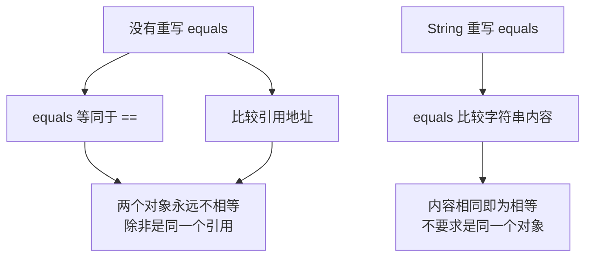

# == 与 equals 有什么区别？

> **目标级别**：P5/P6
> **面试频率**：🔴 高频必考（>70%）

## 快速自测

面试官最关心的 3 个问题：

1. `==` 和 `equals` 在比较基本类型和引用类型时有什么区别？
2. Object 类的 `equals` 方法默认实现是什么？
3. String 和 Integer 等类为什么要重写 `equals` 方法？

如果这三个问题你都能完整回答，可以跳过本文。

---

## 场景切入

面试官问：「`==` 和 `equals` 有什么区别？」你说「`==` 比较引用，equals 比较值」——然后面试官紧接着追问「那为什么 String 的 equals 返回 true，但 `==` 返回 false？」你沉默了。

这是 Java 基础中最容易被误解的概念之一。让我彻底讲清楚。

## 一、`==` 运算符：身份比较

### 1.1 基本类型比较

```java
int a = 10;
int b = 10;
System.out.println(a == b);  // true：比较的是值
```

| 基本类型 | 比较内容 | 说明 |
|----------|----------|------|
| byte | 值 | -128 ~ 127 |
| short | 值 | -32768 ~ 32767 |
| int | 值 | -2^31 ~ 2^31-1 |
| long | 值 | -2^63 ~ 2^63-1 |
| float | 值 | IEEE 754 标准 |
| double | 值 | IEEE 754 标准 |
| char | 值 | Unicode 编码 |
| boolean | 值 | true 或 false |

### 1.2 引用类型比较

```java
String s1 = new String("hello");
String s2 = new String("hello");

System.out.println(s1 == s2);       // false：比较的是引用地址
System.out.println(s1.equals(s2)); // true：比较的是字符串内容
```

:::warning 引用类型 == 的本质
对于引用类型，`==` 比较的是**栈内存中变量的引用地址**，而不是堆内存中的对象内容。
:::

---

## 二、equals 方法：内容比较

### 2.1 Object 默认 equals 实现

```java
// JDK 源码：Object.java
public class Object {
    // [!code highlight] Object 的 equals 默认实现
    public boolean equals(Object obj) {
        return (this == obj);  // [!code highlight] 本质上还是 == 比较引用
    }
}
```

:::tip 关键结论
Object 类的 `equals` 方法默认就是用 `==` 比较引用地址。**只有当一个类显式重写了 equals 方法后，才能比较对象内容**。
:::

### 2.2 为什么 String 要重写 equals？



---

## 三、常见类的 equals 行为

### 3.1 String 类的 equals

```java
// JDK 源码：String.java
public boolean equals(Object anObject) {
    if (this == anObject) {
        return true;  // [!code highlight] 先比较引用地址，同一对象直接返回 true
    }
    if (anObject instanceof String) {
        String anotherString = (String)anObject;
        int n = value.length;  // [!code highlight] value 是 char[]，存储字符串内容
        if (n == anotherString.value.length) {
            char v1[] = value;
            char v2[] = anotherString.value;
            int i = 0;
            while (n-- != 0) {
                if (v1[i] != v2[i])
                    return false;  // [!code highlight] 逐字符比较
                i++;
            }
            return true;
        }
    }
    return false;
}
```

### 3.2 Integer 类的 equals

```java
// JDK 源码：Integer.java
private final int value;  // Integer 包装的值

public boolean equals(Object obj) {
    if (obj instanceof Integer) {
        return value == ((Integer)obj).intValue();  // [!code highlight] 比较 int 值
    }
    return false;
}
```

### 3.3 常见类型比较行为表

| 类型 | `==` 比较 | `equals` 比较 |
|------|-----------|---------------|
| int/long 等基本类型 | 值 | 不适用（没有 equals） |
| Integer 等包装类 | 引用地址 | 值 |
| String | 引用地址 | 字符串内容 |
| StringBuilder | 引用地址 | 引用地址（未重写） |
| StringBuffer | 引用地址 | 引用地址（未重写） |
| Date | 引用地址 | 时间戳 |
| File | 引用地址 | 路径 |
| 数组 | 引用地址 | 引用地址（未重写） |

---

## 四、高频追问链

> **第一层**：`==` 和 `equals` 有什么区别？
>
> **第二层**：Object 的 equals 默认实现是什么？为什么这样设计？
>
> **第三层**：String s1 = "hello"; String s2 = "hello"; 两个对象用 `==` 比较结果是什么？为什么？
>
> **第四层**：new String("hello") 和 "hello" 有什么区别？

---

## 五、String 常量池与 ==

### 5.1 String 创建的两种方式

```java
String s1 = "hello";           // 方式1：直接赋值
String s2 = "hello";           // 方式1：直接赋值
String s3 = new String("hello"); // 方式2：new 创建
String s4 = new String("hello"); // 方式2：new 创建

System.out.println(s1 == s2);  // true：指向常量池中的同一个对象
System.out.println(s1 == s3);  // false：s1 在常量池，s3 在堆内存
System.out.println(s3 == s4);  // false：两个 new 创建的对象地址不同
System.out.println(s1.equals(s2)); // true：内容相同
System.out.println(s1.equals(s3)); // true：内容相同
```

### 5.2 String 内存模型图

```mermaid
graph LR
    subgraph 常量池
        A["\"hello\" (常量池)"]
    end
    subgraph 堆内存
        B["new String(\"hello\")"]
        C["new String(\"hello\")"]
    end
    subgraph 栈内存
        D["s1 -> A"]
        E["s2 -> A"]
        F["s3 -> B"]
        G["s4 -> C"]
    end
    D --> A
    E --> A
    F --> B
    G --> C
```

:::tip String 常量池
使用直接赋值（String s = "hello"）创建字符串时，JVM 会先在 String Pool 中查找是否有相同内容的字符串。如果有，直接返回该对象的引用；如果没有，创建新对象并放入常量池。
:::

---

## 六、常见错误与陷阱

### ⚠️ 陷阱 1：误以为 equals 比 == 更「高级」

```java
Integer a = 127;
Integer b = 127;
System.out.println(a == b);       // true（缓存范围内）
System.out.println(a.equals(b));  // true

Integer c = 128;
Integer d = 128;
System.out.println(c == d);       // false（超出缓存范围）
System.out.println(c.equals(d));  // true
```

:::warning 包装类的 ==
Integer、Byte、Character、Short 等包装类都有缓存池。`-128` 到 `127` 范围内的值会被缓存，所以 `==` 可能返回 true。
:::

### ⚠️ 陷阱 2：自定义类忘记重写 equals

```java
class Person {
    private String name;
    private int age;

    // 忘记重写 equals
}

Person p1 = new Person("张三", 25);
Person p2 = new Person("张三", 25);

System.out.println(p1.equals(p2));  // false：调用 Object 的 equals，比较引用地址
System.out.println(p1 == p2);        // false：两个不同的对象
```

### ⚠️ 陷阱 3：重写 equals 时忘记重写 hashCode

```java
class Person {
    private String name;
    private int age;

    @Override
    public boolean equals(Object o) {
        if (this == o) return true;
        if (o == null || getClass() != o.getClass()) return false;
        Person person = (Person) o;
        return age == person.age && Objects.equals(name, person.name);
    }

    // 忘记重写 hashCode！
}
```

:::warning hashCode 与 equals 必须一致
如果两个对象 equals 返回 true，它们的 hashCode 必须相同。这是 HashMap、HashSet 等哈希结构的契约要求。
:::

---

## 七、手写 equals 的标准范式

### 7.1 自定义类重写 equals

```java
public class Person {
    private String name;
    private int age;
    private String email;

    @Override
    public boolean equals(Object o) {
        // 1. 判断引用是否相同（性能优化）
        if (this == o) return true;

        // 2. 判断是否为 null 或类型不同
        if (o == null || getClass() != o.getClass()) return false;

        // 3. 强制类型转换
        Person person = (Person) o;

        // 4. 逐字段比较
        return age == person.age &&
               Objects.equals(name, person.name) &&
               Objects.equals(email, person.email);
    }

    @Override
    public int hashCode() {
        return Objects.hash(name, age, email);
    }
}
```

### 7.2 equals 方法实现检查清单

| 步骤 | 检查项 | 说明 |
|------|--------|------|
| 1 | 自反性 | `x.equals(x)` 必须返回 true |
| 2 | 对称性 | `x.equals(y)` == `y.equals(x)` |
| 3 | 传递性 | `x.equals(y) && y.equals(z)` → `x.equals(z)` |
| 4 | 一致性 | 多次调用结果必须一致 |
| 5 | 非空性 | `x.equals(null)` 必须返回 false |

---

## 八、加分回答

💡 **超出预期的深度**：

### 1. 为什么 String 选择重写 equals 而不是用 ==？

因为 String 在业务代码中主要用于内容比较而非身份比较。如果 String 用 `==` 比较，两个内容完全相同的字符串就会被判定为「不相等」，这在实际开发中是反直觉的。

### 2. equals 的替代方案：Comparator

```java
// 使用 Comparator 进行自定义比较
List<Person> list = new ArrayList<>();
list.sort(Comparator.comparing(Person::getName)
                   .thenComparing(Person::getAge));
```

### 3. Apache Commons Lang 的 EqualsBuilder

```java
import org.apache.commons.lang3.builder.EqualsBuilder;

public class Person {
    private String name;
    private int age;

    @Override
    public boolean equals(Object o) {
        return new EqualsBuilder()
            .append(this.name, o.name)
            .append(this.age, o.age)
            .isEquals();
    }
}
```

---

## 九、扩展思考

面试结束前的延伸问题：

1. **为什么所有类都继承自 Object？** —— 统一对象模型，提供基础行为（如 toString、hashCode）
2. **hashCode 有什么用？** —— 用于哈希容器（如 HashMap）的快速查找
3. **为什么 String 要不可变？** —— 安全性、哈希值缓存、字符串常量池支持
