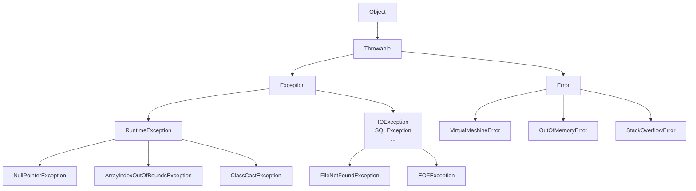
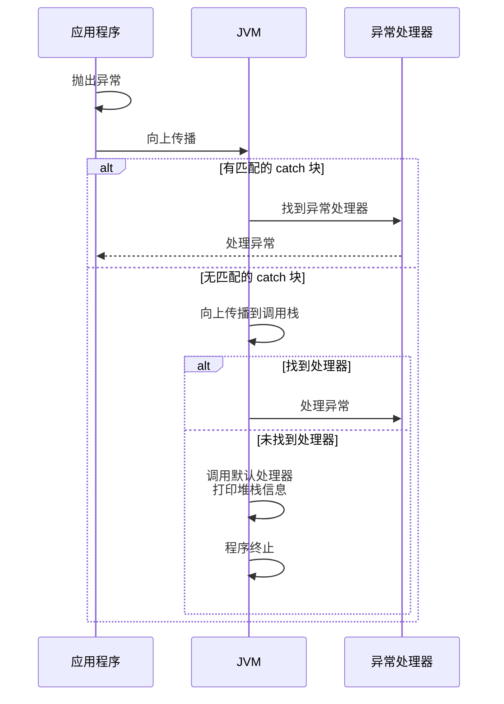

# 异常体系与分类

> **目标级别**：P5/P6
> **面试频率**：🔴 高频必考（>70%）

## 快速自测

面试官最关心的 3 个问题：

1. Java 异常分为哪几类？继承关系是什么？
2. RuntimeException 和普通 Exception 有什么区别？
3. 为什么有些异常不需要 try-catch？

如果这三个问题你都能完整回答，可以跳过本文。

---

## 场景切入

面试官问：「Java 异常体系是怎么分的？」你说「有 Exception 和 Error 两种」——然后面试官追问「那你说说 ArrayIndexOutOfBoundsException 和 FileNotFoundException 的区别？它们分别属于哪一类？」你愣了一下。

异常体系是 Java 面试中的高频考点，但很多人只停留在「两种异常」的层面，对具体分类和适用场景一知半解。

## 一、异常体系架构

### 1.1 继承关系图



### 1.2 Throwable 类源码

```java
// JDK 源码：Throwable.java
public class Throwable implements Serializable {
    private String detailMessage;  // 异常详细信息

    private Throwable cause = this;  // 原因链

    private StackTraceElement[] stackTrace;  // 堆栈跟踪

    // [!code highlight] 两个构造器系列
    public Throwable();
    public Throwable(String message);
    public Throwable(String message, Throwable cause);
}
```

---

## 二、三类异常详解

### 2.1 Error：虚拟机错误

**特点**：由 JVM 产生，程序无法处理也不应处理。

| Error 类型 | 原因 | 解决方案 |
|------------|------|----------|
| OutOfMemoryError | 内存不足 | 调整 JVM 堆大小、优化代码 |
| StackOverflowError | 栈溢出 | 检查递归是否正常退出 |
| VirtualMachineError | JVM 崩溃 | 检查系统资源 |

```java
// 常见场景：递归没有终止条件
public void recursive() {
    recursive();  // [!code warning] 无限递归导致 StackOverflowError
}
```

### 2.2 RuntimeException：运行时异常

**特点**：由程序逻辑错误导致，可以避免。

| 异常类型 | 触发场景 |
|----------|----------|
| NullPointerException | 对象为 null 时调用方法 |
| ArrayIndexOutOfBoundsException | 数组越界访问 |
| ClassCastException | 类型强制转换失败 |
| ArithmeticException | 算术运算错误（如除以 0） |

```java
// 这些异常不需要显式 try-catch，编译器不强制检查
String s = null;
s.length();  // [!code warning] NullPointerException

int[] arr = new int[5];
arr[10] = 1;  // [!code warning] ArrayIndexOutOfBoundsException
```

### 2.3 普通 Exception：受检查异常

**特点**：程序无法完全避免，需要显式处理。

| 异常类型 | 触发场景 |
|----------|----------|
| IOException | 文件读写、网络操作 |
| SQLException | 数据库操作 |
| ParseException | 字符串解析 |

```java
// 编译器强制要求处理
try {
    FileReader reader = new FileReader("test.txt");  // [!code warning] FileNotFoundException
    reader.read();
    reader.close();
} catch (FileNotFoundException e) {
    e.printStackTrace();
} catch (IOException e) {
    e.printStackTrace();
}
```

---

## 三、异常处理机制对比

### 3.1 核心对比表

| 维度 | Error | RuntimeException | 普通 Exception |
|------|-------|-----------------|----------------|
| 产生来源 | JVM | 程序逻辑 | 外部环境 |
| 是否检查 | 非受检查 | 非受检查 | 受检查 |
| 处理要求 | 不需要 | 不需要 | 必须处理 |
| 可否避免 | 否 | 可以 | 部分可以 |
| 是否回滚 | 否 | 否 | 建议回滚 |

### 3.2 异常处理流程



---

## 四、高频追问链

> **第一层**：Java 异常分为哪几类？继承关系是什么？
>
> **第二层**：RuntimeException 和普通 Exception 的区别是什么？
>
> **第三层**：为什么说 Error 不需要 catch？
>
> **第四层**：自定义异常应该继承 Exception 还是 RuntimeException？为什么？

---

## 五、常见错误与陷阱

### ⚠️ 陷阱 1：混淆异常类型

```java
// 错误认为 FileNotFoundException 是 RuntimeException
try {
    new FileReader("not-exist.txt");
} catch (Exception e) {
    // [!code warning] FileNotFoundException 是 IOException 的子类
    // 应该 catch FileNotFoundException 或 IOException
}
```

### ⚠️ 陷阱 2：吞掉异常

```java
// 错误：捕获异常后什么都不做
try {
    doSomething();
} catch (Exception e) {
    // [!code warning] 异常被吞掉，问题被隐藏
}

// 正确做法
try {
    doSomething();
} catch (Exception e) {
    log.error("操作失败", e);  // [!code highlight] 记录日志
    throw new BusinessException("操作失败", e);  // [!code highlight] 重新抛出
}
```

### ⚠️ 陷阱 3：catch 太宽泛

```java
// 错误：捕获所有异常
try {
    parseFile();
} catch (Exception e) {  // [!code warning] 包含 RuntimeException、Error
    e.printStackTrace();
}

// 正确：根据异常类型分别处理
try {
    parseFile();
} catch (FileNotFoundException e) {
    log.warn("文件不存在", e);
} catch (IOException e) {
    log.error("文件读取失败", e);
} catch (RuntimeException e) {
    throw new BusinessException("未知错误", e);
}
```

---

## 六、加分回答

💡 **超出预期的深度**：

### 1. 异常链的传递

```java
try {
    doSomething();
} catch (IOException e) {
    // [!code highlight] 将原始异常作为原因传递
    throw new BusinessException("业务处理失败", e);
}
```

### 2. Throwable 的 fillInStackTrace

```java
// JDK 源码：Throwable.java
public synchronized native Throwable fillInStackTrace();

public Throwable(String message, Throwable cause) {
    super(message);
    this.cause = cause;
    fillInStackTrace();  // [!code highlight] 记录堆栈信息，有性能开销
}
```

:::tip fillInStackTrace 的代价
fillInStackTrace() 会遍历调用栈生成堆栈信息，**有明显的性能开销**。如果不需要堆栈信息，可以用带 cause 参数的构造器手动设置 cause 而不调用 fillInStackTrace。
:::

### 3. 异常处理的最佳实践

```java
// 最佳实践1：具体的异常类型优先
try {
    parse(input);
} catch (NumberFormatException e) {  // [!code highlight] 具体类型
    // 处理数字格式错误
} catch (IllegalArgumentException e) {
    // 处理非法参数
}

// 最佳实践2：异常不应该作为流程控制
// [!code warning] 错误：用异常处理正常业务逻辑
try {
    for (int i = 0; ; i++) {
        list.get(i);  // [!code warning] 用异常判断列表结束
    }
} catch (IndexOutOfBoundsException e) {
    // 到达末尾
}

// [!code highlight] 正确：用循环条件判断
for (int i = 0; i < list.size(); i++) {
    list.get(i);
}
```

---

## 七、扩展思考

面��结束前的延伸问题：

1. **try-catch 会影响性能吗？** —— 正常情况下不影响，异常抛出时才有
2. **为什么不推荐 printStackTrace？** —— 不利于日志聚合，应该用日志框架
3. **finally 一定会执行吗？** —— 除了 System.exit() 和 JVM 崩溃外都会执行
