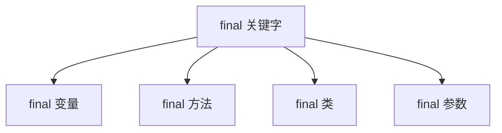

# final 关键字作用

> **目标级别**：P5/P6
> **面试频率**：🔴 高频必考（>70%）

## 快速自测

面试官最关心的 3 个问题：

1. final 可以修饰哪些内容？各自的作用是什么？
2. final 变量和 final 引用有什么区别？
3. 为什么 String 要设计成 final？

如果这三个问题你都能完整回答，可以跳过本文。

---

## 场景切入

面试官问：「final 关键字有什么用？」你说「可以修饰变量、方法和类」——然后面试官追问「那 final 修饰引用类型时，它指向的对象能被修改吗？」你愣住了。

final 是 Java 中保证不变性的关键字，理解它对于理解 String、不可变对象、并发编程都至关重要。

## 一、final 可以修饰的内容

### 1.1 修饰对象一览



### 1.2 作用对比表

| 修饰内容 | 含义 | 能否继承 | 能否修改 |
|----------|------|----------|----------|
| final 变量 | 常量，值不可改变 | - | 不能 |
| final 方法 | 方法不可被重写 | 可以，但不能重写 | - |
| final 类 | 类不可被继承 | ❌ 不能 | - |
| final 参数 | 参数值不可改变 | - | 不能 |

---

## 二、final 变量

### 2.1 基本语法

```java
class Example {
    // [!code highlight] final 变量：必须在声明时或构造函数中初始化
    final int CONSTANT = 100;

    // 空白 final：延迟初始化
    final int blankFinal;

    public Example() {
        blankFinal = 200;  // [!code highlight] 构造函数中初始化
    }
}
```

### 2.2 final 与基本类型 vs 引用类型

```java
class Person {
    String name = "张三";
}

public class Main {
    public static void main(String[] args) {
        // [!code highlight] 基本类型：值不可改变
        final int num = 10;
        num = 20;  // [!code error] 编译错误

        // [!code highlight] 引用类型：引用不可改变，但对象内容可以改变
        final Person p = new Person();
        p.name = "李四";  // [!code highlight] OK！可以修改对象内容
        p = new Person();  // [!code error] 编译错误！不能重新赋值
    }
}
```

:::warning final 引用 vs final 对象
final 修饰引用类型时：
- **不能改变引用指向**（不能重新赋值给另一个对象）
- **但可以修改对象的内容**（除非对象本身也是不可变的）
:::

---

## 三、final 方法

### 3.1 基本语法

```java
class Parent {
    // [!code highlight] final 方法：子类不能重写
    public final void finalMethod() {
        System.out.println("final method");
    }

    // 普通方法：子类可以重写
    public void normalMethod() {
        System.out.println("normal method");
    }
}

class Child extends Parent {
    // [!code error] 编译错误：不能重写 final 方法
    @Override
    public final void finalMethod() {
        System.out.println("override");
    }

    // OK：可以重写普通方法
    @Override
    public void normalMethod() {
        System.out.println("override normal");
    }
}
```

### 3.2 为什么用 final 方法？

| 场景 | 说明 |
|------|------|
| 防止意外重写 | 保证方法行为不变 |
| 性能优化 | JVM 可以内联 final 方法 |
| 安全需求 | 核心方法不允许子类修改 |

---

## 四、final 类

### 4.1 基本语法

```java
// [!code highlight] final 类：不能被继承
public final class String {
    // ...
}

// [!code error] 编译错误：不能继承 final 类
class MyString extends String {  // [!code error]
    // ...
}
```

### 4.2 String 为什么是 final？

```java
// 1. 安全性：防止子类修改行为
public class SecureString extends String {
    @Override
    public char[] toCharArray() {
        // [!code warning] 可能返回被篡改的数据
    }
}

// 2. 哈希值缓存：String 的 hashCode 基于内容计算
public int hashCode() {
    int h = hash;  // [!code highlight] 缓存 hashCode
    if (h == 0 && value.length > 0) {
        // ...
    }
    return h;
}

// 3. 字符串常量池：共享不可变对象是安全的
String s1 = "hello";
String s2 = "hello";
// 如果 String 可变，修改 s1 会影响 s2
```

:::tip final 类的价值
1. **设计意图明确**：告诉使用者这个类不应该被继承
2. **保证一致性**：子类可能破坏父类的约束条件
3. **性能优化**：JVM 可以做更多假设和优化
:::

---

## 五、final 参数

### 5.1 基本语法

```java
class Calculator {
    // [!code highlight] final 参数：方法内不能修改
    public int calculate(final int a, final int b) {
        a = 10;  // [!code error] 编译错误
        b = 20;  // [!code error] 编译错误

        // [!code highlight] 但可以作为局部变量使用
        int temp = a + b;
        return temp;
    }

    public void process(final Person p) {
        p = new Person();  // [!code error] 编译错误
        p.name = "张三";  // [!code highlight] OK！可以修改对象内容
    }
}
```

---

## 六、高频追问链

> **第一层**：final 可以修饰哪些内容？各自的作用是什么？
>
> **第二层**：final 引用类型和普通引用类型有什么区别？
>
> **第三层**：为什么 String 要设计成 final？
>
> **第四层**：final、finally、finalize 有什么区别？

---

## 七、常见错误与陷阱

### ⚠️ 陷阱 1：误以为 final 对象不可变

```java
final List<String> list = new ArrayList<>();
list.add("A");  // [!code warning] 可以添加元素！
list = new ArrayList<>();  // [!code error] 不能重新赋值

// 如果需要真正不可变的集合
List<String> immutable = Collections.unmodifiableList(list);  // [!code highlight]
```

### ⚠️ 陷阱 2：空白 final 未初始化

```java
class Example {
    final int blankFinal;  // 空白 final

    public Example() {
        // [!code error] 如果不初始化，编译错误
        blankFinal = 10;
    }

    // 或者通过构造函数参数初始化
    public Example(int value) {
        blankFinal = value;
    }
}
```

### ⚠️ 陷阱 3：final 不等于不可变对象

```java
// 不可变对象需要满足：
// 1. 类声明为 final（防止继承）
// 2. 所有字段声明为 final
// 3. 不提供修改方法
// 4. 构造函数中完成所有初始化

final class ImmutablePerson {
    private final String name;
    private final int age;

    public ImmutablePerson(String name, int age) {
        this.name = name;  // [!code highlight]
        this.age = age;  // [!code highlight]
    }

    // [!code highlight] 只有 getter，没有 setter
    public String getName() { return name; }
    public int getAge() { return age; }
}
```

---

## 八、加分回答

💡 **超出预期的深度**：

### 1. final 与 JVM 优化

```java
// JVM 会优化 final 方法和 final 变量
class Example {
    static final int CONSTANT = 100;  // [!code highlight] 编译时常量
    final int value = 10;  // [!code highlight] 运行时常量

    public final void method() {
        // JVM 可以内联这个方法
    }
}

// 编译时常量：static final + 基本类型/String 字面量
// 在编译时直接替换为字面量值
```

### 2. final 与多线程

```java
// final 字段的可见性保证
class ThreadSafe {
    final int value;  // [!code highlight] final 字段
    Object reference;

    public ThreadSafe(int v, Object r) {
        this.value = v;
        this.reference = r;
        // [!code highlight] 构造函数中对 final 字段的写入
        // 会在构造函数完成前对其他线程可见
    }
}
```

### 3. final vs immutable

```java
// final：变量引用不可变
final List<String> list = new ArrayList<>();
// list = new ArrayList<>(); // 错误
list.add("A"); // 正确！内容可变

// 不可变对象：对象内容不可变
final class ImmutableList {
    private final List<String> items;  // [!code highlight] 内部仍然可变！

    public ImmutableList(List<String> items) {
        // [!code warning] 如果不复制，内容可能可变
        this.items = items;  // [!code warning]
    }

    // 正确做法：复制防御
    public ImmutableList(List<String> items) {
        this.items = new ArrayList<>(items);  // [!code highlight] 复制一份
    }
}
```

---

## 九、扩展思考

面试结束前的延伸问题：

1. **final、finally、finalize 有什么区别？** —— 变量修饰符/异常处理/JVM 垃圾回收
2. **为什么局部内部类访问的外部变量必须是 final？** —— 生命周期问题
3. **Java 的常量池和 final 有什么关系？** —— 编译时常量存储在常量池
