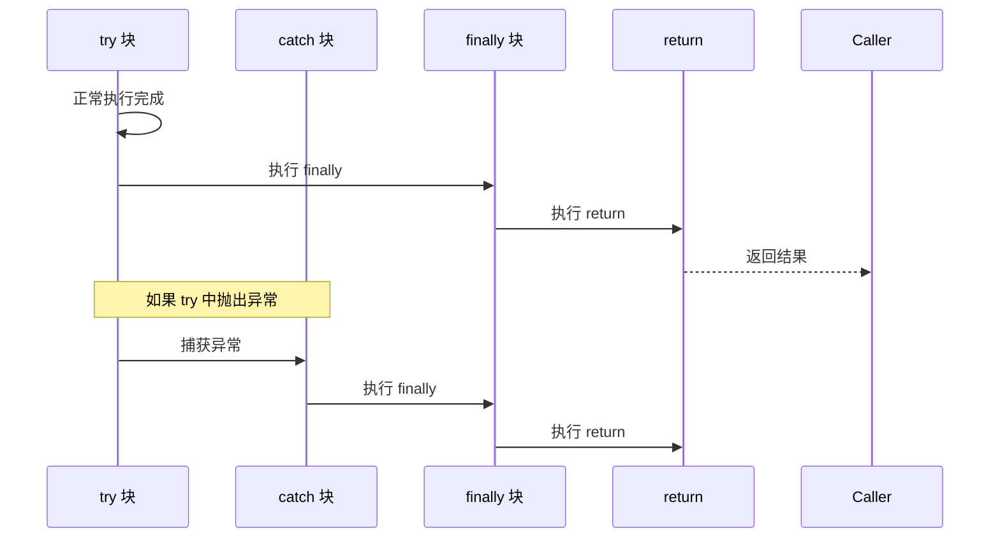

# finally 与 return 执行顺序

> **目标级别**：P5/P6
> **面试频率**：🟡 中频常考（40%-70%）

## 快速自测

面试官最关心的 3 个问题：

1. finally 块一定会在 return 之前执行吗？
2. finally 中的 return 会覆盖 try 中的 return 吗？
3. try 中抛出异常，finally 还会执行吗？

如果这三个问题你都能完整回答，可以跳过本文。

---

## 场景切入

面试官问：「try 中 return，finally 什么时候执行？」你说「在 return 之前」——然后面试官追问「那如果 finally 中也有 return，哪个 return 会生效？」你愣了一下。

这是一个经典的面试陷阱题，考察的是对 Java 异常处理机制的深层理解。

## 一、基本执行顺序

### 1.1 标准流程



### 1.2 简单示例

```java
public class FinallyDemo {
    public static void main(String[] args) {
        System.out.println(test());  // 输出：2
    }

    public static int test() {
        try {
            return 1;  // [!code highlight]
        } finally {
            System.out.println("finally");  // [!code highlight] 先执行
        }
    }
}

// 输出：
// finally
// 2
```

---

## 二、finally 的执行时机

### 2.1 return 的工作机制

```java
public static int test() {
    int result = 0;
    try {
        result = 1;
        return result;  // [!code warning] 返回值被暂存
    } finally {
        result = 2;  // [!code warning] 修改 result，但返回值已经确定
    }
}

// 返回值：1，而不是 2
```

:::warning 返回值暂存机制
当执行 return 时，Java 会先计算返回值并暂存，然后执行 finally 块，最后返回暂存的值。finally 中对变量的修改不会影响已经暂存的返回值。
:::

### 2.2 引用类型的情况

```java
public static List<String> test() {
    List<String> list = new ArrayList<>();
    try {
        list.add("try");
        return list;  // [!code warning] 返回的是引用
    } finally {
        list.add("finally");  // [!code warning] 修改了引用对象
    }
}

// 返回值：["try", "finally"]，finally 中修改了对象内容
```

:::tip 引用类型的特点
如果返回的是引用类型，finally 中修改对象内容会影响返回值，因为返回的是同一个引用。但重新赋值引用不会影响返回值。
:::

---

## 三、finally 中的 return

### 3.1 危险示例

```java
public static int test() {
    try {
        return 1;
    } finally {
        return 2;  // [!code warning] 覆盖了 try 中的 return
    }
}

// 返回值：2
```

:::warning finally 中的 return
finally 中的 return 会覆盖 try/catch 中的 return，**并且会压制 try/catch 中的异常**。这是一个极其危险的做法。
:::

### 3.2 压制异常示例

```java
public static int test() {
    try {
        throw new RuntimeException("try exception");  // [!code warning]
    } finally {
        return 1;  // [!code warning] 压制了异常！
    }
}

// 返回值：1，没有抛出异常！
```

:::danger finally 中的 return 是反模式
finally 中的 return 会：
1. 覆盖 try/catch 中的 return 值
2. 压制 try/catch 中未处理的异常
3. 使代码逻辑难以理解和维护

**永远不要在 finally 中使用 return。**
:::

---

## 四、抛出异常的情况

### 4.1 基本行为

```java
public static void test() {
    try {
        throw new RuntimeException("in try");
    } finally {
        System.out.println("finally");  // [!code highlight] 仍然执行
    }
}

// 输出：
// finally
// RuntimeException: in try
```

### 4.2 finally 抛出异常

```java
public static void test() {
    try {
        throw new RuntimeException("in try");
    } finally {
        throw new RuntimeException("in finally");  // [!code warning] 压制了 try 的异常
    }
}

// 只抛出 finally 中的异常：RuntimeException: in finally
// try 中的异常被丢失！
```

:::warning 异常压制
如果 finally 块抛出异常，会压制 try/catch 中未处理的异常。Java 7+ 提供了 `Throwable.addSuppressed()` 来记录被压制的异常。
:::

---

## 五、常见场景分析

### 5.1 场景 1：正常执行

```java
public static int normal() {
    try {
        return 1;
    } finally {
        System.out.println("finally");
    }
}
// 输出：finally
// 返回值：1
```

### 5.2 场景 2：抛出异常

```java
public static int exception() {
    try {
        throw new RuntimeException();
    } catch (Exception e) {
        return 2;
    } finally {
        System.out.println("finally");
    }
}
// 输出：finally
// 返回值：2
```

### 5.3 场景 3：finally 中的异常

```java
public static int finallyException() {
    try {
        return 1;
    } finally {
        throw new RuntimeException();
    }
}
// 抛出异常：RuntimeException
// 返回值：被压制
```

---

## 六、高频追问链

> **第一层**：try 中 return，finally 什么时候执行？
>
> **第二层**：finally 中修改变量会影响返回值吗？
>
> **第三层**：finally 中的 return 有什么问题？
>
> **第四层**：try 中抛出异常，finally 也抛出异常，哪个会被抛出？

---

## 七、常见错误与陷阱

### ⚠️ 陷阱 1：在 finally 中关闭资源

```java
// 错误写法
BufferedReader br = null;
try {
    br = new BufferedReader(new FileReader("test.txt"));
    return br.readLine();
} finally {
    br.close();  // [!code warning] 如果 br 为 null，抛 NullPointerException
}
```

### ⚠️ 陷阱 2：资源未初始化就 return

```java
// 错误写法
try {
    return new BufferedReader(new FileReader("test.txt")).readLine();
} finally {
    // [!code warning] 没有变量引用，无法关闭！
}
```

:::tip 推荐使用 try-with-resources
```java
try (BufferedReader br = new BufferedReader(new FileReader("test.txt"))) {
    return br.readLine();  // [!code highlight] 自动关闭
}
```
:::

---

## 八、加分回答

💡 **超出预期的深度**：

### 1. 虚拟机会处理 finally 的机制

Java 编译器会为 finally 生成特殊的字节码：

```java
// 源码
try {
    return 1;
} finally {
    System.out.println("finally");
}

// 字节码等效于
try {
    return 1;
} finally {
    // 编译器将 finally 代码复制到这里
    System.out.println("finally");
}
```

### 2. suppressed 异常（Java 7+）

```java
public static void main(String[] args) {
    try {
        try {
            throw new RuntimeException("primary");
        } finally {
            throw new RuntimeException("suppressed");
        }
    } catch (Exception e) {
        System.out.println("Exception: " + e.getMessage());
        // 获取被压制的异常
        Throwable[] suppressed = e.getSuppressed();
        for (Throwable t : suppressed) {
            System.out.println("Suppressed: " + t.getMessage());
        }
    }
}

// 输出：
// Exception: suppressed
// Suppressed: primary
```

---

## 九、扩展思考

面试结束前的延伸问题：

1. **为什么不要在 finally 中关闭文件？** —— 资源管理复杂，应使用 try-with-resources
2. **Java 如何保证 finally 一定执行？** —— JVM 的异常处理机制
3. **finally 中的代码一定会执行吗？** —— 除 System.exit() 和 JVM 崩溃外
