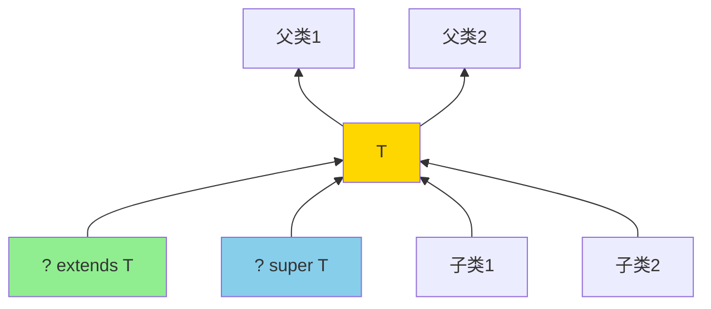
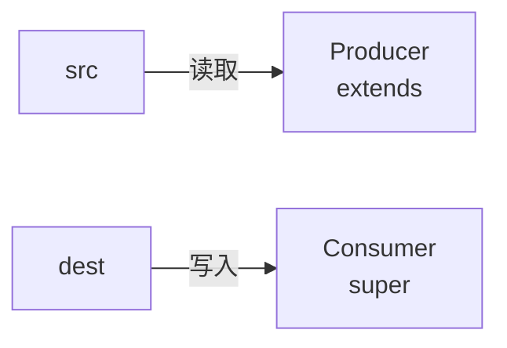
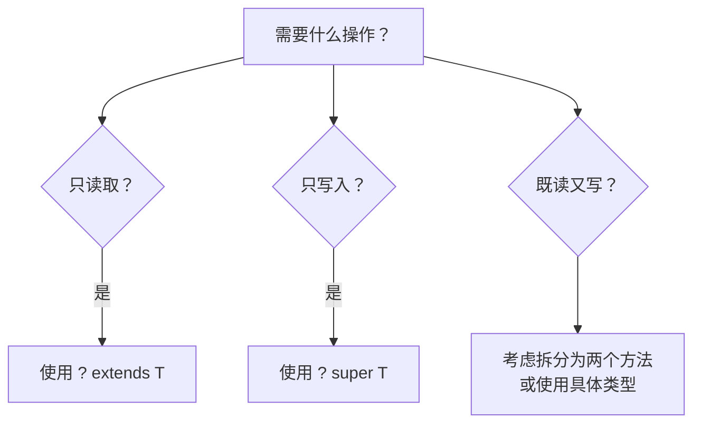

# 泛型通配符与上下界

> **目标级别**：P5/P6
> **面试频率**：🔴 高频必考（>70%）

## 快速自测

面试官最关心的 3 个问题：

1. `? extends T` 和 `? super T` 的区别是什么？
2. 什么时候用上界通配符，什么时候用下界通配符？
3. PECS 原则是什么？

如果这三个问题你都能完整回答，可以跳过本文。

---

## 场景切入

面试官问：「泛型的 `? extends` 和 `? super` 有什么区别？」你说「一个是上限，一个是下限」——然后面试官追问「那你写一个方法，参数是 Number 的列表，应该用什么通配符？」你愣住了。

通配符是泛型中最容易混淆的概念，但它有一个简单好记的原则：PECS。

## 一、三种通配符

### 1.1 通配符一览

| 通配符 | 名称 | 读法 | 限制 | 可读可写 |
|--------|------|------|------|----------|
| `?` | 非受限通配符 | unknown | 无限制 | 只读 |
| `? extends T` | 上界通配符 | T 或 T 的子类 | T 及其子类 | 只读 |
| `? super T` | 下界通配符 | T 或 T 的父类 | T 及其父类 | 可读写 |

### 1.2 图解



---

## 二、上界通配符 `? extends T`

### 2.1 概念

```java
// 上界通配符：只能读取，不能写入（除 null）
List<? extends Number> list;

// 可以读取为 Number
Number num = list.get(0);  // [!code highlight] 安全

// 不能写入（除 null）
list.add(Integer.valueOf(1));  // [!code warning] 编译错误
list.add(Double.valueOf(1.0));  // [!code warning] 编译错误
list.add(null);  // [!code highlight] 可以写入 null
```

### 2.2 使用场景

```java
// 计算数字列表的总和
public double sum(List<? extends Number> list) {  // [!code highlight]
    double total = 0;
    for (Number num : list) {  // [!code highlight] 读取安全
        total += num.doubleValue();
    }
    return total;
}

// 可以传入以下任意类型
List<Integer> integers = Arrays.asList(1, 2, 3);
List<Double> doubles = Arrays.asList(1.0, 2.0, 3.0);
List<Number> numbers = Arrays.asList(1, 2.0, 3L);

sum(integers);  // [!code highlight]
sum(doubles);   // [!code highlight]
sum(numbers);   // [!code highlight]
```

:::tip 上界通配符的场景
**Producer Extends** —— 当你需要从集合中读取（生产）元素时，使用 `extends`。
:::

---

## 三、下界通配符 `? super T`

### 3.1 概念

```java
// 下界通配符：可以写入 T，读取为 Object
List<? super Integer> list;

// 可以写入 Integer 或其子类
list.add(Integer.valueOf(1));  // [!code highlight] 安全
list.add(Double.valueOf(1.0).intValue());  // [!code highlight] 安全

// 只能读取为 Object
Object obj = list.get(0);  // [!code warning] 需要强制类型转换
```

### 3.2 使用场景

```java
// 向列表中添加数字
public void addNumbers(List<? super Integer> list) {  // [!code highlight]
    for (int i = 1; i <= 10; i++) {
        list.add(i);  // [!code highlight] 写入安全
    }
}

// 可以传入以下任意类型
List<Integer> integers = new ArrayList<>();
List<Number> numbers = new ArrayList<>();
List<Object> objects = new ArrayList<>();

addNumbers(integers);  // [!code highlight]
addNumbers(numbers);   // [!code highlight]
addNumbers(objects);  // [!code highlight]
```

:::tip 下界通配符的场景
**Consumer Super** —— 当你需要向集合中写入（消费）元素时，使用 `super`。
:::

---

## 四、PECS 原则

### 4.1 原则定义

```java
// PECS: Producer Extends, Consumer Super
public class Collections {
    // 从 src 复制到 dest
    // src 是生产者（读取），使用 extends
    // dest 是消费者（写入），使用 super
    public static <T> void copy(List<? super T> dest, List<? extends T> src) {
        for (T item : src) {
            dest.add(item);
        }
    }
}
```

### 4.2 PECS 图解



### 4.3 实际应用

```java
// Collections.sort 的实现
public static <T extends Comparable<? super T>> void sort(List<T> list) {
    list.sort(null);
}

// 分析：
// Comparable<? super T> 允许：
// - T 实现 Comparable<T>
// - T 的父类实现 Comparable<T>
// - T 的父类实现 Comparable 的某个父类
// [!code highlight] 这样 Integer 可以直接使用父类 Number 的比较逻辑
```

---

## 五、通配符对比表

### 5.1 核心对比

| 特性 | `? extends T` | `? super T` | 无边界 `?` |
|------|----------------|-------------|------------|
| 读取 | ✅ 安全（返回 T） | ⚠️ 不安全（返回 Object） | ⚠️ 只读（返回 Object） |
| 写入 | ❌ 禁止 | ✅ 安全（写入 T） | ❌ 禁止 |
| 用途 | 生产者 | 消费者 | 只读集合 |

### 5.2 选择决策树



---

## 六、高频追问链

> **第一层**：三种通配符的区别是什么？
>
> **第二层**：PECS 原则是什么？什么时候用 extends，什么时候用 super？
>
> **第三层**：为什么 `List<? extends Number>` 不能添加元素？
>
> **第四层**：为什么 `List<? super Integer>` 读取元素需要强制转换？

---

## 七、常见错误与陷阱

### ⚠️ 陷阱 1：既读又写

```java
// 错误：既读取又写入
public void process(List<? extends Number> list) {
    Number num = list.get(0);    // 读取 OK
    list.add(Double.valueOf(1)); // [!code error] 写入失败
}

// 拆分方法
public void read(List<? extends Number> list) { /* 只读 */ }
public void write(List<? super Number> list) { /* 只写 */ }
```

### ⚠️ 陷阱 2：混淆上下界

```java
List<Number> numbers = new ArrayList<>();
List<? super Integer> list1 = numbers;  // [!code highlight] Integer 的父类有 Number
// list1.add(1) OK
// list1.add(1.0) OK

List<Integer> integers = new ArrayList<>();
List<? extends Number> list2 = integers;  // [!code highlight] Integer 是 Number 的子类
// Number num = list2.get(0) OK
// list2.add(1) 失败
```

### ⚠️ 陷阱 3：通配符用于返回类型

```java
// 错误：返回类型不能使用通配符
public ? extends Number getNumber() {  // [!code error] 编译错误
    return new Integer(1);
}

// 正确：使用具体类型或泛型方法
public Number getNumber() { return new Integer(1); }
public <T extends Number> T getNumber(Class<T> clazz) { return clazz.newInstance(); }
```

---

## 八、加分回答

💡 **超出预期的深度**：

### 1. 通配符捕获

```java
// Java 7 之前的难题
public void swap(List<?> list, int i, int j) {
    Object temp = list.get(i);
    // [!code error] list.set(i, list.get(j)) 无法编译
    // 因为编译器不知道 ? 是什么类型
}

// 解决方案：通配符捕获
public void swap(List<?> list, int i, int j) {
    swapHelper(list, i, j);  // [!code highlight]
}

private <T> void swapHelper(List<T> list, int i, int j) {
    T temp = list.get(i);
    list.set(i, list.get(j));
    list.set(j, temp);
}
```

### 2. 泛型方法 vs 通配符

```java
// 泛型方法
public static <T extends Comparable<T>> void sort(List<T> list)

// 通配符版本
public static void sort(List<Comparable> list)  // [!code warning] 类型不安全

// [!code highlight] 泛型方法更灵活，但语法更复杂
```

### 3. 实际框架中的使用

```java
// JDK 源码中的 PECS 原则
// Collections.copy
public static <T> void copy(List<? super T> dest, List<? extends T> src) { }

// Arrays.sort
public static <T> void sort(T[] a, Comparator<? super T> c)  // [!code highlight] 支持子类型比较器
```

---

## 九、扩展思考

面试结束前的延伸问题：

1. **为什么 `List<Object>` 不能赋值给 `List<String>`？** —— 类型安全
2. **什么是类型推导？Java 编译器能推导泛型吗？** —— 可以，Java 10+ 支持 var
3. **`? extends T` 和 `T` 有什么区别？** —— T 确定类型，? 不确定
