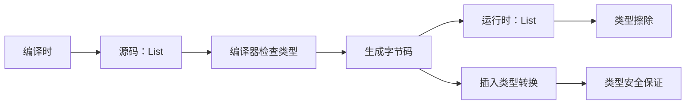
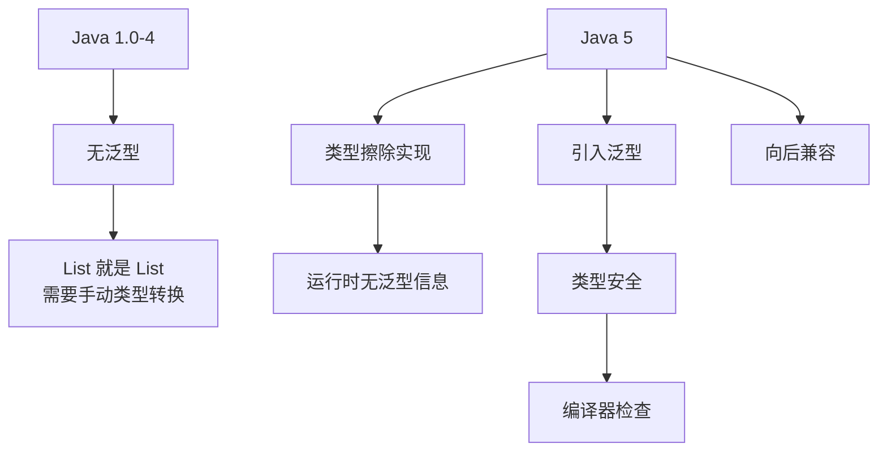

# 泛型与类型擦除

> **目标级别**：P5/P6
> **面试频率**：🔴 高频必考（>70%）

## 快速自测

面试官最关心的 3 个问题：

1. 什么是类型擦除？擦除的是什么？
2. 泛型擦除后变成了什么类型？
3. 为什么需要泛型？擦除后为什么还能保持类型安全？

如果这三个问题你都能完整回答，可以跳过本文。

---

## 场景切入

面试官问：「Java 泛型是什么？有什么特点？」你说「泛型就是参数化类型」——然后面试官追问「那为什么 `List<String>` 和 `List<Integer>` 在运行时是同一个类型？」你愣住了。

泛型擦除是 Java 泛型最核心也最容易被误解的特性。它是 Java 为了向后兼容而做的折中设计。

## 一、泛型的基本概念

### 1.1 什么是泛型

> 泛型即「参数化类型」，允许在定义类、接口、方法时使用类型参数。

```java
// 泛型类
class Box<T> {
    private T value;
    public T get() { return value; }
    public void set(T value) { this.value = value; }
}

// 使用
Box<String> stringBox = new Box<>();
stringBox.set("hello");  // [!code highlight] 类型安全
String value = stringBox.get();
```

### 1.2 泛型的使用场景

| 场景 | 示例 | 说明 |
|------|------|------|
| 泛型类 | `ArrayList<E>` | 集合元素类型 |
| 泛型接口 | `Comparable<T>` | 比较器类型 |
| 泛型方法 | `<T> T getFirst(List<T> list)` | 参数/返回值类型 |
| 泛型构造器 | `new MyClass<T>(T value)` | 构造器参数类型 |

---

## 二、类型擦除原理

### 2.1 擦除的定义



### 2.2 擦除规则

```java
// 源码
class Box<T> {
    private T value;
    public T get() { return value; }
    public void set(T value) { this.value = value; }
}

// 编译后（伪代码）
class Box {
    private Object value;  // [!code highlight] T 被替换为 Object
    public Object get() { return value; }
    public void set(Object value) { this.value = value; }  // [!code highlight]
}
```

### 2.3 有界类型参数

```java
// 源码
class NumberBox<T extends Number> {
    private T value;
    public T get() { return value; }
}

// 编译后
class NumberBox {
    private Number value;  // [!code highlight] T 被替换为上限类型
    public Number get() { return value; }
}
```

### 2.4 类型擦除的完整过程

```java
// 原始类型（Raw Type）
class Container<T, U extends Comparable<T>> {
    private T first;
    private U second;
}

// 擦除后
class Container {
    private Object first;  // [!code highlight] 无界 T -> Object
    private Comparable second;  // [!code highlight] 有界 U -> 上限类型
}
```

---

## 三、类型转换与桥方法

### 3.1 自动类型转换

```java
List<String> list = new ArrayList<>();
list.add("hello");

// 编译器自动插入类型转换
String s = (String) list.get(0);  // [!code highlight] 编译器自动添加
```

### 3.2 桥方法（Bridge Methods）

```java
// 源码
class Person implements Comparable<Person> {
    @Override
    public int compareTo(Person other) {  // [!code highlight]
        return this.name.compareTo(other.name);
    }
}

// 编译后的字节码（伪代码）
class Person {
    public int compareTo(Person other) {  // [!code highlight] 原始方法
        return this.name.compareTo(other.name);
    }

    // [!code highlight] 编译器生成的桥方法
    public volatile int compareTo(Object other) {  // [!code warning] 用于兼容
        return this.compareTo((Person) other);  // [!code highlight] 调用原始方法
    }
}
```

:::tip 桥方法的作用
当子类重写父类方法时，如果父类使用了泛型，编译器会生成桥方法保证多态正确工作。
:::

---

## 四、泛型的限制

### 4.1 不能实例化类型参数

```java
// [!code error] 编译错误
public class Factory<T> {
    public T create() {
        return new T();  // [!code error] 不能 new T()
    }
}

// 正确做法：传入 Class 对象
public class Factory<T> {
    private Class<T> clazz;

    public Factory(Class<T> clazz) {
        this.clazz = clazz;
    }

    public T create() throws Exception {
        return clazz.newInstance();  // [!code highlight]
    }
}
```

### 4.2 不能创建泛型数组

```java
// [!code error] 编译错误
public class ArrayFactory<T> {
    public T[] createArray(int size) {
        return new T[size];  // [!code error] 不能 new T[size]
    }
}

// 正确做法
public class ArrayFactory<T> {
    public T[] createArray(Class<T> clazz, int size) {
        return (T[]) java.lang.reflect.Array.newInstance(clazz, size);  // [!code highlight]
    }
}
```

### 4.3 泛型类型的限制

```java
// 不能使用基本类型
List<int> list;  // [!code error] 基本类型不是对象

// 只能使用包装类型
List<Integer> list;  // [!code highlight]

// 不能 throw/catch 泛型类型
public <T extends Throwable> void process(T t) throws T {  // [!code highlight]
    throw t;  // 只能抛出，不能 catch
}
```

### 4.4 泛型限制一览表

| 限制 | 原因 | 替代方案 |
|------|------|----------|
| 不能实例化 T | 编译器不知道具体类型 | 传入 `Class<T>` |
| 不能创建 T[] | 数组元素类型不确定 | 使用 `Array.newInstance` |
| 不能使用基本类型 | 基本类型不是 Object | 使用包装类 |
| 不能 catch T | 编译时不知道异常类型 | 使用泛型异常声明 |
| 不能 instanceof T | 运行时没有 T 信息 | 使用通配符 |

---

## 五、高频追问链

> **第一层**：什么是类型擦除？Java 为什么要擦除泛型？
>
> **第二层**：类型擦除后，泛型信息去哪了？
>
> **第三层**：什么是桥方法？为什么需要它？
>
> **第四层**：泛型擦除有什么限制？为什么？

---

## 六、常见错误与陷阱

### ⚠️ 陷阱 1：泛型类型与运行时类型

```java
List<String> list1 = new ArrayList<>();
List<Integer> list2 = new ArrayList<>();

System.out.println(list1.getClass() == list2.getClass());  // [!code warning] true！
// 两个 List 在运行时是同一个类型：ArrayList
```

### ⚠️ 陷阱 2：泛型类的静态成员

```java
class Container<T> {
    private static T value;  // [!code error] 编译错误
    private static T[] array;  // [!code error] 编译错误

    public static T getValue() {  // [!code error] 编译错误
        return value;
    }
}
```

:::warning 泛型类型的限制
泛型类的静态成员不能使用类声明的类型参数，因为静态成员是所有实例共享的。
:::

### ⚠️ 陷阱 3：泛型与 instanceof

```java
// [!code error] 编译错误
if (obj instanceof List<String>) { }  // [!code error]

// 只能
if (obj instanceof List<?>) { }  // [!code highlight] 使用通配符
```

---

## 七、加分回答

💡 **超出预期的深度**：

### 1. 泛型与多态的矛盾

```java
class Parent<T> {
    T value;
}

class Child extends Parent<String> {  // [!code highlight] 子类确定泛型类型
}

// 调用时
Parent<String> p = new Child();  // [!code highlight] 多态正常工作
p.value = "hello";  // [!code highlight] 直接是 String
```

### 2. 泛型信息的保留（Java 8+）

```java
// 使用 TypeToken 保留泛型信息（Guava）
TypeToken<List<String>> type = new TypeToken<List<String>>() {};
System.out.println(type.getRawType());  // List.class
System.out.println(type.getType());    // java.util.List<java.lang.String>
```

### 3. 泛型的历史演进



---

## 八、扩展思考

面试结束前的延伸问题：

1. **Java 为什么不保留泛型类型信息到运行时？** —— 向后兼容（Java 1.4 之前的代码）
2. **什么是 Reifiable 类型？** —— 运行时完全可见的类型（数组、泛型参数等）
3. **C# 的泛型与 Java 有什么区别？** —— C# 保留泛型信息，运行时可用
