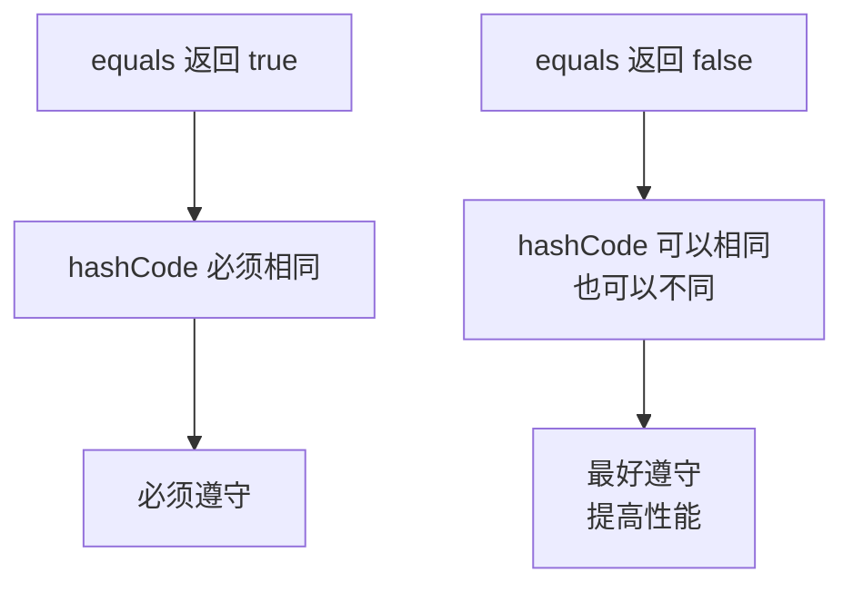
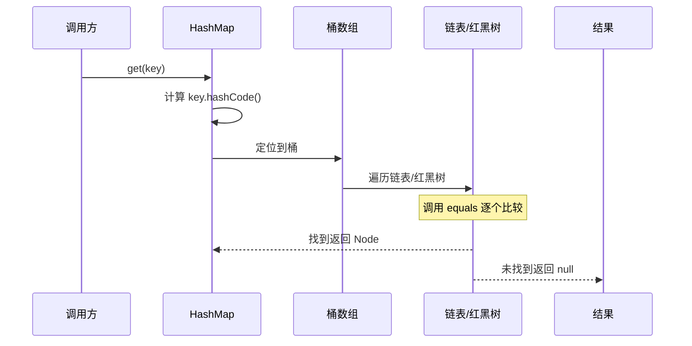

# hashCode 与 equals 的关系

> **目标级别**：P5/P6
> **面试频率**：🔴 高频必考（`>` 70%）

## 快速自测

面试官最关心的 3 个问题：

1. `hashCode` 和 `equals` 的契约是什么？
2. 为什么重写 `equals` 时必须重写 `hashCode`？
3. 两个对象 `equals` 返回 true，它们的 `hashCode` 必须相同吗？

如果这三个问题你都能完整回答，可以跳过本文。

---

## 场景切入

面试官问：「hashCode 和 equals 有什么关系？」你说「equals 比较对象内容，hashCode 生成哈希值」——然后面试官追问「为什么重写了 equals 后，HashMap 可能找不到对象了？」你愣住了。

这个问题背后是 Java 最容易被忽视的契约关系之一。HashMap、HashSet 为什么能快速查找？依赖的就是 hashCode 和 equals 的协作。

## 一、hashCode 是什么？

### 1.1 Object 类的 hashCode

```java
// JDK 源码：Object.java
public class Object {
    // [!code highlight] native 方法，由 C/C++ 实现
    public native int hashCode();

    // 说明：
    // 1. 返回 int 类型的哈希值
    // 2. 是本地方法，由 JVM 实现
    // 3. 与对象的内存地址相关，但不一定等于内存地址
}
```

### 1.2 hashCode 的设计目的

```mermaid
graph LR
    A[对象] --> B[hashCode]
    B --> C[哈希表索引]
    C --> D[O(1) 时间复杂度查找]
    A --> E[equals]
    E --> F[精确比较]
    F --> G[确定元素相等性]
```

hashCode 的核心作用是**支持哈希表的快速查找**。当我们需要在一个集合中查找元素时：
1. 先通过 hashCode 计算哈希值，定位到桶
2. 再通过 equals 精确比较，确定元素是否相等

---

## 二、equals 与 hashCode 的契约

### 2.1 官方契约（来自 Java 文档）

```java
/**
 * hashCode 的通用契约：
 *
 * 1. 在 Java 应用程序执行期间，无论何时在同一对象上多次调用，
 *    hashCode 方法都必须始终返回相同的哈希值。
 *    但这不要求在不同应用程序之间保持一致。
 *
 * 2. 如果两个对象根据 equals(Object) 方法比较是相等的，
 *    那么调用这两个对象的 hashCode 方法必须产生相同的哈希值。
 *
 * 3. 如果两个对象根据 equals(Object) 方法比较是不相等的，
 *    不要求调用 hashCode 方法必须产生不同的哈希值。
 *    但为不相等的对象生成不同的哈希值可以提高哈希表的性能。
 */
```

### 2.2 契约图解



:::warning 关键结论
**equals 返回 true 的两个对象，hashCode 必须相同。**
equals 返回 false 的两个对象，hashCode 最好不同（可选，但能提升性能）。
:::

---

## 三、为什么重写 equals 必须重写 hashCode？

### 3.1 问题演示

```java
class Person {
    private String name;
    private int age;

    public Person(String name, int age) {
        this.name = name;
        this.age = age;
    }

    // 只重写了 equals，没有重写 hashCode
    @Override
    public boolean equals(Object o) {
        if (this == o) return true;
        if (o == null || getClass() != o.getClass()) return false;
        Person person = (Person) o;
        return age == person.age && Objects.equals(name, person.name);
    }
}
```

### 3.2 问题场景：HashSet 行为异常

```java
public class Main {
    public static void main(String[] args) {
        Person p1 = new Person("张三", 25);
        Person p2 = new Person("张三", 25);

        // 直接比较
        System.out.println(p1.equals(p2));  // true
        System.out.println(p1 == p2);        // false

        // HashSet 使用
        HashSet<Person> set = new HashSet<>();
        set.add(p1);
        System.out.println(set.contains(p2)); // [!code warning] false！
    }
}
```

:::danger 严重后果
p1 和 p2 的 equals 返回 true，但在 HashSet 中 contains 返回 false！
这是因为 HashSet 先用 hashCode 定位桶，再用 equals 精确比较。
p1 和 p2 的 hashCode 默认返回内存地址的哈希值，**大概率不同**，所以 HashSet 认为它们不是同一个元素。
:::

---

## 四、正确实现：同时重写 hashCode

### 4.1 手写 hashCode

```java
class Person {
    private String name;
    private int age;

    public Person(String name, int age) {
        this.name = name;
        this.age = age;
    }

    @Override
    public boolean equals(Object o) {
        if (this == o) return true;
        if (o == null || getClass() != o.getClass()) return false;
        Person person = (Person) o;
        return age == person.age && Objects.equals(name, person.name);
    }

    @Override
    public int hashCode() {
        // [!code highlight] 使用 Objects.hash() 生成哈希值
        return Objects.hash(name, age);
    }
}
```

### 4.2 hashCode 计算公式

```java
// Objects.hash() 内部实现
public static int hash(Object... values) {
    return Arrays.hashCode(values);
}

// Arrays.hashCode() 内部实现
public static int hashCode(Object a[]) {
    if (a == null)
        return 0;
    int result = 1;  // [!code highlight]
    for (Object element : a)
        result = 31 * result + (element == null ? 0 : element.hashCode());
    return result;
}
```

:::tip hashCode 计算公式
对于 Person 类：
```
hashCode = 31 * 31 * (name == null ? 0 : name.hashCode()) + age
```
选择 31 的原因：
- 31 是质数，散列分布更好
- `31 * i = (i << 5) - i`，JVM 会优化为移位运算，性能好
:::

---

## 五、HashMap 的查找流程

### 5.1 HashMap 查找原理



### 5.2 JDK 8 中的优化

```java
// JDK 源码：HashMap.java
final Node<K,V> getNode(Object key) {
    Node<K,V>[] tab;
    Node<K,V> first, e;
    int n, hash;
    K k;

    if ((tab = table) != null && (n = tab.length) > 0 &&
        (first = tab[(n - 1) & (hash = hash(key))]) != null) {
        // 1. 先检查第一个节点的 hashCode 和 equals
        if (first.hash == hash &&
            ((k = first.key) == key || key.equals(k))) {
            return first;
        }
        // 2. 遍历链表/红黑树
        if ((e = first.next) != null) {
            if (first instanceof TreeNode)
                return ((TreeNode<K,V>)first).getTreeNode(hash, key);
            do {
                if (e.hash == hash &&
                    ((k = e.key) == key || key.equals(k)))
                    return e;
            } while ((e = e.next) != null);
        }
    }
    return null;
}
```

---

## 六、高频追问链

> **第一层**：hashCode 和 equals 的契约是什么？
>
> **第二层**：为什么重写 equals 时必须重写 hashCode？
>
> **第三层**：hashCode 相同，equals 一定返回 true 吗？
>
> **第四层**：hashCode 不同，equals 可能返回 true 吗？

---

## 七、常见错误与陷阱

### ⚠️ 陷阱 1：hashCode 计算中使用可变字段

```java
class Person {
    private String name;
    private int age;

    @Override
    public int hashCode() {
        return Objects.hash(name, age);
    }
}

Person p = new Person("张三", 25);
HashSet<Person> set = new HashSet<>();
set.add(p);

p.age = 26;  // [!code warning] 可变字段导致 hashCode 改变
set.contains(p);  // [!code warning] false！对象无法被找到
```

:::warning 可变字段的坑
如果 hashCode 依赖可变字段，当字段改变后：
1. hashCode 会变化
2. 对象在哈希表中的位置会变化
3. 导致对象无法被找到

**最佳实践**：hashCode 只使用不可变字段。
:::

### ⚠️ 陷阱 2：使用浮点数作为 hashCode

```java
class Point {
    private double x;
    private double y;

    @Override
    public int hashCode() {
        // [!code warning] double 的 hashCode 实现
        return Double.hashCode(x) + Double.hashCode(y);
    }
}
```

### ⚠️ 陷阱 3：equals 与 hashCode 使用不同字段

```java
class User {
    private String email;
    private String phone;

    // 错误：equals 和 hashCode 使用不同字段
    @Override
    public boolean equals(Object o) {
        // 只比较 email
        return email.equals(o.email);
    }

    @Override
    public int hashCode() {
        // 使用 email 和 phone
        return Objects.hash(email, phone);
    }
}
```

:::warning 字段不一致的后果
两个 User 对象 email 相同但 phone 不同：
- equals 返回 true
- hashCode 不同

**违反了 equals 相等 → hashCode 相同的契约。**
:::

---

## 八、加分回答

💡 **超出预期的深度**：

### 1. String 的 hashCode 优化

```java
// JDK 源码：String.java
public int hashCode() {
    int h = 0;  // [!code highlight]
    if (count > 0) {
        int off = offset;
        char val[] = value;
        for (int i = 0; i < count; i++) {
            h = 31 * h + val[off++];  // [!code highlight]
        }
    }
    return h;
}
```

String 的 hashCode 每次计算后会缓存，只要 String 内容不变，hashCode 就不变。

### 2. Objects.hash() vs 自定义实现

```java
// 方式1：Objects.hash()（推荐）
@Override
public int hashCode() {
    return Objects.hash(name, age);
}

// 方式2：手动计算
@Override
public int hashCode() {
    int result = 17;  // [!code highlight]
    result = 31 * result + (name == null ? 0 : name.hashCode());
    result = 31 * result + age;
    return result;
}
```

### 3. IDE 自动生成

```java
// IntelliJ IDEA / Eclipse 自动生成的标准模板
@Override
public int hashCode() {
    int result = Objects.hash(name, age);
    return result;
}
```

---

## 九、扩展思考

面试结束前的延伸问题：

1. **为什么 hashCode 返回 int 而不是 long？** —— int 足够表示哈希值，且计算更快
2. **HashSet 查找元素的时间复杂度是多少？** —— `O(1)` 平均，`O(n)` 最坏（退化为链表）
3. **为什么 String 选择不可变？** —— 安全性、哈希缓存、字符串常量池
