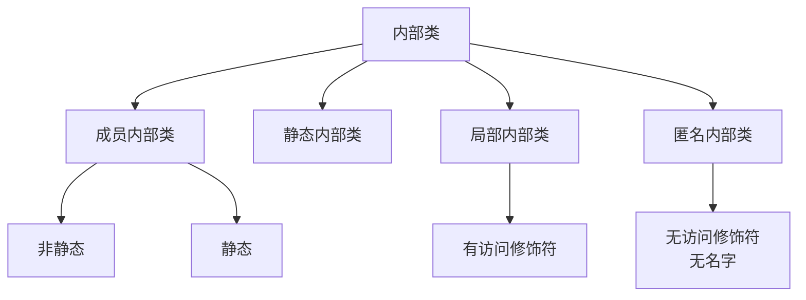

# 内部类分类与区别

> **目标级别**：P5/P6
> **面试频率**：🔴 高频必考（>70%）

## 快速自测

面试官最关心的 3 个问题：

1. Java 内部类有哪几种？各自的特征是什么？
2. 静态内部类和非静态内部类的区别是什么？
3. 内部类为什么能访问外部类的成员？

如果这三个问题你都能完整回答，可以跳过本文。

---

## 场景切入

面试官问：「Java 内部类有几种？有什么区别？」你说「有四种」——然后面试官追问「为什么局部内部类和匿名内部类不能有访问修饰符？」你愣住了。

内部类是 Java 中容易被忽视的概念，但它的四种形式各有特点，是面试中的常考题。

## 一、内部类的四种类型

### 1.1 分类一览



### 1.2 四种类型对比表

| 类型 | 修饰符 | 访问外部类成员 | 生命周期 |
|------|--------|----------------|----------|
| 成员非静态内部类 | 可用全部四种 | ✅ 直接访问 | 依赖外部类对象 |
| 成员静态内部类 | 可用全部四种 | ❌ 只能访问外部类静态成员 | 独立于外部类 |
| 局部内部类 | 无访问修饰符 | ✅ 访问外部所有成员 | 方法作用域内 |
| 匿名内部类 | 无访问修饰符 | ✅ 访问外部所有成员 | 随创建位置 |

---

## 二、成员内部类

### 2.1 基本语法

```java
class OuterClass {
    private int outerField = 1;

    // [!code highlight] 成员内部类（非静态）
    class InnerClass {
        public void innerMethod() {
            // [!code highlight] 直接访问外部类成员
            System.out.println(outerField);
            System.out.println(OuterClass.this.outerField);  // [!code highlight] 显式引用
        }
    }
}

// 创建方式
OuterClass outer = new OuterClass();
OuterClass.InnerClass inner = outer.new InnerClass();  // [!code highlight]
```

### 2.2 特点

```java
class Outer {
    private int x = 10;

    class Inner {
        private int x = 20;

        public void print() {
            int x = 30;
            System.out.println(x);              // [!code highlight] 局部变量
            System.out.println(this.x);         // [!code highlight] Inner.this.x
            System.out.println(Outer.this.x);    // [!code highlight] Outer.this.x
        }
    }
}
```

:::tip 内部类可以访问外部类所有成员
即使外部类成员是 private，内部类也可以直接访问。这是因为内部类持有外部类对象的引用。
:::

---

## 三、静态内部类

### 3.1 基本语法

```java
class OuterClass {
    private static int staticField = 1;
    private int instanceField = 2;

    // [!code highlight] 静态内部类
    static class StaticInnerClass {
        public void method() {
            // [!code highlight] 只能访问外部类静态成员
            System.out.println(staticField);  // OK
            // System.out.println(instanceField);  // [!code error] 编译错误
        }
    }
}

// 创建方式
OuterClass.StaticInnerClass inner = new OuterClass.StaticInnerClass();  // [!code highlight]
```

### 3.2 特点

| 特性 | 成员非静态内部类 | 成员静态内部类 |
|------|------------------|----------------|
| 创建方式 | outer.new Inner() | new Outer.Inner() |
| 外部类引用 | 持有 Outer.this | 不持有 |
| 访问外部成员 | 所有成员 | 只能是静态成员 |
| 生命周期 | 依赖外部类对象 | 独立于外部类 |

---

## 四、局部内部类

### 4.1 基本语法

```java
class OuterClass {
    private int outerField = 1;

    public void outerMethod() {
        final int localVar = 2;

        // [!code highlight] 局部内部类（在方法内定义）
        class LocalInnerClass {
            public void innerMethod() {
                System.out.println(outerField);  // [!code highlight] 访问外部类成员
                System.out.println(localVar);      // [!code highlight] 访问局部变量
            }
        }

        LocalInnerClass inner = new LocalInnerClass();
        inner.innerMethod();
    }
}
```

### 4.2 特点

```java
public void method() {
    int localVar = 10;  // [!code warning] 必须是 final 或 effectively final

    // [!code warning] 不能使用访问修饰符
    class LocalInner {  // 没有修饰符
        public void inner() {
            // 只能访问 localVar（必须是 final 或 effectively final）
            localVar = 20;  // [!code error] 编译错误：不能修改局部变量
        }
    }
}
```

:::warning 局部变量的限制
局部内部类访问的局部变量必须是 final 或 effectively final（Java 8+）。这是因为局部变量的生命周期可能比局部内部类短，需要复制一份给内部类使用。
:::

---

## 五、匿名内部类

### 5.1 基本语法

```java
// 接口实现
Runnable runnable = new Runnable() {  // [!code highlight]
    @Override
    public void run() {
        System.out.println("Running");
    }
};

// 抽象类实现
abstract class Person {
    abstract void speak();
}
Person person = new Person() {  // [!code highlight]
    @Override
    void speak() {
        System.out.println("Hello");
    }
};

// 具体类扩展
Thread thread = new Thread(new Runnable() {  // [!code highlight]
    @Override
    public void run() {
        System.out.println("Thread running");
    }
});
```

### 5.2 Lambda 表达式替代（Java 8+）

```java
// 匿名内部类
Runnable runnable = new Runnable() {
    @Override
    public void run() {
        System.out.println("Running");
    }
};

// [!code highlight] Lambda 表达式（更简洁）
Runnable runnableLambda = () -> System.out.println("Running");

// 但不是所有匿名内部类都能用 Lambda：
// 只有函数式接口（只有一个抽象方法的接口）才能用 Lambda
```

### 5.3 匿名内部类的限制

```java
// 1. 没有名字
new Runnable() {  // [!code warning] 没有类名
    @Override
    public void run() { }
};  // [!code warning] 只能赋值给变量或作为参数

// 2. 不能有访问修饰符
new Runnable() {  // [!code warning] 不能加 private/protected/public
    @Override
    public void run() { }
};

// 3. 不能定义构造器（因为没有名字）
// 如果需要参数，使用「带参数的匿名内部类」
new Person("张三") {  // [!code highlight] 调用有参构造器
    @Override
    void speak() { }
};
```

---

## 六、高频追问链

> **第一层**：Java 内部类有几种？有什么区别？
>
> **第二层**：内部类为什么能访问外部类的成员？原理是什么？
>
> **第三层**：静态内部类和成员内部类的区别是什么？
>
> **第四层**：为什么局部变量必须是 final 才能被内部类访问？

---

## 七、常见错误与陷阱

### ⚠️ 陷阱 1：在匿名内部类中修改外部变量

```java
int count = 0;
Runnable r = new Runnable() {
    @Override
    public void run() {
        count++;  // [!code error] Java 8+ 之前编译错误，Java 8+ 是 effectively final 问题
    }
};
```

### ⚠️ 陷阱 2：非静态内部类的内存泄漏

```java
class Outer {
    class Inner {
        // 内部类持有外部类引用
    }

    public Inner getInner() {
        return new Inner();  // [!code warning] 返回内部类可能导致内存泄漏
    }
}

// 调用方持有 Inner 的引用，同时持有 Outer 的引用
// 如果只释放 Inner 而不释放 Outer，Outer 可能不会被 GC 回收
```

### ⚠️ 陷阱 3：匿名内部类的参数遮蔽

```java
public void process() {
    String name = "outer";
    new Thread(new Runnable() {
        String name = "inner";  // [!code warning] 遮蔽了外部变量

        @Override
        public void run() {
            System.out.println(name);  // "inner"，不是 "outer"
        }
    }).start();
}
```

---

## 八、加分回答

💡 **超出预期的深度**：

### 1. 内部类的字节码结构

```java
// 编译后生成的字节码
class Outer$Inner {  // [!code highlight] 编译器生成 class 文件
    final Outer this$0;  // [!code highlight] 持有外部类引用

    Outer$Inner(Outer this$0) {
        this.this$0 = this$0;
    }
}
```

### 2. 局部内部类的变量复制

```java
public void method() {
    int localVar = 10;

    class LocalInner {
        int capturedVar = localVar;  // [!code highlight] 编译器复制了变量
    }
}

// 编译后伪代码
class method$1LocalInner {
    final int capturedVar;  // [!code highlight] 作为字段存储

    method$1LocalInner(int localVar) {
        this.capturedVar = localVar;
    }
}
```

### 3. 内部类的实际应用

```java
// 策略模式的简化实现
public class ShoppingCart {
    private List<Item> items = new ArrayList<>();

    public void addItem(Item item) {
        items.add(item);
    }

    public int calculate(new PriceCalculator() {  // [!code highlight] 匿名内部类
        @Override
        public int calculate(Item item) {
            return item.getPrice();
        }
    });
}
```

---

## 九、扩展思考

面试结束前的延伸问题：

1. **为什么局部内部类和匿名内部类不能有访问修饰符？** —— 它们的作用域是局部的
2. **内部类会导致内存泄漏吗？** —— 可能，通过非静态内部类持有外部类引用
3. **Java 16 引入的 sealed class 与内部类有什么关系？** —— 无关，是类访问控制的扩展
