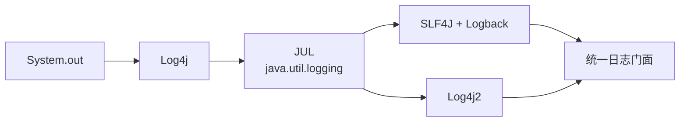
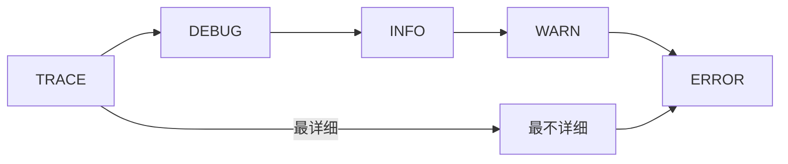

# Java 日志框架

> **目标级别**：P5/P6
> **面试频率**：🟡 中频常考（40%-70%）

## 快速自测

面试官最关心的 3 个问题：

1. Java 有哪些日志框架？
2. SLF4J 是什么？为什么要用它？
3. Log4j、Logback、Log4j2 有什么区别？

如果这三个问题你都能完整回答，可以跳过本文。

---

## 场景切入

面试官问：「你用过什么日志框架？」你说「Log4j」——然后面试官追问「那 SLF4J 是什么？为什么要用门面模式？」你愣住了。

日志框架是 Java 面试中的高频考点，因为几乎所有项目都会用到日志。

## 一、日志框架演进

### 1.1 历史演变



### 1.2 常见框架对比

| 框架 | 类型 | 说明 |
|------|------|------|
| System.out | 控制台 | 最原始 |
| Log4j | 实现 | Apache，Java 日志先驱 |
| JUL (JUL) | 实现 | JDK 内置 |
| SLF4J | 门面 | 日志抽象层 |
| Logback | 实现 | Log4j 作者继任者 |
| Log4j2 | 实现 | Apache 全新实现 |

---

## 二、SLF4J 门面

### 2.1 为什么需要门面

```java
// 直接使用 Log4j
import org.apache.log4j.Logger;

Logger logger = Log4jLogger.getLogger(MyClass.class);

// 问题：如果换成 Logback，需要改代码
// [!code warning] 耦合具体实现

// [!code highlight] 使用 SLF4J 门面
import org.slf4j.Logger;
import org.slf4j.LoggerFactory;

Logger logger = LoggerFactory.getLogger(MyClass.class);
// [!code highlight] 不需要改代码，绑定不同的实现
```

:::tip 门面模式的优势
SLF4J 是日志门面，只定义接口，实现可以切换。应用代码只需要依赖 SLF4J，不需要关心具体实现。
:::

### 2.2 常用 API

```java
import org.slf4j.Logger;
import org.slf4j.LoggerFactory;

public class MyService {
    // [!code highlight] 获取 Logger
    private static final Logger logger = LoggerFactory.getLogger(MyService.class);

    public void doSomething() {
        // 日志级别
        logger.trace("trace message");
        logger.debug("debug message");
        logger.info("info message");
        logger.warn("warn message");
        logger.error("error message");

        // 占位符（延迟拼接）
        String user = "Alice";
        int age = 25;
        logger.info("User {} is {} years old", user, age);  // [!code highlight]

        // 异常日志
        try {
            // ...
        } catch (Exception e) {
            logger.error("Error occurred", e);  // [!code highlight]
        }
    }
}
```

---

## 三、日志级别

### 3.1 级别顺序



| 级别 | 用途 | 典型场景 |
|------|------|----------|
| TRACE | 最详细 | 调试信息 |
| DEBUG | 调试信息 | 开发环境 |
| INFO | 一般信息 | 生产环境重要事件 |
| WARN | 警告 | 可能有问题 |
| ERROR | 错误 | 已发生错误 |

### 3.2 配置示例

```xml title="logback.xml"
<configuration>
    <appender name="CONSOLE" class="ch.qos.logback.core.ConsoleAppender">
        <encoder>
            <pattern>%d{HH:mm:ss.SSS} [%thread] %-5level %logger{36} - %msg%n</pattern>
        </encoder>
    </appender>

    <root level="INFO">
        <appender-ref ref="CONSOLE"/>
    </root>

    <logger name="com.example" level="DEBUG"/>
</configuration>
```

---

## 四、桥接器

### 4.1 常见桥接器

| 桥接器 | 作用 |
|--------|------|
| jcl-over-slf4j | Commons Logging → SLF4J |
| jul-to-slf4j | JDK Logging → SLF4J |
| log4j-over-slf4j | Log4j 1.x → SLF4J |
| log4j-to-slf4j | Log4j2 → SLF4J |

### 4.2 依赖配置

```xml
<!-- SLF4J API -->
<dependency>
    <groupId>org.slf4j</groupId>
    <artifactId>slf4j-api</artifactId>
    <version>2.0.x</version>
</dependency>

<!-- Logback 实现 -->
<dependency>
    <groupId>ch.qos.logback</groupId>
    <artifactId>logback-classic</artifactId>
    <version>1.4.x</version>
</dependency>
```

---

## 五、高频追问链

> **第一层**：Java 有哪些日志框架？
>
> **第二层**：SLF4J 是什么？为什么要用它？
>
> **第三层**：Log4j、Logback、Log4j2 有什么区别？
>
> **第四层**：如何避免日志带来的性能问题？

---

## 六、常见错误与陷阱

### ⚠️ 陷阱 1：日志级别判断

```java
// [!code warning] 错误：在生产环境输出 debug 日志
logger.debug("Processing item: " + item);  // [!code warning] 字符串拼接仍然执行

// [!code highlight] 正确：使用占位符
logger.debug("Processing item: {}", item);  // [!code highlight] 只在 DEBUG 启用时拼接
```

### ⚠️ 陷阱 2：异常日志丢失

```java
// [!code warning] 错误：只记录异常消息
logger.error("Error: " + e.getMessage());

// [!code highlight] 正确：传入异常对象
logger.error("Error occurred", e);
```

### ⚠️ 陷阱 3：Logger 声明

```java
// [!code warning] 错误：Logger 不是 static final
public class MyClass {
    Logger logger = LoggerFactory.getLogger(getClass());  // [!code warning]
}

// [!code highlight] 正确：Logger 应该是 static final
public class MyClass {
    private static final Logger logger = LoggerFactory.getLogger(MyClass.class);
}
```

---

## 七、加分回答

💡 **超出预期的深度**：

### 1. Logback 配置详解

```xml
<!-- 滚动日志 -->
<appender name="FILE" class="ch.qos.logback.core.rolling.RollingFileAppender">
    <file>app.log</file>
    <rollingPolicy class="ch.qos.logback.core.rolling.TimeBasedRollingPolicy">
        <fileNamePattern>app.%d{yyyy-MM-dd}.log</fileNamePattern>
        <maxHistory>30</maxHistory>
    </rollingPolicy>
</appender>
```

### 2. MDC 上下文

```java
// 在请求入口处设置
MDC.put("traceId", traceId);

// 在日志格式中使用
// %X{traceId}

// 在请求结束时清除
MDC.remove("traceId");
```

### 3. Log4j2 vs Logback

| 特性 | Logback | Log4j2 |
|------|---------|---------|
| 性能 | 好 | 更好（异步） |
| 配置 | XML/Groovy | XML/JSON/YAML |
| 自动重载 | 支持 | 支持 |
| 条件处理 | 支持 | 支持 |

---

## 八、扩展思考

1. **如何选择日志框架？** —— 推荐 SLF4J + Logback
2. **日志文件如何管理？** —— 滚动策略 + 定期清理
3. **如何统一处理未捕获异常？** —— Thread.setDefaultUncaughtExceptionHandler
